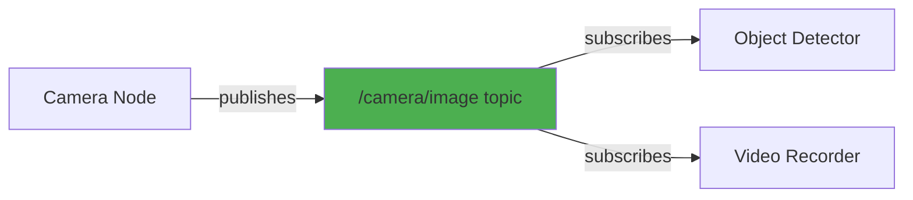
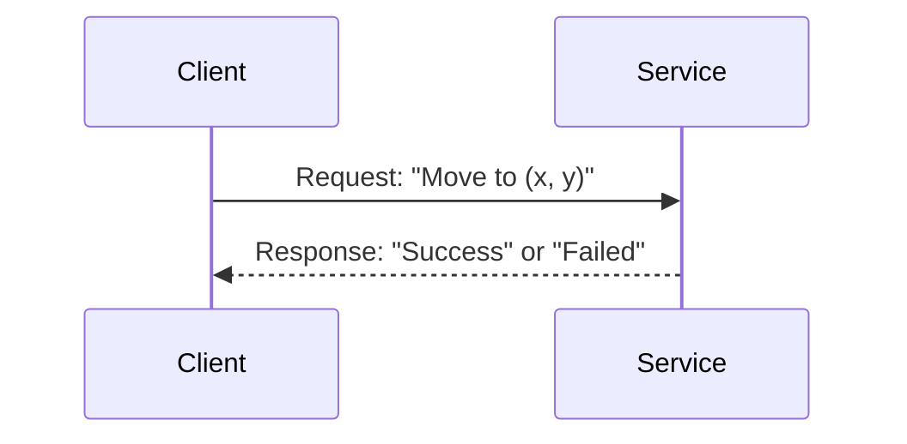
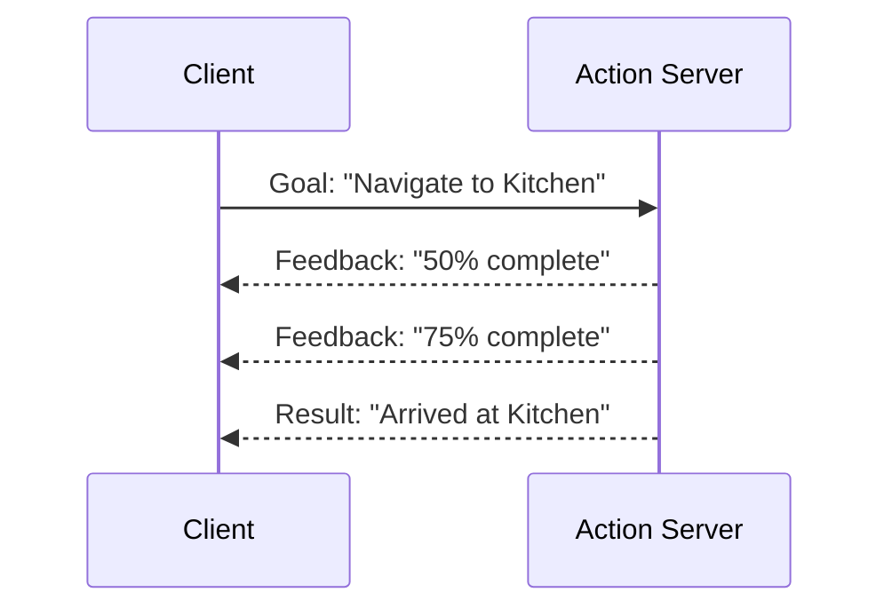
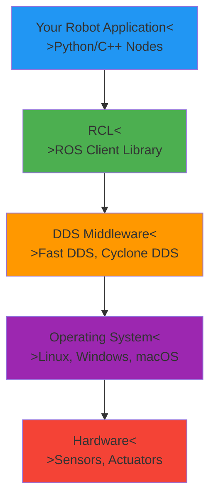
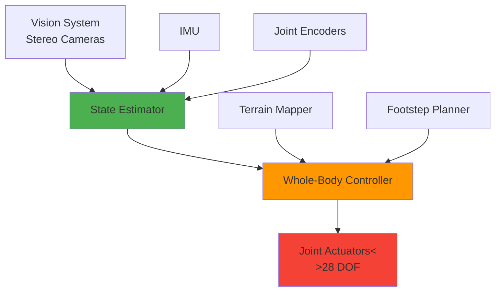
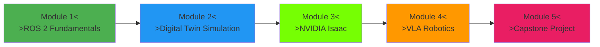

# Chapter 1: Introduction to ROS 2 and Physical AI

**Estimated Reading Time**: 45 minutes

## Learning Objectives

By the end of this chapter, you will be able to:

- **LO-1.1.1**: Explain what ROS 2 is and how it differs from ROS 1
- **LO-1.1.2**: Describe the role of ROS 2 in Physical AI and robotics systems
- **LO-1.1.3**: Identify real-world applications of ROS 2 in humanoid robotics
- **LO-1.1.4**: Understand the ROS 2 communication paradigms (topics, services, actions)

---

## 1. What is Physical AI?

**Physical AI** refers to artificial intelligence systems that interact with and manipulate the physical world through sensors, actuators, and embodied agents like robots. Unlike traditional AI systems that operate purely in digital domains (e.g., chatbots, recommendation algorithms), Physical AI must bridge the gap between computation and physical reality.

### Key Characteristics of Physical AI

Physical AI systems typically possess three core capabilities:

1. **Perception**: Sensing the environment through cameras, lidar, IMUs, force sensors, and other modalities
2. **Reasoning**: Processing sensory information to make decisions, plan actions, and learn from experience
3. **Action**: Physically interacting with the world through motors, grippers, wheels, legs, or other actuators

### Examples of Physical AI Systems

**Humanoid Robots**:
- Boston Dynamics' **Atlas** - bipedal robot with advanced locomotion and manipulation
- Agility Robotics' **Digit** - warehouse robot for package handling
- Tesla's **Optimus** - general-purpose humanoid for manufacturing and domestic tasks

**Autonomous Vehicles**:
- Self-driving cars (Waymo, Tesla Autopilot)
- Delivery drones (Amazon Prime Air, Wing)
- Agricultural robots (John Deere autonomous tractors)

**Industrial Automation**:
- Collaborative robot arms (Universal Robots, KUKA)
- Warehouse picking systems (Amazon Robotics, Locus Robotics)
- Surgical robots (da Vinci Surgical System)

### Physical AI vs. Digital AI

| Aspect | Digital AI | Physical AI |
|--------|-----------|-------------|
| **Environment** | Virtual (databases, web, games) | Physical (real world) |
| **Feedback** | Deterministic, instant | Noisy, delayed, uncertain |
| **Consequences** | Limited (no physical harm) | High (safety-critical) |
| **Training** | Large-scale data, fast iteration | Data-scarce, expensive, sim-to-real gap |
| **Deployment** | Cloud servers, edge devices | Robots, vehicles, drones |

**Key Insight**: Physical AI is fundamentally harder than digital AI because the real world is unpredictable, continuous, and has real consequences for failure.

---

## 2. Introduction to ROS 2

### What is ROS 2?

**ROS 2 (Robot Operating System 2)** is an open-source middleware framework for building robot software. Despite its name, ROS is not an operating system in the traditional sense (like Linux or Windows). Instead, it's a **collection of software libraries and tools** that help you build robot applications.

Think of ROS 2 as the "plumbing" for robot software—it handles communication between different parts of your robot system so you can focus on building intelligent behaviors rather than low-level networking code.

### History: From ROS 1 to ROS 2

**ROS 1** (2007-2020):
- Originally developed at Willow Garage for the PR2 robot
- Became the de facto standard for academic and research robotics
- Limitations: no real-time support, poor security, single-master architecture

**ROS 2** (2017-present):
- Complete rewrite addressing ROS 1 limitations
- Built on **DDS (Data Distribution Service)** middleware for real-time communication
- Designed for production systems, not just research
- Cross-platform (Linux, Windows, macOS)
- Multi-robot support out of the box

**Why ROS 2 Matters**: Companies like Boston Dynamics, BMW, Samsung, and NASA now use ROS 2 in production systems because it meets industrial requirements for reliability and real-time performance.

### Core Concepts

ROS 2 organizes robot software into independent **nodes** that communicate via three patterns:

#### 1. Topics (Publish-Subscribe)
**Use case**: Continuous data streaming (sensor data, commands)

**Example**: A camera node publishes images to `/camera/image`, and multiple nodes (object detector, video recorder) can subscribe to receive those images.

#### 2. Services (Request-Response)
**Use case**: On-demand operations with immediate response (compute path, open gripper)

**Example**: A path planner service receives a goal position and returns a computed trajectory.

#### 3. Actions (Long-Running Goals)
**Use case**: Tasks that take time and need feedback (navigate to waypoint, grasp object)

**Example**: A navigation action provides progress updates while the robot moves to a goal.

### ROS 2 Architecture

**Layers Explained**:
- **Application Layer**: Your robot-specific code (navigation, manipulation, vision)
- **RCL (ROS Client Library)**: Language-specific APIs (rclpy for Python, rclcpp for C++)
- **DDS Middleware**: Handles real-time communication across networks
- **OS Layer**: Provides hardware abstraction
- **Hardware**: Physical robot components

### Why ROS 2 for Physical AI?

1. **Modularity**: Break complex robots into manageable, reusable components
2. **Ecosystem**: 3000+ open-source packages (navigation, perception, manipulation)
3. **Tools**: RViz (visualization), rqt (debugging), rosbag (data logging)
4. **Simulation**: Seamless integration with Gazebo, Isaac Sim, Unity
5. **Community**: Thousands of developers, extensive documentation
6. **Industry Adoption**: Production-ready for commercial robots

---

## 3. ROS 2 in Humanoid Robotics

Humanoid robots are among the most complex Physical AI systems, requiring coordination of dozens of actuators, sensors, and compute modules. ROS 2 is the glue that holds these systems together.

### Case Study: Boston Dynamics Atlas

**Atlas** uses ROS-like architecture for:
- **Perception**: Fusing data from cameras, lidar, IMU (20+ sensors)
- **Planning**: Generating walking gaits, computing footstep placements
- **Control**: Low-level joint control at 1kHz update rates
- **Safety**: Emergency stop systems, collision detection

### ROS 2 Packages for Humanoids

**Core Packages**:
- **ros2_control**: Hardware abstraction for actuators
- **MoveIt 2**: Motion planning for arms and full-body
- **navigation2**: Autonomous navigation and path planning
- **tf2**: Coordinate frame transforms (robot kinematics)

**Humanoid-Specific**:
- Bipedal walking controllers (ZMP, MPC)
- Whole-body inverse kinematics
- Balance and stability control
- Fall detection and recovery

### Industry Adoption

**Companies using ROS 2**:
- **Boston Dynamics**: Spot, Atlas
- **Agility Robotics**: Digit (warehouse automation)
- **Unitree Robotics**: G1 humanoid
- **PAL Robotics**: TALOS humanoid
- **Tesla**: Optimus (suspected, not confirmed)

**Academic Research**:
- MIT Biomimetics Lab (Mini Cheetah)
- CMU Robotics Institute (CHIMP robot)
- UC Berkeley (BLUE humanoid)

**Why Humanoid Robots?**
- **Versatility**: Designed for human environments (stairs, doors, tools)
- **Dexterity**: Manipulate objects designed for human hands
- **Social Interaction**: Natural interface for collaboration with humans
- **Market Size**: $38B projected market by 2030 (Allied Market Research)

---

## 4. Course Roadmap

This textbook follows a structured learning path from fundamentals to advanced Physical AI systems:

### Module 1: ROS 2 Fundamentals (4 weeks)
**You are here!**

Learn the building blocks:
- Publisher/subscriber communication
- Services and actions
- Launch files and parameters
- ROS 2 command-line tools

**Outcome**: Build multi-node robot systems

---

### Module 2: Digital Twin Simulation (3 weeks)

Create virtual replicas of robots:
- Gazebo physics simulation
- Unity for photorealistic rendering
- URDF robot modeling
- Sensor simulation (cameras, lidar)

**Outcome**: Test robots safely in simulation

---

### Module 3: NVIDIA Isaac Platform (4 weeks)

Leverage GPU acceleration for Physical AI:
- Synthetic data generation
- Domain randomization
- Reinforcement learning (Isaac Gym)
- Sim-to-real transfer

**Outcome**: Train perception and control models 100x faster

---

### Module 4: Vision-Language-Action (3 weeks)

Build robots that understand language:
- Vision encoders (CLIP, DINO)
- Language-conditioned policies
- VLA model training (RT-1, RT-2, OpenVLA)
- Natural language command execution

**Outcome**: Robots that follow human instructions

---

### Module 5: Capstone Project (2 weeks)

Integrate everything:
- Design an autonomous humanoid system
- Combine perception, planning, and control
- Test in Isaac Sim
- Deploy to real hardware (optional)

**Outcome**: Portfolio-ready humanoid robot project

---

## Expected Time Commitment

- **Lectures/Reading**: 3-5 hours/week
- **Hands-On Labs**: 5-8 hours/week
- **Assessments**: 2-3 hours/week

**Total**: 10-15 hours/week for 16 weeks

**Flexible Learning**: You can go faster if you have prior robotics experience, or take more time if you're new to the field.

---

## Lab Exercise 1.1: Explore Existing ROS 2 Robots (Theory)

### Objective
Research and document one real-world ROS 2 robot to understand practical applications.

### Instructions

1. **Choose a robot** from the list below (or find your own):
   - Boston Dynamics Spot
   - Agility Robotics Digit
   - TurtleBot 3 (educational robot)
   - PAL Robotics TALOS
   - Clearpath Husky (outdoor rover)

2. **Research** the robot using:
   - Official website
   - GitHub repositories (search for ROS 2 packages)
   - YouTube videos of the robot in action
   - Academic papers (Google Scholar)

3. **Write a 300-word summary** covering:
   - **Hardware specs**: Sensors, actuators, compute
   - **ROS 2 packages used**: Which nodes and topics does it use?
   - **Key capabilities**: What can the robot do?
   - **Applications**: Where is it used?

4. **Deliverable**: Markdown document with your summary and 2-3 reference links

### Expected Time
30 minutes

### Validation
Self-check: Does your summary cover all four bullet points?

---

## Quiz 1.1: ROS 2 Concepts

Test your understanding of this chapter:

### Question 1
**What is the primary advantage of ROS 2 over ROS 1?**

- A) Better graphics support
- B) Real-time capabilities and DDS middleware ✓
- C) Easier installation
- D) Requires less memory

**Explanation**: ROS 2 was designed specifically to address ROS 1's lack of real-time support by using DDS middleware, which enables deterministic communication suitable for production systems.

---

### Question 2
**Which communication pattern is best for sending sensor data continuously?**

- A) Services
- B) Actions
- C) Topics ✓
- D) Parameters

**Explanation**: Topics use the publish-subscribe pattern, which is ideal for continuous data streams like sensor readings. Subscribers receive updates asynchronously without blocking.

---

### Question 3
**True or False: ROS 2 can only run on Linux.**

- False ✓

**Explanation**: ROS 2 is cross-platform and runs on Linux, Windows, and macOS. This makes it more accessible than ROS 1, which was Linux-only.

---

### Question 4
**What is Physical AI? (Short answer - 50 words)**

**Expected Answer**: Physical AI refers to AI systems that interact with and manipulate the physical world through sensors and actuators (robots, autonomous vehicles). Unlike digital AI, Physical AI must handle noisy sensors, real-time constraints, and safety-critical operations in unpredictable environments.

---

### Question 5
**Name two ROS 2 packages commonly used in humanoid robotics. (Short answer)**

**Expected Answers** (any two):
- ros2_control (hardware abstraction)
- MoveIt 2 (motion planning)
- navigation2 (path planning)
- tf2 (coordinate transforms)

---

## Key Takeaways

✅ **Physical AI** bridges computation and physical reality through embodied agents (robots)

✅ **ROS 2** is the industry-standard middleware for building modular, scalable robot software

✅ **Three communication patterns**: Topics (streaming), Services (request-response), Actions (long-running goals)

✅ **Humanoid robots** use ROS 2 to coordinate perception, planning, and control across 20+ DOF

✅ **This course** takes you from ROS 2 basics to building autonomous humanoid systems with VLA models

---

## What's Next?

In **Chapter 2**, you'll install ROS 2 Humble on Ubuntu 22.04 and run your first nodes.

[Continue to Chapter 2: Installing ROS 2 →](/docs/module-1-ros2/week-1/chapter-2-setup)

---

## Additional Resources

- **ROS 2 Official Docs**: [docs.ros.org/en/humble/](https://docs.ros.org/en/humble/)
- **ROS 2 Design Principles**: [design.ros2.org](https://design.ros2.org/)
- **Physical AI Survey Paper**: "Embodied AI: A Survey" ([arxiv.org/abs/2210.06849](https://arxiv.org/abs/2210.06849))
- **Boston Dynamics Atlas**: [bostondynamics.com/atlas](https://www.bostondynamics.com/atlas)

---

**Progress**: Module 1, Week 1, Chapter 1 of 32 | [View all chapters](/docs/intro)
