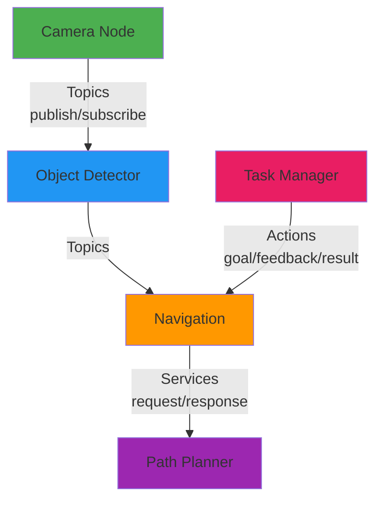
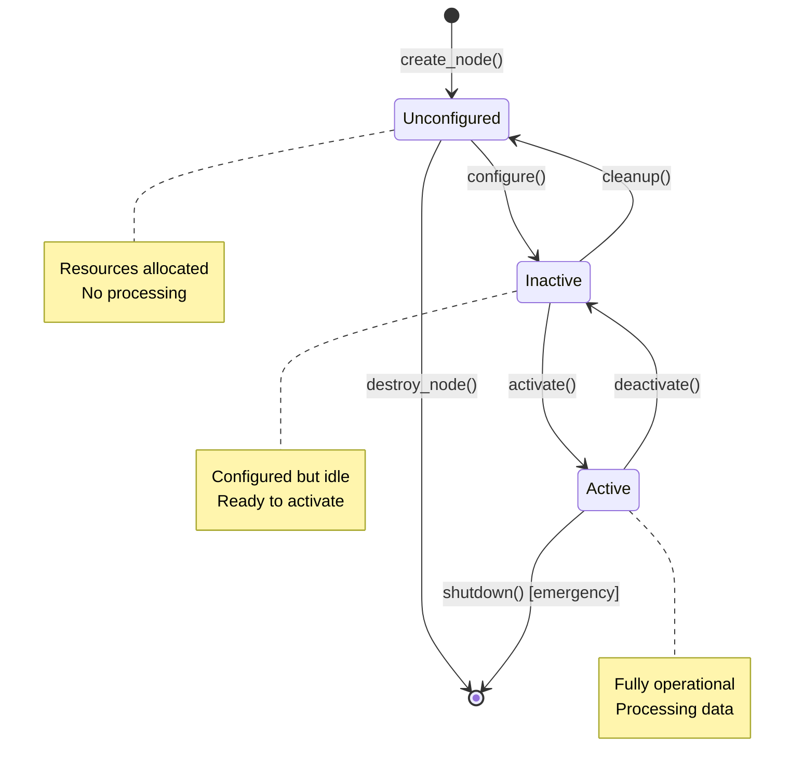

# Chapter 3: ROS 2 Nodes and Communication

**Estimated Reading Time**: 50 minutes

## Learning Objectives

By the end of this chapter, you will be able to:

- **LO-1.3.1**: Explain what a ROS 2 node is and its role in a robot system
- **LO-1.3.2**: Create and run a minimal ROS 2 node using rclpy (Python)
- **LO-1.3.3**: Understand the node lifecycle and state transitions
- **LO-1.3.4**: Configure logging levels and use ROS 2 logging effectively
- **LO-1.3.5**: Work with executors for managing node callbacks

---

## 1. What is a ROS 2 Node?

A **node** is the fundamental building block of any ROS 2 application. Think of a node as a modular, single-purpose program that performs one specific task in your robot system.

### Node Analogy

Imagine building a humanoid robot. Instead of writing one massive program to control everything, you break it down into specialized components:

- **Camera Node**: Captures images from cameras
- **Object Detector Node**: Identifies objects in images
- **Navigation Node**: Plans paths and avoids obstacles
- **Motor Controller Node**: Sends commands to actuators
- **Speech Recognition Node**: Converts speech to text

Each node runs as an **independent process** and communicates with other nodes through ROS 2's middleware (DDS). This modular architecture provides several benefits:

### Benefits of Node-Based Architecture

| Benefit | Description | Example |
|---------|-------------|---------|
| **Modularity** | Each node has a single responsibility | Replace camera driver without touching navigation code |
| **Reusability** | Nodes can be reused across different robots | Use same object detector on different platforms |
| **Fault Isolation** | If one node crashes, others keep running | Navigation continues even if speech recognition fails |
| **Parallelism** | Nodes run concurrently on multiple CPU cores | Camera capture and image processing happen simultaneously |
| **Language Flexibility** | Mix Python and C++ nodes in same system | Write vision in Python, control loops in C++ |

### Node Communication Patterns

Nodes communicate using three primary patterns (covered in detail in later chapters):



---

## 2. Creating Your First ROS 2 Node

Let's create a minimal ROS 2 node in Python using the `rclpy` library (ROS 2 Client Library for Python).

### Minimal Node Example

```python
#!/usr/bin/env python3
"""
Minimal ROS 2 Node Example
File: minimal_node.py
"""

import rclpy
from rclpy.node import Node


class MinimalNode(Node):
    """A minimal ROS 2 node that prints a message."""

    def __init__(self):
        # Initialize the node with a name
        super().__init__('minimal_node')

        # Log a message when node starts
        self.get_logger().info('Minimal node has been started!')

        # Create a timer that calls a function every 1 second
        self.timer = self.create_timer(1.0, self.timer_callback)
        self.counter = 0

    def timer_callback(self):
        """Function called every second by the timer."""
        self.counter += 1
        self.get_logger().info(f'Timer callback #{self.counter}')


def main(args=None):
    # Initialize the ROS 2 Python client library
    rclpy.init(args=args)

    # Create an instance of our node
    node = MinimalNode()

    # Keep the node running and processing callbacks
    rclpy.spin(node)

    # Cleanup when done (Ctrl+C pressed)
    node.destroy_node()
    rclpy.shutdown()


if __name__ == '__main__':
    main()
```

### Code Breakdown

Let's understand each part:

**1. Imports**
```python
import rclpy
from rclpy.node import Node
```
- `rclpy`: ROS 2 Python client library
- `Node`: Base class for all ROS 2 nodes

**2. Node Class Definition**
```python
class MinimalNode(Node):
    def __init__(self):
        super().__init__('minimal_node')
```
- Inherit from `Node` base class
- Call `super().__init__()` with node name as argument
- Node names must be unique in the ROS 2 graph

**3. Timer Creation**
```python
self.timer = self.create_timer(1.0, self.timer_callback)
```
- Creates a timer that fires every 1.0 seconds
- Calls `timer_callback()` function each time it fires
- Timers are a common way to run periodic tasks

**4. Main Function**
```python
rclpy.init(args=args)        # Initialize ROS 2
node = MinimalNode()         # Create node instance
rclpy.spin(node)             # Run node until Ctrl+C
node.destroy_node()          # Cleanup
rclpy.shutdown()             # Shutdown ROS 2
```

### Running the Node

```bash
# Make the script executable
chmod +x minimal_node.py

# Run the node
python3 minimal_node.py
```

**Expected Output:**
```
[INFO] [1638360000.123456] [minimal_node]: Minimal node has been started!
[INFO] [1638360001.123789] [minimal_node]: Timer callback #1
[INFO] [1638360002.124012] [minimal_node]: Timer callback #2
[INFO] [1638360003.124234] [minimal_node]: Timer callback #3
...
```

Press `Ctrl+C` to stop the node.

---

## 3. Node Lifecycle

ROS 2 introduces **managed nodes** with a defined lifecycle for production systems. While basic nodes (like our minimal example) don't use lifecycle, it's important to understand this concept for industrial robots.

### Lifecycle States

Managed nodes transition through these states:



### State Descriptions

| State | Description | Example |
|-------|-------------|---------|
| **Unconfigured** | Node created but not configured | Camera driver loaded, camera not opened |
| **Inactive** | Configured but not processing | Camera opened, not capturing frames |
| **Active** | Fully operational | Camera capturing and publishing images |
| **Finalized** | Cleaned up, ready to be destroyed | Camera closed, resources released |

### When to Use Lifecycle Nodes?

**Use lifecycle nodes for:**
- Production robots with strict startup/shutdown sequences
- Nodes that require configuration before use (e.g., sensor calibration)
- Systems requiring coordinated node activation
- Safety-critical applications

**Use basic nodes for:**
- Simple scripts and prototypes
- Nodes with no special startup requirements
- Academic projects and learning

---

## 4. ROS 2 Logging

Proper logging is essential for debugging and monitoring robot systems. ROS 2 provides five logging levels:

### Logging Levels

```python
#!/usr/bin/env python3
"""
Logging Example
File: logging_node.py
"""

import rclpy
from rclpy.node import Node


class LoggingNode(Node):
    def __init__(self):
        super().__init__('logging_node')

        # Demonstrate all logging levels
        self.get_logger().debug('This is a DEBUG message')
        self.get_logger().info('This is an INFO message')
        self.get_logger().warn('This is a WARN message')
        self.get_logger().error('This is an ERROR message')
        self.get_logger().fatal('This is a FATAL message')

        # Conditional logging (only logs if condition is true)
        sensor_value = 42
        if sensor_value > 40:
            self.get_logger().warn(f'Sensor value too high: {sensor_value}')

        # Throttled logging (log at most once per second)
        self.timer = self.create_timer(0.1, self.timer_callback)

    def timer_callback(self):
        # This would spam logs without throttling
        self.get_logger().info('High-frequency callback', throttle_duration_sec=1.0)


def main():
    rclpy.init()
    node = LoggingNode()
    rclpy.spin(node)
    node.destroy_node()
    rclpy.shutdown()


if __name__ == '__main__':
    main()
```

### Logging Level Guide

| Level | When to Use | Color in Terminal |
|-------|-------------|-------------------|
| **DEBUG** | Detailed diagnostic information | Gray |
| **INFO** | Confirmation that things are working | White |
| **WARN** | Something unexpected but not critical | Yellow |
| **ERROR** | Serious problem, some functionality failed | Red |
| **FATAL** | Critical failure, node cannot continue | Bold Red |

### Setting Log Levels

```bash
# Set log level for a specific node
ros2 run <package> <node> --ros-args --log-level DEBUG

# Set log level for all nodes
export ROS_LOG_LEVEL=DEBUG
ros2 run <package> <node>
```

### Best Practices for Logging

✅ **Do:**
- Use `INFO` for normal operational events
- Use `WARN` for recoverable issues
- Include relevant data in log messages (sensor values, error codes)
- Use throttling for high-frequency logs

❌ **Don't:**
- Log sensitive information (passwords, API keys)
- Use `DEBUG` in production (degrades performance)
- Log in tight loops without throttling
- Use `print()` instead of proper logging

---

## 5. Executors and Callback Management

**Executors** manage how and when node callbacks are executed. Understanding executors is crucial for building responsive robot systems.

### What is an Executor?

An executor is responsible for:
1. **Waiting** for callbacks to be ready (timer fired, message received, etc.)
2. **Executing** callbacks in the correct order
3. **Managing** thread allocation for parallel execution

### SingleThreadedExecutor (Default)

```python
#!/usr/bin/env python3
"""
Single-Threaded Executor Example
File: single_threaded_executor.py
"""

import rclpy
from rclpy.node import Node
from rclpy.executors import SingleThreadedExecutor


class FastNode(Node):
    def __init__(self):
        super().__init__('fast_node')
        self.timer = self.create_timer(0.1, self.fast_callback)

    def fast_callback(self):
        self.get_logger().info('Fast callback (100ms)')


class SlowNode(Node):
    def __init__(self):
        super().__init__('slow_node')
        self.timer = self.create_timer(1.0, self.slow_callback)

    def slow_callback(self):
        self.get_logger().info('Slow callback (1000ms) - STARTING')
        # Simulate slow processing (e.g., heavy computation)
        import time
        time.sleep(2.0)
        self.get_logger().info('Slow callback (1000ms) - FINISHED')


def main():
    rclpy.init()

    fast_node = FastNode()
    slow_node = SlowNode()

    # Create single-threaded executor
    executor = SingleThreadedExecutor()
    executor.add_node(fast_node)
    executor.add_node(slow_node)

    try:
        executor.spin()
    except KeyboardInterrupt:
        pass

    fast_node.destroy_node()
    slow_node.destroy_node()
    rclpy.shutdown()


if __name__ == '__main__':
    main()
```

**Problem**: The slow callback blocks the fast callback! While `slow_callback()` is sleeping for 2 seconds, `fast_callback()` cannot run.

### MultiThreadedExecutor (Parallel Execution)

```python
#!/usr/bin/env python3
"""
Multi-Threaded Executor Example
File: multi_threaded_executor.py
"""

import rclpy
from rclpy.executors import MultiThreadedExecutor


def main():
    rclpy.init()

    fast_node = FastNode()  # Same as before
    slow_node = SlowNode()  # Same as before

    # Create multi-threaded executor with 2 threads
    executor = MultiThreadedExecutor(num_threads=2)
    executor.add_node(fast_node)
    executor.add_node(slow_node)

    try:
        executor.spin()
    except KeyboardInterrupt:
        pass

    fast_node.destroy_node()
    slow_node.destroy_node()
    rclpy.shutdown()


if __name__ == '__main__':
    main()
```

**Solution**: Now `fast_callback()` runs on one thread while `slow_callback()` runs on another. No blocking!

### Executor Comparison

| Executor Type | Threads | Use Case | Pros | Cons |
|---------------|---------|----------|------|------|
| **SingleThreadedExecutor** | 1 | Simple nodes with no blocking | Low overhead, predictable | Callbacks can block each other |
| **MultiThreadedExecutor** | N | Nodes with blocking operations | Parallel execution | Thread safety required |
| **StaticSingleThreadedExecutor** | 1 | High-performance, known entities | Fastest single-threaded | Inflexible (entities fixed at startup) |

---

## 6. Node Introspection with ROS 2 CLI

ROS 2 provides powerful command-line tools to inspect running nodes.

### List All Running Nodes

```bash
ros2 node list
```

**Example Output:**
```
/minimal_node
/camera_node
/object_detector
```

### Get Node Information

```bash
ros2 node info /minimal_node
```

**Example Output:**
```
/minimal_node
  Subscribers:

  Publishers:

  Service Servers:
    /minimal_node/describe_parameters
    /minimal_node/get_parameter_types
    /minimal_node/get_parameters
    /minimal_node/list_parameters
    /minimal_node/set_parameters
    /minimal_node/set_parameters_atomically
  Service Clients:

  Action Servers:

  Action Clients:
```

**Note**: Even a minimal node has parameter services automatically created by ROS 2.

### Remapping Node Names

You can change a node's name at runtime:

```bash
# Run node with default name "minimal_node"
python3 minimal_node.py

# Run node with custom name "my_custom_node"
python3 minimal_node.py --ros-args --remap __node:=my_custom_node
```

This is useful for:
- Running multiple instances of the same node
- Avoiding name conflicts
- Testing different configurations

---

## Lab Exercise 1.3: Create a Custom ROS 2 Node

### Objective

Build a ROS 2 node that monitors a simulated robot's battery level and logs warnings when battery is low.

### Requirements

Create `battery_monitor.py` with the following specifications:

1. **Node Name**: `battery_monitor`
2. **Functionality**:
   - Simulate battery level starting at 100%
   - Decrease battery by 1% every second
   - Log INFO message every second with current battery level
   - Log WARN when battery < 20%
   - Log ERROR when battery < 10%
   - Log FATAL when battery = 0% and shut down node
3. **Logging Format**: `"Battery level: X%"` (where X is the percentage)

### Starter Code

```python
#!/usr/bin/env python3
"""
Lab 1.3: Battery Monitor Node
TODO: Complete the implementation
"""

import rclpy
from rclpy.node import Node


class BatteryMonitor(Node):
    def __init__(self):
        super().__init__('battery_monitor')
        self.battery_level = 100.0

        # TODO: Create a timer that fires every 1 second
        # TODO: Call self.check_battery() in the timer callback

        self.get_logger().info('Battery monitor started')

    def check_battery(self):
        # TODO: Decrease battery_level by 1%

        # TODO: Log appropriate message based on battery level
        # INFO if >= 20%
        # WARN if < 20% but >= 10%
        # ERROR if < 10% but > 0%
        # FATAL if = 0% (and shutdown)

        pass


def main(args=None):
    rclpy.init(args=args)
    node = BatteryMonitor()
    rclpy.spin(node)
    node.destroy_node()
    rclpy.shutdown()


if __name__ == '__main__':
    main()
```

### Expected Output

```
[INFO] [1638360000.123456] [battery_monitor]: Battery monitor started
[INFO] [1638360001.123789] [battery_monitor]: Battery level: 100%
[INFO] [1638360002.124012] [battery_monitor]: Battery level: 99%
...
[INFO] [1638360021.130456] [battery_monitor]: Battery level: 20%
[WARN] [1638360022.131234] [battery_monitor]: Battery level: 19%
...
[ERROR] [1638360090.145678] [battery_monitor]: Battery level: 9%
...
[FATAL] [1638360100.150123] [battery_monitor]: Battery level: 0% - SHUTDOWN
```

### Acceptance Criteria

- ✅ Node runs without errors
- ✅ Battery decreases by 1% per second
- ✅ Logging levels change appropriately
- ✅ Node shuts down when battery reaches 0%
- ✅ Code follows Python style guidelines (PEP 8)

### Validation

Run your node and verify:
```bash
python3 battery_monitor.py
```

Let it run for ~2 minutes to see all logging levels in action.

### Solution

<details>
<summary>Click to reveal solution (try it yourself first!)</summary>

```python
#!/usr/bin/env python3
import rclpy
from rclpy.node import Node


class BatteryMonitor(Node):
    def __init__(self):
        super().__init__('battery_monitor')
        self.battery_level = 100.0
        self.timer = self.create_timer(1.0, self.check_battery)
        self.get_logger().info('Battery monitor started')

    def check_battery(self):
        # Decrease battery
        self.battery_level -= 1.0

        # Log based on level
        if self.battery_level <= 0:
            self.get_logger().fatal(f'Battery level: 0% - SHUTDOWN')
            raise SystemExit  # Shutdown node
        elif self.battery_level < 10:
            self.get_logger().error(f'Battery level: {int(self.battery_level)}%')
        elif self.battery_level < 20:
            self.get_logger().warn(f'Battery level: {int(self.battery_level)}%')
        else:
            self.get_logger().info(f'Battery level: {int(self.battery_level)}%')


def main(args=None):
    rclpy.init(args=args)
    node = BatteryMonitor()
    try:
        rclpy.spin(node)
    except SystemExit:
        pass
    node.destroy_node()
    rclpy.shutdown()


if __name__ == '__main__':
    main()
```
</details>

---

## Quiz 1.3: ROS 2 Nodes

### Question 1
**What is the primary benefit of using a node-based architecture in ROS 2?**

- A) Faster execution speed
- B) Modularity and fault isolation ✓
- C) Smaller file sizes
- D) Easier installation

**Explanation**: Node-based architecture allows each component to be developed, tested, and debugged independently. If one node crashes, others continue running, providing fault isolation.

---

### Question 2
**Which executor should you use if you have callbacks that perform blocking operations?**

- A) SingleThreadedExecutor
- B) MultiThreadedExecutor ✓
- C) StaticSingleThreadedExecutor
- D) No executor needed

**Explanation**: MultiThreadedExecutor runs callbacks in parallel on different threads, preventing blocking callbacks from stopping other callbacks.

---

### Question 3
**What does `rclpy.spin(node)` do?**

- A) Rotates the robot
- B) Keeps the node running and processes callbacks ✓
- C) Creates a new node
- D) Shuts down the node

**Explanation**: `rclpy.spin()` enters a loop that waits for and executes callbacks (timers, message arrivals, etc.) until interrupted (Ctrl+C).

---

### Question 4
**True or False: Node names must be unique in a ROS 2 system.**

- True ✓

**Explanation**: Each node must have a unique name so it can be identified and managed independently. ROS 2 uses node names for introspection and debugging.

---

### Question 5
**When should you use the WARN logging level? (Short answer)**

**Expected Answer**: Use WARN for unexpected situations that don't prevent the node from functioning but may indicate a problem (e.g., sensor reading out of normal range, retry attempt, deprecated parameter used).

---

## Key Takeaways

✅ **Nodes** are independent processes that perform single, well-defined tasks in a robot system

✅ **Modularity** enables reusability, fault isolation, and parallel development

✅ **Node lifecycle** (Unconfigured → Inactive → Active) provides structured startup/shutdown for production systems

✅ **Logging** with appropriate levels (DEBUG, INFO, WARN, ERROR, FATAL) is essential for debugging

✅ **Executors** manage callback execution; use MultiThreadedExecutor for blocking operations

✅ **ROS 2 CLI tools** (`ros2 node list`, `ros2 node info`) enable runtime introspection

---

## What's Next?

In **Chapter 4**, you'll learn about **Topics** - the publish/subscribe communication pattern that enables nodes to share data continuously.

[Continue to Chapter 4: Topics and Publish/Subscribe →](/docs/module-1-ros2/week-2/chapter-4-topics)

---

## Additional Resources

- **rclpy API Documentation**: [docs.ros.org/en/humble/p/rclpy/](https://docs.ros.org/en/humble/p/rclpy/)
- **Node Lifecycle Tutorial**: [design.ros2.org/articles/node_lifecycle.html](https://design.ros2.org/articles/node_lifecycle.html)
- **Executors Deep Dive**: [docs.ros.org/en/humble/Concepts/About-Executors.html](https://docs.ros.org/en/humble/Concepts/About-Executors.html)
- **Logging Cookbook**: [docs.ros.org/en/humble/Tutorials/Logging.html](https://docs.ros.org/en/humble/Tutorials/Logging.html)

---

**Progress**: Module 1, Week 2, Chapter 3 of 32 | [View all chapters](/docs/intro)
