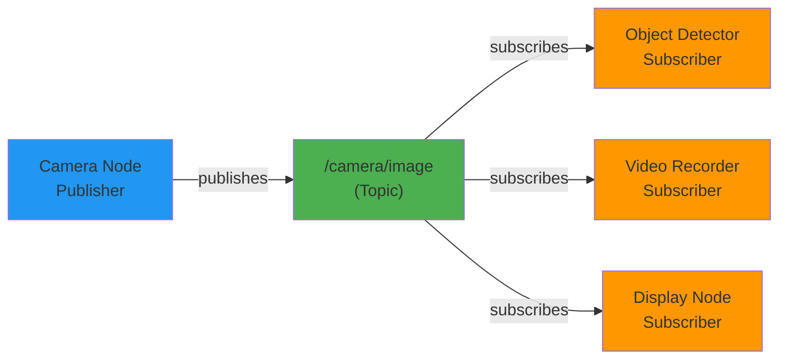
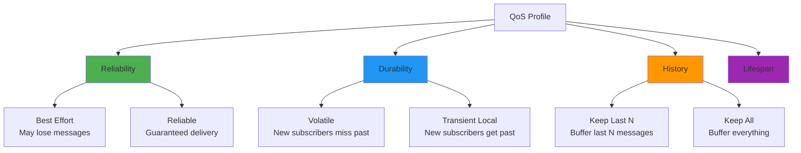

# Chapter 4: Topics and Publish/Subscribe Pattern

**Estimated Reading Time**: 60 minutes

## Learning Objectives

By the end of this chapter, you will be able to:

- **LO-1.4.1**: Explain the publish/subscribe pattern and when to use it
- **LO-1.4.2**: Create publisher and subscriber nodes in Python
- **LO-1.4.3**: Work with ROS 2 message types and custom messages
- **LO-1.4.4**: Configure Quality of Service (QoS) policies for reliable communication
- **LO-1.4.5**: Use ROS 2 CLI tools for topic introspection and debugging

---

## 1. What are Topics?

**Topics** are named channels for asynchronous, many-to-many communication between nodes. They implement the **publish/subscribe pattern** - one of the three core communication patterns in ROS 2.

### Publish/Subscribe Pattern

Think of topics like a YouTube channel:
- **Publisher** (YouTuber): Creates and uploads videos
- **Topic** (/cooking_channel): The channel where videos are posted
- **Subscribers** (Viewers): Watch videos as they're posted

Key characteristics:
- Publishers don't know who is subscribing
- Subscribers don't know who is publishing
- Multiple publishers can publish to the same topic
- Multiple subscribers can subscribe to the same topic
- Communication is **asynchronous** (no waiting for responses)



**Example**: A camera node publishes images to `/camera/image`. Multiple nodes (object detector, video recorder, GUI display) can subscribe without the camera knowing they exist.

---

## 2. When to Use Topics

Use **Topics** when you need:

✅ **Continuous data streaming** (sensor data, odometry, camera feeds)
✅ **One-to-many communication** (broadcast sensor data to multiple processing nodes)
✅ **Asynchronous updates** (subscribers don't need immediate response)
✅ **Decoupled systems** (publishers and subscribers independent)

**Don't use Topics** for:

❌ **Request/response interactions** → Use **Services** (Chapter 5)
❌ **Long-running tasks with feedback** → Use **Actions** (Chapter 6)
❌ **Configuration data** → Use **Parameters** (Chapter 7)

---

## 3. Creating a Publisher

Let's create a node that publishes simulated temperature sensor data.

### Publisher Example: Temperature Sensor

```python
#!/usr/bin/env python3
"""
Temperature Sensor Publisher
File: temperature_publisher.py
"""

import rclpy
from rclpy.node import Node
from std_msgs.msg import Float32
import random


class TemperatureSensor(Node):
    """Simulates a temperature sensor publishing data."""

    def __init__(self):
        super().__init__('temperature_sensor')

        # Create publisher
        # Topic: /temperature
        # Message type: Float32
        # Queue size: 10
        self.publisher = self.create_publisher(Float32, '/temperature', 10)

        # Publish at 1 Hz (once per second)
        self.timer = self.create_timer(1.0, self.publish_temperature)

        self.get_logger().info('Temperature sensor started')

    def publish_temperature(self):
        """Generate and publish temperature reading."""
        # Simulate temperature between 20-30°C with noise
        temperature = 25.0 + random.uniform(-5.0, 5.0)

        # Create message
        msg = Float32()
        msg.data = temperature

        # Publish message
        self.publisher.publish(msg)

        self.get_logger().info(f'Published: {temperature:.2f}°C')


def main(args=None):
    rclpy.init(args=args)
    node = TemperatureSensor()
    rclpy.spin(node)
    node.destroy_node()
    rclpy.shutdown()


if __name__ == '__main__':
    main()
```

### Publisher Code Breakdown

**1. Import Message Type**
```python
from std_msgs.msg import Float32
```
- `std_msgs`: Standard message package (comes with ROS 2)
- `Float32`: Message type for a single floating-point number

**2. Create Publisher**
```python
self.publisher = self.create_publisher(Float32, '/temperature', 10)
```
- **Type**: `Float32` - what kind of data we're publishing
- **Topic**: `/temperature` - topic name (must start with `/`)
- **Queue Size**: `10` - how many messages to buffer if subscribers are slow

**3. Publish Message**
```python
msg = Float32()
msg.data = temperature
self.publisher.publish(msg)
```
- Create message instance
- Set data field
- Publish to all subscribers

### Running the Publisher

```bash
python3 temperature_publisher.py
```

**Output:**
```
[INFO] [1638360000.123456] [temperature_sensor]: Temperature sensor started
[INFO] [1638360001.123789] [temperature_sensor]: Published: 23.45°C
[INFO] [1638360002.124012] [temperature_sensor]: Published: 27.12°C
[INFO] [1638360003.124234] [temperature_sensor]: Published: 22.89°C
```

---

## 4. Creating a Subscriber

Now let's create a node that subscribes to the temperature topic.

### Subscriber Example: Temperature Monitor

```python
#!/usr/bin/env python3
"""
Temperature Monitor Subscriber
File: temperature_subscriber.py
"""

import rclpy
from rclpy.node import Node
from std_msgs.msg import Float32


class TemperatureMonitor(Node):
    """Subscribes to temperature data and monitors thresholds."""

    def __init__(self):
        super().__init__('temperature_monitor')

        # Create subscriber
        # Topic: /temperature
        # Message type: Float32
        # Callback: temperature_callback
        # Queue size: 10
        self.subscription = self.create_subscription(
            Float32,
            '/temperature',
            self.temperature_callback,
            10
        )

        # Thresholds for alerts
        self.max_temp = 28.0
        self.min_temp = 22.0

        self.get_logger().info('Temperature monitor started')

    def temperature_callback(self, msg):
        """Called whenever a temperature message is received."""
        temperature = msg.data

        # Check thresholds
        if temperature > self.max_temp:
            self.get_logger().warn(f'HIGH TEMP: {temperature:.2f}°C')
        elif temperature < self.min_temp:
            self.get_logger().warn(f'LOW TEMP: {temperature:.2f}°C')
        else:
            self.get_logger().info(f'Normal: {temperature:.2f}°C')


def main(args=None):
    rclpy.init(args=args)
    node = TemperatureMonitor()
    rclpy.spin(node)
    node.destroy_node()
    rclpy.shutdown()


if __name__ == '__main__':
    main()
```

### Subscriber Code Breakdown

**Create Subscription**
```python
self.subscription = self.create_subscription(
    Float32,           # Message type
    '/temperature',    # Topic name
    self.temperature_callback,  # Callback function
    10                 # Queue size
)
```

**Callback Function**
```python
def temperature_callback(self, msg):
    temperature = msg.data
    # Process the received data
```
- Called automatically when a message arrives
- Receives message as parameter
- Should be fast (no heavy computation or blocking)

### Running Publisher and Subscriber Together

**Terminal 1 (Publisher):**
```bash
python3 temperature_publisher.py
```

**Terminal 2 (Subscriber):**
```bash
python3 temperature_subscriber.py
```

**Subscriber Output:**
```
[INFO] [1638360000.123456] [temperature_monitor]: Temperature monitor started
[INFO] [1638360001.125678] [temperature_monitor]: Normal: 25.34°C
[WARN] [1638360002.126789] [temperature_monitor]: HIGH TEMP: 29.12°C
[WARN] [1638360003.127890] [temperature_monitor]: LOW TEMP: 21.45°C
```

---

## 5. ROS 2 Message Types

ROS 2 provides standard message types in packages like `std_msgs`, `sensor_msgs`, and `geometry_msgs`.

### Common Standard Messages

| Package | Message Type | Description | Example Use |
|---------|-------------|-------------|-------------|
| `std_msgs` | `Int32` | Single integer | Count, ID |
| `std_msgs` | `Float32` | Single float | Temperature, voltage |
| `std_msgs` | `String` | Text string | Status message |
| `std_msgs` | `Bool` | Boolean | Switch state |
| `sensor_msgs` | `Image` | Camera image | Vision processing |
| `sensor_msgs` | `LaserScan` | Lidar data | Obstacle detection |
| `sensor_msgs` | `Imu` | IMU data | Robot orientation |
| `geometry_msgs` | `Twist` | Velocity command | Robot movement |
| `geometry_msgs` | `Pose` | Position & orientation | Robot localization |

### Viewing Message Structure

```bash
# See message definition
ros2 interface show std_msgs/msg/Float32

# Output:
# float32 data
```

```bash
# See complex message
ros2 interface show geometry_msgs/msg/Twist

# Output:
# Vector3  linear
#   float64 x
#   float64 y
#   float64 z
# Vector3  angular
#   float64 x
#   float64 y
#   float64 z
```

### Using Complex Messages

```python
from geometry_msgs.msg import Twist

# Create velocity command
cmd_vel = Twist()
cmd_vel.linear.x = 0.5    # Move forward at 0.5 m/s
cmd_vel.angular.z = 0.2   # Turn at 0.2 rad/s

publisher.publish(cmd_vel)
```

---

## 6. Quality of Service (QoS)

**QoS (Quality of Service)** policies control how messages are delivered. This is critical for reliable robot systems.

### QoS Policies Overview



### QoS Policy Dimensions

| Policy | Options | When to Use |
|--------|---------|-------------|
| **Reliability** | Best Effort / Reliable | Best effort: sensor data (ok to miss). Reliable: commands (must not miss) |
| **Durability** | Volatile / Transient Local | Volatile: real-time data. Transient local: configuration/maps |
| **History** | Keep Last N / Keep All | Keep last: sensor streams. Keep all: log everything |
| **Lifespan** | Duration | Discard old data (e.g., 5-second-old camera frame) |

### QoS Example: Reliable vs Best Effort

```python
#!/usr/bin/env python3
"""
QoS Configuration Example
File: qos_publisher.py
"""

import rclpy
from rclpy.node import Node
from rclpy.qos import QoSProfile, ReliabilityPolicy, HistoryPolicy
from std_msgs.msg import String


class QoSPublisher(Node):
    def __init__(self):
        super().__init__('qos_publisher')

        # Best Effort QoS (for sensor data - ok to lose messages)
        qos_best_effort = QoSProfile(
            reliability=ReliabilityPolicy.BEST_EFFORT,
            history=HistoryPolicy.KEEP_LAST,
            depth=10
        )

        # Reliable QoS (for commands - must not lose)
        qos_reliable = QoSProfile(
            reliability=ReliabilityPolicy.RELIABLE,
            history=HistoryPolicy.KEEP_LAST,
            depth=10
        )

        # Create publishers with different QoS
        self.sensor_pub = self.create_publisher(
            String, '/sensor_data', qos_best_effort
        )

        self.command_pub = self.create_publisher(
            String, '/robot_command', qos_reliable
        )

        self.timer = self.create_timer(1.0, self.publish_data)

    def publish_data(self):
        # Sensor data (best effort - ok to lose)
        sensor_msg = String()
        sensor_msg.data = 'Sensor reading: 42'
        self.sensor_pub.publish(sensor_msg)

        # Command (reliable - must arrive)
        command_msg = String()
        command_msg.data = 'MOVE_FORWARD'
        self.command_pub.publish(command_msg)

        self.get_logger().info('Published sensor and command')


def main(args=None):
    rclpy.init(args=args)
    node = QoSPublisher()
    rclpy.spin(node)
    node.destroy_node()
    rclpy.shutdown()


if __name__ == '__main__':
    main()
```

### QoS Matching

**Important**: Publisher and subscriber QoS must be **compatible**:

✅ **Compatible**:
- Both use Best Effort
- Both use Reliable
- Publisher: Reliable, Subscriber: Best Effort

❌ **Incompatible**:
- Publisher: Best Effort, Subscriber: Reliable

If incompatible, the connection will **not** be established!

### Checking QoS Compatibility

```bash
# See QoS of a topic
ros2 topic info /temperature --verbose

# Output shows publisher and subscriber QoS settings
```

---

## 7. Topic Introspection with ROS 2 CLI

### List All Active Topics

```bash
ros2 topic list
```

**Output:**
```
/parameter_events
/rosout
/temperature
```

### Get Topic Information

```bash
ros2 topic info /temperature
```

**Output:**
```
Type: std_msgs/msg/Float32
Publisher count: 1
Subscription count: 2
```

### Echo Topic Messages

```bash
# Print messages as they arrive
ros2 topic echo /temperature
```

**Output:**
```
data: 25.34
---
data: 27.12
---
data: 22.89
---
```

### Measure Topic Frequency

```bash
# Check publishing rate
ros2 topic hz /temperature
```

**Output:**
```
average rate: 1.002
  min: 0.998s max: 1.005s std dev: 0.002s window: 10
```

### Publish from Command Line

```bash
# Publish a single message manually
ros2 topic pub /temperature std_msgs/msg/Float32 "data: 30.0"

# Publish repeatedly at 10 Hz
ros2 topic pub --rate 10 /temperature std_msgs/msg/Float32 "data: 30.0"
```

This is incredibly useful for testing subscribers without writing code!

---

## 8. Best Practices

### ✅ Do:

1. **Use descriptive topic names**: `/robot/sensors/temperature` not `/temp`
2. **Namespace topics by robot**: `/robot1/camera`, `/robot2/camera`
3. **Choose appropriate QoS**: Reliable for commands, Best Effort for sensor streams
4. **Keep callbacks fast**: Heavy processing should happen in separate threads
5. **Use standard message types** when possible (e.g., `sensor_msgs/Image`)

### ❌ Don't:

1. **Don't publish at excessive rates**: 1000 Hz camera is wasteful
2. **Don't block in callbacks**: No `time.sleep()` in subscribers
3. **Don't use topics for request/response**: Use services instead
4. **Don't forget to check QoS compatibility**
5. **Don't use generic names**: `/data`, `/info`, `/status` are too vague

### Topic Naming Conventions

```
✅ Good:
  /robot1/sensors/camera/image_raw
  /robot1/control/cmd_vel
  /environment/obstacles/laser_scan

❌ Bad:
  /cam
  /data
  /topic1
```

---

## Lab Exercise 1.4: Robot Sensor System

### Objective

Build a complete publisher-subscriber system simulating a robot sensor suite.

### Requirements

Create two nodes:

#### 1. `sensor_suite_publisher.py`

**Functionality**:
- Publish to 3 topics simultaneously:
  - `/sensors/temperature` (Float32) - at 1 Hz
  - `/sensors/battery` (Float32) - at 0.5 Hz (every 2 seconds)
  - `/sensors/status` (String) - at 0.2 Hz (every 5 seconds)
- Simulate realistic values:
  - Temperature: 20-30°C with random noise
  - Battery: Decreasing from 100% to 0% over 2 minutes
  - Status: Alternating between "NORMAL", "WARNING", "ERROR"

#### 2. `sensor_monitor_subscriber.py`

**Functionality**:
- Subscribe to all 3 topics
- Store latest value from each
- Print summary every 5 seconds:
  ```
  === Sensor Summary ===
  Temperature: 25.4°C
  Battery: 78.3%
  Status: NORMAL
  ```
- Alert if:
  - Temperature > 28°C: Log WARN
  - Battery < 20%: Log WARN
  - Status = "ERROR": Log ERROR

### Starter Code

```python
#!/usr/bin/env python3
"""
Lab 1.4: Sensor Suite Publisher
TODO: Complete the implementation
"""

import rclpy
from rclpy.node import Node
from std_msgs.msg import Float32, String
import random


class SensorSuitePublisher(Node):
    def __init__(self):
        super().__init__('sensor_suite_publisher')

        # TODO: Create 3 publishers for temperature, battery, status

        # TODO: Create 3 timers with different rates:
        #   - Temperature: 1 Hz
        #   - Battery: 0.5 Hz
        #   - Status: 0.2 Hz

        self.battery_level = 100.0
        self.status_index = 0
        self.statuses = ["NORMAL", "WARNING", "ERROR"]

        self.get_logger().info('Sensor suite started')

    def publish_temperature(self):
        # TODO: Publish random temperature (20-30°C)
        pass

    def publish_battery(self):
        # TODO: Publish battery (decrease by 1% each call)
        pass

    def publish_status(self):
        # TODO: Cycle through statuses
        pass


def main(args=None):
    rclpy.init(args=args)
    node = SensorSuitePublisher()
    rclpy.spin(node)
    node.destroy_node()
    rclpy.shutdown()


if __name__ == '__main__':
    main()
```

### Acceptance Criteria

- ✅ All 3 topics publish at correct rates
- ✅ Subscriber receives all messages correctly
- ✅ Summary prints every 5 seconds
- ✅ Alerts trigger at correct thresholds
- ✅ Code is well-commented

### Testing

**Terminal 1:**
```bash
python3 sensor_suite_publisher.py
```

**Terminal 2:**
```bash
python3 sensor_monitor_subscriber.py
```

**Terminal 3 (validation):**
```bash
# Check all topics exist
ros2 topic list

# Verify publishing rates
ros2 topic hz /sensors/temperature
ros2 topic hz /sensors/battery
ros2 topic hz /sensors/status
```

### Solution

<details>
<summary>Click to reveal solution</summary>

**sensor_suite_publisher.py:**
```python
#!/usr/bin/env python3
import rclpy
from rclpy.node import Node
from std_msgs.msg import Float32, String
import random


class SensorSuitePublisher(Node):
    def __init__(self):
        super().__init__('sensor_suite_publisher')

        self.temp_pub = self.create_publisher(Float32, '/sensors/temperature', 10)
        self.battery_pub = self.create_publisher(Float32, '/sensors/battery', 10)
        self.status_pub = self.create_publisher(String, '/sensors/status', 10)

        self.create_timer(1.0, self.publish_temperature)
        self.create_timer(2.0, self.publish_battery)
        self.create_timer(5.0, self.publish_status)

        self.battery_level = 100.0
        self.status_index = 0
        self.statuses = ["NORMAL", "WARNING", "ERROR"]

        self.get_logger().info('Sensor suite started')

    def publish_temperature(self):
        msg = Float32()
        msg.data = 25.0 + random.uniform(-5.0, 5.0)
        self.temp_pub.publish(msg)

    def publish_battery(self):
        msg = Float32()
        msg.data = max(0.0, self.battery_level)
        self.battery_pub.publish(msg)
        self.battery_level -= 1.0

    def publish_status(self):
        msg = String()
        msg.data = self.statuses[self.status_index]
        self.status_pub.publish(msg)
        self.status_index = (self.status_index + 1) % len(self.statuses)


def main(args=None):
    rclpy.init(args=args)
    node = SensorSuitePublisher()
    rclpy.spin(node)
    node.destroy_node()
    rclpy.shutdown()


if __name__ == '__main__':
    main()
```

**sensor_monitor_subscriber.py:**
```python
#!/usr/bin/env python3
import rclpy
from rclpy.node import Node
from std_msgs.msg import Float32, String


class SensorMonitor(Node):
    def __init__(self):
        super().__init__('sensor_monitor')

        self.create_subscription(Float32, '/sensors/temperature', self.temp_callback, 10)
        self.create_subscription(Float32, '/sensors/battery', self.battery_callback, 10)
        self.create_subscription(String, '/sensors/status', self.status_callback, 10)

        self.create_timer(5.0, self.print_summary)

        self.temperature = None
        self.battery = None
        self.status = None

        self.get_logger().info('Sensor monitor started')

    def temp_callback(self, msg):
        self.temperature = msg.data
        if self.temperature > 28.0:
            self.get_logger().warn(f'High temperature: {self.temperature:.1f}°C')

    def battery_callback(self, msg):
        self.battery = msg.data
        if self.battery < 20.0:
            self.get_logger().warn(f'Low battery: {self.battery:.1f}%')

    def status_callback(self, msg):
        self.status = msg.data
        if self.status == "ERROR":
            self.get_logger().error(f'System status: {self.status}')

    def print_summary(self):
        self.get_logger().info('=== Sensor Summary ===')
        self.get_logger().info(f'Temperature: {self.temperature:.1f}°C' if self.temperature else 'Temperature: N/A')
        self.get_logger().info(f'Battery: {self.battery:.1f}%' if self.battery else 'Battery: N/A')
        self.get_logger().info(f'Status: {self.status}' if self.status else 'Status: N/A')


def main(args=None):
    rclpy.init(args=args)
    node = SensorMonitor()
    rclpy.spin(node)
    node.destroy_node()
    rclpy.shutdown()


if __name__ == '__main__':
    main()
```
</details>

---

## Quiz 1.4: Topics

### Question 1
**What is the main advantage of the publish/subscribe pattern?**

- A) Faster than other patterns
- B) Decoupling publishers from subscribers ✓
- C) Uses less memory
- D) Easier to debug

**Explanation**: Pub/sub decouples producers and consumers. Publishers don't need to know about subscribers and vice versa, enabling modular, scalable systems.

---

### Question 2
**Which QoS reliability policy should you use for publishing robot velocity commands?**

- A) Best Effort
- B) Reliable ✓
- C) Either works
- D) QoS not needed

**Explanation**: Velocity commands must arrive reliably. A lost command could cause the robot to miss a stop signal, creating safety hazards.

---

### Question 3
**What happens if a subscriber's callback function blocks for a long time?**

- A) Nothing, it's fine
- B) Messages queue up and may be dropped ✓
- C) Publisher stops publishing
- D) ROS 2 crashes

**Explanation**: If callbacks are slow, incoming messages queue up. When the queue fills (depth parameter), new messages are dropped.

---

### Question 4
**True or False: Multiple nodes can publish to the same topic.**

- True ✓

**Explanation**: Topics support many-to-many communication. Multiple publishers and subscribers can use the same topic.

---

### Question 5
**What command shows the publishing rate of a topic? (Short answer)**

**Expected Answer**: `ros2 topic hz /topic_name`

---

## Key Takeaways

✅ **Topics** enable asynchronous, many-to-many communication via publish/subscribe pattern

✅ **Publishers** send messages without knowing who receives them (decoupled)

✅ **Subscribers** receive messages via callback functions (must be fast!)

✅ **QoS policies** control reliability, durability, and history (critical for production systems)

✅ **ROS 2 CLI tools** (`ros2 topic list`, `echo`, `hz`, `info`) essential for debugging

✅ **Standard message types** (`std_msgs`, `sensor_msgs`, `geometry_msgs`) cover most use cases

---

## What's Next?

In **Chapter 5**, you'll learn about **Services** - the request/response communication pattern for on-demand operations.

[Continue to Chapter 5: ROS 2 Services →](/docs/module-1-ros2/week-3/chapter-5-services)

---

## Additional Resources

- **rclpy Publisher Tutorial**: [docs.ros.org/en/humble/Tutorials/Writing-A-Simple-Py-Publisher-And-Subscriber.html](https://docs.ros.org/en/humble/Tutorials/Beginner-Client-Libraries/Writing-A-Simple-Py-Publisher-And-Subscriber.html)
- **QoS Deep Dive**: [docs.ros.org/en/humble/Concepts/About-Quality-of-Service-Settings.html](https://docs.ros.org/en/humble/Concepts/About-Quality-of-Service-Settings.html)
- **Standard Messages**: [docs.ros2.org/latest/api/std_msgs/](https://docs.ros2.org/latest/api/std_msgs/)
- **Topic CLI Reference**: [docs.ros.org/en/humble/Tutorials/Beginner-CLI-Tools/Understanding-ROS2-Topics.html](https://docs.ros.org/en/humble/Tutorials/Beginner-CLI-Tools/Understanding-ROS2-Topics.html)

---

**Progress**: Module 1, Week 2, Chapter 4 of 32 | [View all chapters](/docs/intro)
