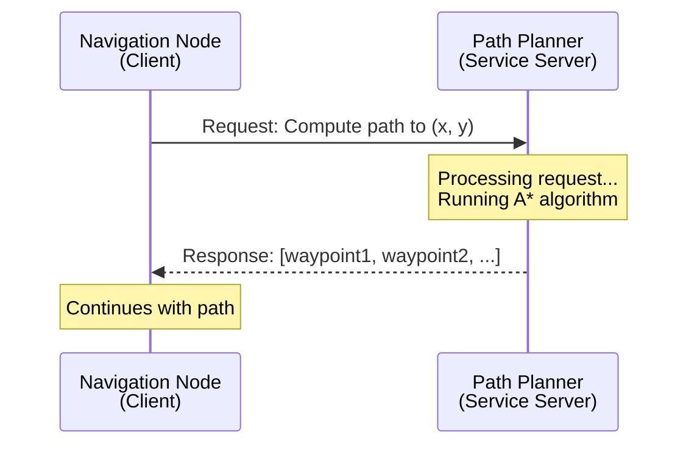

# Chapter 5: ROS 2 Services for Request-Response

**Estimated Reading Time**: 55 minutes

## Learning Objectives

By the end of this chapter, you will be able to:

- **LO-1.5.1**: Explain when to use services vs topics
- **LO-1.5.2**: Create service servers that handle requests
- **LO-1.5.3**: Create service clients that make requests and wait for responses
- **LO-1.5.4**: Work with standard and custom service definitions
- **LO-1.5.5**: Handle timeouts and errors in service communication

---

## 1. What are Services?

**Services** implement the **request-response pattern** - one of the three core communication patterns in ROS 2 (alongside topics and actions).

### Request-Response Pattern

Think of services like a restaurant order:
- **Client** (Customer): Requests a service ("I'd like a burger")
- **Server** (Kitchen): Processes the request and returns a response ("Here's your burger")
- Communication is **synchronous**: client waits for response
- **One-to-one**: each request goes to exactly one server



**Key Difference from Topics**:
- **Topics**: Continuous, asynchronous data streaming (fire-and-forget)
- **Services**: On-demand, synchronous request-response (wait for reply)

---

## 2. When to Use Services

Use **Services** when you need:

✅ **On-demand operations** (compute path, open gripper, take photo)
✅ **Immediate response required** (need result before continuing)
✅ **Transactional operations** (success/failure confirmation)
✅ **One-time requests** (not continuous streaming)

**Examples**:
- Compute inverse kinematics for arm position
- Request robot to save map
- Ask for current battery percentage
- Trigger camera capture

**Don't use Services** for:

❌ **Continuous data streams** → Use **Topics** (Chapter 4)
❌ **Long-running tasks** (>1 second) → Use **Actions** (Chapter 6)
❌ **Broadcasting to multiple listeners** → Use **Topics**
❌ **No response needed** → Use **Topics**

---

## 3. Creating a Service Server

Let's create a simple service that adds two numbers.

### Service Server Example: Add Two Ints

```python
#!/usr/bin/env python3
"""
Add Two Ints Service Server
File: add_two_ints_server.py
"""

import rclpy
from rclpy.node import Node
from example_interfaces.srv import AddTwoInts


class AddTwoIntsServer(Node):
    """Service server that adds two integers."""

    def __init__(self):
        super().__init__('add_two_ints_server')

        # Create service
        # Service name: /add_two_ints
        # Service type: AddTwoInts
        # Callback: add_two_ints_callback
        self.service = self.create_service(
            AddTwoInts,
            '/add_two_ints',
            self.add_two_ints_callback
        )

        self.get_logger().info('Add Two Ints server ready')

    def add_two_ints_callback(self, request, response):
        """
        Called when a request is received.
        Args:
            request: Contains request.a and request.b
            response: Object to fill with response.sum
        Returns:
            response: Filled response object
        """
        # Extract request data
        a = request.a
        b = request.b

        # Compute result
        response.sum = a + b

        # Log the operation
        self.get_logger().info(f'Request: {a} + {b} = {response.sum}')

        # Return response to client
        return response


def main(args=None):
    rclpy.init(args=args)
    node = AddTwoIntsServer()
    rclpy.spin(node)
    node.destroy_node()
    rclpy.shutdown()


if __name__ == '__main__':
    main()
```

### Service Server Code Breakdown

**1. Import Service Type**
```python
from example_interfaces.srv import AddTwoInts
```
- `example_interfaces`: Package with standard service definitions
- `AddTwoInts`: Service type (request has two ints, response has one)

**2. Create Service**
```python
self.service = self.create_service(
    AddTwoInts,                    # Service type
    '/add_two_ints',               # Service name
    self.add_two_ints_callback     # Callback function
)
```

**3. Service Callback**
```python
def add_two_ints_callback(self, request, response):
    response.sum = request.a + request.b
    return response
```
- Receives `request` object with data
- Fills `response` object with result
- Must return `response`

### Running the Service Server

```bash
python3 add_two_ints_server.py
```

**Output:**
```
[INFO] [1638360000.123456] [add_two_ints_server]: Add Two Ints server ready
```

The server is now waiting for requests...

---

## 4. Creating a Service Client

Now let's create a client that calls our service.

### Service Client Example

```python
#!/usr/bin/env python3
"""
Add Two Ints Service Client
File: add_two_ints_client.py
"""

import rclpy
from rclpy.node import Node
from example_interfaces.srv import AddTwoInts
import sys


class AddTwoIntsClient(Node):
    """Service client that requests addition of two numbers."""

    def __init__(self):
        super().__init__('add_two_ints_client')

        # Create client
        # Service name: /add_two_ints
        # Service type: AddTwoInts
        self.client = self.create_client(AddTwoInts, '/add_two_ints')

        # Wait for service to be available
        while not self.client.wait_for_service(timeout_sec=1.0):
            self.get_logger().info('Service not available, waiting...')

        self.get_logger().info('Service is available!')

    def send_request(self, a, b):
        """
        Send a request to add two numbers.
        Args:
            a: First number
            b: Second number
        Returns:
            Future object (result available later)
        """
        # Create request
        request = AddTwoInts.Request()
        request.a = a
        request.b = b

        # Send request asynchronously
        self.get_logger().info(f'Sending request: {a} + {b}')
        future = self.client.call_async(request)

        return future


def main(args=None):
    rclpy.init(args=args)

    # Get numbers from command line
    if len(sys.argv) != 3:
        print('Usage: python3 add_two_ints_client.py <a> <b>')
        return

    a = int(sys.argv[1])
    b = int(sys.argv[2])

    # Create client and send request
    node = AddTwoIntsClient()
    future = node.send_request(a, b)

    # Wait for response
    rclpy.spin_until_future_complete(node, future)

    # Get result
    if future.result() is not None:
        response = future.result()
        node.get_logger().info(f'Result: {a} + {b} = {response.sum}')
    else:
        node.get_logger().error('Service call failed')

    node.destroy_node()
    rclpy.shutdown()


if __name__ == '__main__':
    main()
```

### Service Client Code Breakdown

**1. Create Client**
```python
self.client = self.create_client(AddTwoInts, '/add_two_ints')
```

**2. Wait for Service**
```python
while not self.client.wait_for_service(timeout_sec=1.0):
    self.get_logger().info('Service not available, waiting...')
```
- Checks if server is running
- Timeout prevents infinite waiting

**3. Send Request**
```python
request = AddTwoInts.Request()
request.a = a
request.b = b
future = self.client.call_async(request)
```
- Create request object
- Fill with data
- Call asynchronously (non-blocking)

**4. Wait for Response**
```python
rclpy.spin_until_future_complete(node, future)
response = future.result()
```

### Running Client and Server Together

**Terminal 1 (Server):**
```bash
python3 add_two_ints_server.py
```

**Terminal 2 (Client):**
```bash
python3 add_two_ints_client.py 10 15
```

**Server Output:**
```
[INFO] [1638360000.123456] [add_two_ints_server]: Add Two Ints server ready
[INFO] [1638360005.234567] [add_two_ints_server]: Request: 10 + 15 = 25
```

**Client Output:**
```
[INFO] [1638360005.234123] [add_two_ints_client]: Service is available!
[INFO] [1638360005.234345] [add_two_ints_client]: Sending request: 10 + 15
[INFO] [1638360005.234890] [add_two_ints_client]: Result: 10 + 15 = 25
```

---

## 5. Service Definitions

### Viewing Service Structure

```bash
# See service definition
ros2 interface show example_interfaces/srv/AddTwoInts
```

**Output:**
```
int64 a
int64 b
---
int64 sum
```

**Structure**:
- **Above the line** (`---`): Request fields
- **Below the line**: Response fields

### Common Standard Services

| Package | Service Type | Request | Response | Use Case |
|---------|-------------|---------|----------|----------|
| `std_srvs` | `Trigger` | None | success, message | Start/stop operations |
| `std_srvs` | `SetBool` | data (bool) | success, message | Enable/disable features |
| `example_interfaces` | `AddTwoInts` | a, b (int64) | sum (int64) | Simple computation |
| `nav_msgs` | `GetMap` | None | map (OccupancyGrid) | Retrieve map data |

### Custom Service Definition

You can create custom services for robot-specific operations:

**File: `RobotCommand.srv`**
```
# Request
string command
float32 speed
---
# Response
bool success
string message
```

This service could control a robot:
- **Request**: Command ("move_forward", "turn_left") and speed
- **Response**: Success status and descriptive message

---

## 6. Handling Timeouts and Errors

In production systems, services can fail. Handle errors gracefully!

### Client with Timeout Handling

```python
#!/usr/bin/env python3
"""
Service Client with Timeout Handling
File: robust_service_client.py
"""

import rclpy
from rclpy.node import Node
from example_interfaces.srv import AddTwoInts
from rclpy.executors import MultiThreadedExecutor
import time


class RobustServiceClient(Node):
    def __init__(self):
        super().__init__('robust_service_client')
        self.client = self.create_client(AddTwoInts, '/add_two_ints')

    def send_request_with_timeout(self, a, b, timeout_sec=5.0):
        """
        Send request with timeout and error handling.
        Returns:
            Result if successful, None if failed
        """
        # Check if service is available
        if not self.client.wait_for_service(timeout_sec=2.0):
            self.get_logger().error('Service not available after 2 seconds')
            return None

        # Create and send request
        request = AddTwoInts.Request()
        request.a = a
        request.b = b

        future = self.client.call_async(request)

        # Wait with timeout
        start_time = time.time()
        while rclpy.ok():
            rclpy.spin_once(self, timeout_sec=0.1)

            if future.done():
                try:
                    response = future.result()
                    self.get_logger().info(f'Success: {response.sum}')
                    return response
                except Exception as e:
                    self.get_logger().error(f'Service call failed: {e}')
                    return None

            # Check timeout
            if time.time() - start_time > timeout_sec:
                self.get_logger().error('Service call timed out')
                return None

        return None


def main(args=None):
    rclpy.init(args=args)
    node = RobustServiceClient()

    # Test with timeout
    result = node.send_request_with_timeout(5, 7, timeout_sec=5.0)

    if result:
        print(f'Got result: {result.sum}')
    else:
        print('Request failed')

    node.destroy_node()
    rclpy.shutdown()


if __name__ == '__main__':
    main()
```

### Error Handling Best Practices

✅ **Do:**
- Always check `wait_for_service()` before calling
- Set reasonable timeouts (5-10 seconds for computations)
- Log errors clearly with context
- Return meaningful error messages in response

❌ **Don't:**
- Assume service is always available
- Wait forever (no timeout)
- Ignore errors silently
- Crash on failure (handle gracefully)

---

## 7. Service Introspection with ROS 2 CLI

### List All Services

```bash
ros2 service list
```

**Output:**
```
/add_two_ints
/robot_state_publisher/describe_parameters
/robot_state_publisher/get_parameters
...
```

### Get Service Type

```bash
ros2 service type /add_two_ints
```

**Output:**
```
example_interfaces/srv/AddTwoInts
```

### Call Service from Command Line

```bash
# Call service manually
ros2 service call /add_two_ints example_interfaces/srv/AddTwoInts "{a: 10, b: 15}"
```

**Output:**
```
waiting for service to become available...
requester: making request: example_interfaces.srv.AddTwoInts_Request(a=10, b=15)

response:
example_interfaces.srv.AddTwoInts_Response(sum=25)
```

This is incredibly useful for testing services without writing client code!

---

## 8. Real-World Service Example

### Robot Arm Control Service

```python
#!/usr/bin/env python3
"""
Robot Arm Control Service
File: arm_controller_server.py
"""

import rclpy
from rclpy.node import Node
from std_srvs.srv import Trigger


class ArmControllerServer(Node):
    """Service server for robot arm control."""

    def __init__(self):
        super().__init__('arm_controller_server')

        # Create services for different arm operations
        self.home_service = self.create_service(
            Trigger, '/arm/go_home', self.go_home_callback
        )

        self.calibrate_service = self.create_service(
            Trigger, '/arm/calibrate', self.calibrate_callback
        )

        self.arm_homed = False
        self.arm_calibrated = False

        self.get_logger().info('Arm controller server ready')

    def go_home_callback(self, request, response):
        """Move arm to home position."""
        if not self.arm_calibrated:
            response.success = False
            response.message = 'Cannot home: Arm not calibrated'
            self.get_logger().warn('Home request rejected: Not calibrated')
        else:
            # Simulate moving to home position
            self.get_logger().info('Moving arm to home position...')
            # In real code: send commands to motors
            import time
            time.sleep(2.0)  # Simulate motion

            self.arm_homed = True
            response.success = True
            response.message = 'Arm moved to home position'
            self.get_logger().info('Arm homed successfully')

        return response

    def calibrate_callback(self, request, response):
        """Calibrate arm sensors."""
        self.get_logger().info('Calibrating arm...')
        # In real code: run calibration routine
        import time
        time.sleep(3.0)  # Simulate calibration

        self.arm_calibrated = True
        response.success = True
        response.message = 'Arm calibrated successfully'
        self.get_logger().info('Calibration complete')

        return response


def main(args=None):
    rclpy.init(args=args)
    node = ArmControllerServer()
    rclpy.spin(node)
    node.destroy_node()
    rclpy.shutdown()


if __name__ == '__main__':
    main()
```

**Usage:**
```bash
# Terminal 1: Start server
python3 arm_controller_server.py

# Terminal 2: Test services
ros2 service call /arm/go_home std_srvs/srv/Trigger
# Response: success: False, message: 'Cannot home: Arm not calibrated'

ros2 service call /arm/calibrate std_srvs/srv/Trigger
# Response: success: True, message: 'Arm calibrated successfully'

ros2 service call /arm/go_home std_srvs/srv/Trigger
# Response: success: True, message: 'Arm moved to home position'
```

---

## Lab Exercise 1.5: Robot Control Service

### Objective

Build a service-based robot control system with state management.

### Requirements

Create two nodes:

#### 1. `robot_controller_server.py`

**Services to implement**:
- `/robot/power_on` (Trigger)
  - Turn on robot
  - Response: success=True if not already on, False if already on
- `/robot/power_off` (Trigger)
  - Turn off robot
  - Response: success=True if on, False if already off
- `/robot/set_speed` (SetBool)
  - Set speed mode (data=True → fast, data=False → slow)
  - Response: success=True if robot is powered on, False otherwise

**State management**:
- Track power state (on/off)
- Track speed mode (fast/slow)
- Only allow speed changes when powered on

#### 2. `robot_controller_client.py`

**Functionality**:
- Command-line interface for controlling robot
- Usage: `python3 robot_controller_client.py <command>`
- Commands:
  - `on` → Call power_on service
  - `off` → Call power_off service
  - `fast` → Call set_speed(True)
  - `slow` → Call set_speed(False)
- Print server response message

### Starter Code

```python
#!/usr/bin/env python3
"""
Lab 1.5: Robot Controller Server
TODO: Complete the implementation
"""

import rclpy
from rclpy.node import Node
from std_srvs.srv import Trigger, SetBool


class RobotControllerServer(Node):
    def __init__(self):
        super().__init__('robot_controller_server')

        # TODO: Create three services
        # /robot/power_on (Trigger)
        # /robot/power_off (Trigger)
        # /robot/set_speed (SetBool)

        # TODO: Initialize state variables
        self.powered_on = False
        self.fast_mode = False

        self.get_logger().info('Robot controller server ready')

    def power_on_callback(self, request, response):
        # TODO: Implement power on logic
        pass

    def power_off_callback(self, request, response):
        # TODO: Implement power off logic
        pass

    def set_speed_callback(self, request, response):
        # TODO: Implement speed setting logic
        # Only allow if powered on
        pass


def main(args=None):
    rclpy.init(args=args)
    node = RobotControllerServer()
    rclpy.spin(node)
    node.destroy_node()
    rclpy.shutdown()


if __name__ == '__main__':
    main()
```

### Acceptance Criteria

- ✅ All three services work correctly
- ✅ State is managed properly (can't set speed when off)
- ✅ Appropriate response messages
- ✅ Client works from command line
- ✅ Code includes error handling

### Testing

**Terminal 1:**
```bash
python3 robot_controller_server.py
```

**Terminal 2:**
```bash
python3 robot_controller_client.py on
python3 robot_controller_client.py fast
python3 robot_controller_client.py off
python3 robot_controller_client.py fast  # Should fail
```

**Terminal 3 (validation):**
```bash
ros2 service list | grep robot
ros2 service type /robot/power_on
```

### Solution

<details>
<summary>Click to reveal solution</summary>

```python
#!/usr/bin/env python3
import rclpy
from rclpy.node import Node
from std_srvs.srv import Trigger, SetBool


class RobotControllerServer(Node):
    def __init__(self):
        super().__init__('robot_controller_server')

        self.create_service(Trigger, '/robot/power_on', self.power_on_callback)
        self.create_service(Trigger, '/robot/power_off', self.power_off_callback)
        self.create_service(SetBool, '/robot/set_speed', self.set_speed_callback)

        self.powered_on = False
        self.fast_mode = False

        self.get_logger().info('Robot controller server ready')

    def power_on_callback(self, request, response):
        if self.powered_on:
            response.success = False
            response.message = 'Robot already powered on'
        else:
            self.powered_on = True
            response.success = True
            response.message = 'Robot powered on'
            self.get_logger().info('Robot powered ON')
        return response

    def power_off_callback(self, request, response):
        if not self.powered_on:
            response.success = False
            response.message = 'Robot already powered off'
        else:
            self.powered_on = False
            self.fast_mode = False
            response.success = True
            response.message = 'Robot powered off'
            self.get_logger().info('Robot powered OFF')
        return response

    def set_speed_callback(self, request, response):
        if not self.powered_on:
            response.success = False
            response.message = 'Cannot set speed: Robot is powered off'
        else:
            self.fast_mode = request.data
            mode = "FAST" if self.fast_mode else "SLOW"
            response.success = True
            response.message = f'Speed mode set to {mode}'
            self.get_logger().info(f'Speed: {mode}')
        return response


def main(args=None):
    rclpy.init(args=args)
    node = RobotControllerServer()
    rclpy.spin(node)
    node.destroy_node()
    rclpy.shutdown()


if __name__ == '__main__':
    main()
```
</details>

---

## Quiz 1.5: Services

### Question 1
**When should you use a service instead of a topic?**

- A) For continuous sensor data
- B) For one-time, on-demand operations ✓
- C) For high-frequency data streams
- D) For broadcasting to multiple nodes

**Explanation**: Services are for request-response interactions where the client needs an immediate result. Topics are for continuous data streams.

---

### Question 2
**What does `wait_for_service()` do?**

- A) Creates a new service
- B) Checks if service server is running ✓
- C) Sends a request
- D) Shuts down a service

**Explanation**: `wait_for_service()` blocks until the service server is available, ensuring the client doesn't try to call a non-existent service.

---

### Question 3
**True or False: A service can have multiple servers responding to the same service name.**

- False ✓

**Explanation**: Each service name can only have one server. Multiple servers would create ambiguity about which server handles a request.

---

### Question 4
**What is the difference between `call_async()` and `call()` for service clients? (Short answer)**

**Expected Answer**: `call_async()` returns immediately with a Future object (non-blocking), while `call()` blocks until the response is received (blocking, not recommended in ROS 2).

---

### Question 5
**Name two situations where services are preferred over topics. (Short answer)**

**Expected Answers** (any two):
- Computing a result (inverse kinematics, path planning)
- Triggering one-time actions (save map, take photo)
- Querying system state (get battery level, check calibration)
- Transactional operations requiring confirmation (success/failure)

---

## Key Takeaways

✅ **Services** implement synchronous request-response pattern (client waits for server)

✅ **Use services** for on-demand operations, not continuous streaming

✅ **Service server** processes requests and returns responses via callbacks

✅ **Service client** sends requests and receives responses (with timeout handling)

✅ **Always check** service availability with `wait_for_service()` before calling

✅ **Handle errors gracefully** with timeouts and meaningful error messages

---

## What's Next?

In **Chapter 6**, you'll learn about **Actions** - the communication pattern for long-running tasks with feedback and cancellation.

[Continue to Chapter 6: ROS 2 Actions →](/docs/module-1-ros2/week-3/chapter-6-actions)

---

## Additional Resources

- **Service Tutorial**: [docs.ros.org/en/humble/Tutorials/Writing-A-Simple-Py-Service-And-Client.html](https://docs.ros.org/en/humble/Tutorials/Beginner-Client-Libraries/Writing-A-Simple-Py-Service-And-Client.html)
- **Service CLI Reference**: [docs.ros.org/en/humble/Tutorials/Beginner-CLI-Tools/Understanding-ROS2-Services.html](https://docs.ros.org/en/humble/Tutorials/Beginner-CLI-Tools/Understanding-ROS2-Services.html)
- **Standard Services**: [docs.ros2.org/latest/api/std_srvs/](https://docs.ros2.org/latest/api/std_srvs/)
- **Custom Service Definitions**: [docs.ros.org/en/humble/Tutorials/Custom-ROS2-Interfaces.html](https://docs.ros.org/en/humble/Tutorials/Beginner-Client-Libraries/Custom-ROS2-Interfaces.html)

---

**Progress**: Module 1, Week 3, Chapter 5 of 32 | [View all chapters](/docs/intro)
