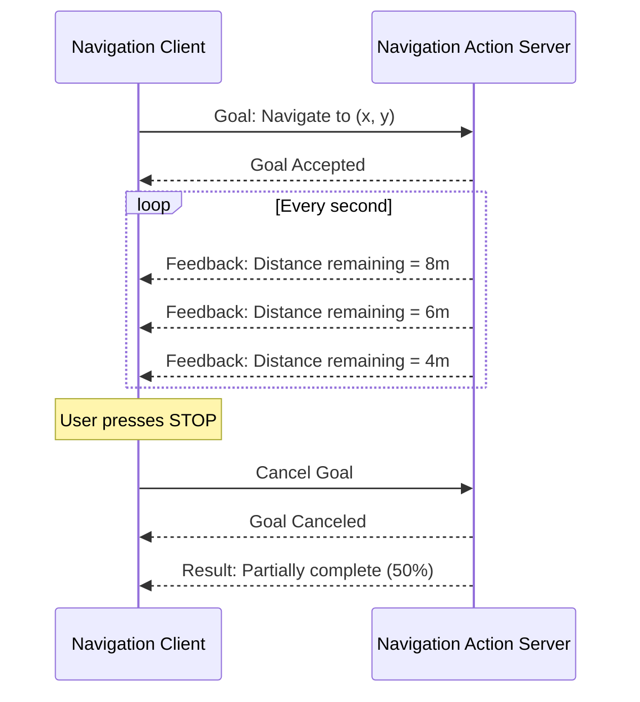
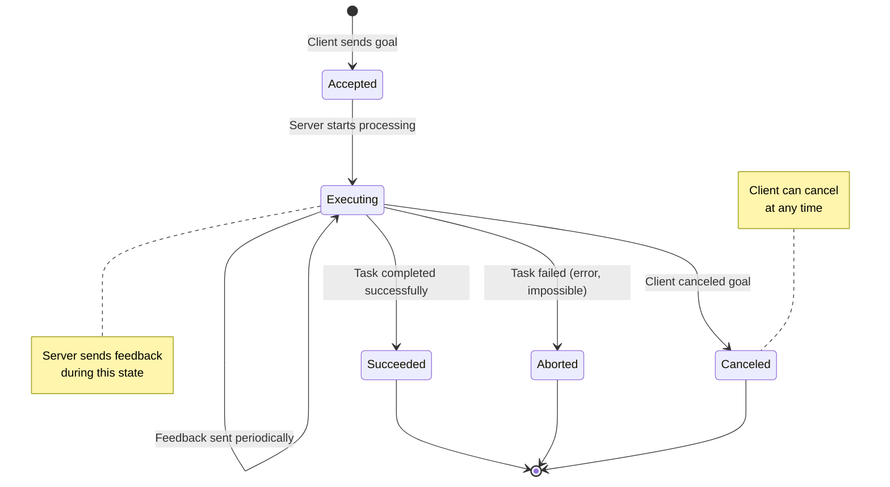

# Chapter 6: ROS 2 Actions for Long-Running Tasks

**Estimated Reading Time**: 65 minutes

## Learning Objectives

By the end of this chapter, you will be able to:

- **LO-1.6.1**: Explain when to use actions vs services vs topics
- **LO-1.6.2**: Create action servers that handle long-running goals
- **LO-1.6.3**: Create action clients that send goals and receive feedback
- **LO-1.6.4**: Implement goal cancellation (preemption)
- **LO-1.6.5**: Work with custom action definitions
- **LO-1.6.6**: Handle action lifecycle states (accepted, executing, succeeded, aborted, canceled)

---

## 1. What are Actions?

**Actions** are the third and most sophisticated communication pattern in ROS 2. They're designed for **long-running, pre-emptable tasks** that provide progress feedback.

### The Need for Actions

**Problem**: You want to command a robot to navigate to a waypoint:
- **Can't use Topics**: Need confirmation that goal was received
- **Can't use Services**: Navigation takes 30+ seconds; service would block too long
- **Can't cancel Services**: No way to stop robot mid-navigation

**Solution**: Actions provide:
1. **Goal**: Send target waypoint
2. **Feedback**: Periodic progress updates ("50% complete", "10m remaining")
3. **Result**: Final outcome when task completes
4. **Cancellation**: Ability to stop task mid-execution



---

## 2. When to Use Actions

Use **Actions** when you need:

✅ **Long-running tasks** (>1 second: navigation, manipulation, data collection)
✅ **Progress feedback** (show user "40% complete", estimated time)
✅ **Cancellation** (allow user to stop task mid-execution)
✅ **Asynchronous execution** (don't block while task runs)

**Examples**:
- Navigate robot to waypoint (30 seconds, progress updates, cancel if obstacle)
- Grasp object with robot arm (5 seconds, feedback on gripper position)
- Scan environment with lidar (60 seconds, percent complete, cancel anytime)

**Communication Pattern Comparison**:

| Pattern | Duration | Response | Feedback | Cancellable | Use Case |
|---------|----------|----------|----------|-------------|----------|
| **Topic** | Continuous | None | N/A | N/A | Sensor streaming |
| **Service** | Instant | Yes | No | No | Compute kinematics |
| **Action** | Long (>1s) | Yes | Yes | Yes | Navigate, grasp, scan |

---

## 3. Action Components

An action consists of three message types:

### Action Definition Structure

**File: `NavigateToGoal.action`**
```
# Goal - what to achieve
geometry_msgs/Point target_position
---
# Result - final outcome
bool success
float32 final_distance
---
# Feedback - periodic updates
float32 distance_remaining
float32 percent_complete
```

**Components**:
1. **Goal**: What the client wants to achieve (sent once)
2. **Result**: Final outcome when task completes (sent once)
3. **Feedback**: Progress updates during execution (sent repeatedly)

---

## 4. Action State Machine

Actions follow a well-defined lifecycle:



### Action States

| State | Description | Next States |
|-------|-------------|-------------|
| **Accepted** | Server acknowledged goal | Executing, Rejected |
| **Executing** | Task in progress, sending feedback | Succeeded, Aborted, Canceled |
| **Succeeded** | Task completed successfully | Terminal |
| **Aborted** | Task failed due to error | Terminal |
| **Canceled** | Client canceled the goal | Terminal |

---

## 5. Creating an Action Server

Let's create an action server for a simple countdown task.

### Action Server Example: Countdown

```python
#!/usr/bin/env python3
"""
Countdown Action Server
File: countdown_action_server.py
"""

import rclpy
from rclpy.action import ActionServer
from rclpy.node import Node
from example_interfaces.action import Fibonacci  # Using standard action for demo
import time


class CountdownActionServer(Node):
    """Action server that counts down from N to 0."""

    def __init__(self):
        super().__init__('countdown_action_server')

        # Create action server
        # Action name: /countdown
        # Action type: Fibonacci (reusing for simplicity)
        # Callback: execute_callback
        self._action_server = ActionServer(
            self,
            Fibonacci,
            '/countdown',
            self.execute_callback
        )

        self.get_logger().info('Countdown action server ready')

    def execute_callback(self, goal_handle):
        """
        Called when a goal is received.
        Args:
            goal_handle: Handle for managing goal state
        Returns:
            Result message
        """
        self.get_logger().info('Executing goal...')

        # Extract goal
        count_from = goal_handle.request.order

        # Prepare feedback and result
        feedback_msg = Fibonacci.Feedback()
        result = Fibonacci.Result()

        # Count down
        for i in range(count_from, 0, -1):
            # Check if goal was canceled
            if goal_handle.is_cancel_requested:
                goal_handle.canceled()
                self.get_logger().info('Goal canceled')
                result.sequence = [0]
                return result

            # Send feedback
            feedback_msg.sequence = [i]
            goal_handle.publish_feedback(feedback_msg)
            self.get_logger().info(f'Feedback: {i}')

            # Simulate work
            time.sleep(1.0)

        # Mark goal as succeeded
        goal_handle.succeed()

        # Set result
        result.sequence = [0]
        self.get_logger().info('Goal succeeded!')

        return result


def main(args=None):
    rclpy.init(args=args)
    node = CountdownActionServer()
    rclpy.spin(node)
    node.destroy_node()
    rclpy.shutdown()


if __name__ == '__main__':
    main()
```

### Action Server Code Breakdown

**1. Import Action Classes**
```python
from rclpy.action import ActionServer
from example_interfaces.action import Fibonacci
```

**2. Create Action Server**
```python
self._action_server = ActionServer(
    self,                    # Node
    Fibonacci,               # Action type
    '/countdown',            # Action name
    self.execute_callback    # Callback function
)
```

**3. Execute Callback**
```python
def execute_callback(self, goal_handle):
    # Check if canceled
    if goal_handle.is_cancel_requested:
        goal_handle.canceled()
        return result

    # Send feedback
    goal_handle.publish_feedback(feedback_msg)

    # Mark as succeeded
    goal_handle.succeed()

    return result
```

**Key Methods**:
- `goal_handle.is_cancel_requested`: Check if client canceled
- `goal_handle.publish_feedback()`: Send feedback to client
- `goal_handle.succeed()`: Mark goal as succeeded
- `goal_handle.abort()`: Mark goal as aborted (failed)
- `goal_handle.canceled()`: Mark goal as canceled

---

## 6. Creating an Action Client

Now let's create a client that sends goals to our action server.

### Action Client Example

```python
#!/usr/bin/env python3
"""
Countdown Action Client
File: countdown_action_client.py
"""

import rclpy
from rclpy.action import ActionClient
from rclpy.node import Node
from example_interfaces.action import Fibonacci
import sys


class CountdownActionClient(Node):
    """Action client for countdown."""

    def __init__(self):
        super().__init__('countdown_action_client')

        # Create action client
        self._action_client = ActionClient(
            self,
            Fibonacci,
            '/countdown'
        )

        self.get_logger().info('Waiting for action server...')
        self._action_client.wait_for_server()
        self.get_logger().info('Action server available!')

    def send_goal(self, count_from):
        """Send goal to action server."""
        # Create goal message
        goal_msg = Fibonacci.Goal()
        goal_msg.order = count_from

        self.get_logger().info(f'Sending goal: count from {count_from}')

        # Send goal asynchronously
        self._send_goal_future = self._action_client.send_goal_async(
            goal_msg,
            feedback_callback=self.feedback_callback
        )

        # Register callback for goal response
        self._send_goal_future.add_done_callback(self.goal_response_callback)

    def goal_response_callback(self, future):
        """Called when server accepts/rejects goal."""
        goal_handle = future.result()

        if not goal_handle.accepted:
            self.get_logger().error('Goal rejected')
            return

        self.get_logger().info('Goal accepted!')

        # Get result
        self._get_result_future = goal_handle.get_result_async()
        self._get_result_future.add_done_callback(self.get_result_callback)

    def feedback_callback(self, feedback_msg):
        """Called when feedback is received."""
        feedback = feedback_msg.feedback
        self.get_logger().info(f'Feedback: {feedback.sequence}')

    def get_result_callback(self, future):
        """Called when result is received."""
        result = future.result().result
        status = future.result().status

        if status == 4:  # SUCCEEDED
            self.get_logger().info(f'Goal succeeded! Result: {result.sequence}')
        elif status == 5:  # CANCELED
            self.get_logger().warn('Goal was canceled')
        elif status == 6:  # ABORTED
            self.get_logger().error('Goal aborted')

        rclpy.shutdown()


def main(args=None):
    rclpy.init(args=args)

    if len(sys.argv) < 2:
        print('Usage: python3 countdown_action_client.py <count_from>')
        return

    count_from = int(sys.argv[1])

    node = CountdownActionClient()
    node.send_goal(count_from)
    rclpy.spin(node)


if __name__ == '__main__':
    main()
```

### Action Client Code Breakdown

**1. Create Action Client**
```python
self._action_client = ActionClient(self, Fibonacci, '/countdown')
self._action_client.wait_for_server()
```

**2. Send Goal with Feedback Callback**
```python
self._action_client.send_goal_async(
    goal_msg,
    feedback_callback=self.feedback_callback
)
```

**3. Handle Goal Response**
```python
def goal_response_callback(self, future):
    goal_handle = future.result()
    if goal_handle.accepted:
        # Goal accepted, wait for result
        goal_handle.get_result_async()
```

**4. Receive Feedback**
```python
def feedback_callback(self, feedback_msg):
    feedback = feedback_msg.feedback
    # Process feedback
```

**5. Get Final Result**
```python
def get_result_callback(self, future):
    result = future.result().result
    status = future.result().status
    # Check if succeeded/canceled/aborted
```

### Running Server and Client

**Terminal 1 (Server):**
```bash
python3 countdown_action_server.py
```

**Terminal 2 (Client):**
```bash
python3 countdown_action_client.py 5
```

**Server Output:**
```
[INFO] [1638360000.123456] [countdown_action_server]: Countdown action server ready
[INFO] [1638360005.234567] [countdown_action_server]: Executing goal...
[INFO] [1638360006.234890] [countdown_action_server]: Feedback: 5
[INFO] [1638360007.235123] [countdown_action_server]: Feedback: 4
[INFO] [1638360008.235456] [countdown_action_server]: Feedback: 3
[INFO] [1638360009.235789] [countdown_action_server]: Feedback: 2
[INFO] [1638360010.236012] [countdown_action_server]: Feedback: 1
[INFO] [1638360011.236234] [countdown_action_server]: Goal succeeded!
```

**Client Output:**
```
[INFO] [1638360005.233456] [countdown_action_client]: Action server available!
[INFO] [1638360005.234123] [countdown_action_client]: Sending goal: count from 5
[INFO] [1638360005.234678] [countdown_action_client]: Goal accepted!
[INFO] [1638360006.235123] [countdown_action_client]: Feedback: [5]
[INFO] [1638360007.235456] [countdown_action_client]: Feedback: [4]
[INFO] [1638360008.235789] [countdown_action_client]: Feedback: [3]
[INFO] [1638360009.236012] [countdown_action_client]: Feedback: [2]
[INFO] [1638360010.236234] [countdown_action_client]: Feedback: [1]
[INFO] [1638360011.236567] [countdown_action_client]: Goal succeeded! Result: [0]
```

---

## 7. Canceling Actions

One of the key features of actions is the ability to cancel ongoing goals.

### Action Client with Cancellation

```python
#!/usr/bin/env python3
"""
Action Client with Cancellation
File: cancelable_action_client.py
"""

import rclpy
from rclpy.action import ActionClient
from rclpy.node import Node
from example_interfaces.action import Fibonacci
import threading


class CancelableActionClient(Node):
    def __init__(self):
        super().__init__('cancelable_action_client')
        self._action_client = ActionClient(self, Fibonacci, '/countdown')
        self._goal_handle = None

    def send_goal(self, count_from):
        """Send goal and store handle for cancellation."""
        goal_msg = Fibonacci.Goal()
        goal_msg.order = count_from

        self.get_logger().info(f'Sending goal: {count_from}')

        send_goal_future = self._action_client.send_goal_async(
            goal_msg,
            feedback_callback=self.feedback_callback
        )
        send_goal_future.add_done_callback(self.goal_response_callback)

    def goal_response_callback(self, future):
        self._goal_handle = future.result()
        if self._goal_handle.accepted:
            self.get_logger().info('Goal accepted! Press Enter to cancel...')

            # Start thread to wait for user input
            threading.Thread(target=self.wait_for_cancel, daemon=True).start()

            # Get result
            result_future = self._goal_handle.get_result_async()
            result_future.add_done_callback(self.get_result_callback)

    def feedback_callback(self, feedback_msg):
        self.get_logger().info(f'Feedback: {feedback_msg.feedback.sequence}')

    def get_result_callback(self, future):
        status = future.result().status
        if status == 4:
            self.get_logger().info('Goal succeeded!')
        elif status == 5:
            self.get_logger().warn('Goal was CANCELED')
        rclpy.shutdown()

    def cancel_goal(self):
        """Cancel the current goal."""
        if self._goal_handle:
            self.get_logger().info('Sending cancel request...')
            cancel_future = self._goal_handle.cancel_goal_async()
            cancel_future.add_done_callback(self.cancel_response_callback)

    def cancel_response_callback(self, future):
        cancel_response = future.result()
        if len(cancel_response.goals_canceling) > 0:
            self.get_logger().info('Goal successfully canceled')
        else:
            self.get_logger().error('Goal could not be canceled')

    def wait_for_cancel(self):
        """Wait for user to press Enter to cancel."""
        input()  # Wait for Enter key
        self.cancel_goal()


def main(args=None):
    rclpy.init(args=args)
    node = CancelableActionClient()
    node.send_goal(10)  # Count from 10
    rclpy.spin(node)


if __name__ == '__main__':
    main()
```

**Usage:**
```bash
python3 cancelable_action_client.py
# Press Enter during execution to cancel
```

---

## 8. Action Introspection with ROS 2 CLI

### List All Actions

```bash
ros2 action list
```

**Output:**
```
/countdown
/fibonacci
/navigate_to_pose
```

### Get Action Type

```bash
ros2 action info /countdown
```

**Output:**
```
Action: /countdown
Action clients: 1
    /countdown_action_client
Action servers: 1
    /countdown_action_server
```

### Send Action Goal from Command Line

```bash
# Send goal
ros2 action send_goal /countdown example_interfaces/action/Fibonacci "{order: 5}"
```

**Output:**
```
Waiting for an action server to become available...
Sending goal:
     order: 5

Goal accepted with ID: ...

Feedback:
    sequence: [5]

Feedback:
    sequence: [4]
...

Result:
    sequence: [0]

Goal finished with status: SUCCEEDED
```

---

## 9. Real-World Example: Navigation Action

### Robot Navigation Action

```python
#!/usr/bin/env python3
"""
Simple Navigation Action Server
File: navigate_action_server.py
"""

import rclpy
from rclpy.action import ActionServer
from rclpy.node import Node
from geometry_msgs.msg import Point
import time
import math


# For demo, we'll create a simple action definition inline
# In real code, this would be in a .action file
class NavigateToGoal:
    class Goal:
        def __init__(self):
            self.target_x = 0.0
            self.target_y = 0.0

    class Feedback:
        def __init__(self):
            self.distance_remaining = 0.0
            self.percent_complete = 0.0

    class Result:
        def __init__(self):
            self.success = False
            self.final_distance = 0.0


class NavigationActionServer(Node):
    def __init__(self):
        super().__init__('navigation_action_server')

        # Robot's current position
        self.current_x = 0.0
        self.current_y = 0.0

        self.get_logger().info('Navigation server ready')
        # Note: Actual ActionServer creation would use proper action definition

    def execute_navigate(self, goal_handle):
        """Navigate robot to target position."""
        # Extract goal
        target_x = goal_handle.request.target_x
        target_y = goal_handle.request.target_y

        self.get_logger().info(f'Navigating to ({target_x}, {target_y})')

        # Calculate initial distance
        start_distance = math.sqrt(
            (target_x - self.current_x) ** 2 +
            (target_y - self.current_y) ** 2
        )

        # Simulate movement (in real robot: send velocity commands)
        for step in range(100):
            # Check if canceled
            if goal_handle.is_cancel_requested:
                goal_handle.canceled()
                result = NavigateToGoal.Result()
                result.success = False
                result.final_distance = self.get_distance(target_x, target_y)
                self.get_logger().warn('Navigation canceled')
                return result

            # Move toward goal (simplified)
            dx = (target_x - self.current_x) * 0.01
            dy = (target_y - self.current_y) * 0.01
            self.current_x += dx
            self.current_y += dy

            # Calculate progress
            current_distance = self.get_distance(target_x, target_y)
            percent = 100.0 * (1.0 - current_distance / start_distance)

            # Send feedback every 10 steps
            if step % 10 == 0:
                feedback = NavigateToGoal.Feedback()
                feedback.distance_remaining = current_distance
                feedback.percent_complete = percent
                goal_handle.publish_feedback(feedback)
                self.get_logger().info(f'Progress: {percent:.1f}%')

            time.sleep(0.1)

            # Check if reached goal
            if current_distance < 0.1:
                break

        # Success!
        goal_handle.succeed()
        result = NavigateToGoal.Result()
        result.success = True
        result.final_distance = self.get_distance(target_x, target_y)
        self.get_logger().info('Navigation succeeded!')
        return result

    def get_distance(self, target_x, target_y):
        """Calculate distance to target."""
        return math.sqrt(
            (target_x - self.current_x) ** 2 +
            (target_y - self.current_y) ** 2
        )


def main(args=None):
    rclpy.init(args=args)
    node = NavigationActionServer()
    rclpy.spin(node)
    node.destroy_node()
    rclpy.shutdown()


if __name__ == '__main__':
    main()
```

**This demonstrates**:
- Feedback with progress percentage
- Cancellation handling
- Real-world use case (navigation)

---

## Lab Exercise 1.6: File Download Action

### Objective

Build an action server and client simulating a file download with progress feedback and cancellation.

### Requirements

#### 1. `file_download_action_server.py`

**Action**: `DownloadFile`
- **Goal**: `filename` (string), `file_size_mb` (int)
- **Feedback**: `bytes_downloaded` (int), `percent_complete` (float)
- **Result**: `success` (bool), `total_time` (float)

**Behavior**:
- Simulate downloading 1 MB per second
- Send feedback every 1 second
- Support cancellation at any time
- Mark as succeeded when 100% complete

#### 2. `file_download_action_client.py`

**Functionality**:
- Send goal: download "ubuntu.iso" (size: 5 MB)
- Print feedback updates
- Cancel if user presses Ctrl+C

### Starter Code

```python
#!/usr/bin/env python3
"""
Lab 1.6: File Download Action Server
TODO: Complete the implementation
"""

import rclpy
from rclpy.action import ActionServer
from rclpy.node import Node
# TODO: Import appropriate action type (use Fibonacci for simplicity)
import time


class FileDownloadActionServer(Node):
    def __init__(self):
        super().__init__('file_download_action_server')

        # TODO: Create action server
        # Action name: /download_file

        self.get_logger().info('File download action server ready')

    def execute_download(self, goal_handle):
        """Execute file download."""
        # TODO: Extract goal (filename, file_size)

        # TODO: Loop and simulate download:
        #   - Download 1 MB per second
        #   - Send feedback (bytes, percent)
        #   - Check if canceled
        #   - Sleep 1 second per MB

        # TODO: Mark as succeeded
        # TODO: Return result (success, total_time)

        pass


def main(args=None):
    rclpy.init(args=args)
    node = FileDownloadActionServer()
    rclpy.spin(node)
    node.destroy_node()
    rclpy.shutdown()


if __name__ == '__main__':
    main()
```

### Acceptance Criteria

- ✅ Action server accepts download goals
- ✅ Feedback sent every second with percent complete
- ✅ Cancellation works correctly
- ✅ Result shows total download time
- ✅ Client prints progress updates

### Testing

**Terminal 1:**
```bash
python3 file_download_action_server.py
```

**Terminal 2:**
```bash
python3 file_download_action_client.py
# Press Ctrl+C during download to cancel
```

**Terminal 3 (validation):**
```bash
ros2 action list
ros2 action info /download_file
```

---

## Quiz 1.6: Actions

### Question 1
**When should you use an action instead of a service?**

- A) For instant operations (&lt;1 second)
- B) For long-running tasks with feedback ✓
- C) For continuous data streaming
- D) For broadcasting to multiple nodes

**Explanation**: Actions are designed for long-running tasks where you need progress feedback and the ability to cancel.

---

### Question 2
**What are the three message types in an action?**

- A) Request, Response, Error
- B) Goal, Feedback, Result ✓
- C) Start, Update, End
- D) Command, Status, Output

**Explanation**: Actions have Goal (what to achieve), Feedback (progress updates), and Result (final outcome).

---

### Question 3
**True or False: An action client can cancel a goal while it's executing.**

- True ✓

**Explanation**: Cancellation (preemption) is a core feature of actions, allowing clients to stop tasks mid-execution.

---

### Question 4
**What method do you call in an action server to mark a goal as succeeded? (Short answer)**

**Expected Answer**: `goal_handle.succeed()`

---

### Question 5
**Name two real-world robotics tasks that are well-suited for actions. (Short answer)**

**Expected Answers** (any two):
- Robot navigation to a waypoint
- Grasping an object with a robot arm
- Scanning an environment with sensors
- Charging a battery
- Autonomous docking

---

## Key Takeaways

✅ **Actions** are for long-running, cancel-able tasks with feedback (navigation, manipulation)

✅ **Three components**: Goal (what to achieve), Feedback (progress), Result (outcome)

✅ **State machine**: Accepted → Executing → Succeeded/Aborted/Canceled

✅ **Cancellation** allows clients to stop tasks mid-execution

✅ **Feedback** provides progress updates to clients during execution

✅ **Action servers** handle goals via execute callback, check `is_cancel_requested`, publish feedback

✅ **Action clients** send goals, register feedback callback, can cancel goals

---

## What's Next?

In **Chapter 7**, you'll learn about **Parameters** - the mechanism for runtime configuration of nodes.

[Continue to Chapter 7: Parameters →](/docs/module-1-ros2/week-4/chapter-7-parameters)

---

## Additional Resources

- **Action Tutorial**: [docs.ros.org/en/humble/Tutorials/Writing-A-Simple-Py-Action-Server-And-Client.html](https://docs.ros.org/en/humble/Tutorials/Intermediate/Writing-an-Action-Server-Client/Py.html)
- **Action CLI Reference**: [docs.ros.org/en/humble/Tutorials/Beginner-CLI-Tools/Understanding-ROS2-Actions.html](https://docs.ros.org/en/humble/Tutorials/Beginner-CLI-Tools/Understanding-ROS2-Actions.html)
- **Custom Action Definitions**: [docs.ros.org/en/humble/Tutorials/Custom-ROS2-Interfaces.html](https://docs.ros.org/en/humble/Tutorials/Beginner-Client-Libraries/Custom-ROS2-Interfaces.html)
- **Action Design Patterns**: [design.ros2.org/articles/actions.html](https://design.ros2.org/articles/actions.html)

---

**Progress**: Module 1, Week 3, Chapter 6 of 32 | [View all chapters](/docs/intro)
