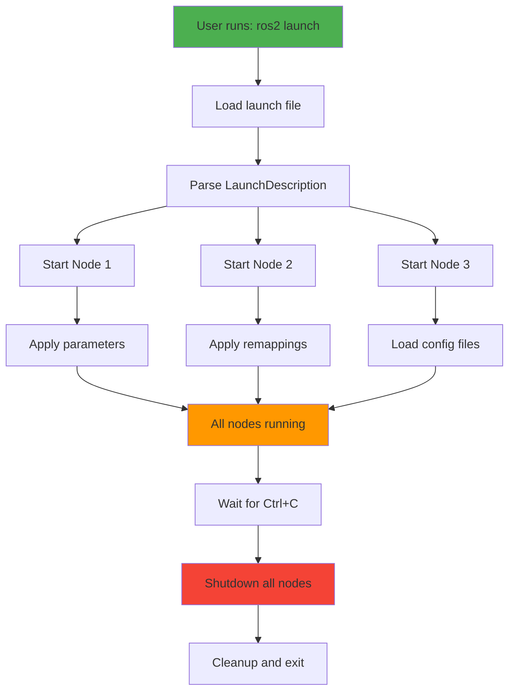

# Chapter 8: Launch Files and System Integration

**Estimated Reading Time**: 70 minutes

## Learning Objectives

By the end of this chapter, you will be able to:

- **LO-1.8.1**: Explain the purpose and benefits of launch files
- **LO-1.8.2**: Write Python launch files to start multiple nodes
- **LO-1.8.3**: Pass parameters and arguments to launched nodes
- **LO-1.8.4**: Use topic remapping and namespace isolation
- **LO-1.8.5**: Create composable node containers for performance
- **LO-1.8.6**: Organize complex robot systems with launch files

---

## 1. What are Launch Files?

**Launch files** are scripts that automate the startup of complex ROS 2 systems. Instead of manually running each node in a separate terminal, you define the entire system in one file.

### The Problem Without Launch Files

Imagine a robot with 10 nodes:

```bash
# Terminal 1
python3 camera_node.py

# Terminal 2
python3 object_detector.py --ros-args -p threshold:=0.8

# Terminal 3
python3 navigation_node.py --ros-args --params-file nav_config.yaml

# Terminal 4
python3 motor_controller.py --ros-args -r /cmd_vel:=/robot1/cmd_vel

# ... 6 more terminals ...
```

**Problems**:
- ❌ Error-prone (forget a parameter, typo in topic name)
- ❌ Time-consuming (10 terminals to manage)
- ❌ Not reproducible (can't share exact configuration)
- ❌ Difficult to stop (Ctrl+C in each terminal)

### The Solution: Launch Files

```python
# robot_system_launch.py
from launch import LaunchDescription
from launch_ros.actions import Node

def generate_launch_description():
    return LaunchDescription([
        Node(package='my_package', executable='camera_node'),
        Node(package='my_package', executable='object_detector',
             parameters=[{'threshold': 0.8}]),
        Node(package='my_package', executable='navigation_node',
             parameters=['nav_config.yaml']),
        Node(package='my_package', executable='motor_controller',
             remappings=[('/cmd_vel', '/robot1/cmd_vel')]),
        # ... all 10 nodes defined here ...
    ])
```

**Benefits**:
- ✅ Single command: `ros2 launch my_package robot_system_launch.py`
- ✅ Reproducible configuration
- ✅ Easy to share and version control
- ✅ All nodes stop together (one Ctrl+C)

---

## 2. Launch File Execution Flow



---

## 3. Basic Python Launch File

Let's create a simple launch file that starts two nodes.

### Basic Launch Example

**File: `basic_launch.py`**
```python
#!/usr/bin/env python3
"""
Basic Launch File
Starts temperature sensor and monitor nodes
"""

from launch import LaunchDescription
from launch_ros.actions import Node


def generate_launch_description():
    """
    Required function that returns LaunchDescription.
    """
    return LaunchDescription([
        # Node 1: Temperature Sensor
        Node(
            package='my_robot',          # Package name
            executable='temperature_publisher.py',  # Script name
            name='temperature_sensor',   # Node name
            output='screen'              # Show output in terminal
        ),

        # Node 2: Temperature Monitor
        Node(
            package='my_robot',
            executable='temperature_subscriber.py',
            name='temperature_monitor',
            output='screen'
        ),
    ])
```

### Running the Launch File

```bash
ros2 launch my_robot basic_launch.py
```

**Output:**
```
[INFO] [launch]: All log files can be found below /home/user/.ros/log/...
[INFO] [launch]: Default logging verbosity is set to INFO
[INFO] [temperature_sensor-1]: process started with pid [12345]
[INFO] [temperature_monitor-2]: process started with pid [12346]
[temperature_sensor-1] [INFO] [1638360000.123456] [temperature_sensor]: Temperature sensor started
[temperature_monitor-2] [INFO] [1638360000.234567] [temperature_monitor]: Temperature monitor started
```

Press `Ctrl+C` to stop all nodes.

---

## 4. Launch Files with Parameters

### Passing Parameters Inline

```python
from launch import LaunchDescription
from launch_ros.actions import Node


def generate_launch_description():
    return LaunchDescription([
        Node(
            package='my_robot',
            executable='robot_controller.py',
            name='robot_controller',
            parameters=[{
                'max_speed': 1.0,
                'sensor_rate': 20,
                'robot_name': 'alpha',
                'debug_mode': True
            }],
            output='screen'
        ),
    ])
```

### Passing Parameters from YAML File

```python
import os
from ament_index_python.packages import get_package_share_directory
from launch import LaunchDescription
from launch_ros.actions import Node


def generate_launch_description():
    # Get package directory
    package_dir = get_package_share_directory('my_robot')

    # Path to config file
    config_file = os.path.join(package_dir, 'config', 'robot_params.yaml')

    return LaunchDescription([
        Node(
            package='my_robot',
            executable='robot_controller.py',
            name='robot_controller',
            parameters=[config_file],  # Load from YAML
            output='screen'
        ),
    ])
```

### Mixing Inline and File Parameters

```python
def generate_launch_description():
    return LaunchDescription([
        Node(
            package='my_robot',
            executable='robot_controller.py',
            parameters=[
                config_file,              # Load from file
                {'max_speed': 2.0}        # Override specific parameter
            ],
            output='screen'
        ),
    ])
```

---

## 5. Topic Remapping and Namespaces

### Topic Remapping

Remapping changes topic names without modifying code:

```python
def generate_launch_description():
    return LaunchDescription([
        Node(
            package='my_robot',
            executable='motor_controller.py',
            remappings=[
                ('/cmd_vel', '/robot1/cmd_vel'),      # Remap cmd_vel topic
                ('/odom', '/robot1/odometry'),        # Remap odom topic
            ],
            output='screen'
        ),
    ])
```

**Why Remap?**
- Run multiple robots without topic conflicts
- Connect nodes with different topic naming conventions
- Organize topics into logical groups

### Namespaces

Namespaces group all node topics/services under a common prefix:

```python
def generate_launch_description():
    return LaunchDescription([
        # Robot 1
        Node(
            package='my_robot',
            executable='motor_controller.py',
            namespace='robot1',  # All topics: /robot1/cmd_vel, /robot1/odom
            output='screen'
        ),

        # Robot 2
        Node(
            package='my_robot',
            executable='motor_controller.py',
            namespace='robot2',  # All topics: /robot2/cmd_vel, /robot2/odom
            output='screen'
        ),
    ])
```

**Result**:
- Robot 1 topics: `/robot1/cmd_vel`, `/robot1/odom`
- Robot 2 topics: `/robot2/cmd_vel`, `/robot2/odom`

No conflicts!

---

## 6. Launch Arguments

Launch arguments make launch files configurable from command line.

### Declaring and Using Launch Arguments

```python
from launch import LaunchDescription
from launch.actions import DeclareLaunchArgument
from launch.substitutions import LaunchConfiguration
from launch_ros.actions import Node


def generate_launch_description():
    return LaunchDescription([
        # Declare arguments
        DeclareLaunchArgument(
            'robot_name',
            default_value='robot_1',
            description='Name of the robot'
        ),

        DeclareLaunchArgument(
            'max_speed',
            default_value='0.5',
            description='Maximum robot speed in m/s'
        ),

        # Use arguments
        Node(
            package='my_robot',
            executable='robot_controller.py',
            name=LaunchConfiguration('robot_name'),
            parameters=[{
                'max_speed': LaunchConfiguration('max_speed')
            }],
            output='screen'
        ),
    ])
```

### Passing Arguments from Command Line

```bash
# Use default values
ros2 launch my_robot configurable_launch.py

# Override arguments
ros2 launch my_robot configurable_launch.py robot_name:=alpha max_speed:=1.5
```

---

## 7. Composable Nodes (Performance Optimization)

Composable nodes run in the same process, reducing overhead.

### Why Composable Nodes?

**Regular Nodes** (separate processes):
- Each node = separate process
- Inter-process communication overhead
- Higher memory usage

**Composable Nodes** (single process):
- Multiple nodes in one process
- Shared memory (zero-copy messaging)
- Lower latency, less memory

### Composable Node Launch File

```python
from launch import LaunchDescription
from launch_ros.actions import ComposableNodeContainer
from launch_ros.descriptions import ComposableNode


def generate_launch_description():
    return LaunchDescription([
        ComposableNodeContainer(
            name='sensor_container',
            namespace='',
            package='rclcpp_components',
            executable='component_container',
            composable_node_descriptions=[
                ComposableNode(
                    package='my_robot',
                    plugin='my_robot::CameraNode',  # C++ class name
                    name='camera_node',
                ),
                ComposableNode(
                    package='my_robot',
                    plugin='my_robot::ObjectDetector',
                    name='object_detector',
                ),
            ],
            output='screen',
        )
    ])
```

**Note**: Composable nodes require C++ components. Python nodes can't be composed.

---

## 8. Including Other Launch Files

Build complex systems by including smaller launch files.

### Including Launch Files

```python
import os
from ament_index_python.packages import get_package_share_directory
from launch import LaunchDescription
from launch.actions import IncludeLaunchDescription
from launch.launch_description_sources import PythonLaunchDescriptionSource


def generate_launch_description():
    # Get paths
    nav_launch_file = os.path.join(
        get_package_share_directory('my_robot'),
        'launch',
        'navigation_launch.py'
    )

    perception_launch_file = os.path.join(
        get_package_share_directory('my_robot'),
        'launch',
        'perception_launch.py'
    )

    return LaunchDescription([
        # Include navigation system
        IncludeLaunchDescription(
            PythonLaunchDescriptionSource(nav_launch_file),
            launch_arguments={'use_sim': 'true'}.items()
        ),

        # Include perception system
        IncludeLaunchDescription(
            PythonLaunchDescriptionSource(perception_launch_file)
        ),

        # Additional nodes for this system
        Node(
            package='my_robot',
            executable='mission_planner.py',
            output='screen'
        ),
    ])
```

---

## 9. XML Launch Files (Alternative Syntax)

ROS 2 also supports XML launch files (similar to ROS 1).

### XML Launch Example

**File: `robot_launch.xml`**
```xml
<launch>
    <!-- Arguments -->
    <arg name="robot_name" default="robot_1"/>
    <arg name="max_speed" default="0.5"/>

    <!-- Nodes -->
    <node pkg="my_robot" exec="robot_controller.py" name="$(var robot_name)" output="screen">
        <param name="max_speed" value="$(var max_speed)"/>
        <param name="sensor_rate" value="20"/>
        <remap from="/cmd_vel" to="/$(var robot_name)/cmd_vel"/>
    </node>

    <node pkg="my_robot" exec="sensor_node.py" name="sensors" output="screen">
        <param from="$(find-pkg-share my_robot)/config/sensor_config.yaml"/>
    </node>
</launch>
```

### Running XML Launch File

```bash
ros2 launch my_robot robot_launch.xml robot_name:=alpha max_speed:=1.0
```

**Python vs XML**:
- **Python**: More flexible, programmable logic, easier to debug
- **XML**: Simpler for basic cases, familiar to ROS 1 users

**Recommendation**: Use Python launch files for new projects.

---

## 10. Complete Robot System Example

### Multi-Node Robot System

```python
#!/usr/bin/env python3
"""
Complete Robot System Launch File
File: complete_robot_launch.py
"""

import os
from ament_index_python.packages import get_package_share_directory
from launch import LaunchDescription
from launch.actions import DeclareLaunchArgument, LogInfo
from launch.conditions import IfCondition
from launch.substitutions import LaunchConfiguration
from launch_ros.actions import Node


def generate_launch_description():
    # Package directory
    pkg_dir = get_package_share_directory('my_robot')

    # Config files
    nav_config = os.path.join(pkg_dir, 'config', 'navigation.yaml')
    sensor_config = os.path.join(pkg_dir, 'config', 'sensors.yaml')

    return LaunchDescription([
        # ========== Arguments ==========
        DeclareLaunchArgument('robot_name', default_value='robot_1'),
        DeclareLaunchArgument('use_sim', default_value='false'),
        DeclareLaunchArgument('enable_logging', default_value='true'),

        # ========== Sensor System ==========
        Node(
            package='my_robot',
            executable='camera_node.py',
            name='camera',
            namespace=LaunchConfiguration('robot_name'),
            parameters=[sensor_config],
            output='screen'
        ),

        Node(
            package='my_robot',
            executable='lidar_node.py',
            name='lidar',
            namespace=LaunchConfiguration('robot_name'),
            parameters=[sensor_config],
            output='screen'
        ),

        # ========== Perception ==========
        Node(
            package='my_robot',
            executable='object_detector.py',
            name='object_detector',
            namespace=LaunchConfiguration('robot_name'),
            parameters=[{
                'confidence_threshold': 0.7,
                'max_objects': 10
            }],
            output='screen'
        ),

        # ========== Navigation ==========
        Node(
            package='my_robot',
            executable='navigation_node.py',
            name='navigation',
            namespace=LaunchConfiguration('robot_name'),
            parameters=[nav_config],
            output='screen'
        ),

        # ========== Motor Control ==========
        Node(
            package='my_robot',
            executable='motor_controller.py',
            name='motor_controller',
            namespace=LaunchConfiguration('robot_name'),
            parameters=[{
                'max_linear_speed': 1.0,
                'max_angular_speed': 2.0
            }],
            output='screen'
        ),

        # ========== Data Logging (conditional) ==========
        Node(
            package='my_robot',
            executable='data_logger.py',
            name='logger',
            namespace=LaunchConfiguration('robot_name'),
            condition=IfCondition(LaunchConfiguration('enable_logging')),
            output='screen'
        ),

        # ========== Info Message ==========
        LogInfo(msg=['Launching robot system: ', LaunchConfiguration('robot_name')]),
    ])
```

### Running the Complete System

```bash
# Real robot
ros2 launch my_robot complete_robot_launch.py robot_name:=alpha

# Simulation
ros2 launch my_robot complete_robot_launch.py robot_name:=sim_robot use_sim:=true

# Without logging
ros2 launch my_robot complete_robot_launch.py enable_logging:=false
```

---

## Lab Exercise 1.8: Complete Sensor System

### Objective

Build a complete multi-node sensor system with launch file.

### Requirements

Create a system with these nodes:

1. **Temperature Sensor** (`temperature_sensor.py`)
   - Publishes to `/sensors/temperature` (Float32)
   - Parameter: `publish_rate` (default: 10 Hz)

2. **Pressure Sensor** (`pressure_sensor.py`)
   - Publishes to `/sensors/pressure` (Float32)
   - Parameter: `publish_rate` (default: 5 Hz)

3. **Sensor Monitor** (`sensor_monitor.py`)
   - Subscribes to both sensor topics
   - Logs warnings if values out of range
   - Parameters: `temp_max` (30.0), `pressure_max` (1013.25)

4. **Data Logger** (`data_logger.py`)
   - Subscribes to both sensors
   - Logs data to file
   - Parameter: `log_file` (default: "sensor_log.txt")

### Create Launch File: `sensor_system_launch.py`

**Requirements**:
- Start all 4 nodes
- Load parameters from `sensor_config.yaml`
- Use namespace `/robot/sensors/`
- Launch argument `enable_logging` (default: true)
- Only start data_logger if `enable_logging=true`

### Parameter File: `sensor_config.yaml`

```yaml
temperature_sensor:
  ros__parameters:
    publish_rate: 10

pressure_sensor:
  ros__parameters:
    publish_rate: 5

sensor_monitor:
  ros__parameters:
    temp_max: 30.0
    pressure_max: 1013.25

data_logger:
  ros__parameters:
    log_file: "/tmp/sensor_data.log"
```

### Acceptance Criteria

- ✅ All nodes start with one command
- ✅ Parameters loaded from YAML file
- ✅ Namespace applied correctly (`/robot/sensors/temperature`)
- ✅ Conditional logging works
- ✅ System stops cleanly with Ctrl+C

### Testing

```bash
# Terminal 1: Launch system
ros2 launch my_robot sensor_system_launch.py

# Terminal 2: Verify nodes
ros2 node list

# Terminal 3: Check topics
ros2 topic list

# Terminal 4: Disable logging
ros2 launch my_robot sensor_system_launch.py enable_logging:=false
```

---

## Quiz 1.8: Launch Files

### Question 1
**What is the main purpose of launch files?**

- A) Faster node execution
- B) Automate startup of multi-node systems ✓
- C) Reduce code size
- D) Improve security

**Explanation**: Launch files automate the complex process of starting multiple nodes with their configurations, making systems reproducible and easier to manage.

---

### Question 2
**What function must a Python launch file define?**

- A) `main()`
- B) `launch()`
- C) `generate_launch_description()` ✓
- D) `create_nodes()`

**Explanation**: ROS 2 requires the `generate_launch_description()` function that returns a `LaunchDescription` object.

---

### Question 3
**True or False: Topic remapping allows you to change topic names without modifying node code.**

- True ✓

**Explanation**: Remapping is a powerful feature that lets you connect nodes with different topic naming conventions or run multiple instances without conflicts.

---

### Question 4
**What command launches a Python launch file? (Short answer)**

**Expected Answer**: `ros2 launch <package> <launch_file>.py`

---

### Question 5
**Name two benefits of using composable nodes. (Short answer)**

**Expected Answers** (any two):
- Lower latency (in-process communication)
- Reduced memory usage (shared process)
- Zero-copy messaging (shared memory)
- Fewer system processes

---

## Key Takeaways

✅ **Launch files** automate startup of complex multi-node systems

✅ **Python launch files** use `generate_launch_description()` returning `LaunchDescription`

✅ **Parameters** can be passed inline or from YAML files

✅ **Remapping** changes topic names; **namespaces** group topics

✅ **Launch arguments** make launch files configurable from command line

✅ **Composable nodes** improve performance via in-process communication

✅ **Include launch files** to build modular systems

---

## Module 1 Complete! 🎉

Congratulations! You've completed **Module 1: ROS 2 Fundamentals**!

You now understand:
- ✅ ROS 2 nodes and executors
- ✅ Topics (publish/subscribe)
- ✅ Services (request/response)
- ✅ Actions (long-running tasks)
- ✅ Parameters (runtime configuration)
- ✅ Launch files (system integration)

**Next**: Module 2 will teach you how to simulate robots in Gazebo and Unity!

[Take Module 1 Assessment →](/docs/module-1-ros2/module-1-assessment)

---

## Additional Resources

- **Launch File Tutorial**: [docs.ros.org/en/humble/Tutorials/Launch-Files/Creating-Launch-Files.html](https://docs.ros.org/en/humble/Tutorials/Intermediate/Launch/Creating-Launch-Files.html)
- **Launch File Architecture**: [design.ros2.org/articles/roslaunch.html](https://design.ros2.org/articles/roslaunch.html)
- **Composable Nodes**: [docs.ros.org/en/humble/Tutorials/Composition.html](https://docs.ros.org/en/humble/Tutorials/Intermediate/Composition.html)
- **XML Launch Syntax**: [docs.ros.org/en/humble/How-To-Guides/Launch-file-different-formats.html](https://docs.ros.org/en/humble/How-To-Guides/Launch-file-different-formats.html)

---

**Progress**: Module 1, Week 4, Chapter 8 of 32 | [View all chapters](/docs/intro)
