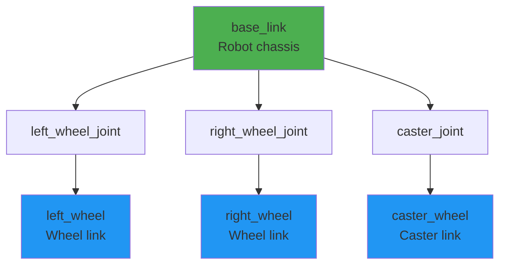

# Chapter 10: Building Robot Models with URDF/Xacro

**Estimated Reading Time**: 65 minutes

## Learning Objectives

By the end of this chapter, you will be able to:

- **LO-2.2.1**: Understand URDF structure (links, joints, visual, collision)
- **LO-2.2.2**: Create simple robot models in URDF
- **LO-2.2.3**: Use Xacro for parameterized, reusable robot descriptions
- **LO-2.2.4**: Visualize URDF models in RViz and Gazebo
- **LO-2.2.5**: Define inertial properties for realistic physics
- **LO-2.2.6**: Organize complex robot models with best practices

---

## 1. What is URDF?

**URDF (Unified Robot Description Format)** is an XML-based format for describing robot geometry, kinematics, dynamics, and visual appearance.

### Why URDF?

Without URDF, you'd need to:
- Hardcode robot geometry in every program
- Manually calculate transformations between robot parts
- Duplicate robot description across visualization, simulation, and control

**With URDF**:
- ✅ Single source of truth for robot structure
- ✅ Automatic transform tree (TF) generation
- ✅ Works across RViz, Gazebo, MoveIt
- ✅ Standard format understood by all ROS 2 tools

### URDF Use Cases

| Tool | Uses URDF For |
|------|--------------|
| **RViz** | 3D visualization of robot state |
| **Gazebo** | Physics simulation |
| **MoveIt** | Motion planning (collision checking, kinematics) |
| **robot_state_publisher** | Publishing joint transforms (TF) |
| **Controllers** | Understanding robot structure |

---

## 2. URDF Structure

A URDF model consists of **links** (rigid bodies) connected by **joints** (constraints).

### Robot Model Tree



**Components**:
- **Links**: Physical parts (chassis, wheels, arms)
- **Joints**: Connections between links (fixed, revolute, prismatic)

---

## 3. Creating a Simple URDF Model

Let's build a simple box robot step-by-step.

### Minimal URDF: Single Link

**File: `simple_box.urdf`**
```xml
<?xml version="1.0"?>
<robot name="simple_box">

  <!-- Base Link: A simple box -->
  <link name="base_link">
    <visual>
      <geometry>
        <box size="0.5 0.3 0.2"/>  <!-- Width x Depth x Height (meters) -->
      </geometry>
      <material name="blue">
        <color rgba="0 0 1 1"/>  <!-- Blue color (R G B Alpha) -->
      </material>
    </visual>

    <collision>
      <geometry>
        <box size="0.5 0.3 0.2"/>
      </geometry>
    </collision>

    <inertial>
      <mass value="1.0"/>  <!-- kg -->
      <inertia ixx="0.01" ixy="0.0" ixz="0.0"
               iyy="0.01" iyz="0.0"
               izz="0.01"/>
    </inertial>
  </link>

</robot>
```

### URDF Element Breakdown

**`<link>`**: Represents a rigid body

**`<visual>`**: How the link appears (rendering)
- `<geometry>`: Shape (box, cylinder, sphere, mesh)
- `<material>`: Color or texture
- `<origin>`: Position and orientation offset

**`<collision>`**: Shape used for collision detection
- Usually simpler than visual (for performance)
- Can be same as visual for simple shapes

**`<inertial>`**: Mass and inertia for physics
- `<mass>`: Weight in kg
- `<inertia>`: 3x3 inertia matrix
- Required for Gazebo simulation

---

### Visualizing in RViz

```bash
# Install joint_state_publisher GUI (if not installed)
sudo apt install ros-humble-joint-state-publisher-gui

# Launch RViz with URDF
ros2 launch urdf_tutorial display.launch.py model:=simple_box.urdf
```

**What you'll see**:
- Blue box displayed in RViz
- No joints yet (single link)

---

## 4. Adding Joints: Two-Wheel Robot

Let's add wheels using joints.

**File: `two_wheel_robot.urdf`**
```xml
<?xml version="1.0"?>
<robot name="two_wheel_robot">

  <!-- Base Link (Chassis) -->
  <link name="base_link">
    <visual>
      <geometry>
        <box size="0.4 0.2 0.1"/>
      </geometry>
      <material name="gray">
        <color rgba="0.5 0.5 0.5 1"/>
      </material>
    </visual>
    <collision>
      <geometry>
        <box size="0.4 0.2 0.1"/>
      </geometry>
    </collision>
    <inertial>
      <mass value="2.0"/>
      <inertia ixx="0.02" ixy="0" ixz="0" iyy="0.02" iyz="0" izz="0.02"/>
    </inertial>
  </link>

  <!-- Left Wheel Link -->
  <link name="left_wheel">
    <visual>
      <geometry>
        <cylinder radius="0.05" length="0.04"/>  <!-- radius, length -->
      </geometry>
      <origin xyz="0 0 0" rpy="1.57 0 0"/>  <!-- Rotate 90° to make horizontal -->
      <material name="black">
        <color rgba="0 0 0 1"/>
      </material>
    </visual>
    <collision>
      <geometry>
        <cylinder radius="0.05" length="0.04"/>
      </geometry>
      <origin xyz="0 0 0" rpy="1.57 0 0"/>
    </collision>
    <inertial>
      <mass value="0.5"/>
      <inertia ixx="0.001" ixy="0" ixz="0" iyy="0.001" iyz="0" izz="0.001"/>
    </inertial>
  </link>

  <!-- Left Wheel Joint -->
  <joint name="left_wheel_joint" type="continuous">
    <parent link="base_link"/>
    <child link="left_wheel"/>
    <origin xyz="0 0.15 -0.05" rpy="0 0 0"/>  <!-- Position: x y z -->
    <axis xyz="0 1 0"/>  <!-- Rotation axis (Y-axis for wheel roll) -->
  </joint>

  <!-- Right Wheel Link -->
  <link name="right_wheel">
    <visual>
      <geometry>
        <cylinder radius="0.05" length="0.04"/>
      </geometry>
      <origin xyz="0 0 0" rpy="1.57 0 0"/>
      <material name="black">
        <color rgba="0 0 0 1"/>
      </material>
    </visual>
    <collision>
      <geometry>
        <cylinder radius="0.05" length="0.04"/>
      </geometry>
      <origin xyz="0 0 0" rpy="1.57 0 0"/>
    </collision>
    <inertial>
      <mass value="0.5"/>
      <inertia ixx="0.001" ixy="0" ixz="0" iyy="0.001" iyz="0" izz="0.001"/>
    </inertial>
  </link>

  <!-- Right Wheel Joint -->
  <joint name="right_wheel_joint" type="continuous">
    <parent link="base_link"/>
    <child link="right_wheel"/>
    <origin xyz="0 -0.15 -0.05" rpy="0 0 0"/>
    <axis xyz="0 1 0"/>
  </joint>

</robot>
```

### Joint Types

| Type | Description | Example | Limits |
|------|-------------|---------|--------|
| **fixed** | No movement | Camera mount | N/A |
| **revolute** | Rotates about axis | Robot arm joint | Min/max angle |
| **continuous** | Rotates infinitely | Wheel | None |
| **prismatic** | Slides along axis | Linear actuator | Min/max position |
| **planar** | Moves in plane | N/A (rarely used) | N/A |
| **floating** | 6-DOF free movement | Aerial drone | N/A |

---

## 5. Introduction to Xacro

**Xacro (XML Macros)** extends URDF with:
- Variables and constants
- Mathematical expressions
- Macros (reusable blocks)
- Conditional logic

### Why Xacro?

**Problem with URDF**:
```xml
<!-- Repeating similar code for each wheel -->
<link name="left_wheel">...</link>
<joint name="left_wheel_joint">...</joint>

<link name="right_wheel">...</link>
<joint name="right_wheel_joint">...</joint>

<!-- If you change wheel radius, update 4+ places! -->
```

**Solution with Xacro**:
```xml
<!-- Define wheel once as macro, reuse 4 times -->
<xacro:macro name="wheel" params="prefix y_offset">
  <link name="${prefix}_wheel">...</link>
  <joint name="${prefix}_wheel_joint">...</joint>
</xacro:macro>

<xacro:wheel prefix="left" y_offset="0.15"/>
<xacro:wheel prefix="right" y_offset="-0.15"/>
```

---

### Xacro Example: Parameterized Robot

**File: `two_wheel_robot.xacro`**
```xml
<?xml version="1.0"?>
<robot name="two_wheel_robot" xmlns:xacro="http://www.ros.org/wiki/xacro">

  <!-- Properties (Constants) -->
  <xacro:property name="base_width" value="0.4"/>
  <xacro:property name="base_depth" value="0.2"/>
  <xacro:property name="base_height" value="0.1"/>
  <xacro:property name="wheel_radius" value="0.05"/>
  <xacro:property name="wheel_thickness" value="0.04"/>
  <xacro:property name="wheel_separation" value="0.3"/>

  <!-- Base Link -->
  <link name="base_link">
    <visual>
      <geometry>
        <box size="${base_width} ${base_depth} ${base_height}"/>
      </geometry>
      <material name="gray">
        <color rgba="0.5 0.5 0.5 1"/>
      </material>
    </visual>
    <collision>
      <geometry>
        <box size="${base_width} ${base_depth} ${base_height}"/>
      </geometry>
    </collision>
    <inertial>
      <mass value="2.0"/>
      <inertia ixx="0.02" ixy="0" ixz="0" iyy="0.02" iyz="0" izz="0.02"/>
    </inertial>
  </link>

  <!-- Wheel Macro -->
  <xacro:macro name="wheel" params="prefix y_reflect">
    <link name="${prefix}_wheel">
      <visual>
        <geometry>
          <cylinder radius="${wheel_radius}" length="${wheel_thickness}"/>
        </geometry>
        <origin xyz="0 0 0" rpy="${pi/2} 0 0"/>
        <material name="black">
          <color rgba="0 0 0 1"/>
        </material>
      </visual>
      <collision>
        <geometry>
          <cylinder radius="${wheel_radius}" length="${wheel_thickness}"/>
        </geometry>
        <origin xyz="0 0 0" rpy="${pi/2} 0 0"/>
      </collision>
      <inertial>
        <mass value="0.5"/>
        <inertia ixx="0.001" ixy="0" ixz="0" iyy="0.001" iyz="0" izz="0.001"/>
      </inertial>
    </link>

    <joint name="${prefix}_wheel_joint" type="continuous">
      <parent link="base_link"/>
      <child link="${prefix}_wheel"/>
      <origin xyz="0 ${y_reflect * wheel_separation/2} ${-wheel_radius}" rpy="0 0 0"/>
      <axis xyz="0 1 0"/>
    </joint>
  </xacro:macro>

  <!-- Instantiate Wheels -->
  <xacro:wheel prefix="left" y_reflect="1"/>
  <xacro:wheel prefix="right" y_reflect="-1"/>

</robot>
```

### Xacro Features Used

**Properties (Constants)**:
```xml
<xacro:property name="wheel_radius" value="0.05"/>
```

**Mathematical Expressions**:
```xml
<box size="${base_width} ${base_depth} ${base_height}"/>
<origin xyz="0 ${y_reflect * wheel_separation/2} ${-wheel_radius}"/>
```

**Macros with Parameters**:
```xml
<xacro:macro name="wheel" params="prefix y_reflect">
  ...
</xacro:macro>

<xacro:wheel prefix="left" y_reflect="1"/>
```

**Built-in Constants**:
- `${pi}`: 3.14159...
- `${pi/2}`: 90 degrees in radians

---

### Converting Xacro to URDF

Xacro files must be processed before use:

```bash
# Install xacro tool
sudo apt install ros-humble-xacro

# Convert .xacro to .urdf
xacro two_wheel_robot.xacro > two_wheel_robot_generated.urdf

# View generated URDF
cat two_wheel_robot_generated.urdf
```

**In launch files**, xacro processing happens automatically:
```python
from launch import LaunchDescription
from launch_ros.actions import Node
import xacro

def generate_launch_description():
    # Process xacro
    robot_description = xacro.process_file('two_wheel_robot.xacro').toxml()

    return LaunchDescription([
        Node(
            package='robot_state_publisher',
            executable='robot_state_publisher',
            parameters=[{'robot_description': robot_description}]
        ),
    ])
```

---

## 6. Inertial Properties

Accurate inertial properties are **critical** for realistic Gazebo simulation.

### Calculating Inertia

For simple shapes, use standard formulas:

**Box** (width W, depth D, height H, mass M):
```
Ixx = (M/12) * (D² + H²)
Iyy = (M/12) * (W² + H²)
Izz = (M/12) * (W² + D²)
```

**Cylinder** (radius R, length L, mass M):
```
Ixx = Iyy = (M/12) * (3*R² + L²)
Izz = (M/2) * R²
```

**Sphere** (radius R, mass M):
```
Ixx = Iyy = Izz = (2/5) * M * R²
```

### Xacro Inertia Macros

```xml
<!-- Macro for box inertia -->
<xacro:macro name="box_inertia" params="m w d h">
  <inertial>
    <mass value="${m}"/>
    <inertia ixx="${(m/12) * (d*d + h*h)}" ixy="0" ixz="0"
             iyy="${(m/12) * (w*w + h*h)}" iyz="0"
             izz="${(m/12) * (w*w + d*d)}"/>
  </inertial>
</xacro:macro>

<!-- Usage -->
<xacro:box_inertia m="2.0" w="0.4" d="0.2" h="0.1"/>
```

---

## 7. Best Practices

### ✅ Do:

1. **Use Xacro for any robot with >2 links**
   - Parameterize dimensions
   - Create macros for repeated parts

2. **Separate visual and collision geometry**
   - Collision: simple shapes (performance)
   - Visual: detailed meshes (appearance)

3. **Always define inertia**
   - Required for Gazebo physics
   - Use realistic mass values

4. **Follow naming conventions**
   - `base_link` for root
   - `_link` suffix for links
   - `_joint` suffix for joints

5. **Use consistent units**
   - Meters (not cm or mm)
   - Kilograms (not grams)
   - Radians (not degrees)

### ❌ Don't:

1. **Don't hardcode values**
   - Bad: `<box size="0.4 0.2 0.1"/>`
   - Good: `<box size="${width} ${depth} ${height}"/>`

2. **Don't forget collision geometry**
   - Robot will fall through ground in Gazebo!

3. **Don't use zero mass**
   - Causes physics errors

4. **Don't make collision == detailed visual**
   - Slows simulation significantly

5. **Don't forget to specify joint limits**
   - For revolute joints (prevents unrealistic motion)

---

## 8. Spawning in Gazebo

### Spawning URDF/Xacro in Gazebo

```bash
# Terminal 1: Launch Gazebo
ros2 launch gazebo_ros gazebo.launch.py

# Terminal 2: Spawn robot
ros2 run gazebo_ros spawn_entity.py \
  -file two_wheel_robot.urdf \
  -entity my_robot \
  -x 0 -y 0 -z 0.5
```

**With Xacro**:
```bash
# Convert first
xacro two_wheel_robot.xacro > /tmp/robot.urdf

# Spawn
ros2 run gazebo_ros spawn_entity.py \
  -file /tmp/robot.urdf \
  -entity my_robot \
  -z 0.5
```

---

## Lab Exercise 2.2: Build Custom Robot

### Objective

Create a four-wheeled rover robot using Xacro.

### Requirements

**Robot Specifications**:
- Chassis: 0.6m × 0.4m × 0.2m (L × W × H)
- 4 wheels: radius 0.08m, thickness 0.05m
- Caster wheel (front): radius 0.04m
- Total mass: 5kg (chassis 3kg, wheels 0.5kg each)

**File**: `rover_robot.xacro`

**Structure**:
```
base_link (chassis)
├── front_left_wheel
├── front_right_wheel
├── rear_left_wheel
├── rear_right_wheel
└── caster_wheel
```

**Xacro Features to Use**:
- Properties for all dimensions
- Wheel macro (reuse 4 times)
- Inertia calculations

**Deliverables**:
1. `rover_robot.xacro` file
2. Launch file to spawn in Gazebo
3. Screenshot in Gazebo
4. Screenshot in RViz

### Starter Code

```xml
<?xml version="1.0"?>
<robot name="rover_robot" xmlns:xacro="http://www.ros.org/wiki/xacro">

  <!-- TODO: Define properties -->
  <xacro:property name="chassis_length" value="0.6"/>
  <xacro:property name="chassis_width" value="0.4"/>
  <!-- Add more properties... -->

  <!-- TODO: Define base_link -->
  <link name="base_link">
    <!-- Add visual, collision, inertial -->
  </link>

  <!-- TODO: Define wheel macro -->
  <xacro:macro name="wheel" params="prefix x_reflect y_reflect">
    <!-- Create wheel link and joint -->
  </xacro:macro>

  <!-- TODO: Instantiate 4 wheels -->
  <xacro:wheel prefix="front_left" x_reflect="1" y_reflect="1"/>
  <!-- Add other 3 wheels... -->

  <!-- TODO: Add caster wheel -->

</robot>
```

### Acceptance Criteria

- ✅ Xacro file compiles without errors
- ✅ All 5 wheels present
- ✅ Robot spawns in Gazebo
- ✅ Robot falls correctly (physics working)
- ✅ Inertial properties defined
- ✅ Wheel macro used (DRY principle)

### Testing

```bash
# Check xacro syntax
xacro rover_robot.xacro --check

# Generate URDF
xacro rover_robot.xacro > rover.urdf

# Visualize in RViz
ros2 launch urdf_tutorial display.launch.py model:=rover.urdf

# Spawn in Gazebo
ros2 launch gazebo_ros gazebo.launch.py
ros2 run gazebo_ros spawn_entity.py -file rover.urdf -entity rover -z 0.5
```

---

## Quiz 2.2: URDF/Xacro

### Question 1
**What is the purpose of URDF?**

- A) Control robot motors
- B) Describe robot geometry and kinematics ✓
- C) Program robot behaviors
- D) Manage robot packages

**Explanation**: URDF is a standard format for robot descriptions used across visualization, simulation, and planning.

---

### Question 2
**What is the main advantage of Xacro over pure URDF?**

- A) Faster simulation
- B) Better graphics
- C) Parameterization and reusability ✓
- D) Smaller file size

**Explanation**: Xacro adds variables, macros, and math, making robot descriptions maintainable and reusable.

---

### Question 3
**True or False: Collision geometry should always match visual geometry exactly.**

- False ✓

**Explanation**: Collision should be simpler (boxes, cylinders) for performance. Visual can be detailed meshes.

---

### Question 4
**What joint type allows infinite rotation (like a wheel)?**

- A) Revolute
- B) Continuous ✓
- C) Prismatic
- D) Fixed

**Explanation**: Continuous joints rotate infinitely without limits, perfect for wheels.

---

### Question 5
**Why is inertia important in URDF? (Short answer)**

**Expected Answer**: Inertia defines how mass is distributed in a link, crucial for realistic physics simulation in Gazebo. Without accurate inertia, objects behave unrealistically (wrong rotation, bouncing, instability).

---

## Key Takeaways

✅ **URDF** is the standard XML format for robot descriptions in ROS 2

✅ **Links** represent rigid bodies; **Joints** connect links

✅ **Visual vs Collision**: Visual for appearance, collision for physics (keep simple)

✅ **Xacro** adds variables, macros, and math for maintainable robot models

✅ **Inertial properties** (mass, inertia) are required for realistic Gazebo physics

✅ **Best practices**: Use Xacro, parameterize dimensions, separate visual/collision, define inertia

---

## What's Next?

In **Chapter 11**, you'll add sensors and actuators to your robot models using Gazebo-ROS 2 plugins!

[Continue to Chapter 11: Gazebo-ROS 2 Plugins →](/docs/module-2-simulation/week-6/chapter-11-gazebo-plugins)

---

## Additional Resources

- **URDF Tutorials**: [docs.ros.org/en/humble/Tutorials/URDF.html](https://docs.ros.org/en/humble/Tutorials/Intermediate/URDF/URDF-Main.html)
- **Xacro Documentation**: [wiki.ros.org/xacro](http://wiki.ros.org/xacro)
- **URDF Checker**: `check_urdf <file.urdf>`
- **Inertia Calculator**: [calc.inertia.xyz](https://github.com/tu-darmstadt-ros-pkg/hector_models/tree/melodic-devel/hector_xacro_tools)

---

**Progress**: Module 2, Week 5, Chapter 10 of 32 | [View all chapters](/docs/intro)
