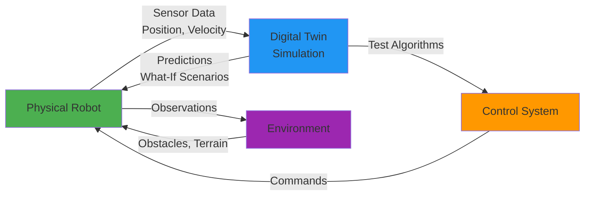
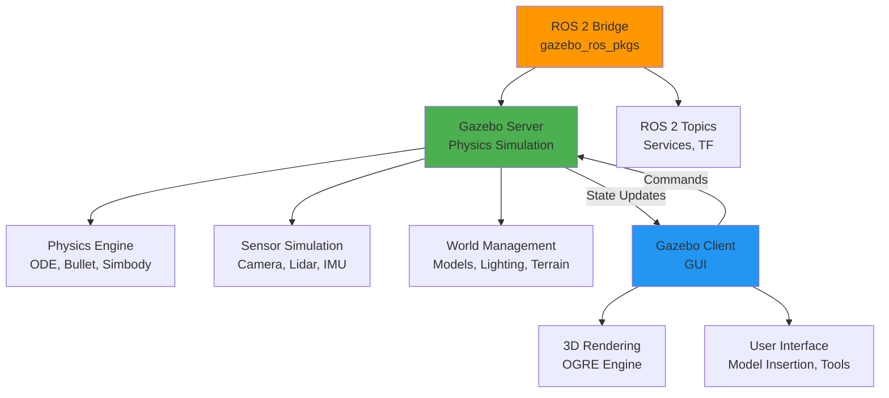

# Chapter 9: Introduction to Digital Twins and Gazebo

**Estimated Reading Time**: 50 minutes

## Learning Objectives

By the end of this chapter, you will be able to:

- **LO-2.1.1**: Explain what digital twins are and their role in robotics development
- **LO-2.1.2**: Understand the benefits of simulation in robot development
- **LO-2.1.3**: Describe Gazebo's architecture and key components
- **LO-2.1.4**: Install Gazebo Classic 11 on Ubuntu 22.04
- **LO-2.1.5**: Launch and navigate the Gazebo interface
- **LO-2.1.6**: Understand the sim-to-real transfer challenge

---

## 1. What is a Digital Twin?

A **digital twin** is a virtual replica of a physical system that mirrors the behavior, state, and properties of its real-world counterpart in real-time.

### Digital Twin Definition

In robotics, a digital twin is:
- **Virtual Model**: 3D representation with accurate geometry and physics
- **Bidirectional Sync**: Real robot → simulation (state updates), Simulation → real robot (predictions)
- **Real-Time**: Updates continuously as physical robot operates
- **Predictive**: Can simulate future scenarios before executing on hardware

### Digital Twin Feedback Loop



**Example**: Boston Dynamics uses digital twins to:
- Test new gaits in simulation before deploying to Atlas
- Predict battery life based on mission plans
- Simulate recovery from falls safely

---

## 2. Why Simulate Robots?

### The Case for Simulation

**Real Robot Development Without Simulation**:
```
Idea → Code → Deploy to Robot → Test → Robot Crashes → Repair ($$$) → Repeat
```

**Problems**:
- 💰 **Expensive**: Robot hardware costs $10k-$1M+
- ⏰ **Slow**: Deploying code takes minutes, testing takes hours
- 🔧 **Risky**: Crashes damage motors, sensors, structure
- 🚫 **Limited**: Can't test dangerous scenarios (cliffs, fires, explosions)
- 👥 **Scaling**: Only one team member can use robot at a time

**With Simulation**:
```
Idea → Code → Test in Sim (seconds) → Iterate 100x → Deploy to Robot (works!)
```

**Benefits**:
- ✅ **Safe**: No hardware damage from failures
- ✅ **Fast**: Test thousands of scenarios per day
- ✅ **Cheap**: Run on any laptop
- ✅ **Scalable**: 100 developers, 100 virtual robots simultaneously
- ✅ **Reproducible**: Exact same conditions every time
- ✅ **Dangerous scenarios**: Test edge cases (sensor failures, obstacles)

### Simulation Use Cases

| Use Case | Description | Example |
|----------|-------------|---------|
| **Algorithm Development** | Test navigation, perception, control | Train reinforcement learning in 1000 parallel sims |
| **Integration Testing** | Verify multi-robot coordination | Test warehouse fleet without 50 physical robots |
| **Edge Case Handling** | Explore failure modes | What if lidar fails during navigation? |
| **Training Data** | Generate synthetic datasets | Render 100k labeled images for object detection |
| **Continuous Integration** | Automated testing in CI/CD | Every git commit tested in simulation |
| **Operator Training** | Teach humans to use robots | VR-based teleop training |

---

## 3. Introduction to Gazebo

**Gazebo** is the most widely used robot simulator in the ROS ecosystem, developed by Open Robotics (creators of ROS).

### Gazebo Versions

| Version | Release Year | Status | ROS Support | Use When |
|---------|--------------|--------|-------------|----------|
| **Gazebo Classic 11** | 2020 | LTS (until 2025) | ROS 1 & ROS 2 | Production systems with ROS 2 Humble |
| **Gazebo Harmonic** | 2024 | Latest | ROS 2 only | New projects, cutting-edge features |
| **Gazebo Garden** | 2022 | Active | ROS 2 | Stable modern features |

**We'll use Gazebo Classic 11** because:
- Full ROS 2 Humble support
- Extensive tutorials and community support
- Most companies still use it in production
- Smooth transition to newer Gazebo later

---

## 4. Gazebo Architecture

### Gazebo Components



**Key Components**:

1. **Gazebo Server** (gzserver)
   - Runs physics simulation
   - Updates sensor readings
   - Manages world state
   - Headless (no GUI) option for CI/CD

2. **Gazebo Client** (gzclient)
   - 3D visualization
   - User interaction (click, drag models)
   - Camera controls
   - Optional (can run server-only)

3. **Physics Engine**
   - Computes dynamics (gravity, collisions, friction)
   - Options: ODE (default), Bullet, Simbody
   - Configurable timestep and solver

4. **Sensor Simulation**
   - Camera: RGB, depth, stereo
   - Lidar: 2D/3D laser scans
   - IMU: Orientation, acceleration
   - GPS, Contact sensors, Force/Torque

5. **ROS 2 Bridge** (gazebo_ros_pkgs)
   - Publishes sensor data to ROS 2 topics
   - Subscribes to control commands
   - Spawns/deletes models
   - Manages TF (transforms)

---

## 5. Installing Gazebo Classic 11

### Prerequisites

- **Operating System**: Ubuntu 22.04 LTS
- **ROS 2**: Humble Hawksbill (already installed from Module 1)
- **Graphics**: OpenGL 3.3+ (most modern GPUs)

### Installation Steps

**Method 1: Install with ROS 2 Desktop (Recommended)**

Gazebo Classic is included in ROS 2 Desktop:

```bash
# If you installed ROS 2 Desktop in Module 1, Gazebo is already installed!
# Verify installation:
gazebo --version

# Expected output:
# Gazebo multi-robot simulator, version 11.x.x
```

**Method 2: Install Separately**

If you installed ROS 2 Base (without desktop), install Gazebo:

```bash
# Install Gazebo Classic 11
sudo apt update
sudo apt install gazebo

# Install ROS 2 - Gazebo bridge packages
sudo apt install ros-humble-gazebo-ros-pkgs
sudo apt install ros-humble-gazebo-ros2-control

# Verify
which gzserver
which gzclient
```

### Testing Installation

```bash
# Launch Gazebo
gazebo

# You should see the Gazebo GUI open with an empty world
```

**Common Issues**:

**Issue**: `command not found: gazebo`
- **Fix**: Gazebo not in PATH. Try `source /usr/share/gazebo/setup.sh`

**Issue**: Black screen or rendering issues
- **Fix**: Update graphics drivers. For NVIDIA: `sudo ubuntu-drivers autoinstall`

**Issue**: `libcurl: (6) Could not resolve host`
- **Fix**: Gazebo trying to download models. Disable with: `export GAZEBO_MODEL_DATABASE_URI=""`

---

## 6. Gazebo Interface Tour

### Launching Gazebo

```bash
# Launch with empty world
gazebo

# Launch with specific world
gazebo worlds/cafe.world

# Launch server-only (no GUI, for automated testing)
gzserver worlds/cafe.world
```

### GUI Components

When Gazebo opens, you'll see:

**Top Toolbar**:
- **Select Mode** (arrow): Click and drag objects
- **Translate Mode**: Move objects in X/Y/Z
- **Rotate Mode**: Rotate objects
- **Scale Mode**: Resize objects
- **Insert**: Add models from library

**Left Panel** (Models):
- Prebuilt robots and objects
- Drag into world to spawn
- Categories: Robots, Buildings, Objects

**Main Viewport**:
- 3D view of world
- Mouse controls:
  - **Left click + drag**: Rotate camera
  - **Middle click + drag**: Pan camera
  - **Scroll wheel**: Zoom in/out
  - **Right click**: Context menu

**World Panel** (right side):
- Scene hierarchy
- Model properties
- Physics settings
- Lighting

**Bottom Panel**:
- Time controls (play, pause, reset)
- Simulation time vs real time
- Statistics (FPS, physics update rate)

---

## 7. Gazebo Worlds

Gazebo includes pre-made worlds for testing.

### Exploring Worlds

```bash
# Empty world (good for learning)
gazebo

# Café world (indoor environment with furniture)
gazebo worlds/cafe.world

# Construction cone world (obstacle course)
gazebo worlds/construction_cone.world

# Robocup soccer field
gazebo worlds/robocup_3Dsim_field.world
```

### Creating Your First Empty World

1. **Launch Gazebo**: `gazebo`
2. **Insert Ground Plane**: Left panel → Insert → Ground Plane
3. **Insert Sun**: Insert → Sun (for lighting)
4. **Insert Object**: Insert → Construction Cone
5. **Move Object**: Select translate mode, drag cone
6. **Save World**: File → Save World As → `my_first_world.world`

---

## 8. Gazebo + ROS 2 Integration

### Launching Gazebo from ROS 2

Instead of launching Gazebo directly, integrate with ROS 2:

```bash
# Source ROS 2
source /opt/ros/humble/setup.bash

# Launch Gazebo with ROS 2 bridge
ros2 launch gazebo_ros gazebo.launch.py
```

This starts:
- Gazebo server and client
- ROS 2 bridge (publishes clock, manages lifecycle)
- `/gazebo` namespace for all topics

### Checking ROS 2 Topics

```bash
# List topics (Gazebo publishes to ROS 2)
ros2 topic list

# You should see:
# /clock
# /parameter_events
# /rosout
```

### Spawning a Robot in Gazebo via ROS 2

```bash
# Spawn a simple box (we'll do real robots in Chapter 10)
ros2 run gazebo_ros spawn_entity.py -entity my_box \
    -x 0 -y 0 -z 1 \
    -b
```

---

## 9. Sim-to-Real Transfer Challenge

**The Problem**: Algorithms that work perfectly in simulation often fail on real robots.

### Why Sim-to-Real is Hard

| Aspect | Simulation | Reality | Gap |
|--------|-----------|---------|-----|
| **Physics** | Perfect, deterministic | Noisy, unpredictable | Friction, backlash, flex |
| **Sensors** | Noise-free, perfect | Noisy, biased, drift | Sensor models too simple |
| **Actuators** | Instant response | Delays, saturation | Motor dynamics ignored |
| **Environment** | Controlled, static | Dynamic, unexpected | Sim too perfect |

**Example**: A robot perfectly navigates Gazebo's smooth floor, but slips on real polished tile.

### Bridging the Sim-to-Real Gap

**Techniques**:
1. **Domain Randomization**: Vary physics parameters (friction, mass) in sim
2. **Realistic Sensor Models**: Add noise, latency, dropout to sim sensors
3. **System Identification**: Measure real robot parameters, tune sim to match
4. **Sim-to-Real Transfer Learning**: Train in sim, fine-tune on real robot
5. **Conservative Design**: Test worst-case scenarios in sim

**Best Practice**:
```
Develop in Sim → Test extensively in Sim → Deploy cautiously to Real → Iterate
```

---

## 10. Gazebo vs Other Simulators

### Simulator Comparison

| Simulator | Pros | Cons | Best For |
|-----------|------|------|----------|
| **Gazebo** | ROS native, open-source, large community | Graphics dated, slow for large worlds | ROS 2 robotics, research |
| **Unity** | Beautiful graphics, game engine tools | Not physics-focused, ROS integration complex | VR, human interaction, visual ML |
| **Isaac Sim** | GPU-accelerated, photorealistic, RL focus | NVIDIA GPU required, learning curve | Synthetic data, RL, warehouse |
| **PyBullet** | Fast, Python-native, simple | No GUI (basic visualization), limited sensors | RL research, batch experiments |
| **Webots** | Cross-platform, easy to learn | Smaller community, paid for commercial | Education, mobile robots |

**Why Gazebo for This Course**:
- Industry standard for ROS 2
- Free and open-source
- Extensive tutorials and models
- Proven for production robots

---

## Lab Exercise 2.1: Explore Gazebo Worlds

### Objective

Get hands-on experience with Gazebo by exploring different worlds and inserting models.

### Part 1: World Exploration (15 minutes)

**Tasks**:
1. Launch Gazebo empty world
2. Insert ground plane and sun
3. Insert 5 different models from the model library:
   - Construction Cone
   - Café Table
   - Dumpster
   - Person Standing
   - TurtleBot3 Burger (under Robots)

4. Use translate/rotate tools to arrange models
5. Save as `my_test_world.world`

**Questions to Answer**:
- How do you rotate objects?
- How do you delete objects?
- What happens when you click "Play" in bottom toolbar?

---

### Part 2: ROS 2 Integration (15 minutes)

**Tasks**:
1. Close Gazebo if running
2. Launch Gazebo via ROS 2:
   ```bash
   ros2 launch gazebo_ros gazebo.launch.py
   ```

3. In another terminal, list topics:
   ```bash
   ros2 topic list
   ```

4. Echo the clock topic:
   ```bash
   ros2 topic echo /clock
   ```

5. Spawn a sphere using ROS 2:
   ```bash
   ros2 run gazebo_ros spawn_entity.py -entity test_sphere \
       -x 0 -y 0 -z 2 \
       -b
   ```

**Questions to Answer**:
- What topics does Gazebo publish?
- What happens to sphere when you click Play? (it falls due to gravity!)
- How do you pause simulation?

---

### Part 3: Performance Testing (10 minutes)

**Tasks**:
1. Launch Gazebo
2. Insert 20 construction cones in a grid
3. Click Play and observe:
   - Real-time factor (bottom panel)
   - FPS (frames per second)
4. Try pausing and unpausing

**Questions to Answer**:
- What is the real-time factor? (1.0 = simulation runs at real-time speed)
- Does FPS drop with many objects?
- What happens when you pause?

---

### Acceptance Criteria

- ✅ Successfully launched Gazebo
- ✅ Inserted multiple models
- ✅ Saved custom world
- ✅ Launched Gazebo via ROS 2
- ✅ Spawned entity via command line
- ✅ Observed simulation time and performance

### Deliverable

Screenshot of your custom world with annotations explaining:
- At least 5 different models
- Labels showing what each model is

---

## Quiz 2.1: Digital Twins and Gazebo

### Question 1
**What is a digital twin?**

- A) A backup copy of a robot
- B) A virtual replica that mirrors a physical system in real-time ✓
- C) Two identical robots
- D) A simulation-only robot

**Explanation**: Digital twins are virtual models that sync with physical counterparts, enabling prediction and testing.

---

### Question 2
**What is the main benefit of robot simulation?**

- A) Makes robots faster
- B) Safe, fast, cheap testing without hardware risk ✓
- C) Improves graphics
- D) Reduces code size

**Explanation**: Simulation allows rapid iteration without expensive hardware damage or safety risks.

---

### Question 3
**Which Gazebo component runs the physics simulation?**

- A) Gazebo Client
- B) Gazebo Server ✓
- C) Gazebo GUI
- D) ROS 2 Bridge

**Explanation**: gzserver runs headless physics simulation; gzclient provides optional visualization.

---

### Question 4
**True or False: Gazebo Classic 11 works with both ROS 1 and ROS 2.**

- True ✓

**Explanation**: Gazebo Classic 11 is the LTS version supporting both ROS ecosystems.

---

### Question 5
**What is the sim-to-real gap? (Short answer)**

**Expected Answer**: The difference between how algorithms perform in simulation vs reality, caused by imperfect physics models, sensor noise, and environmental variations. Algorithms that work perfectly in sim often need tuning for real robots.

---

## Key Takeaways

✅ **Digital twins** are virtual replicas that mirror physical robots for testing and prediction

✅ **Simulation** enables safe, fast, cheap robot development without hardware risk

✅ **Gazebo** is the industry-standard robot simulator for ROS 2

✅ **Gazebo architecture**: Server (physics), Client (visualization), ROS 2 Bridge (integration)

✅ **Gazebo Classic 11** is the LTS version recommended for ROS 2 Humble production systems

✅ **Sim-to-real gap** requires domain randomization and careful modeling to bridge

---

## What's Next?

In **Chapter 10**, you'll learn to build custom robot models using URDF and Xacro, the standard formats for robot descriptions in ROS 2.

[Continue to Chapter 10: Building Robot Models →](/docs/module-2-simulation/week-5/chapter-10-urdf)

---

## Additional Resources

- **Gazebo Tutorials**: [classic.gazebosim.org/tutorials](https://classic.gazebosim.org/tutorials)
- **Gazebo ROS 2 Integration**: [docs.ros.org/en/humble/Tutorials/Gazebo.html](https://docs.ros.org/en/humble/Tutorials/Advanced/Simulators/Gazebo/Gazebo.html)
- **Digital Twins Overview**: [IBM Digital Twin](https://www.ibm.com/topics/what-is-a-digital-twin)
- **Sim-to-Real Transfer**: ["Closing the Sim-to-Real Gap" paper](https://arxiv.org/abs/1804.10332)

---

**Progress**: Module 2, Week 5, Chapter 9 of 32 | [View all chapters](/docs/intro)
