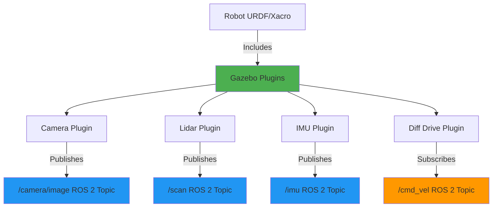

# Chapter 11: Gazebo-ROS 2 Plugins and Sensors

**Estimated Reading Time**: 60 minutes

## Learning Objectives

By the end of this chapter, you will be able to:

- **LO-2.3.1**: Understand Gazebo plugin architecture
- **LO-2.3.2**: Add camera sensors to robot models
- **LO-2.3.3**: Configure lidar sensors for obstacle detection
- **LO-2.3.4**: Integrate IMU sensors for orientation tracking
- **LO-2.3.5**: Implement differential drive controller
- **LO-2.3.6**: Subscribe to simulated sensor data in ROS 2

---

## 1. What are Gazebo Plugins?

**Gazebo plugins** are dynamic libraries that extend Gazebo functionality by interfacing with ROS 2.

### Plugin Architecture



**Common Plugins**:
- **Sensors**: Camera, Lidar, IMU, GPS, Contact
- **Actuators**: Differential drive, joint controllers
- **Utilities**: Model state, world state, clock

---

## 2. Adding Camera Plugin

### Camera Configuration in Xacro

```xml
<?xml version="1.0"?>
<robot name="camera_robot" xmlns:xacro="http://www.ros.org/wiki/xacro">

  <!-- Camera Link -->
  <link name="camera_link">
    <visual>
      <geometry>
        <box size="0.05 0.05 0.05"/>
      </geometry>
      <material name="red">
        <color rgba="1 0 0 1"/>
      </material>
    </visual>
    <collision>
      <geometry>
        <box size="0.05 0.05 0.05"/>
      </geometry>
    </collision>
    <inertial>
      <mass value="0.1"/>
      <inertia ixx="0.0001" ixy="0" ixz="0" iyy="0.0001" iyz="0" izz="0.0001"/>
    </inertial>
  </link>

  <!-- Camera Joint -->
  <joint name="camera_joint" type="fixed">
    <parent link="base_link"/>
    <child link="camera_link"/>
    <origin xyz="0.2 0 0.1" rpy="0 0 0"/>
  </joint>

  <!-- Gazebo Camera Plugin -->
  <gazebo reference="camera_link">
    <sensor type="camera" name="camera">
      <update_rate>30.0</update_rate>
      <camera name="head">
        <horizontal_fov>1.3962634</horizontal_fov>  <!-- 80 degrees -->
        <image>
          <width>800</width>
          <height>600</height>
          <format>R8G8B8</format>
        </image>
        <clip>
          <near>0.02</near>
          <far>300</far>
        </clip>
        <noise>
          <type>gaussian</type>
          <mean>0.0</mean>
          <stddev>0.007</stddev>
        </noise>
      </camera>
      <plugin name="camera_controller" filename="libgazebo_ros_camera.so">
        <ros>
          <namespace>/robot</namespace>
          <remapping>image_raw:=camera/image</remapping>
          <remapping>camera_info:=camera/camera_info</remapping>
        </ros>
        <camera_name>camera</camera_name>
        <frame_name>camera_link</frame_name>
        <hack_baseline>0.07</hack_baseline>
      </plugin>
    </sensor>
  </gazebo>

</robot>
```

### Camera Parameters

| Parameter | Description | Example Value |
|-----------|-------------|---------------|
| `update_rate` | Hz (frames per second) | 30.0 |
| `horizontal_fov` | Field of view (radians) | 1.3962634 (80°) |
| `width` x `height` | Image resolution | 800x600 |
| `format` | Color format | R8G8B8 (RGB) |
| `near` / `far` | Clip planes (meters) | 0.02 / 300 |
| `noise` | Sensor noise model | Gaussian, σ=0.007 |

### Subscribing to Camera in ROS 2

```python
#!/usr/bin/env python3
import rclpy
from rclpy.node import Node
from sensor_msgs.msg import Image
from cv_bridge import CvBridge
import cv2

class CameraSubscriber(Node):
    def __init__(self):
        super().__init__('camera_subscriber')
        self.bridge = CvBridge()

        self.subscription = self.create_subscription(
            Image,
            '/robot/camera/image',
            self.image_callback,
            10
        )

    def image_callback(self, msg):
        # Convert ROS Image to OpenCV format
        cv_image = self.bridge.imgmsg_to_cv2(msg, desired_encoding='bgr8')

        # Display
        cv2.imshow("Camera View", cv_image)
        cv2.waitKey(1)

def main():
    rclpy.init()
    node = CameraSubscriber()
    rclpy.spin(node)
    node.destroy_node()
    rclpy.shutdown()

if __name__ == '__main__':
    main()
```

---

## 3. Adding Lidar Plugin

### 2D Lidar Configuration

```xml
<!-- Lidar Link -->
<link name="lidar_link">
  <visual>
    <geometry>
      <cylinder radius="0.05" length="0.04"/>
    </geometry>
    <material name="black">
      <color rgba="0 0 0 1"/>
    </material>
  </visual>
  <collision>
    <geometry>
      <cylinder radius="0.05" length="0.04"/>
    </geometry>
  </collision>
  <inertial>
    <mass value="0.2"/>
    <inertia ixx="0.0001" ixy="0" ixz="0" iyy="0.0001" iyz="0" izz="0.0001"/>
  </inertial>
</link>

<joint name="lidar_joint" type="fixed">
  <parent link="base_link"/>
  <child link="lidar_link"/>
  <origin xyz="0 0 0.15" rpy="0 0 0"/>
</joint>

<!-- Gazebo Lidar Plugin -->
<gazebo reference="lidar_link">
  <sensor type="ray" name="lidar">
    <pose>0 0 0 0 0 0</pose>
    <visualize>true</visualize>
    <update_rate>10</update_rate>
    <ray>
      <scan>
        <horizontal>
          <samples>720</samples>           <!-- Number of beams -->
          <resolution>1</resolution>
          <min_angle>-1.570796</min_angle>  <!-- -90° -->
          <max_angle>1.570796</max_angle>   <!-- +90° -->
        </horizontal>
      </scan>
      <range>
        <min>0.10</min>
        <max>30.0</max>
        <resolution>0.01</resolution>
      </range>
      <noise>
        <type>gaussian</type>
        <mean>0.0</mean>
        <stddev>0.01</stddev>
      </noise>
    </ray>
    <plugin name="gazebo_ros_laser" filename="libgazebo_ros_ray_sensor.so">
      <ros>
        <namespace>/robot</namespace>
        <remapping>~/out:=scan</remapping>
      </ros>
      <output_type>sensor_msgs/LaserScan</output_type>
      <frame_name>lidar_link</frame_name>
    </plugin>
  </sensor>
</gazebo>
```

### Lidar Parameters

| Parameter | Description | Typical Value |
|-----------|-------------|---------------|
| `samples` | Number of laser beams | 360-720 |
| `min_angle` / `max_angle` | Scan range | -π to +π (360°) |
| `min` / `max` range | Detection distance | 0.1m to 30m |
| `resolution` | Distance precision | 0.01m (1cm) |

### Processing Lidar Data

```python
import rclpy
from rclpy.node import Node
from sensor_msgs.msg import LaserScan

class LidarSubscriber(Node):
    def __init__(self):
        super().__init__('lidar_subscriber')
        self.subscription = self.create_subscription(
            LaserScan,
            '/robot/scan',
            self.scan_callback,
            10
        )

    def scan_callback(self, msg):
        # Find minimum distance (closest obstacle)
        min_distance = min(msg.ranges)

        # Find angle of closest obstacle
        min_idx = msg.ranges.index(min_distance)
        angle = msg.angle_min + (min_idx * msg.angle_increment)

        self.get_logger().info(
            f'Closest obstacle: {min_distance:.2f}m at {angle:.2f} rad'
        )

        # Detect obstacles in front (±30°)
        front_ranges = msg.ranges[330:390]  # Adjust indices based on samples
        if min(front_ranges) < 0.5:
            self.get_logger().warn('OBSTACLE AHEAD!')

def main():
    rclpy.init()
    node = LidarSubscriber()
    rclpy.spin(node)
    node.destroy_node()
    rclpy.shutdown()

if __name__ == '__main__':
    main()
```

---

## 4. Adding IMU Plugin

### IMU Configuration

```xml
<!-- IMU Link -->
<link name="imu_link">
  <visual>
    <geometry>
      <box size="0.02 0.02 0.01"/>
    </geometry>
    <material name="green">
      <color rgba="0 1 0 1"/>
    </material>
  </visual>
  <inertial>
    <mass value="0.01"/>
    <inertia ixx="0.00001" ixy="0" ixz="0" iyy="0.00001" iyz="0" izz="0.00001"/>
  </inertial>
</link>

<joint name="imu_joint" type="fixed">
  <parent link="base_link"/>
  <child link="imu_link"/>
  <origin xyz="0 0 0.05" rpy="0 0 0"/>
</joint>

<!-- Gazebo IMU Plugin -->
<gazebo reference="imu_link">
  <sensor name="imu_sensor" type="imu">
    <always_on>true</always_on>
    <update_rate>100</update_rate>
    <imu>
      <angular_velocity>
        <x>
          <noise type="gaussian">
            <mean>0.0</mean>
            <stddev>2e-4</stddev>
          </noise>
        </x>
        <y>
          <noise type="gaussian">
            <mean>0.0</mean>
            <stddev>2e-4</stddev>
          </noise>
        </y>
        <z>
          <noise type="gaussian">
            <mean>0.0</mean>
            <stddev>2e-4</stddev>
          </noise>
        </z>
      </angular_velocity>
      <linear_acceleration>
        <x>
          <noise type="gaussian">
            <mean>0.0</mean>
            <stddev>1.7e-2</stddev>
          </noise>
        </x>
        <y>
          <noise type="gaussian">
            <mean>0.0</mean>
            <stddev>1.7e-2</stddev>
          </noise>
        </y>
        <z>
          <noise type="gaussian">
            <mean>0.0</mean>
            <stddev>1.7e-2</stddev>
          </noise>
        </z>
      </linear_acceleration>
    </imu>
    <plugin name="imu_plugin" filename="libgazebo_ros_imu_sensor.so">
      <ros>
        <namespace>/robot</namespace>
        <remapping>~/out:=imu</remapping>
      </ros>
      <initial_orientation_as_reference>false</initial_orientation_as_reference>
      <frame_name>imu_link</frame_name>
    </plugin>
  </sensor>
</gazebo>
```

### IMU Data Processing

```python
import rclpy
from rclpy.node import Node
from sensor_msgs.msg import Imu
import math

class IMUSubscriber(Node):
    def __init__(self):
        super().__init__('imu_subscriber')
        self.subscription = self.create_subscription(
            Imu,
            '/robot/imu',
            self.imu_callback,
            10
        )

    def imu_callback(self, msg):
        # Extract orientation (quaternion)
        q = msg.orientation

        # Convert quaternion to Euler angles (roll, pitch, yaw)
        roll, pitch, yaw = self.quaternion_to_euler(q.x, q.y, q.z, q.w)

        # Extract angular velocity
        omega_x = msg.angular_velocity.x
        omega_y = msg.angular_velocity.y
        omega_z = msg.angular_velocity.z

        # Extract linear acceleration
        accel_x = msg.linear_acceleration.x
        accel_y = msg.linear_acceleration.y
        accel_z = msg.linear_acceleration.z

        self.get_logger().info(
            f'Orientation: roll={math.degrees(roll):.1f}° '
            f'pitch={math.degrees(pitch):.1f}° '
            f'yaw={math.degrees(yaw):.1f}°'
        )

    def quaternion_to_euler(self, x, y, z, w):
        """Convert quaternion to Euler angles."""
        t0 = +2.0 * (w * x + y * z)
        t1 = +1.0 - 2.0 * (x * x + y * y)
        roll = math.atan2(t0, t1)

        t2 = +2.0 * (w * y - z * x)
        t2 = +1.0 if t2 > +1.0 else t2
        t2 = -1.0 if t2 < -1.0 else t2
        pitch = math.asin(t2)

        t3 = +2.0 * (w * z + x * y)
        t4 = +1.0 - 2.0 * (y * y + z * z)
        yaw = math.atan2(t3, t4)

        return roll, pitch, yaw

def main():
    rclpy.init()
    node = IMUSubscriber()
    rclpy.spin(node)
    node.destroy_node()
    rclpy.shutdown()

if __name__ == '__main__':
    main()
```

---

## 5. Differential Drive Plugin

### Diff Drive Configuration

```xml
<!-- Gazebo Differential Drive Plugin -->
<gazebo>
  <plugin name="diff_drive" filename="libgazebo_ros_diff_drive.so">
    <ros>
      <namespace>/robot</namespace>
    </ros>

    <!-- Wheels -->
    <left_joint>left_wheel_joint</left_joint>
    <right_joint>right_wheel_joint</right_joint>

    <!-- Kinematics -->
    <wheel_separation>0.3</wheel_separation>
    <wheel_diameter>0.1</wheel_diameter>

    <!-- Limits -->
    <max_wheel_torque>20</max_wheel_torque>
    <max_wheel_acceleration>1.0</max_wheel_acceleration>

    <!-- Output -->
    <publish_odom>true</publish_odom>
    <publish_odom_tf>true</publish_odom_tf>
    <publish_wheel_tf>false</publish_wheel_tf>

    <odometry_frame>odom</odometry_frame>
    <robot_base_frame>base_link</robot_base_frame>

    <!-- Topic remapping -->
    <command_topic>cmd_vel</command_topic>
    <odometry_topic>odom</odometry_topic>

    <update_rate>50</update_rate>
  </plugin>
</gazebo>
```

### Controlling Robot with Teleop

```bash
# Install teleop twist keyboard
sudo apt install ros-humble-teleop-twist-keyboard

# Launch Gazebo with robot
ros2 launch my_robot robot_gazebo.launch.py

# In another terminal, run teleop
ros2 run teleop_twist_keyboard teleop_twist_keyboard --ros-args --remap /cmd_vel:=/robot/cmd_vel
```

**Controls**:
- `i` - Move forward
- `k` - Stop
- `,` - Move backward
- `j` - Turn left
- `l` - Turn right

---

## 6. Complete Sensor-Equipped Robot

### Full Xacro Example

```xml
<?xml version="1.0"?>
<robot name="sensor_robot" xmlns:xacro="http://www.ros.org/wiki/xacro">

  <!-- Properties -->
  <xacro:property name="base_width" value="0.3"/>
  <xacro:property name="base_length" value="0.4"/>
  <xacro:property name="base_height" value="0.1"/>
  <xacro:property name="wheel_radius" value="0.05"/>
  <xacro:property name="wheel_width" value="0.04"/>
  <xacro:property name="wheel_separation" value="0.3"/>

  <!-- Base Link -->
  <link name="base_link">
    <visual>
      <geometry>
        <box size="${base_length} ${base_width} ${base_height}"/>
      </geometry>
      <material name="blue">
        <color rgba="0 0 1 1"/>
      </material>
    </visual>
    <collision>
      <geometry>
        <box size="${base_length} ${base_width} ${base_height}"/>
      </geometry>
    </collision>
    <inertial>
      <mass value="2.0"/>
      <inertia ixx="0.02" ixy="0" ixz="0" iyy="0.02" iyz="0" izz="0.02"/>
    </inertial>
  </link>

  <!-- Wheel Macro -->
  <xacro:macro name="wheel" params="prefix y_reflect">
    <link name="${prefix}_wheel">
      <visual>
        <geometry>
          <cylinder radius="${wheel_radius}" length="${wheel_width}"/>
        </geometry>
        <origin xyz="0 0 0" rpy="${pi/2} 0 0"/>
        <material name="black">
          <color rgba="0 0 0 1"/>
        </material>
      </visual>
      <collision>
        <geometry>
          <cylinder radius="${wheel_radius}" length="${wheel_width}"/>
        </geometry>
        <origin xyz="0 0 0" rpy="${pi/2} 0 0"/>
      </collision>
      <inertial>
        <mass value="0.5"/>
        <inertia ixx="0.001" ixy="0" ixz="0" iyy="0.001" iyz="0" izz="0.001"/>
      </inertial>
    </link>

    <joint name="${prefix}_wheel_joint" type="continuous">
      <parent link="base_link"/>
      <child link="${prefix}_wheel"/>
      <origin xyz="0 ${y_reflect * wheel_separation/2} ${-wheel_radius}" rpy="0 0 0"/>
      <axis xyz="0 1 0"/>
    </joint>
  </xacro:macro>

  <!-- Wheels -->
  <xacro:wheel prefix="left" y_reflect="1"/>
  <xacro:wheel prefix="right" y_reflect="-1"/>

  <!-- Camera -->
  <link name="camera_link">
    <visual>
      <geometry>
        <box size="0.05 0.05 0.05"/>
      </geometry>
      <material name="red">
        <color rgba="1 0 0 1"/>
      </material>
    </visual>
    <collision>
      <geometry>
        <box size="0.05 0.05 0.05"/>
      </geometry>
    </collision>
    <inertial>
      <mass value="0.1"/>
      <inertial>
        <mass value="0.1"/>
        <inertia ixx="0.0001" ixy="0" ixz="0" iyy="0.0001" iyz="0" izz="0.0001"/>
      </inertial>
    </inertial>
  </link>

  <joint name="camera_joint" type="fixed">
    <parent link="base_link"/>
    <child link="camera_link"/>
    <origin xyz="${base_length/2} 0 0.1" rpy="0 0 0"/>
  </joint>

  <!-- Lidar -->
  <link name="lidar_link">
    <visual>
      <geometry>
        <cylinder radius="0.05" length="0.04"/>
      </geometry>
      <material name="black">
        <color rgba="0 0 0 1"/>
      </material>
    </visual>
    <collision>
      <geometry>
        <cylinder radius="0.05" length="0.04"/>
      </geometry>
    </collision>
    <inertial>
      <mass value="0.2"/>
      <inertia ixx="0.0001" ixy="0" ixz="0" iyy="0.0001" iyz="0" izz="0.0001"/>
    </inertial>
  </link>

  <joint name="lidar_joint" type="fixed">
    <parent link="base_link"/>
    <child link="lidar_link"/>
    <origin xyz="0 0 0.15" rpy="0 0 0"/>
  </joint>

  <!-- Include plugin configurations here -->
  <!-- (Camera, Lidar, IMU, Diff Drive plugins as shown above) -->

</robot>
```

---

## Lab Exercise 2.3: Autonomous Obstacle Avoidance

### Objective

Create a robot with lidar and implement basic obstacle avoidance.

### Requirements

1. **Robot Model**: Mobile robot with lidar and diff drive
2. **Obstacle Avoidance Node**: Python node that:
   - Subscribes to `/scan`
   - Publishes to `/cmd_vel`
   - Logic: Move forward until obstacle &lt;1m, then turn

### Starter Code

```python
#!/usr/bin/env python3
import rclpy
from rclpy.node import Node
from sensor_msgs.msg import LaserScan
from geometry_msgs.msg import Twist

class ObstacleAvoider(Node):
    def __init__(self):
        super().__init__('obstacle_avoider')

        self.scan_sub = self.create_subscription(
            LaserScan, '/robot/scan', self.scan_callback, 10
        )
        self.cmd_pub = self.create_publisher(Twist, '/robot/cmd_vel', 10)

    def scan_callback(self, msg):
        # TODO: Find minimum distance in front sector
        front_ranges = msg.ranges[len(msg.ranges)//2 - 30:len(msg.ranges)//2 + 30]
        min_distance = min(front_ranges)

        # TODO: Create Twist message
        cmd = Twist()

        if min_distance > 1.0:
            # Clear ahead: move forward
            cmd.linear.x = 0.5
            cmd.angular.z = 0.0
        else:
            # Obstacle detected: turn
            cmd.linear.x = 0.0
            cmd.angular.z = 0.5

        self.cmd_pub.publish(cmd)

def main():
    rclpy.init()
    node = ObstacleAvoider()
    rclpy.spin(node)
    node.destroy_node()
    rclpy.shutdown()

if __name__ == '__main__':
    main()
```

### Acceptance Criteria

- ✅ Robot spawns in Gazebo with lidar
- ✅ Lidar data published to ROS 2
- ✅ Obstacle avoider node runs
- ✅ Robot moves forward and turns at obstacles
- ✅ No collisions

---

## Quiz 2.3: Gazebo Plugins

### Question 1
**What is the purpose of Gazebo plugins?**

- A) Make Gazebo faster
- B) Connect Gazebo sensors/actuators to ROS 2 ✓
- C) Improve graphics quality
- D) Reduce file size

**Explanation**: Plugins bridge Gazebo simulation and ROS 2, publishing sensor data and subscribing to commands.

---

### Question 2
**Which message type does a camera plugin publish?**

- A) LaserScan
- B) Imu
- C) Image ✓
- D) PointCloud2

**Explanation**: Camera plugins publish `sensor_msgs/Image` messages containing image data.

---

### Question 3
**True or False: Collision geometry should be more detailed than visual geometry.**

- False ✓

**Explanation**: Collision should be simpler for performance; visual can be detailed for appearance.

---

### Question 4
**What does the differential drive plugin subscribe to?**

- A) /odom
- B) /scan
- C) /cmd_vel ✓
- D) /joint_states

**Explanation**: Diff drive subscribes to velocity commands (`Twist` messages) on `/cmd_vel`.

---

### Question 5
**Why add noise to sensor models? (Short answer)**

**Expected Answer**: Adding noise makes simulation more realistic, matching real sensor behavior. This helps algorithms work on real robots (closes sim-to-real gap) by training them to handle noisy data.

---

## Key Takeaways

✅ **Gazebo plugins** connect simulation to ROS 2 topics/services

✅ **Camera plugin** publishes images (`sensor_msgs/Image`)

✅ **Lidar plugin** publishes laser scans for obstacle detection

✅ **IMU plugin** provides orientation and acceleration data

✅ **Differential drive** plugin enables robot control via `/cmd_vel`

✅ **Sensor noise** models improve sim-to-real transfer

---

## What's Next?

In **Chapter 12**, you'll design custom Gazebo worlds with obstacles, lighting, and terrain!

[Continue to Chapter 12: Gazebo World Design →](/docs/module-2-simulation/week-6/chapter-12-worlds)

---

## Additional Resources

- **Gazebo ROS 2 Plugins**: [github.com/ros-simulation/gazebo_ros_pkgs](https://github.com/ros-simulation/gazebo_ros_pkgs)
- **Sensor Plugins**: [classic.gazebosim.org/tutorials?tut=ros_gzplugins](https://classic.gazebosim.org/tutorials?tut=ros_gzplugins)
- **Differential Drive**: [github.com/ros-simulation/gazebo_ros_pkgs/tree/ros2/gazebo_plugins](https://github.com/ros-simulation/gazebo_ros_pkgs/tree/ros2/gazebo_plugins)

---

**Progress**: Module 2, Week 6, Chapter 11 of 32 | [View all chapters](/docs/intro)
