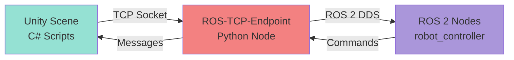

# Chapter 13: Unity for Robotics - ROS-TCP-Connector

**Estimated Reading Time**: 55 minutes

## Learning Objectives

By the end of this chapter, you will be able to:

- **LO-2.5.1**: Install and configure Unity 2022 LTS for robotics
- **LO-2.5.2**: Set up ROS-TCP-Connector for Unity-ROS 2 communication
- **LO-2.5.3**: Write C# scripts to publish and subscribe to ROS topics
- **LO-2.5.4**: Create Unity scenes for robot simulation
- **LO-2.5.5**: Compare Unity vs Gazebo for robotics use cases
- **LO-2.5.6**: Implement sensor data visualization in Unity

---

## 1. Why Unity for Robotics?

### Unity vs Gazebo

| Feature | Gazebo | Unity |
|---------|--------|-------|
| **Graphics** | Basic | Photorealistic (HDRP) |
| **VR/AR** | Limited | Native support |
| **Physics** | ODE/Bullet | PhysX/NVIDIA |
| **Asset Store** | Limited models | 100,000+ assets |
| **Learning Curve** | Moderate | Steeper (game dev) |
| **Performance** | Good for robotics | Excellent for visuals |
| **Use Case** | Engineering simulation | Human-robot interaction, demos, VR |

### When to Choose Unity

✅ **Use Unity for**:
- Photorealistic rendering (marketing, demos)
- VR/AR robotics applications
- Human-robot interaction (HRI) studies
- Large-scale environments with NPCs
- Advanced graphics (lighting, materials)

❌ **Use Gazebo for**:
- Pure engineering testing
- Lightweight simulation
- Standard robotics workflows
- ROS-native integration

---

## 2. System Architecture

### Unity-ROS 2 Communication Flow



**Components**:
1. **Unity Robotics Hub** (Unity package)
2. **ROS-TCP-Connector** (Unity side)
3. **ROS-TCP-Endpoint** (ROS 2 side - Python)
4. **Custom C# scripts** (Unity game objects)

---

## 3. Installation and Setup

### Step 1: Install Unity Hub and Unity 2022 LTS

**Ubuntu 22.04**:

```bash
# Download Unity Hub
wget -qO - https://hub.unity3d.com/linux/keys/public | gpg --dearmor | sudo tee /usr/share/keyrings/unity-archive-keyring.gpg > /dev/null

# Add Unity repository
echo "deb [signed-by=/usr/share/keyrings/unity-archive-keyring.gpg] https://hub.unity3d.com/linux/repos/deb stable main" | sudo tee /etc/apt/sources.list.d/unityhub.list

# Install Unity Hub
sudo apt update
sudo apt install unityhub

# Launch Unity Hub
unityhub
```

**In Unity Hub**:
1. Go to **Installs** → **Install Editor**
2. Select **Unity 2022.3 LTS**
3. Add modules: **Linux Build Support**, **WebGL Build Support**

---

### Step 2: Create Unity Project

1. **New Project** → **3D (URP)** (Universal Render Pipeline)
2. Name: `ROS2UnitySimulation`
3. Location: `~/ros2_ws/src/unity_sim/`

---

### Step 3: Install Unity Robotics Hub

**Via Package Manager**:

1. Open **Window** → **Package Manager**
2. Click **+** → **Add package from git URL**
3. Enter:
   ```
   https://github.com/Unity-Technologies/ROS-TCP-Connector.git?path=/com.unity.robotics.ros-tcp-connector
   ```
4. Repeat for Visualizations:
   ```
   https://github.com/Unity-Technologies/ROS-TCP-Connector.git?path=/com.unity.robotics.visualizations
   ```

---

### Step 4: Install ROS-TCP-Endpoint (ROS 2 Side)

```bash
cd ~/ros2_ws/src
git clone https://github.com/Unity-Technologies/ROS-TCP-Endpoint.git

cd ~/ros2_ws
colcon build --packages-select ros_tcp_endpoint
source install/setup.bash
```

---

## 4. Configuring ROS-TCP-Connector

### Unity Settings

**Robotics → ROS Settings**:

```
ROS IP Address: 127.0.0.1  (localhost, or remote IP)
ROS Port: 10000
Protocol: ROS 2
```

### Launch ROS-TCP-Endpoint

**Terminal 1**:
```bash
source ~/ros2_ws/install/setup.bash
ros2 run ros_tcp_endpoint default_server_endpoint --ros-args -p ROS_IP:=0.0.0.0
```

**Output**:
```
[INFO] [ros_tcp_endpoint]: Starting server on 0.0.0.0:10000
```

---

## 5. Publishing to ROS Topics from Unity

### Example: Publish Cube Position

**Unity C# Script: `RosPublisher.cs`**

```csharp
using UnityEngine;
using Unity.Robotics.ROSTCPConnector;
using RosMessageTypes.Geometry;

public class RosPublisher : MonoBehaviour
{
    ROSConnection ros;
    public string topicName = "unity/cube_position";
    public float publishFrequency = 10.0f;

    private float timeElapsed;

    void Start()
    {
        // Get ROS connection
        ros = ROSConnection.GetOrCreateInstance();
        ros.RegisterPublisher<PointMsg>(topicName);
    }

    void Update()
    {
        timeElapsed += Time.deltaTime;

        if (timeElapsed > 1.0f / publishFrequency)
        {
            Vector3 position = transform.position;

            PointMsg msg = new PointMsg
            {
                x = position.x,
                y = position.y,
                z = position.z
            };

            ros.Publish(topicName, msg);
            timeElapsed = 0;
        }
    }
}
```

**Attach to Cube**:
1. Create **GameObject → 3D Object → Cube**
2. Add **Component** → `RosPublisher` script
3. Play the scene

**Verify in Terminal**:
```bash
ros2 topic echo /unity/cube_position
```

**Output**:
```yaml
x: 0.5
y: 1.2
z: -2.3
---
```

---

## 6. Subscribing to ROS Topics in Unity

### Example: Move Object via ROS Commands

**ROS 2 Node (Python)**:

```python
#!/usr/bin/env python3
import rclpy
from rclpy.node import Node
from geometry_msgs.msg import Twist

class UnityController(Node):
    def __init__(self):
        super().__init__('unity_controller')
        self.cmd_pub = self.create_publisher(Twist, '/unity/cmd_vel', 10)
        self.timer = self.create_timer(1.0, self.send_command)

    def send_command(self):
        msg = Twist()
        msg.linear.x = 1.0  # Move forward
        msg.angular.z = 0.5  # Turn left
        self.cmd_pub.publish(msg)
        self.get_logger().info('Sent cmd_vel to Unity')

def main():
    rclpy.init()
    node = UnityController()
    rclpy.spin(node)
    node.destroy_node()
    rclpy.shutdown()

if __name__ == '__main__':
    main()
```

**Unity C# Script: `RosSubscriber.cs`**

```csharp
using UnityEngine;
using Unity.Robotics.ROSTCPConnector;
using RosMessageTypes.Geometry;

public class RosSubscriber : MonoBehaviour
{
    public string topicName = "unity/cmd_vel";
    public float moveSpeed = 2.0f;
    public float rotateSpeed = 50.0f;

    void Start()
    {
        ROSConnection.GetOrCreateInstance().Subscribe<TwistMsg>(topicName, OnCmdVelReceived);
    }

    void OnCmdVelReceived(TwistMsg msg)
    {
        // Apply linear velocity
        Vector3 movement = new Vector3(
            (float)msg.linear.x * moveSpeed,
            0,
            0
        ) * Time.deltaTime;
        transform.Translate(movement);

        // Apply angular velocity
        float rotation = (float)msg.angular.z * rotateSpeed * Time.deltaTime;
        transform.Rotate(0, rotation, 0);

        Debug.Log($"Received cmd_vel: linear.x={msg.linear.x}, angular.z={msg.angular.z}");
    }
}
```

**Attach to Robot GameObject**:
1. Create **GameObject → 3D Object → Capsule** (robot proxy)
2. Add **Component** → `RosSubscriber`
3. Play scene

**Run ROS Node**:
```bash
python3 unity_controller.py
```

The capsule will move based on ROS commands!

---

## 7. Working with Custom Messages

### Generating C# Message Classes

**Step 1: Create ROS 2 Message**

```bash
cd ~/ros2_ws/src
ros2 pkg create --build-type ament_cmake custom_msgs
cd custom_msgs
mkdir msg
```

**File: `msg/RobotStatus.msg`**
```
std_msgs/Header header
float32 battery_level
string status
bool is_moving
```

**Build**:
```bash
cd ~/ros2_ws
colcon build --packages-select custom_msgs
source install/setup.bash
```

---

**Step 2: Generate C# Classes**

**In Unity**:
1. **Robotics → Generate ROS Messages**
2. **ROS message path**: `~/ros2_ws/install/custom_msgs/share/custom_msgs/msg`
3. Click **Build Messages**

Generated file: `Assets/RosMessages/CustomMsgs/msg/RobotStatusMsg.cs`

---

**Step 3: Use Custom Message in Unity**

```csharp
using RosMessageTypes.CustomMsgs;

void Start()
{
    ROSConnection.GetOrCreateInstance().Subscribe<RobotStatusMsg>("robot/status", OnStatusReceived);
}

void OnStatusReceived(RobotStatusMsg msg)
{
    Debug.Log($"Battery: {msg.battery_level}%, Status: {msg.status}, Moving: {msg.is_moving}");
}
```

---

## 8. Creating a Simple Robot Scene

### Unity Scene Setup

**Step 1: Create Robot Body**

1. **GameObject → 3D Object → Cylinder** (body)
   - Scale: (0.5, 0.3, 0.5)
   - Material: Blue

2. **GameObject → 3D Object → Sphere** (wheels, x2)
   - Scale: (0.2, 0.2, 0.2)
   - Position: (±0.3, -0.3, 0)
   - Material: Black

3. **GameObject → 3D Object → Cube** (sensor box)
   - Scale: (0.1, 0.1, 0.1)
   - Position: (0, 0.4, 0)
   - Material: Red

**Step 2: Add Physics**

- Select **Robot Body** → **Add Component** → **Rigidbody**
- Constraints: Freeze Position Y, Freeze Rotation X, Z

**Step 3: Add Camera**

- **GameObject → Camera**
- Position: (0, 5, -10)
- Rotation: (30, 0, 0)

**Step 4: Add Scripts**

- Attach `RosSubscriber.cs` to Robot Body
- Attach `RosPublisher.cs` to Sensor Box

---

## 9. Sensor Simulation in Unity

### Lidar Visualization

**C# Script: `LidarSensor.cs`**

```csharp
using UnityEngine;
using Unity.Robotics.ROSTCPConnector;
using RosMessageTypes.Sensor;

public class LidarSensor : MonoBehaviour
{
    public string topicName = "unity/scan";
    public int numRays = 360;
    public float scanRange = 10.0f;
    public float scanFrequency = 10.0f;

    private ROSConnection ros;
    private float timeElapsed;

    void Start()
    {
        ros = ROSConnection.GetOrCreateInstance();
        ros.RegisterPublisher<LaserScanMsg>(topicName);
    }

    void Update()
    {
        timeElapsed += Time.deltaTime;

        if (timeElapsed > 1.0f / scanFrequency)
        {
            LaserScanMsg scan = PerformScan();
            ros.Publish(topicName, scan);
            timeElapsed = 0;
        }
    }

    LaserScanMsg PerformScan()
    {
        float[] ranges = new float[numRays];
        float angleMin = -Mathf.PI;
        float angleMax = Mathf.PI;
        float angleIncrement = (angleMax - angleMin) / numRays;

        for (int i = 0; i < numRays; i++)
        {
            float angle = angleMin + i * angleIncrement;
            Vector3 direction = new Vector3(Mathf.Cos(angle), 0, Mathf.Sin(angle));

            RaycastHit hit;
            if (Physics.Raycast(transform.position, direction, out hit, scanRange))
            {
                ranges[i] = hit.distance;
                Debug.DrawLine(transform.position, hit.point, Color.green, 0.1f);
            }
            else
            {
                ranges[i] = scanRange;
                Debug.DrawRay(transform.position, direction * scanRange, Color.red, 0.1f);
            }
        }

        return new LaserScanMsg
        {
            header = new RosMessageTypes.Std.HeaderMsg { frame_id = "lidar_frame" },
            angle_min = angleMin,
            angle_max = angleMax,
            angle_increment = angleIncrement,
            range_min = 0.1f,
            range_max = scanRange,
            ranges = ranges
        };
    }
}
```

**Visualize Lidar**:
```bash
ros2 topic echo /unity/scan
```

---

## Lab Exercise 2.5: Unity Robot Teleoperation

### Objective

Create a Unity scene with a robot that can be controlled via ROS 2 teleop keyboard.

### Requirements

**Unity Scene**:
1. Robot model (simple geometric shapes)
2. 10m × 10m ground plane
3. 5 obstacle objects
4. Camera following robot

**ROS 2 Integration**:
1. Subscribe to `/cmd_vel` from `teleop_twist_keyboard`
2. Publish `/odom` (robot position)
3. Publish `/unity/camera` (camera image as compressed)

**Deliverables**:
1. Unity scene file
2. C# scripts (`RobotController.cs`, `OdometryPublisher.cs`)
3. Video showing teleoperation

### Starter Code

**C# Script: `RobotController.cs`**

```csharp
using UnityEngine;
using Unity.Robotics.ROSTCPConnector;
using RosMessageTypes.Geometry;

public class RobotController : MonoBehaviour
{
    // TODO: Subscribe to /cmd_vel
    // TODO: Apply Twist commands to robot movement
    // TODO: Handle physics (Rigidbody)

    void Start()
    {
        // Initialize ROS connection
    }

    void OnCmdVelReceived(TwistMsg msg)
    {
        // Move robot based on msg
    }
}
```

### Acceptance Criteria

- ✅ Robot moves with arrow keys via `teleop_twist_keyboard`
- ✅ Collisions with obstacles prevent movement
- ✅ Odometry published at 20 Hz
- ✅ Camera follows robot smoothly
- ✅ No errors in Unity console or ROS 2

---

## Quiz 2.5: Unity-ROS Integration

### Question 1
**What is the purpose of ROS-TCP-Connector?**

- A) Replace ROS 2 entirely
- B) Bridge Unity and ROS 2 via TCP sockets ✓
- C) Create Unity assets
- D) Compile C# to Python

**Explanation**: ROS-TCP-Connector enables bidirectional communication between Unity (C#) and ROS 2 (Python/C++) using TCP/IP.

---

### Question 2
**Which Unity render pipeline is recommended for robotics?**

- A) Built-in
- B) URP (Universal Render Pipeline) ✓
- C) HDRP (High Definition)
- D) Lightweight

**Explanation**: URP balances performance and visual quality, suitable for real-time simulation on various hardware.

---

### Question 3
**True or False: Unity can natively publish to ROS 2 DDS without ROS-TCP-Endpoint.**

- False ✓

**Explanation**: Unity needs the ROS-TCP-Endpoint Python node to translate between TCP and ROS 2 DDS.

---

### Question 4
**What is the default port for ROS-TCP-Connector?**

- A) 8080
- B) 9090
- C) 10000 ✓
- D) 11311

**Explanation**: Port 10000 is the default for ROS-TCP-Endpoint server.

---

### Question 5
**Why use Unity over Gazebo for robotics? (Short answer)**

**Expected Answer**: Unity offers photorealistic graphics, native VR/AR support, a vast asset store, and advanced rendering (HDRP), making it ideal for human-robot interaction studies, demos, and marketing. Gazebo is better for pure engineering simulation.

---

## Key Takeaways

✅ **Unity** provides photorealistic rendering and VR support beyond Gazebo

✅ **ROS-TCP-Connector** bridges Unity (C#) and ROS 2 via TCP sockets

✅ **C# scripts** publish/subscribe to ROS topics using `ROSConnection` API

✅ **Custom messages** require generating C# classes from ROS 2 `.msg` files

✅ **Sensor simulation** (Lidar, cameras) uses Unity's Raycast and Camera APIs

✅ **Use cases**: HRI, VR training, photorealistic demos, large environments

---

## What's Next?

In **Chapter 14**, you'll dive into **Humanoid Animation and Physics in Unity**, learning to import humanoid models, configure ragdoll physics, and create realistic human-robot interactions!

[Continue to Chapter 14: Humanoid Animation in Unity →](/docs/module-2-simulation/week-7/chapter-14-humanoid-unity)

---

## Additional Resources

- **Unity Robotics Hub**: [github.com/Unity-Technologies/Unity-Robotics-Hub](https://github.com/Unity-Technologies/Unity-Robotics-Hub)
- **ROS-TCP-Connector Docs**: [Unity Robotics Documentation](https://github.com/Unity-Technologies/ROS-TCP-Connector)
- **Unity Learn**: [learn.unity.com](https://learn.unity.com)
- **C# for Unity**: [docs.unity3d.com/ScriptReference](https://docs.unity3d.com/ScriptReference/)

---

**Progress**: Module 2, Week 7, Chapter 13 of 32 | [View all chapters](/docs/intro)
