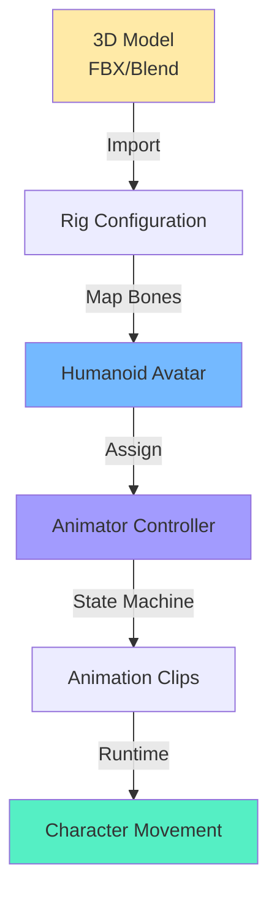
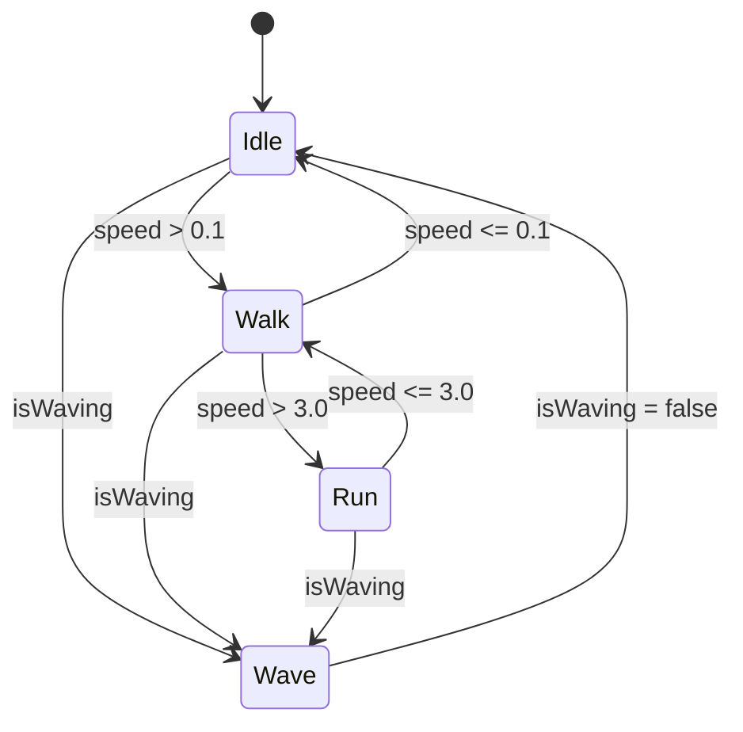

# Chapter 14: Humanoid Animation and Physics in Unity

**Estimated Reading Time**: 60 minutes

## Learning Objectives

By the end of this chapter, you will be able to:

- **LO-2.6.1**: Import and configure humanoid models with Unity's Mecanim
- **LO-2.6.2**: Create animation controllers with state machines
- **LO-2.6.3**: Set up ragdoll physics for realistic collisions
- **LO-2.6.4**: Implement inverse kinematics (IK) for dynamic poses
- **LO-2.6.5**: Design blend trees for smooth animation transitions
- **LO-2.6.6**: Integrate motion capture data (BVH, FBX)

---

## 1. Why Humanoid Simulation?

### Applications in Robotics

**Human-Robot Interaction (HRI)**:
- Training robots to recognize human gestures
- Simulating crowded environments
- Testing service robots (delivery, assistance)
- VR telepresence for humanoid robots

**Use Cases**:
- 🏥 Healthcare: Patient care simulation
- 🏭 Manufacturing: Collaborative robotics (cobots)
- 🏠 Home assistance: Elderly care, domestic robots
- 🎮 Entertainment: Virtual characters interacting with robots

---

## 2. Unity Humanoid Rig System

### Mecanim Overview

**Mecanim** is Unity's animation system for humanoid characters.



**Key Concepts**:
- **Avatar**: Bone mapping (hip, spine, head, limbs)
- **Animator Controller**: State machine for animations
- **Animation Clips**: Walk, run, idle, jump, etc.
- **Blend Trees**: Smooth transitions between clips

---

## 3. Importing Humanoid Models

### Step 1: Download Free Model

**Mixamo** (Adobe's free character library):
1. Visit [mixamo.com](https://www.mixamo.com)
2. Select character (e.g., "X Bot", "Amy")
3. Download as **FBX for Unity (.fbx)**
4. Download animations: Idle, Walk, Run, Wave

---

### Step 2: Import to Unity

**Unity Project**:
1. Drag `.fbx` files to `Assets/Models/`
2. Select model → **Inspector**
3. **Rig** tab:
   - Animation Type: **Humanoid**
   - Avatar Definition: **Create From This Model**
4. Click **Configure**

**Bone Mapping**:
Unity auto-maps bones. Verify:
- ✅ Head → Head bone
- ✅ Spine → Spine bones (chest, upper chest)
- ✅ Left/Right Arms → Shoulder, elbow, wrist
- ✅ Left/Right Legs → Hip, knee, ankle

**Apply** and **Done**.

---

## 4. Animation Controller Setup

### Creating Animator Controller

**Assets → Create → Animator Controller**
- Name: `HumanoidAnimator`

**Assign to Character**:
1. Select character in scene
2. **Add Component** → **Animator**
3. **Controller**: Assign `HumanoidAnimator`

---

### State Machine

**Open Animator Window** (Window → Animation → Animator)

**States**:
1. **Idle** (default state)
2. **Walk**
3. **Run**
4. **Wave**

**Transitions**:
- Idle → Walk (condition: `speed > 0.1`)
- Walk → Run (condition: `speed > 3.0`)
- Run → Walk (condition: `speed <= 3.0`)
- Walk → Idle (condition: `speed <= 0.1`)
- Any State → Wave (condition: `isWaving == true`)

**Parameters**:
- `speed` (Float)
- `isWaving` (Bool)



---

## 5. Controlling Animations with C#

### Animation Controller Script

**File: `HumanoidController.cs`**

```csharp
using UnityEngine;

public class HumanoidController : MonoBehaviour
{
    private Animator animator;
    public float moveSpeed = 2.0f;
    public float runSpeed = 5.0f;

    void Start()
    {
        animator = GetComponent<Animator>();
    }

    void Update()
    {
        // Get input
        float horizontal = Input.GetAxis("Horizontal");
        float vertical = Input.GetAxis("Vertical");

        Vector3 movement = new Vector3(horizontal, 0, vertical);
        float speed = movement.magnitude;

        // Apply run modifier
        if (Input.GetKey(KeyCode.LeftShift))
        {
            speed *= (runSpeed / moveSpeed);
        }

        // Update animator
        animator.SetFloat("speed", speed);

        // Move character
        if (speed > 0.1f)
        {
            transform.Translate(movement.normalized * moveSpeed * Time.deltaTime, Space.World);
            transform.rotation = Quaternion.LookRotation(movement);
        }

        // Wave gesture
        if (Input.GetKeyDown(KeyCode.Space))
        {
            animator.SetBool("isWaving", true);
        }
        if (Input.GetKeyUp(KeyCode.Space))
        {
            animator.SetBool("isWaving", false);
        }
    }
}
```

**Attach to Character**:
1. Select character → **Add Component** → `HumanoidController`
2. Play scene
3. Use **WASD** to move, **Shift** to run, **Space** to wave

---

## 6. Ragdoll Physics

### What is Ragdoll Physics?

**Ragdoll** simulates realistic body physics when character is hit, falls, or loses control.

**Use Cases**:
- Robot collision with humans
- Fall detection
- Impact analysis

---

### Creating Ragdoll

**Unity Ragdoll Wizard**:

1. **GameObject → 3D Object → Ragdoll**
2. Assign bones:
   - Pelvis: `Hips`
   - Left/Right Hips: `LeftUpperLeg`, `RightUpperLeg`
   - Left/Right Knees: `LeftLowerLeg`, `RightLowerLeg`
   - Left/Right Arms: `LeftUpperArm`, `RightUpperArm`
   - Elbows: `LeftForeArm`, `RightForeArm`
   - Head: `Head`

3. **Total Mass**: 70 kg (average human)
4. **Strength**: 50
5. Click **Create**

**Components Added**:
- **Rigidbody** on each bone
- **Character Joint** for limb connections
- **Capsule Collider** on body parts

---

### Toggling Ragdoll

**Script: `RagdollController.cs`**

```csharp
using UnityEngine;

public class RagdollController : MonoBehaviour
{
    private Animator animator;
    private Rigidbody[] ragdollRigidbodies;
    private CharacterJoint[] ragdollJoints;
    private bool isRagdoll = false;

    void Start()
    {
        animator = GetComponent<Animator>();
        ragdollRigidbodies = GetComponentsInChildren<Rigidbody>();
        ragdollJoints = GetComponentsInChildren<CharacterJoint>();

        DisableRagdoll();
    }

    void Update()
    {
        if (Input.GetKeyDown(KeyCode.R))
        {
            ToggleRagdoll();
        }
    }

    void ToggleRagdoll()
    {
        isRagdoll = !isRagdoll;

        if (isRagdoll)
        {
            EnableRagdoll();
        }
        else
        {
            DisableRagdoll();
        }
    }

    void EnableRagdoll()
    {
        animator.enabled = false;

        foreach (Rigidbody rb in ragdollRigidbodies)
        {
            rb.isKinematic = false;
        }

        Debug.Log("Ragdoll enabled");
    }

    void DisableRagdoll()
    {
        animator.enabled = true;

        foreach (Rigidbody rb in ragdollRigidbodies)
        {
            rb.isKinematic = true;
        }

        Debug.Log("Ragdoll disabled");
    }

    void OnCollisionEnter(Collision collision)
    {
        // Auto-enable ragdoll on high-impact collision
        if (collision.relativeVelocity.magnitude > 5.0f)
        {
            EnableRagdoll();
        }
    }
}
```

**Test**:
- Press **R** to toggle ragdoll mode
- Character falls realistically

---

## 7. Inverse Kinematics (IK)

### What is IK?

**Inverse Kinematics** adjusts limbs to reach target positions (e.g., foot on uneven ground, hand grabbing object).

**Forward Kinematics (FK)**:
- Animate joints → end effector position computed

**Inverse Kinematics (IK)**:
- Specify end effector position → joints computed

---

### Unity IK Setup

**Script: `IKController.cs`**

```csharp
using UnityEngine;

public class IKController : MonoBehaviour
{
    private Animator animator;

    public Transform rightHandTarget;  // Assign in Inspector
    public Transform leftHandTarget;
    public Transform lookAtTarget;

    [Range(0, 1)] public float rightHandWeight = 1.0f;
    [Range(0, 1)] public float leftHandWeight = 1.0f;
    [Range(0, 1)] public float lookAtWeight = 1.0f;

    void Start()
    {
        animator = GetComponent<Animator>();
    }

    void OnAnimatorIK(int layerIndex)
    {
        // Right hand IK
        if (rightHandTarget != null)
        {
            animator.SetIKPositionWeight(AvatarIKGoal.RightHand, rightHandWeight);
            animator.SetIKRotationWeight(AvatarIKGoal.RightHand, rightHandWeight);
            animator.SetIKPosition(AvatarIKGoal.RightHand, rightHandTarget.position);
            animator.SetIKRotation(AvatarIKGoal.RightHand, rightHandTarget.rotation);
        }

        // Left hand IK
        if (leftHandTarget != null)
        {
            animator.SetIKPositionWeight(AvatarIKGoal.LeftHand, leftHandWeight);
            animator.SetIKRotationWeight(AvatarIKGoal.LeftHand, leftHandWeight);
            animator.SetIKPosition(AvatarIKGoal.LeftHand, leftHandTarget.position);
            animator.SetIKRotation(AvatarIKGoal.LeftHand, leftHandTarget.rotation);
        }

        // Look-at IK
        if (lookAtTarget != null)
        {
            animator.SetLookAtWeight(lookAtWeight);
            animator.SetLookAtPosition(lookAtTarget.position);
        }
    }
}
```

**Setup**:
1. Create **Empty GameObjects** as targets:
   - `RightHandTarget`
   - `LeftHandTarget`
   - `LookAtTarget` (e.g., robot face)
2. Assign in Inspector
3. Enable **IK Pass** in Animator Controller → Base Layer (gear icon)

**Test**:
- Move `RightHandTarget` → character's hand follows
- Move `LookAtTarget` → character's head tracks

---

## 8. Blend Trees for Smooth Transitions

### Creating Blend Tree

**Animator Controller → Right-click → Create State → From New Blend Tree**

**Name**: `Locomotion`

**Blend Type**: 2D Simple Directional

**Parameters**:
- `velocityX` (Float)
- `velocityZ` (Float)

**Motion Fields**:
- (0, 0): Idle
- (0, 1): Walk Forward
- (0, -1): Walk Backward
- (-1, 0): Walk Left
- (1, 0): Walk Right

**Script Update**:

```csharp
void Update()
{
    float horizontal = Input.GetAxis("Horizontal");
    float vertical = Input.GetAxis("Vertical");

    animator.SetFloat("velocityX", horizontal);
    animator.SetFloat("velocityZ", vertical);
}
```

**Result**: Character smoothly blends between walk directions.

---

## 9. Motion Capture Integration

### Importing BVH Files

**BVH (Biovision Hierarchy)** stores motion capture data.

**Free Sources**:
- [mocap.cs.cmu.edu](http://mocap.cs.cmu.edu)
- [mixamo.com](https://www.mixamo.com)

**Import Steps**:
1. Download `.bvh` file
2. Drag to Unity `Assets/Animations/`
3. Select → **Rig** → **Humanoid** → **Apply**
4. Add to Animator Controller

**Retargeting**:
Unity automatically retargets animations to different humanoid models!

---

## Lab Exercise 2.6: Human-Robot Interaction Scene

### Objective

Create a Unity scene where a humanoid character waves at a robot, and the robot responds by moving closer.

### Requirements

**Scene Setup**:
1. Humanoid character (Mixamo model)
2. Simple robot (capsule + sphere)
3. Ground plane (10m × 10m)

**Interactions**:
1. Character plays **Idle** animation by default
2. Press **Space** → Character waves
3. Robot detects wave (distance check)
4. Robot moves toward character
5. Robot stops 1m away

**Deliverables**:
1. Unity scene file
2. `HumanController.cs` (character animation)
3. `RobotAI.cs` (robot response logic)
4. Video showing interaction

### Starter Code

**C# Script: `RobotAI.cs`**

```csharp
using UnityEngine;

public class RobotAI : MonoBehaviour
{
    public Transform humanCharacter;
    public float detectionRange = 5.0f;
    public float moveSpeed = 1.0f;
    public float stopDistance = 1.0f;

    private Animator humanAnimator;
    private bool isApproaching = false;

    void Start()
    {
        humanAnimator = humanCharacter.GetComponent<Animator>();
    }

    void Update()
    {
        // TODO: Check if human is waving
        bool isWaving = humanAnimator.GetBool("isWaving");

        // TODO: Calculate distance to human
        float distance = Vector3.Distance(transform.position, humanCharacter.position);

        // TODO: If waving and in range, approach
        if (isWaving && distance < detectionRange && distance > stopDistance)
        {
            // Move toward human
        }
    }
}
```

### Acceptance Criteria

- ✅ Character animation plays smoothly
- ✅ Robot detects wave gesture
- ✅ Robot approaches and stops at correct distance
- ✅ No jittering or physics errors
- ✅ Scene runs at >30 FPS

---

## Quiz 2.6: Humanoid Animation

### Question 1
**What is Mecanim in Unity?**

- A) Physics engine
- B) Humanoid animation system ✓
- C) AI pathfinding
- D) Rendering pipeline

**Explanation**: Mecanim is Unity's animation system with humanoid rig support, state machines, and blend trees.

---

### Question 2
**What does ragdoll physics simulate?**

- A) Character walking
- B) Realistic body physics when falling/colliding ✓
- C) Smooth transitions
- D) Facial expressions

**Explanation**: Ragdoll uses Rigidbody and Character Joints to simulate realistic limb physics.

---

### Question 3
**True or False: Inverse Kinematics (IK) computes joint angles to reach a target position.**

- True ✓

**Explanation**: IK solves for joint rotations given desired end effector (hand, foot) position.

---

### Question 4
**What is the purpose of blend trees?**

- A) Combine multiple animations smoothly ✓
- B) Create ragdoll physics
- C) Import FBX files
- D) Enable IK

**Explanation**: Blend trees interpolate between animation clips based on parameters (speed, direction).

---

### Question 5
**Why use humanoid simulation in robotics? (Short answer)**

**Expected Answer**: Humanoid simulation enables testing human-robot interaction scenarios, training robots to recognize gestures, simulating crowded environments, and developing service robots for healthcare, manufacturing, and home assistance.

---

## Key Takeaways

✅ **Mecanim** is Unity's animation system for humanoid characters with bone mapping

✅ **Animator Controllers** use state machines to manage animation transitions

✅ **Ragdoll physics** simulates realistic body collisions using Rigidbody and joints

✅ **Inverse Kinematics (IK)** adjusts limbs to reach target positions dynamically

✅ **Blend trees** enable smooth transitions between multiple animation clips

✅ **Motion capture** (BVH, FBX) can be retargeted to any humanoid model

---

## What's Next?

🎉 **Module 2 Complete!** You've mastered digital twin simulation with Gazebo and Unity!

**Next**: Complete the **Module 2 Assessment** to test your knowledge and build a comprehensive simulation project.

[Continue to Module 2 Assessment →](/docs/module-2-simulation/module-2-assessment)

---

## Additional Resources

- **Mixamo**: [mixamo.com](https://www.mixamo.com) (free characters & animations)
- **Unity Animation Docs**: [docs.unity3d.com/Manual/AnimationOverview.html](https://docs.unity3d.com/Manual/AnimationOverview.html)
- **CMU Motion Capture Database**: [mocap.cs.cmu.edu](http://mocap.cs.cmu.edu)
- **Humanoid Avatars**: [docs.unity3d.com/Manual/AvatarCreationandSetup.html](https://docs.unity3d.com/Manual/AvatarCreationandSetup.html)

---

**Progress**: Module 2, Week 7, Chapter 14 of 32 | [View all chapters](/docs/intro)
