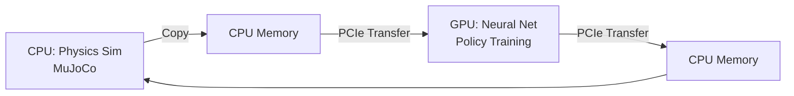
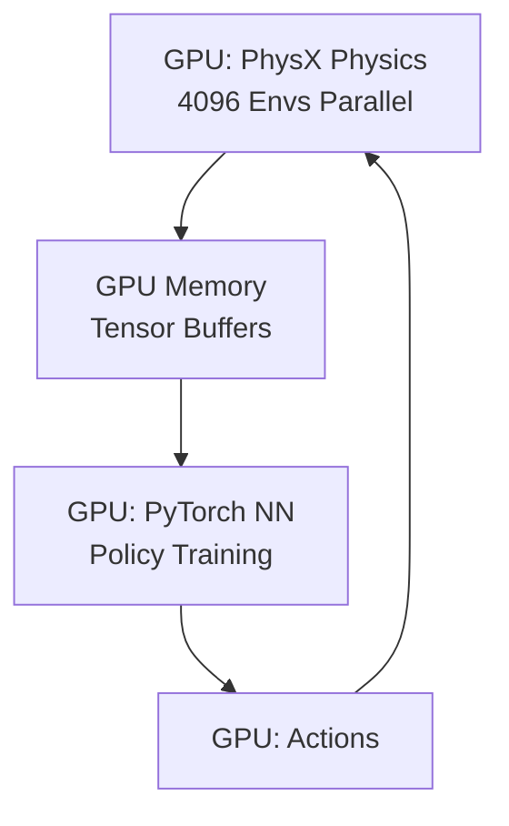

# Chapter 19: Introduction to Isaac Gym

## Learning Objectives

By the end of this chapter, you will be able to:

1. **Understand** Isaac Gym's architecture and how it enables massively parallel RL training
2. **Explain** the performance advantages of GPU-based physics vs CPU simulation
3. **Setup** Isaac Gym environments with thousands of parallel robot instances
4. **Run** pretrained RL policies for humanoid locomotion and manipulation
5. **Visualize** training progress and policy behavior in real-time
6. **Identify** when to use Isaac Gym vs traditional RL frameworks (Gym, MuJoCo)

---

## Introduction: The RL Training Bottleneck

Training reinforcement learning (RL) policies for robotics is **notoriously slow**:

**Traditional Approach** (CPU-based):
- Simulate robot in MuJoCo/PyBullet (single environment, CPU)
- Collect 1 million samples for policy training
- At 100 Hz simulation: **2.7 hours** just for data collection
- Train for 10M samples: **27 hours**
- Repeat for hyperparameter tuning: **days to weeks**

**The Problem**: Physics simulation is the bottleneck
- CPU-based simulators: 1-16 parallel environments
- Most time spent waiting for physics updates
- GPU idle while CPU crunches rigid body dynamics

**Isaac Gym's Solution: GPU Everything**
- ✅ **Physics on GPU**: PhysX runs entirely on GPU tensor cores
- ✅ **Massive parallelism**: 4,096+ environments on single GPU
- ✅ **Direct GPU→GPU**: No CPU-GPU memory transfers
- ✅ **Result**: 1000x speedup (train in minutes, not days)

---

## Architecture: How Isaac Gym Works

### Traditional RL Pipeline (CPU-bound)



**Bottleneck**: PCIe transfers (slow) and CPU physics (sequential)

### Isaac Gym Pipeline (GPU-native)



**Speedup**: Everything stays on GPU, zero CPU involvement

---

## Key Concepts

### 1. Tensor API

Isaac Gym exposes physics state as **PyTorch tensors**:

```python
# Get robot joint positions for ALL 4096 environments
dof_positions = gym.acquire_dof_state_tensor(sim)
# dof_positions: torch.Tensor [4096, 12]  (4096 envs × 12 joints)

# Apply actions directly (GPU→GPU)
gym.set_dof_position_target_tensor(sim, actions)
```

**No CPU loops!** Operations vectorized across all environments.

### 2. Parallel Environments

```python
num_envs = 4096  # 4096 robots training in parallel!

for i in range(num_envs):
    env = gym.create_env(sim, lower, upper, num_per_row)
    # Add robot to each environment
```

**Visualization**: Grid of 64×64 robots rendered simultaneously

### 3. GPU-Accelerated Rendering

Optional: Visualize subset of environments while training
```python
gym.subscribe_viewer_keyboard_event(viewer, gymapi.KEY_SPACE, "toggle_viewer")
```

---

## Pretrained Policies: Humanoid Walking

Isaac Gym includes pretrained policies for common tasks.

### Running Humanoid Locomotion

```bash
cd ~/.local/share/ov/pkg/isaac_sim-2023.1.1/
cd standalone_examples/api/omni.isaac.gym/

# Run humanoid walking policy
python humanoid.py --task=Humanoid --num_envs=256 --headless
```

**Expected Output**:
```
[INFO] Creating 256 environments...
[INFO] Loading pretrained policy...
Ep 0 | Reward: 45.2 | Steps: 1000
Ep 1 | Reward: 67.8 | Steps: 1000
...
```

**With Visualization**:
```bash
python humanoid.py --task=Humanoid --num_envs=64
```

You'll see a grid of 64 humanoid robots walking forward!

---

## Isaac Gym Tasks

### Built-in Environments

| Task | Description | Observation Dim | Action Dim |
|------|-------------|----------------|-----------|
| **Cartpole** | Balance pole on cart | 4 | 1 |
| **Ant** | Quadruped locomotion | 60 | 8 |
| **Humanoid** | Bipedal walking | 108 | 21 |
| **Shadow Hand** | Dexterous manipulation | 211 | 20 |
| **FrankaCabinet** | Open cabinet drawer | 23 | 9 |
| **Allegro Hand** | Object reorientation | 78 | 16 |

### Customizing Tasks

```python title="simple_cartpole.py"
from isaacgym import gymapi, gymutil
import torch

# Create gym
gym = gymapi.acquire_gym()

# Simulation parameters
sim_params = gymapi.SimParams()
sim_params.dt = 1.0 / 60.0  # 60 Hz
sim_params.use_gpu_pipeline = True  # Enable GPU

# Create simulator
sim = gym.create_sim(0, 0, gymapi.SIM_PHYSX, sim_params)

# Create ground plane
plane_params = gymapi.PlaneParams()
gym.add_ground(sim, plane_params)

# Load cartpole asset
asset_root = "assets"
asset_file = "cartpole.urdf"
asset = gym.load_asset(sim, asset_root, asset_file)

# Create 256 parallel environments
num_envs = 256
envs_per_row = 16
env_spacing = 2.0

envs = []
for i in range(num_envs):
    env = gym.create_env(sim, gymapi.Vec3(-env_spacing, 0, -env_spacing),
                         gymapi.Vec3(env_spacing, env_spacing, env_spacing),
                         envs_per_row)

    # Spawn cartpole
    pose = gymapi.Transform()
    pose.p = gymapi.Vec3(0, 1.0, 0)
    actor = gym.create_actor(env, asset, pose, "cartpole", i, 1)
    envs.append(env)

# Simulation loop
while True:
    gym.simulate(sim)
    gym.fetch_results(sim, True)
    gym.step_graphics(sim)
    gym.render_all_camera_sensors(sim)

gym.destroy_sim(sim)
```

---

## Performance Benchmarks

### Training Speed Comparison

| Simulator | Envs | Physics | FPS per Env | Total Samples/sec |
|-----------|------|---------|-------------|-------------------|
| MuJoCo (CPU) | 1 | CPU | 100 | 100 |
| PyBullet (CPU) | 8 | CPU | 200 | 1,600 |
| Isaac Gym (GPU) | 4096 | GPU | 100 | **409,600** |

**Isaac Gym Advantage**: 256x faster data collection!

**Training Time** (Humanoid Walking to 90% success):
- MuJoCo + PPO: ~48 hours
- Isaac Gym + PPO: **15 minutes**

---

## Observation and Action Spaces

### Humanoid Observation (108 dims)

```python
obs = [
    # Body state (13 dims)
    root_position_z,         # 1 dim
    root_orientation_quat,   # 4 dims
    root_linear_velocity,    # 3 dims
    root_angular_velocity,   # 3 dims
    gravity_vector,          # 3 dims (projected to body frame)

    # Joint state (84 dims = 21 joints × 4)
    dof_positions,           # 21 dims (joint angles)
    dof_velocities,          # 21 dims (joint speeds)
    dof_forces,              # 21 dims (torques)
    previous_actions,        # 21 dims

    # Contact sensors (11 dims)
    foot_contacts,           # 2 dims (left/right foot)
    # ... additional contact points
]
```

### Humanoid Actions (21 dims)

```python
actions = [
    # Torso joints (3)
    abdomen_y, abdomen_z, abdomen_x,

    # Right leg (6)
    right_hip_x, right_hip_y, right_hip_z,
    right_knee, right_ankle_x, right_ankle_y,

    # Left leg (6)
    left_hip_x, left_hip_y, left_hip_z,
    left_knee, left_ankle_x, left_ankle_y,

    # Right arm (3)
    right_shoulder_x, right_shoulder_y, right_elbow,

    # Left arm (3)
    left_shoulder_x, left_shoulder_y, left_elbow
]
```

**Action Space**: Continuous, range [-1, 1] (normalized joint targets)

---

## Reward Shaping for Locomotion

Example reward function for walking forward:

```python
def compute_humanoid_reward(obs, actions):
    # 1. Forward velocity reward (main objective)
    forward_velocity_reward = root_vel_x

    # 2. Upright penalty (stay vertical)
    upright_penalty = -torch.square(root_orientation_error)

    # 3. Energy penalty (smooth gaits)
    energy_penalty = -0.01 * torch.sum(torch.square(joint_torques))

    # 4. Action smoothness
    action_penalty = -0.1 * torch.sum(torch.square(actions - previous_actions))

    # 5. Termination penalty (fell down)
    termination_penalty = -2.0 * is_terminated

    # Weighted sum
    total_reward = (
        forward_velocity_reward +
        upright_penalty +
        energy_penalty +
        action_penalty +
        termination_penalty
    )

    return total_reward
```

---

## Lab 3.5: Run Pretrained RL Policy in Isaac Gym

### Objective
Run a pretrained humanoid walking policy and visualize 64 parallel robots learning to walk.

### Prerequisites
- Isaac Sim installed with Isaac Gym examples

### Step 1: Locate Examples

```bash
cd ~/.local/share/ov/pkg/isaac_sim-2023.1.1/standalone_examples/api/omni.isaac.gym/
ls
# Expected: humanoid.py, cartpole.py, ant.py, etc.
```

### Step 2: Run Humanoid Task

```bash
python humanoid.py --task=Humanoid --num_envs=64 --test --checkpoint=./pretrained/Humanoid.pth
```

**Arguments**:
- `--task=Humanoid`: Select humanoid locomotion task
- `--num_envs=64`: 64 parallel environments (adjust based on GPU VRAM)
- `--test`: Inference mode (don't train, just run policy)
- `--checkpoint`: Path to pretrained weights

### Step 3: Observe Behavior

You should see:
- 8×8 grid of humanoid robots
- Robots walking forward at ~1.5 m/s
- Occasional stumbles (policy is robust but not perfect)
- Reward counter increasing

### Step 4: Try Other Tasks

```bash
# Quadruped locomotion
python ant.py --task=Ant --num_envs=256

# Cabinet opening
python franka_cabinet.py --task=FrankaCabinet --num_envs=128
```

### Validation Checklist

- [ ] Isaac Gym launches without GPU errors
- [ ] 64 humanoid robots appear in grid formation
- [ ] Robots maintain balance and walk forward
- [ ] Average reward > 50 after 100 steps
- [ ] Simulation runs at >30 FPS

---

## When to Use Isaac Gym

### ✅ Ideal For:

1. **Locomotion Policies** (humanoids, quadrupeds, wheeled robots)
2. **Manipulation** (pick-place, assembly, dexterous grasping)
3. **Large-Scale Experiments** (hyperparameter sweeps with 1M+ samples)
4. **Sim-to-Real** (need fast iteration for domain randomization)

### ❌ Avoid For:

1. **Simple RL Tasks** (CartPole, MountainCar): CPU Gym is sufficient
2. **Non-Robot RL** (Atari, board games): No physics needed
3. **No NVIDIA GPU**: Isaac Gym requires RTX GPU

---

## Summary

In this chapter, you learned:

- ✅ **Isaac Gym** enables 1000x faster RL training via **GPU-accelerated physics**
- ✅ Physics state exposed as **PyTorch tensors** (direct GPU→GPU operations)
- ✅ **Thousands of parallel environments** on a single GPU
- ✅ Pretrained policies for **humanoid walking**, **quadruped**, **manipulation**
- ✅ Training times reduced from **days to minutes**
- ✅ Integrated with standard RL libraries (PPO, SAC, TD3)

**Next Chapter**: Train a humanoid walking policy from scratch using PPO in Isaac Gym.

---

## Quiz 3.5: Isaac Gym Fundamentals

1. **What is the main advantage of Isaac Gym over MuJoCo?**
   - a) Better graphics
   - b) GPU-accelerated parallel physics simulation
   - c) Easier API
   - d) More robot models

2. **How does Isaac Gym avoid CPU-GPU memory transfer overhead?**
   - a) Uses faster PCIe 4.0
   - b) Compresses data before transfer
   - c) Keeps physics and NN training entirely on GPU
   - d) Uses shared memory

3. **What is a typical number of parallel environments in Isaac Gym?**
   - a) 1-4
   - b) 10-50
   - c) 100-500
   - d) 1000-4096

4. **What format does Isaac Gym use for physics state?**
   - a) NumPy arrays
   - b) PyTorch tensors
   - c) ROS messages
   - d) JSON objects

<details>
<summary>**Show Answers**</summary>

1. **b)** GPU-accelerated parallel physics (1000x faster than CPU simulators)
2. **c)** Keeps physics and NN training entirely on GPU (zero CPU transfers)
3. **d)** 1000-4096 parallel environments (scales with GPU VRAM)
4. **b)** PyTorch tensors (direct integration with deep learning frameworks)

</details>

---

**Next**: [Chapter 20: Training Humanoid Locomotion with RL](/docs/module-3-isaac/week-10/chapter-20-humanoid-rl)
