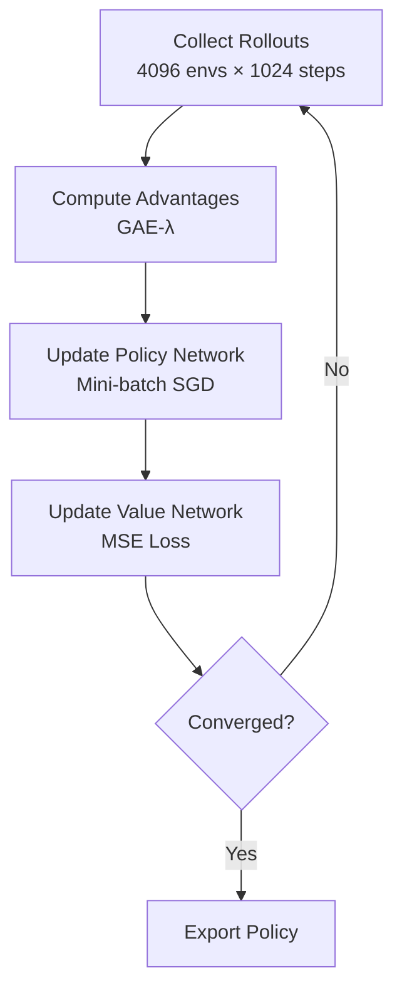

# Chapter 20: Training Humanoid Locomotion with RL

## Learning Objectives

By the end of this chapter, you will be able to:

1. **Implement** a complete RL training loop for humanoid walking using PPO (Proximal Policy Optimization)
2. **Design** reward functions for bipedal locomotion (balance, forward velocity, energy efficiency)
3. **Apply** curriculum learning to progressively increase task difficulty
4. **Monitor** training progress with TensorBoard and real-time visualization
5. **Export** trained policies and evaluate performance metrics
6. **Prepare** policies for sim-to-real deployment with domain randomization

---

## Introduction: The Challenge of Bipedal Walking

Humanoid walking is one of the most challenging tasks in robotics:
- **High-dimensional** (21+ degrees of freedom)
- **Unstable** (small support polygon, high center of mass)
- **Contact-rich** (foot-ground interactions, friction)
- **Energy-efficient** gaits require careful optimization

**Why RL?**: Traditional control (ZMP, LIP models) requires extensive manual tuning. RL learns optimal policies through trial-and-error.

**Training Time** (with Isaac Gym):
- **15-30 minutes** to learn basic forward walking
- **2-4 hours** for robust multi-directional locomotion
- **1000x faster** than CPU-based simulators

---

## Proximal Policy Optimization (PPO) Overview

PPO is the de facto standard for robot RL due to:
- ✅ **Sample efficiency** (learns from on-policy data)
- ✅ **Stability** (clipped objective prevents destructive updates)
- ✅ **Simplicity** (fewer hyperparameters than TRPO)

### PPO Algorithm (Simplified)



**Key Components**:
1. **Actor (Policy) Network**: `π(a|s)` outputs action given observation
2. **Critic (Value) Network**: `V(s)` estimates expected future reward
3. **Advantage Estimation**: `A(s,a) = Q(s,a) - V(s)` (how much better is action `a`?)
4. **Clipped Loss**: Prevents large policy updates

---

## Environment Setup

### Humanoid Task Configuration

```python title="humanoid_config.py"
from dataclasses import dataclass

@dataclass
class HumanoidConfig:
    # Environment
    num_envs: int = 4096
    env_spacing: float = 3.0
    episode_length: int = 1000  # Max steps per episode

    # Observations (108 dims)
    obs_dim: int = 108
    # Actions (21 joints)
    act_dim: int = 21

    # Rewards
    linear_velocity_scale: float = 2.0
    angular_velocity_scale: float = 0.5
    torque_penalty_scale: float = 0.00001
    action_rate_scale: float = 0.01
    alive_reward_scale: float = 0.5

    # Physics
    sim_dt: float = 0.0167  # 60 Hz
    control_dt: float = 0.0167

    # Termination
    termination_height: float = 0.8  # Fallen if root < 0.8m

    # Training
    ppo_epochs: int = 4
    mini_batch_size: int = 512
    learning_rate: float = 3e-4
    gamma: float = 0.99  # Discount factor
    gae_lambda: float = 0.95  # GAE parameter
```

---

## Reward Function Design

### Components

```python
def compute_humanoid_reward(root_states, dof_pos, dof_vel,
                            actions, prev_actions, contact_forces):
    # 1. Forward velocity reward (primary objective)
    lin_vel_reward = root_states[:, 7]  # x-velocity
    forward_reward = lin_vel_reward * 2.0

    # 2. Upright orientation reward
    up_vec = quat_rotate(root_states[:, 3:7], torch.tensor([0, 0, 1]))
    upright_reward = torch.square(up_vec[:, 2])  # z-component of "up"

    # 3. Energy penalty (minimize torques)
    torque = torch.sum(torch.square(actions), dim=-1)
    energy_penalty = -0.00001 * torque

    # 4. Action smoothness (prevent jittery motion)
    action_diff = torch.sum(torch.square(actions - prev_actions), dim=-1)
    smoothness_penalty = -0.01 * action_diff

    # 5. Termination penalty
    root_height = root_states[:, 2]
    is_alive = (root_height > 0.8).float()
    alive_reward = is_alive * 0.5

    # Total reward
    total_reward = (
        forward_reward +
        upright_reward +
        energy_penalty +
        smoothness_penalty +
        alive_reward
    )

    return total_reward, {
        'forward': forward_reward.mean(),
        'upright': upright_reward.mean(),
        'energy': energy_penalty.mean(),
        'alive': alive_reward.mean()
    }
```

### Reward Shaping Tips

1. **Scale appropriately**: Main objective (velocity) should dominate
2. **Dense rewards**: Provide feedback every step (not just at goal)
3. **Avoid sparse rewards**: `if goal_reached: +1000 else: 0` is hard to learn
4. **Curriculum**: Start with easier rewards, gradually increase difficulty

---

## Training Loop (PPO Implementation)

```python title="train_humanoid.py"
import torch
from torch import nn
from isaacgym import gymapi
from rl_games.algos_torch import torch_ext
from rl_games.common import vecenv
from rl_games.algos_torch import players

class HumanoidEnv(vecenv.IVecEnv):
    def __init__(self, config):
        self.cfg = config
        self.num_envs = config.num_envs
        self.num_obs = config.obs_dim
        self.num_actions = config.act_dim

        # Create Isaac Gym simulation
        self.gym = gymapi.acquire_gym()
        self.sim = self._create_sim()
        self.envs, self.actor_handles = self._create_envs()

        # Buffers (on GPU)
        self.obs_buf = torch.zeros((self.num_envs, self.num_obs), device='cuda')
        self.rew_buf = torch.zeros(self.num_envs, device='cuda')
        self.reset_buf = torch.zeros(self.num_envs, dtype=torch.long, device='cuda')
        self.progress_buf = torch.zeros(self.num_envs, dtype=torch.long, device='cuda')

    def step(self, actions):
        # Apply actions to robots
        self.gym.set_dof_position_target_tensor(self.sim, gymtorch.unwrap_tensor(actions))

        # Step physics
        self.gym.simulate(self.sim)
        self.gym.fetch_results(self.sim, True)

        # Compute observations
        self._refresh_tensors()
        self.obs_buf[:] = self._compute_observations()

        # Compute rewards
        self.rew_buf[:], reward_components = compute_humanoid_reward(...)

        # Check terminations
        self.reset_buf[:] = (self.root_states[:, 2] < 0.8)  # Fallen

        # Reset terminated environments
        env_ids = self.reset_buf.nonzero(as_tuple=False).flatten()
        if len(env_ids) > 0:
            self._reset_envs(env_ids)

        return self.obs_buf, self.rew_buf, self.reset_buf, {}

    def reset(self):
        self._reset_envs(torch.arange(self.num_envs, device='cuda'))
        return self.obs_buf

# Training
env = HumanoidEnv(HumanoidConfig())

# rl_games PPO agent
from rl_games.torch_runner import Runner
runner = Runner()
runner.load_config({
    'params': {
        'algo': {
            'name': 'a2c_continuous',  # PPO implementation
        },
        'network': {
            'name': 'actor_critic',
            'separate': False,
            'space': {
                'continuous': {
                    'mu_activation': 'None',
                    'sigma_activation': 'None',
                    'mu_init': {'name': 'default'},
                    'sigma_init': {'name': 'const_initializer', 'val': 0},
                    'fixed_sigma': True,
                }
            },
            'mlp': {
                'units': [256, 128, 64],
                'activation': 'elu',
            }
        },
        'config': {
            'name': 'Humanoid',
            'env_name': 'rlgpu',
            'num_actors': 4096,
            'minibatch_size': 32768,
            'mini_epochs': 5,
            'learning_rate': 3e-4,
            'gamma': 0.99,
            'tau': 0.95,
            'max_epochs': 1000,
        }
    }
})

runner.run({'train': True})
```

---

## Curriculum Learning

Start with easier tasks, gradually increase difficulty:

### Stage 1: Stationary Balance (50 epochs)
```python
# Reward only for staying upright
reward = upright_reward + alive_reward
```

### Stage 2: Slow Walking (200 epochs)
```python
# Add forward velocity, but low target speed
target_velocity = 0.5  # m/s
velocity_reward = -abs(current_velocity - target_velocity)
```

### Stage 3: Fast Walking (500 epochs)
```python
# Increase target speed
target_velocity = 1.5  # m/s
```

### Stage 4: Direction Control (1000 epochs)
```python
# Add turning commands
target_angular_velocity = commanded_yaw_rate
```

---

## Domain Randomization for Sim-to-Real

Randomize physics parameters to improve real-world robustness:

```python
# Randomize robot mass
mass_scale = torch.rand(num_envs) * 0.4 + 0.8  # 80-120% of nominal
gym.set_actor_scale(env, actor, mass_scale[i])

# Randomize friction
friction = torch.rand(num_envs) * 0.6 + 0.4  # 0.4-1.0
gym.set_actor_friction(env, actor, friction[i])

# Randomize motor strength
motor_strength = torch.rand(num_envs) * 0.3 + 0.85  # 85-115%
action_scale = motor_strength
```

---

## Monitoring Training

### TensorBoard Logging

```python
from torch.utils.tensorboard import SummaryWriter

writer = SummaryWriter('runs/humanoid_ppo')

for epoch in range(num_epochs):
    # Training...

    # Log metrics
    writer.add_scalar('Train/mean_reward', mean_reward, epoch)
    writer.add_scalar('Train/mean_episode_length', mean_length, epoch)
    writer.add_scalar('Train/policy_loss', policy_loss, epoch)
    writer.add_scalar('Train/value_loss', value_loss, epoch)

    # Log reward components
    for key, value in reward_components.items():
        writer.add_scalar(f'Rewards/{key}', value, epoch)
```

**View**:
```bash
tensorboard --logdir=runs/
```

---

## Exporting and Testing Policies

### Save Model

```python
torch.save({
    'actor': agent.model.a2c_network.actor.state_dict(),
    'critic': agent.model.a2c_network.critic.state_dict(),
    'config': config
}, 'humanoid_policy.pth')
```

### Load and Test

```python
checkpoint = torch.load('humanoid_policy.pth')
policy = ActorNetwork(obs_dim=108, act_dim=21)
policy.load_state_dict(checkpoint['actor'])
policy.eval()

# Inference
with torch.no_grad():
    actions = policy(observations)
```

---

## Lab 3.6: Train Humanoid Walking Policy from Scratch

### Objective
Train a simple bipedal walking policy using PPO in Isaac Gym.

### Step 1: Clone rl_games

```bash
pip install rl-games
```

### Step 2: Run Training

```bash
cd ~/.local/share/ov/pkg/isaac_sim-2023.1.1/standalone_examples/api/omni.isaac.gym/

python humanoid.py --task=Humanoid --num_envs=4096 --headless --max_iterations=1000
```

### Step 3: Monitor Progress

```bash
tensorboard --logdir=runs/Humanoid/summaries
```

**Expected Metrics**:
- Epoch 0: Mean reward ~ -50 (falling immediately)
- Epoch 100: Mean reward ~ 0 (balancing)
- Epoch 500: Mean reward ~ 50 (walking forward)
- Epoch 1000: Mean reward ~ 80+ (robust walking)

### Step 4: Test Trained Policy

```bash
python humanoid.py --task=Humanoid --num_envs=64 --test --checkpoint=runs/Humanoid/nn/Humanoid.pth
```

### Validation Checklist

- [ ] Training runs without crashes
- [ ] Mean reward increases over epochs
- [ ] By epoch 500, robots walk forward consistently
- [ ] Trained policy maintains balance for >500 steps
- [ ] Walking speed reaches ~1.0 m/s

---

## Summary

In this chapter, you learned:

- ✅ Implement **PPO** (Proximal Policy Optimization) for humanoid locomotion
- ✅ Design **reward functions** balancing velocity, stability, and energy
- ✅ Use **curriculum learning** to gradually increase task difficulty
- ✅ Apply **domain randomization** (mass, friction, motor strength) for sim-to-real
- ✅ Monitor training with **TensorBoard** (reward curves, episode length)
- ✅ Train bipedal walking in **15-30 minutes** (vs days with CPU simulators)

**Next Chapter**: Isaac Cortex for behavior trees and task planning.

---

## Quiz 3.6: Humanoid RL Training

1. **What is the purpose of the "alive reward" in the humanoid reward function?**
   - a) Increase simulation speed
   - b) Encourage the robot to stay upright and not fall
   - c) Reduce energy consumption
   - d) Improve graphics rendering

2. **What does "curriculum learning" mean in RL?**
   - a) Training on multiple tasks simultaneously
   - b) Starting with easier tasks and gradually increasing difficulty
   - c) Using a school-based curriculum
   - d) Training only on the final task

3. **Why randomize robot mass during training?**
   - a) To make training faster
   - b) To improve sim-to-real transfer by exposing the policy to diverse conditions
   - c) To reduce GPU memory usage
   - d) It's required by PPO

4. **What is a typical training time for humanoid walking in Isaac Gym?**
   - a) 5 minutes
   - b) 15-30 minutes
   - c) 10 hours
   - d) 3 days

<details>
<summary>**Show Answers**</summary>

1. **b)** Encourage the robot to stay upright (provides dense reward for not terminating)
2. **b)** Starting with easier tasks and gradually increasing difficulty
3. **b)** Improve sim-to-real transfer (real robots have manufacturing variations)
4. **b)** 15-30 minutes (vs days on CPU simulators)

</details>

---

**Next**: [Chapter 21: Isaac Cortex for Behavior Trees](/docs/module-3-isaac/week-11/chapter-21-isaac-cortex)
