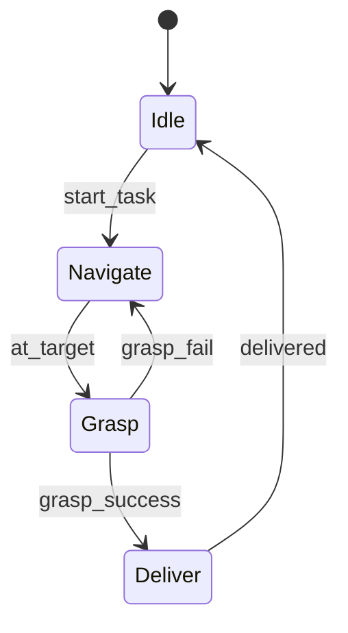
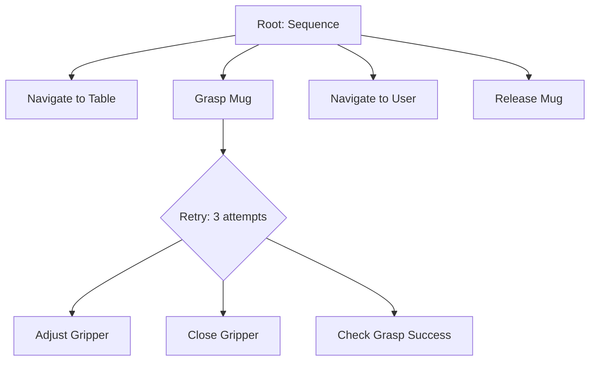
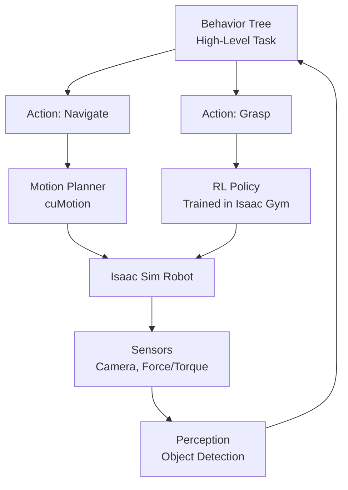

# Chapter 21: Isaac Cortex for Behavior Trees

## Learning Objectives

By the end of this chapter, you will be able to:

1. **Understand** behavior trees as a hierarchical task representation for robot AI
2. **Differentiate** between behavior trees, finite state machines, and reinforcement learning
3. **Design** behavior trees for robot tasks (navigation, manipulation, multi-step workflows)
4. **Implement** Isaac Cortex behavior trees in Python for Isaac Sim robots
5. **Combine** learned skills (RL policies) with scripted behaviors (planners, perception)
6. **Debug** behavior tree execution with visualization tools

---

## Introduction: From Skills to Tasks

You've trained low-level skills (walking, grasping) with RL in previous chapters. But real-world robotics requires **high-level decision-making**:
- "Navigate to table, grasp mug, deliver to user"
- "If path is blocked, find alternative route"
- "If grasp fails, retry with adjusted approach"

**The Challenge**: How to compose skills into robust task execution?

**Approaches**:
1. **Finite State Machines (FSM)**: Simple but brittle (hard to add new states)
2. **Hierarchical RL**: Learns task structure, but sample-inefficient
3. **Behavior Trees (BT)**: Modular, reusable, human-readable ✅

**Isaac Cortex** is NVIDIA's behavior tree framework for robotics, integrated with Isaac Sim.

---

## Behavior Trees vs Finite State Machines

### Finite State Machine (FSM)



**Problems**:
- ❌ **Spaghetti transitions**: Adding new states requires updating many transitions
- ❌ **Not reusable**: Hard to extract "Navigate" for use in other tasks
- ❌ **No hierarchy**: Flat structure becomes unmanageable

### Behavior Tree (BT)



**Advantages**:
- ✅ **Modular**: "Grasp Mug" subtree can be reused in other tasks
- ✅ **Hierarchical**: Decompose complex tasks into simple primitives
- ✅ **Reactive**: Re-evaluates tree every tick (adapts to environment changes)

---

## Behavior Tree Fundamentals

### Node Types

**1. Action Nodes** (Leaves)
- Execute behaviors: `MoveToPosition()`, `CloseGripper()`, `DetectObject()`
- Return: `SUCCESS`, `FAILURE`, or `RUNNING`

**2. Condition Nodes** (Leaves)
- Check state: `IsGrasped()`, `IsPathClear()`, `BatteryLow()`
- Return: `SUCCESS` or `FAILURE` (never `RUNNING`)

**3. Composite Nodes** (Internal)
- **Sequence** (`→`): Execute children left-to-right until one fails
- **Selector** (`?`): Execute children until one succeeds (OR logic)
- **Parallel** (`⇉`): Execute all children simultaneously

**4. Decorator Nodes**
- Modify child behavior: `Repeat(N)`, `Inverter()`, `Retry()`, `UntilFail()`

### Execution Example

```
Sequence:
  ├─ Navigate("table") → RUNNING... SUCCESS
  ├─ Grasp("mug")      → RUNNING... FAILURE
  └─ (sequence halts, returns FAILURE)
```

Next tick:
```
Selector (Retry):
  ├─ Grasp("mug")      → RUNNING... SUCCESS
  └─ (selector succeeds, continues)
```

---

## Isaac Cortex Architecture

Isaac Cortex integrates behavior trees with:
- **Isaac Sim**: Simulated robots and sensors
- **ROS 2**: Real robot integration
- **Motion Planning**: MoveIt, cuMotion (NVIDIA)
- **Perception**: Object detection, segmentation



---

## Example: Pick-and-Place Behavior Tree

### Task: "Pick mug from table, place in bin"

```python title="pick_and_place_bt.py"
from omni.isaac.cortex.df import DfLogicalState, DfStateMachine, DfDecider
from omni.isaac.cortex.dfb import DfBehavior, make_decorator_node

# Define behaviors (actions)
class NavigateToTarget(DfBehavior):
    def __init__(self, target_name):
        super().__init__()
        self.target_name = target_name

    def tick(self):
        if self.robot.distance_to(self.target_name) < 0.1:
            return DfBehavior.SUCCESS
        else:
            self.robot.move_towards(self.target_name)
            return DfBehavior.RUNNING

class GraspObject(DfBehavior):
    def tick(self):
        if self.robot.gripper_has_object():
            return DfBehavior.SUCCESS
        else:
            self.robot.close_gripper()
            return DfBehavior.RUNNING

class ReleaseObject(DfBehavior):
    def tick(self):
        self.robot.open_gripper()
        return DfBehavior.SUCCESS

# Build behavior tree
def build_pick_place_tree():
    return DfDecider(
        children=[
            NavigateToTarget("table"),
            GraspObject(),
            NavigateToTarget("bin"),
            ReleaseObject()
        ],
        decider_type="sequence"  # Execute in order
    )

# Execute
bt = build_pick_place_tree()
while bt.tick() == DfBehavior.RUNNING:
    time.sleep(0.1)

print("Task completed!" if bt.status == DfBehavior.SUCCESS else "Task failed!")
```

---

## Handling Failures with Selectors

### Retry Logic

```python
# Retry grasp up to 3 times before failing
grasp_with_retry = make_decorator_node(
    "retry",
    child=GraspObject(),
    num_retries=3
)

# Fallback: Try primary grasp, if fails, use two-handed grasp
grasp_selector = DfDecider(
    children=[
        GraspObject(gripper="right"),
        TwoHandedGrasp()  # Fallback
    ],
    decider_type="selector"
)
```

---

## Combining RL Policies with Behavior Trees

### Learned Skill as BT Node

```python
class RLWalkingBehavior(DfBehavior):
    def __init__(self, policy_path):
        super().__init__()
        self.policy = torch.load(policy_path)
        self.policy.eval()

    def tick(self):
        obs = self.robot.get_observation()
        with torch.no_grad():
            actions = self.policy(obs)
        self.robot.apply_actions(actions)

        if self.robot.reached_goal():
            return DfBehavior.SUCCESS
        else:
            return DfBehavior.RUNNING

# Use in tree
tree = DfDecider(
    children=[
        RLWalkingBehavior("humanoid_walk.pth"),
        GraspObject(),
        RLWalkingBehavior("humanoid_walk.pth")  # Walk back
    ],
    decider_type="sequence"
)
```

---

## Lab 3.7: Implement Multi-Task Robot Behavior Tree

### Objective
Create a behavior tree for a robot that patrols, detects objects, and reports findings.

### Task: Security Patrol

**Workflow**:
1. Navigate to waypoint 1
2. Scan for objects
3. If object detected → Report location, else → Continue
4. Navigate to waypoint 2
5. Repeat

### Implementation

```python title="security_patrol.py"
from omni.isaac.cortex.df import DfBehavior, DfDecider

class NavigateToWaypoint(DfBehavior):
    def __init__(self, waypoint_id):
        super().__init__()
        self.waypoint = waypoint_id

    def tick(self):
        # Simplified: assume navigation completes after 5 ticks
        if self.ticks_elapsed >= 5:
            return DfBehavior.SUCCESS
        self.ticks_elapsed += 1
        return DfBehavior.RUNNING

class ScanForObjects(DfBehavior):
    def tick(self):
        # Simulate object detection
        import random
        self.detected = random.choice([True, False])
        return DfBehavior.SUCCESS

class ReportObject(DfBehavior):
    def tick(self):
        print("ALERT: Object detected at current position!")
        return DfBehavior.SUCCESS

# Build patrol tree
patrol_sequence = DfDecider(
    children=[
        NavigateToWaypoint(1),
        ScanForObjects(),
        DfDecider(  # Conditional: if detected, report
            children=[
                lambda: DfBehavior.SUCCESS if ScanForObjects().detected else DfBehavior.FAILURE,
                ReportObject()
            ],
            decider_type="sequence"
        ),
        NavigateToWaypoint(2),
        # Loop back (wrap in Repeat decorator)
    ],
    decider_type="sequence"
)

# Run simulation
for i in range(10):
    status = patrol_sequence.tick()
    print(f"Tick {i}: {status}")
```

### Validation Checklist

- [ ] Robot navigates between waypoints sequentially
- [ ] Object detection triggers report behavior
- [ ] Tree completes full patrol loop
- [ ] Adding new waypoints only requires extending children list

---

## Visualization and Debugging

Isaac Cortex provides tools to visualize tree execution:

```python
from omni.isaac.cortex.tools import visualize_tree

visualize_tree(patrol_sequence, output="patrol_tree.png")
```

**Output**: Graphical representation showing:
- Green nodes: SUCCESS
- Red nodes: FAILURE
- Yellow nodes: RUNNING

---

## Best Practices

### 1. Keep Actions Small and Reusable

❌ Bad:
```python
class NavigateGraspAndReturn(DfBehavior):
    # Monolithic action - hard to reuse
```

✅ Good:
```python
tree = Sequence([Navigate(), Grasp(), Navigate()])
```

### 2. Use Conditions to Check State, Not Actions

❌ Bad:
```python
class GraspAndCheck(DfBehavior):
    # Mixes action and condition
```

✅ Good:
```python
Sequence([Grasp(), Condition("IsGrasped")])
```

### 3. Design for Failure

Always include:
- Retry logic for flaky actions (perception, grasping)
- Fallback behaviors (alternative paths)
- Timeout conditions (prevent infinite loops)

---

## Summary

In this chapter, you learned:

- ✅ **Behavior trees** provide hierarchical, modular task planning for robots
- ✅ **Node types**: Actions, Conditions, Sequence, Selector, Decorators
- ✅ **Isaac Cortex** integrates BTs with Isaac Sim, ROS 2, and RL policies
- ✅ Combine **learned skills** (RL policies) with **scripted logic** (planners)
- ✅ Handle **failures** gracefully with retries, fallbacks, timeouts
- ✅ **Visualize and debug** trees with Isaac Cortex tools

**Next Chapter**: Deploying trained Isaac models to real robots with ROS 2 integration.

---

## Quiz 3.7: Behavior Trees

1. **What is the key advantage of behavior trees over finite state machines?**
   - a) Faster execution
   - b) Modularity and reusability
   - c) Lower memory usage
   - d) Better graphics

2. **What does a Sequence node do?**
   - a) Executes children in random order
   - b) Executes children left-to-right until one fails
   - c) Executes only the first child
   - d) Executes all children in parallel

3. **What status can an Action node return?**
   - a) Only SUCCESS or FAILURE
   - b) SUCCESS, FAILURE, or RUNNING
   - c) TRUE or FALSE
   - d) 0 or 1

4. **How can you integrate an RL policy into a behavior tree?**
   - a) Replace the entire tree with the policy
   - b) Create an Action node that calls the policy for inference
   - c) It's not possible
   - d) Use only Condition nodes

<details>
<summary>**Show Answers**</summary>

1. **b)** Modularity and reusability (subtrees can be reused in different tasks)
2. **b)** Executes children left-to-right until one fails (then returns FAILURE)
3. **b)** SUCCESS, FAILURE, or RUNNING (indicates ongoing execution)
4. **b)** Create an Action node that calls the policy for inference at each tick

</details>

---

**Next**: [Chapter 22: Deploying Isaac Models to Real Robots](/docs/module-3-isaac/week-11/chapter-22-isaac-deployment)
