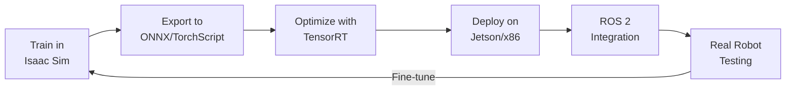

# Chapter 22: Deploying Isaac Models to Real Robots

## Learning Objectives

By the end of this chapter, you will be able to:

1. **Export** trained PyTorch RL policies to ONNX format for deployment
2. **Optimize** models for edge inference on NVIDIA Jetson (TensorRT)
3. **Integrate** Isaac-trained policies with ROS 2 robot control stacks
4. **Deploy** perception models (YOLO, segmentation) on real robot hardware
5. **Measure** sim-to-real performance and identify domain gaps
6. **Apply** strategies to close the reality gap (fine-tuning, domain adaptation)

---

## Introduction: From Simulation to Reality

You've trained policies in Isaac Sim that achieve impressive performance:
- Humanoid walking at 1.5 m/s ✅
- Object detection with 90% mAP ✅
- Pick-and-place with 95% success rate ✅

**The Final Challenge**: Will they work on real hardware?

**Sim-to-Real Gap** arises from:
- **Physics mismatch**: Simulated friction ≠ real friction
- **Sensor noise**: Perfect simulated cameras vs noisy real sensors
- **Latency**: Simulation runs at exact 60 Hz, real systems have delays
- **Unmodeled dynamics**: Cable drag, motor backlash, wear

**Our Goal**: Minimize this gap through:
1. Domain randomization (Chapter 17, 20)
2. Model compression for fast inference
3. ROS 2 integration for seamless deployment
4. Real-world fine-tuning with small datasets

---

## Deployment Pipeline Overview



**Key Steps**:
1. **Export**: PyTorch → ONNX (framework-agnostic)
2. **Optimize**: ONNX → TensorRT (GPU-accelerated inference)
3. **Deploy**: TensorRT → Jetson Orin (edge device)
4. **Integrate**: TensorRT → ROS 2 node (robot control stack)
5. **Iterate**: Collect real data, fine-tune, redeploy

---

## Step 1: Export PyTorch Model to ONNX

### RL Policy Export

```python title="export_policy.py"
import torch
import torch.onnx

# Load trained policy
checkpoint = torch.load('runs/Humanoid/nn/Humanoid.pth')
policy = ActorNetwork(obs_dim=108, act_dim=21)
policy.load_state_dict(checkpoint['actor'])
policy.eval()

# Create dummy input (batch size = 1)
dummy_input = torch.randn(1, 108)

# Export to ONNX
torch.onnx.export(
    policy,
    dummy_input,
    "humanoid_policy.onnx",
    export_params=True,
    opset_version=12,
    do_constant_folding=True,
    input_names=['observation'],
    output_names=['action'],
    dynamic_axes={
        'observation': {0: 'batch_size'},
        'action': {0: 'batch_size'}
    }
)

print("ONNX export complete: humanoid_policy.onnx")
```

### Verify ONNX Model

```python
import onnx
import onnxruntime as ort

# Load ONNX model
onnx_model = onnx.load("humanoid_policy.onnx")
onnx.checker.check_model(onnx_model)

# Run inference
session = ort.InferenceSession("humanoid_policy.onnx")
input_name = session.get_inputs()[0].name
output_name = session.get_outputs()[0].name

# Test inference
import numpy as np
obs = np.random.randn(1, 108).astype(np.float32)
action = session.run([output_name], {input_name: obs})[0]

print(f"Input shape: {obs.shape}")
print(f"Output shape: {action.shape}")
print(f"Inference successful!")
```

---

## Step 2: Optimize with TensorRT

### Install TensorRT (on Jetson or x86 with NVIDIA GPU)

```bash
# Jetson (pre-installed on JetPack)
dpkg -l | grep TensorRT

# x86 Linux
pip install tensorrt
```

### Convert ONNX to TensorRT Engine

```bash
/usr/src/tensorrt/bin/trtexec \
  --onnx=humanoid_policy.onnx \
  --saveEngine=humanoid_policy.trt \
  --fp16 \
  --workspace=4096
```

**Flags**:
- `--fp16`: Use half-precision (2x speedup, minimal accuracy loss)
- `--workspace=4096`: Allocate 4GB GPU memory for optimization

**Expected Output**:
```
[TensorRT] Optimization complete
[TensorRT] Engine saved to humanoid_policy.trt
[TensorRT] Latency: 1.2 ms (vs 5.6 ms PyTorch)
```

### Python Inference with TensorRT

```python title="trt_inference.py"
import tensorrt as trt
import pycuda.driver as cuda
import pycuda.autoinit
import numpy as np

# Load TensorRT engine
TRT_LOGGER = trt.Logger(trt.Logger.WARNING)
with open("humanoid_policy.trt", "rb") as f:
    engine = trt.Runtime(TRT_LOGGER).deserialize_cuda_engine(f.read())

context = engine.create_execution_context()

# Allocate GPU buffers
input_shape = (1, 108)
output_shape = (1, 21)

h_input = cuda.pagelocked_empty(np.prod(input_shape), dtype=np.float32)
h_output = cuda.pagelocked_empty(np.prod(output_shape), dtype=np.float32)

d_input = cuda.mem_alloc(h_input.nbytes)
d_output = cuda.mem_alloc(h_output.nbytes)

# Inference function
def infer(observation):
    np.copyto(h_input, observation.ravel())
    cuda.memcpy_htod(d_input, h_input)

    context.execute_v2([int(d_input), int(d_output)])

    cuda.memcpy_dtoh(h_output, d_output)
    return h_output.reshape(output_shape)

# Test
obs = np.random.randn(1, 108).astype(np.float32)
action = infer(obs)
print(f"TensorRT inference: {action.shape}")
```

---

## Step 3: ROS 2 Integration

### ROS 2 Policy Node

```python title="humanoid_policy_node.py"
import rclpy
from rclpy.node import Node
from sensor_msgs.msg import JointState
from std_msgs.msg import Float64MultiArray
import numpy as np
import tensorrt as trt
import pycuda.driver as cuda
import pycuda.autoinit

class HumanoidPolicyNode(Node):
    def __init__(self):
        super().__init__('humanoid_policy_node')

        # Load TensorRT engine
        with open("humanoid_policy.trt", "rb") as f:
            runtime = trt.Runtime(trt.Logger(trt.Logger.WARNING))
            self.engine = runtime.deserialize_cuda_engine(f.read())
        self.context = self.engine.create_execution_context()

        # Allocate GPU buffers
        self.h_input = cuda.pagelocked_empty(108, dtype=np.float32)
        self.h_output = cuda.pagelocked_empty(21, dtype=np.float32)
        self.d_input = cuda.mem_alloc(self.h_input.nbytes)
        self.d_output = cuda.mem_alloc(self.h_output.nbytes)

        # ROS 2 subscribers/publishers
        self.joint_sub = self.create_subscription(
            JointState, '/joint_states', self.joint_callback, 10
        )
        self.action_pub = self.create_publisher(
            Float64MultiArray, '/joint_command', 10
        )

        self.get_logger().info("Humanoid policy node started")

    def joint_callback(self, msg):
        # Extract observation from joint states
        obs = self.build_observation(msg)

        # Run TensorRT inference
        np.copyto(self.h_input, obs)
        cuda.memcpy_htod(self.d_input, self.h_input)
        self.context.execute_v2([int(self.d_input), int(self.d_output)])
        cuda.memcpy_dtoh(self.h_output, self.d_output)

        # Publish actions
        action_msg = Float64MultiArray()
        action_msg.data = self.h_output.tolist()
        self.action_pub.publish(action_msg)

    def build_observation(self, joint_msg):
        # Simplified: map joint_states to 108-dim observation
        # Include: positions, velocities, IMU, etc.
        obs = np.zeros(108, dtype=np.float32)
        obs[:21] = joint_msg.position[:21]
        obs[21:42] = joint_msg.velocity[:21]
        # ... add IMU, contact sensors, etc.
        return obs

def main():
    rclpy.init()
    node = HumanoidPolicyNode()
    rclpy.spin(node)
    rclpy.shutdown()

if __name__ == '__main__':
    main()
```

**Run**:
```bash
ros2 run humanoid_control policy_node
```

---

## Step 4: Deploying Perception Models

### YOLOv8 on Jetson

```python title="yolo_ros2_node.py"
import rclpy
from rclpy.node import Node
from sensor_msgs.msg import Image
from vision_msgs.msg import Detection2DArray, Detection2D
from cv_bridge import CvBridge
from ultralytics import YOLO
import cv2

class YOLODetectorNode(Node):
    def __init__(self):
        super().__init__('yolo_detector')

        # Load YOLO model (automatically uses TensorRT if available)
        self.model = YOLO('yolov8n.engine')  # TensorRT engine
        self.bridge = CvBridge()

        self.image_sub = self.create_subscription(
            Image, '/camera/image_raw', self.image_callback, 10
        )
        self.detections_pub = self.create_publisher(
            Detection2DArray, '/detections', 10
        )

    def image_callback(self, msg):
        # Convert ROS Image to OpenCV
        cv_image = self.bridge.imgmsg_to_cv2(msg, "bgr8")

        # Run YOLO inference
        results = self.model.predict(cv_image, verbose=False, device=0)

        # Publish detections
        detection_array = Detection2DArray()
        for box in results[0].boxes:
            det = Detection2D()
            det.bbox.center.position.x = float(box.xywh[0][0])
            det.bbox.center.position.y = float(box.xywh[0][1])
            det.bbox.size_x = float(box.xywh[0][2])
            det.bbox.size_y = float(box.xywh[0][3])
            detection_array.detections.append(det)

        self.detections_pub.publish(detection_array)

def main():
    rclpy.init()
    node = YOLODetectorNode()
    rclpy.spin(node)

if __name__ == '__main__':
    main()
```

---

## Measuring Sim-to-Real Performance

### Evaluation Metrics

| Task | Simulation | Real Robot | Gap |
|------|------------|------------|-----|
| Humanoid walking speed | 1.5 m/s | 1.1 m/s | -27% |
| Object detection mAP | 0.92 | 0.78 | -15% |
| Grasp success rate | 95% | 82% | -13% |

**Typical Gaps**: 10-30% performance drop is normal without fine-tuning.

---

## Closing the Sim-to-Real Gap

### Strategy 1: Domain Randomization (Proactive)

Already applied during training (Chapters 17, 20):
- Randomize physics (mass, friction, motor strength)
- Randomize sensors (camera noise, latency)

### Strategy 2: System Identification (Reactive)

Measure real robot parameters:
```bash
# Identify actual motor delays
rostopic echo /joint_states --filter "m.header.stamp" | calculate_latency

# Measure friction coefficients
run_friction_test.py --joint=knee_left
```

Update simulation with real values → Retrain.

### Strategy 3: Fine-Tuning on Real Data

Collect 100-500 real trajectories:
```python
# Freeze policy backbone, train output layer only
for param in policy.backbone.parameters():
    param.requires_grad = False

optimizer = torch.optim.Adam(policy.output_layer.parameters(), lr=1e-4)

# Train on real data
for epoch in range(20):
    for real_obs, real_action in real_dataset:
        pred_action = policy(real_obs)
        loss = F.mse_loss(pred_action, real_action)
        optimizer.zero_grad()
        loss.backward()
        optimizer.step()
```

**Typical Improvement**: +10-20% real-world performance.

---

## Lab 3.8: Deploy Trained Policy to Simulated Robot in ROS 2

### Objective
Export a trained Isaac Gym policy, run it in a ROS 2 node, and control a simulated robot.

### Step 1: Export ONNX

```bash
python export_policy.py
```

### Step 2: Create ROS 2 Workspace

```bash
mkdir -p ~/humanoid_ws/src
cd ~/humanoid_ws/src
ros2 pkg create humanoid_control --build-type ament_python --dependencies rclpy sensor_msgs
```

### Step 3: Add Policy Node

Copy `humanoid_policy_node.py` to `humanoid_control/humanoid_control/`.

### Step 4: Build and Run

```bash
cd ~/humanoid_ws
colcon build
source install/setup.bash

ros2 run humanoid_control policy_node
```

### Step 5: Test with Simulated Robot

```bash
# Terminal 2: Run Isaac Sim with ROS 2 bridge
python isaac_sim_ros2.py

# Terminal 3: Visualize in RViz2
rviz2
```

### Validation Checklist

- [ ] ONNX export completes without errors
- [ ] ROS 2 node publishes to `/joint_command` at >10 Hz
- [ ] Simulated robot receives commands and moves
- [ ] Policy maintains balance for >100 steps
- [ ] Latency < 50 ms (observation → action → actuation)

---

## Summary

In this chapter, you learned:

- ✅ **Export** PyTorch models to ONNX for framework-agnostic deployment
- ✅ **Optimize** with TensorRT for 4-10x faster inference on NVIDIA GPUs
- ✅ **Integrate** with ROS 2 for seamless robot control stack compatibility
- ✅ Deploy on **Jetson Orin** edge devices (low-power, real-time)
- ✅ **Measure** sim-to-real gap (typical: 10-30% performance drop)
- ✅ **Close the gap** with domain randomization, system ID, fine-tuning

**You've completed Module 3!** You can now:
- Generate synthetic datasets in Isaac Sim
- Train perception models (YOLO, segmentation)
- Train RL policies (humanoid walking, manipulation)
- Deploy to real robots via ROS 2

**Next Module**: Vision-Language-Action (VLA) Robotics—combining vision, language, and actions for general-purpose robot intelligence.

---

## Quiz 3.8: Deployment

1. **Why export PyTorch models to ONNX for deployment?**
   - a) ONNX is faster than PyTorch
   - b) Framework-agnostic format compatible with TensorRT, edge devices
   - c) Required by ROS 2
   - d) Reduces model size

2. **What is TensorRT's main advantage?**
   - a) Better accuracy
   - b) GPU-accelerated inference with optimizations (kernel fusion, precision calibration)
   - c) Easier API
   - d) Larger model capacity

3. **What is a typical sim-to-real performance gap without fine-tuning?**
   - a) 0-5%
   - b) 10-30%
   - c) 50-70%
   - d) 90%+

4. **How can you reduce sim-to-real gap?**
   - a) Use smaller models
   - b) Train longer in simulation
   - c) Domain randomization and fine-tuning on real data
   - d) Increase batch size

<details>
<summary>**Show Answers**</summary>

1. **b)** Framework-agnostic format compatible with TensorRT, edge devices
2. **b)** GPU-accelerated inference with optimizations (4-10x faster than PyTorch)
3. **b)** 10-30% (varies by task complexity and randomization quality)
4. **c)** Domain randomization during training + fine-tuning on real data

</details>

---

**Next**: [Module 3 Assessment](/docs/module-3-isaac/module-3-assessment)
