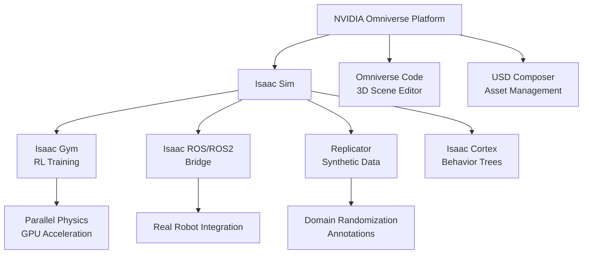
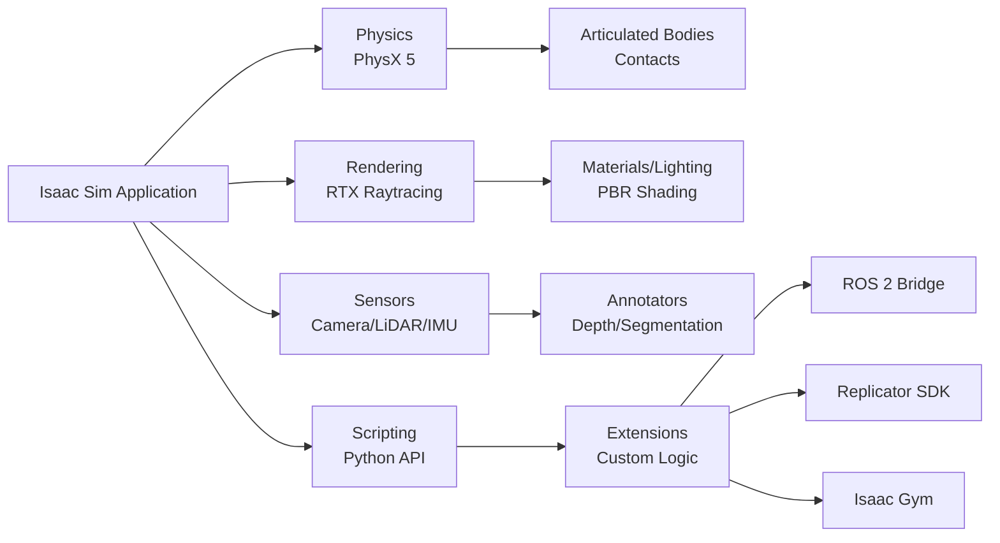
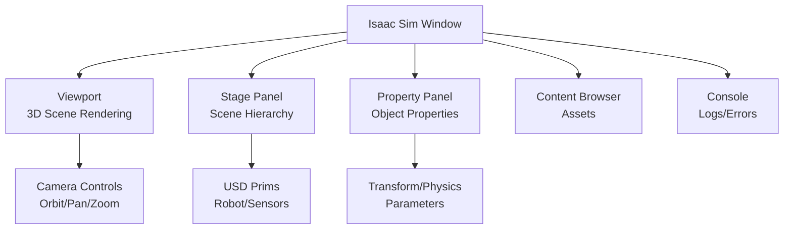

# Chapter 15: Introduction to NVIDIA Isaac Sim

## Learning Objectives

By the end of this chapter, you will be able to:

1. **Understand** the NVIDIA Omniverse ecosystem and Isaac Sim's role in robotics development
2. **Explain** the key features and advantages of Isaac Sim over traditional simulators
3. **Identify** hardware requirements and GPU specifications for running Isaac Sim
4. **Install** Isaac Sim 2023.1.1+ on Ubuntu 22.04 with proper NVIDIA drivers
5. **Navigate** the Isaac Sim interface and load default robot scenes
6. **Recognize** use cases for photorealistic simulation in robotics and AI training

---

## Introduction: The Evolution of Robot Simulation

Traditional robot simulators like Gazebo and V-REP have served the robotics community well for physics-based testing. However, modern robotics—especially **Physical AI** and **humanoid robots**—demands more:

- **Photorealistic rendering** for computer vision and perception training
- **Synthetic data generation** at scale for deep learning models
- **GPU-accelerated physics** for parallel simulation (thousands of robots simultaneously)
- **Real-time ray tracing** for accurate lighting and sensor simulation
- **Integration with AI frameworks** (PyTorch, TensorFlow) and reinforcement learning

Enter **NVIDIA Isaac Sim**: a next-generation robotics simulator built on the **NVIDIA Omniverse** platform. Isaac Sim combines:
- **Physically accurate simulation** (PhysX 5 engine)
- **Photorealistic rendering** (RTX ray tracing)
- **Scalability** (GPU parallelization for thousands of environments)
- **Synthetic data pipelines** (domain randomization, annotation tools)
- **ROS 2 integration** (bidirectional communication with real robot stacks)

This chapter introduces Isaac Sim's architecture, ecosystem, and installation process.

---

## The NVIDIA Omniverse Ecosystem

### What is Omniverse?

**NVIDIA Omniverse** is a platform for building and operating 3D workflows and applications. Think of it as:
- A **collaboration platform** for 3D design (like Google Docs, but for 3D worlds)
- A **rendering engine** using real-time ray tracing (RTX GPUs)
- An **extensible framework** for building custom simulation tools

Omniverse uses **Universal Scene Description (USD)** as its core data format—an open standard from Pixar for 3D scene interchange.

### Isaac Sim within Omniverse

**Isaac Sim** is an Omniverse application specifically designed for robotics:



**Key Components**:
1. **Isaac Sim Core**: Main simulation environment with physics, rendering, sensors
2. **Isaac Gym**: RL training framework for massively parallel environments
3. **Isaac ROS/ROS2**: Bridges for integrating with ROS 2 robot software
4. **Replicator**: Synthetic data generation with domain randomization
5. **Isaac Cortex**: AI-powered behavior trees for task planning

---

## Why Isaac Sim for Physical AI and Humanoids?

### Advantages Over Traditional Simulators

| Feature | Gazebo Classic | Unity | Isaac Sim |
|---------|----------------|-------|-----------|
| **Physics Engine** | ODE, Bullet, DART | PhysX, Havok | PhysX 5 (GPU-accelerated) |
| **Rendering** | OGRE (basic) | Scriptable RP | RTX Ray Tracing |
| **Parallel Envs** | Manual (slow) | Manual scripting | Native (1000s on GPU) |
| **Synthetic Data** | Limited | Manual setup | Built-in Replicator |
| **ROS 2 Integration** | Native (gazebo_ros) | ROS-TCP-Connector | Native Isaac ROS 2 |
| **Vision AI** | Basic cameras | Good (HDRP/URP) | Photorealistic (RTX) |
| **GPU Requirement** | Optional | Moderate | **Required (RTX)** |

**Isaac Sim Strengths**:
- ✅ **Photorealism**: Train vision models on data indistinguishable from real images
- ✅ **Scale**: Simulate 1000+ robot environments in parallel for RL training
- ✅ **Accuracy**: PhysX 5 with contact-rich manipulation (grasping, assembly)
- ✅ **Sim-to-Real**: Minimize reality gap with accurate physics and rendering

**Trade-offs**:
- ⚠️ **Hardware Cost**: Requires NVIDIA RTX GPU (RTX 3060+ recommended, RTX 4090 ideal)
- ⚠️ **Learning Curve**: More complex than Gazebo due to Omniverse ecosystem
- ⚠️ **Ecosystem**: Smaller community compared to Gazebo (but growing fast)

### Use Cases for Humanoid Robotics

Isaac Sim excels in scenarios where **perception** and **contact-rich manipulation** are critical:

1. **Vision-Language-Action (VLA) Models**: Generate diverse synthetic images for training VLA policies (Module 4)
2. **Bipedal Locomotion**: Train walking/running gaits with GPU-accelerated RL (Isaac Gym)
3. **Manipulation Tasks**: Simulate grasping, assembly, and dexterous object handling
4. **Human-Robot Interaction**: Test safety behaviors with virtual humans in scenes
5. **Sim-to-Real Transfer**: Validate policies before deploying to expensive humanoid hardware

---

## Isaac Sim Architecture

### Core Systems



**Physics Layer (PhysX 5)**:
- Rigid body dynamics, articulated robots (joints, motors)
- Contact simulation (friction, restitution)
- **GPU Tensor API**: Direct access to physics state on GPU (bypasses CPU bottleneck)

**Rendering Layer (RTX)**:
- Real-time ray tracing for global illumination
- Physically Based Rendering (PBR) materials
- Multi-camera setups (RGB, depth, segmentation, instance masks)

**Sensor Layer**:
- **Cameras**: RGB, depth, stereo, fisheye, instance/semantic segmentation
- **LiDAR**: Rotating and solid-state (configurable beams, range, noise)
- **IMU**: Accelerometer, gyroscope with noise models
- **Contact sensors**: Force-torque, tactile arrays

**Scripting Layer (Python)**:
- Full control via Python API (`omni.isaac.core`, `omni.isaac.kit`)
- Programmatic scene creation, robot spawning, trajectory execution
- Integration with PyTorch, NumPy for AI workflows

---

## Hardware Requirements

### Minimum Specifications

Isaac Sim is **GPU-intensive**. Here are NVIDIA's official requirements:

| Component | Minimum | Recommended | Optimal |
|-----------|---------|-------------|---------|
| **GPU** | RTX 2070 (8GB VRAM) | RTX 3080 (10GB+) | RTX 4090 (24GB) |
| **CPU** | Intel i7 / AMD Ryzen 7 | Intel i9 / AMD Ryzen 9 | Threadripper/Xeon |
| **RAM** | 32 GB | 64 GB | 128 GB+ |
| **Storage** | 50 GB SSD | 100 GB NVMe SSD | 500 GB NVMe |
| **OS** | Ubuntu 20.04/22.04 | Ubuntu 22.04 LTS | Ubuntu 22.04 LTS |

**GPU Notes**:
- **RTX required**: GTX cards (e.g., GTX 1080) lack ray tracing cores and are unsupported
- **VRAM critical**: Larger scenes (warehouses, outdoor environments) need 16GB+ VRAM
- **Multi-GPU**: Supported for scaling parallel RL environments (Isaac Gym)

**Cloud Options**:
If you lack local GPU hardware:
- **NVIDIA NGC**: Cloud instances with pre-configured Isaac Sim
- **AWS EC2 G5 instances**: RTX-equipped VMs (g5.xlarge or larger)
- **Google Cloud**: A2 instances with NVIDIA A100 GPUs

:::tip
For learning purposes, an **RTX 3060 Ti (8GB)** is sufficient for most tutorials and small-scale RL experiments. Production training benefits from RTX 4090 or A100.
:::

---

## Installation Guide

### Step 1: Install NVIDIA Drivers

Isaac Sim requires **proprietary NVIDIA drivers** (version 525+):

```bash
# Check current driver version
nvidia-smi

# If driver is missing or outdated:
sudo apt update
sudo apt install nvidia-driver-535  # or latest available

# Reboot to load driver
sudo reboot

# Verify after reboot
nvidia-smi
# Should show driver version 535.x and GPU name (e.g., RTX 4090)
```

### Step 2: Download Isaac Sim

**Option A: Omniverse Launcher (Recommended for Beginners)**

1. Download the **Omniverse Launcher**:
   - Visit: [https://www.nvidia.com/en-us/omniverse/download/](https://www.nvidia.com/en-us/omniverse/download/)
   - Download the `.AppImage` for Linux

2. Run the Launcher:
   ```bash
   chmod +x omniverse-launcher-linux.AppImage
   ./omniverse-launcher-linux.AppImage
   ```

3. Install Isaac Sim from the **Exchange** tab:
   - Search for "Isaac Sim"
   - Click "Install" (version 2023.1.1 or newer)
   - Installation directory: `~/.local/share/ov/pkg/isaac_sim-2023.1.1/`

**Option B: Direct Download (Advanced)**

For scripted installations or Docker:

```bash
# Download Isaac Sim standalone
wget https://developer.nvidia.com/isaac-sim/download -O isaac_sim.tar.gz

# Extract to /opt/nvidia/
sudo mkdir -p /opt/nvidia
sudo tar -xzf isaac_sim.tar.gz -C /opt/nvidia/

# Set environment variable
echo 'export ISAACSIM_PATH="/opt/nvidia/isaac_sim-2023.1.1"' >> ~/.bashrc
source ~/.bashrc
```

### Step 3: Verify Installation

Launch Isaac Sim:

```bash
# If using Omniverse Launcher, click "Launch" in the GUI
# Or from terminal:
~/.local/share/ov/pkg/isaac_sim-2023.1.1/isaac-sim.sh
```

**Expected Behavior**:
- Isaac Sim window opens (may take 1-2 minutes on first launch)
- You see the main viewport with a grid floor
- No error messages in the terminal

:::warning Common Issues
- **"No GPU detected"**: Ensure `nvidia-smi` works and driver is loaded
- **"VRAM insufficient"**: Close other GPU applications (Chrome, games)
- **Black screen**: Update to latest NVIDIA driver (535+)
:::

---

## Navigating the Isaac Sim Interface

### Main Interface Components



**Viewport (Center)**:
- Main 3D rendering area
- **Mouse Controls**:
  - **Left-click + drag**: Rotate camera (orbit)
  - **Middle-click + drag**: Pan camera
  - **Scroll wheel**: Zoom in/out
  - **Right-click**: Context menu

**Stage Panel (Left)**:
- Hierarchical tree of all objects (USD Prims)
- Example: `/World/Robot/base_link/camera_sensor`

**Property Panel (Right)**:
- Shows selected object's properties (position, physics, materials)

**Toolbar (Top)**:
- Play/Pause/Stop simulation buttons
- Physics step control

---

## Lab 3.1: Launch Isaac Sim and Explore Default Scenes

### Objective
Load a pre-built robot scene and interact with the Isaac Sim interface.

### Steps

**1. Launch Isaac Sim** (as shown in installation guide)

**2. Load a Sample Robot Scene**:
   - Menu Bar → **Isaac Examples** → **Simple Robot**
   - This loads a Franka Emika robot arm in an empty environment

**3. Explore the Scene**:
   - In the **Stage Panel** (left), expand `/World/Franka` to see:
     - `/Franka/panda_link0` ... `/panda_link7` (arm joints)
     - `/Franka/panda_hand` (gripper)
   - Click on `/Franka/panda_hand` and view its **Transform** properties in the Property Panel

**4. Run the Simulation**:
   - Click the **Play button** (▶) in the toolbar
   - The robot should remain still (no controllers active yet)
   - Physics is now running at 60 Hz

**5. Manually Move the Robot**:
   - **Stop** the simulation (■ button)
   - Select `/Franka/panda_joint1` in the Stage Panel
   - In the Property Panel, find **Angular Drive** → **Target Position**
   - Change from `0.0` to `1.57` (90 degrees in radians)
   - **Play** again—the joint should rotate!

**6. Add a Camera Sensor**:
   - Menu Bar → **Create** → **Camera**
   - A camera prim appears in the Stage Panel
   - Move it to view the robot (use Transform properties: Position X=2, Y=0, Z=1)
   - **Window** → **Viewport** → **Camera** → Select your camera
   - Now the viewport shows the robot from your camera's perspective!

### Validation Checklist

- [ ] Isaac Sim launches without errors
- [ ] Franka robot loads in the scene
- [ ] Simulation plays and physics is active
- [ ] You can manually adjust joint angles via Property Panel
- [ ] Custom camera renders the scene from a new viewpoint

---

## Key Differences from Gazebo and Unity

### Workflow Paradigm

**Gazebo**: XML/URDF-centric
```xml
<!-- Define robot in URDF/SDF -->
<robot name="my_robot">
  <link name="base_link">...</link>
</robot>
```

**Unity**: GameObject-centric (C# scripts)
```csharp
// Instantiate robot prefab
GameObject robot = Instantiate(robotPrefab);
```

**Isaac Sim**: USD-centric (Python scripting)
```python
from omni.isaac.core.utils.stage import add_reference_to_stage

# Load robot USD file
add_reference_to_stage(
    usd_path="/path/to/robot.usd",
    prim_path="/World/MyRobot"
)
```

### Data Format: USD (Universal Scene Description)

Unlike Gazebo's SDF or Unity's prefabs, Isaac Sim uses **USD**:
- **Standardized**: Adopted by Pixar, Apple, NVIDIA for 3D interchange
- **Layered**: Non-destructive edits via layers (like Photoshop layers)
- **Composable**: Reference other USD files (modular robot assemblies)
- **Scalable**: Efficiently handles massive scenes (warehouses with 1000s of objects)

**Example USD Hierarchy**:
```
/World
  /Ground_Plane
  /Warehouse
    /Shelves
    /Products
  /Robot_01
    /base_link
    /Camera
```

---

## Use Cases: When to Use Isaac Sim

### ✅ Ideal For:

1. **Training Vision Models**:
   - Photorealistic synthetic data for object detection, segmentation
   - Domain randomization (lighting, textures, object poses)

2. **Reinforcement Learning at Scale**:
   - Isaac Gym: 10,000+ parallel environments on a single GPU
   - Humanoid locomotion, manipulation policies

3. **Sim-to-Real Transfer**:
   - Accurate physics (PhysX 5) minimizes reality gap
   - Sensor noise models match real hardware

4. **Complex Manipulation**:
   - Contact-rich tasks (grasping, assembly, deformables)
   - Tactile sensors and force-torque simulation

### ❌ Avoid For:

1. **Lightweight Prototyping**: Gazebo is faster to set up for simple tests
2. **No GPU Available**: Isaac Sim requires RTX GPU (minimum)
3. **Pure 2D Robotics**: Overkill for mobile robot navigation (use Gazebo)

---

## Summary

In this chapter, you learned:

- ✅ **Isaac Sim** is a robotics simulator built on **NVIDIA Omniverse** with RTX rendering and PhysX 5 physics
- ✅ It excels at **photorealistic simulation**, **synthetic data generation**, and **GPU-accelerated RL training**
- ✅ Requires **RTX GPU** (RTX 3060+ recommended) and Ubuntu 22.04
- ✅ Installed via **Omniverse Launcher** or direct download
- ✅ Uses **USD** (Universal Scene Description) as the core data format
- ✅ Ideal for **humanoid robotics**, **VLA model training**, and **sim-to-real transfer**

**Next Chapter**: We'll integrate Isaac Sim with ROS 2 using the **Isaac ROS 2 Bridge**, enabling you to control simulated robots with real ROS 2 nodes.

---

## Quiz 3.1: Isaac Sim Fundamentals

Test your understanding:

1. **What is the main advantage of Isaac Sim over Gazebo Classic for vision-based AI?**
   - a) Faster physics simulation
   - b) Photorealistic RTX rendering for training perception models
   - c) Better ROS 1 integration
   - d) Lower hardware requirements

2. **Which physics engine powers Isaac Sim?**
   - a) ODE
   - b) Bullet
   - c) PhysX 5
   - d) Havok

3. **What is the minimum GPU requirement for Isaac Sim?**
   - a) GTX 1080
   - b) RTX 2070
   - c) RTX 4090
   - d) Integrated GPU

4. **What file format does Isaac Sim use for 3D scenes?**
   - a) URDF
   - b) SDF
   - c) USD (Universal Scene Description)
   - d) FBX

5. **Which Isaac Sim component enables massively parallel RL training?**
   - a) Isaac ROS 2
   - b) Isaac Gym
   - c) Isaac Cortex
   - d) Replicator

<details>
<summary>**Show Answers**</summary>

1. **b)** Photorealistic RTX rendering (enables training on near-realistic images)
2. **c)** PhysX 5 (NVIDIA's GPU-accelerated physics engine)
3. **b)** RTX 2070 (minimum 8GB VRAM; RTX 3080+ recommended)
4. **c)** USD (Pixar's open standard for 3D scene interchange)
5. **b)** Isaac Gym (runs 1000s of parallel environments on GPU)

</details>

---

## Further Reading

- [NVIDIA Isaac Sim Documentation](https://docs.omniverse.nvidia.com/isaacsim/latest/index.html)
- [Omniverse USD Documentation](https://docs.omniverse.nvidia.com/prod_usd/prod_usd.html)
- [PhysX 5 SDK](https://nvidia-omniverse.github.io/PhysX/physx/5.1.3/index.html)
- [Isaac Sim Tutorials (NVIDIA)](https://docs.omniverse.nvidia.com/isaacsim/latest/tutorials.html)

---

**Next**: [Chapter 16: Isaac Sim-ROS 2 Bridge](/docs/module-3-isaac/week-8/chapter-16-isaac-ros-bridge)
