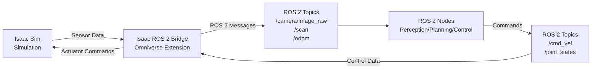
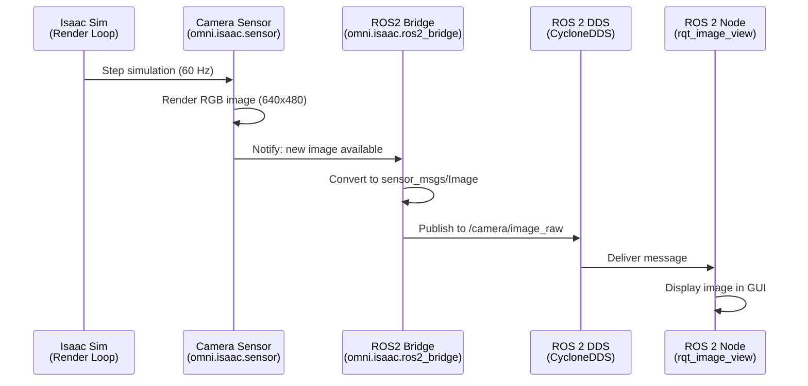

# Chapter 16: Isaac Sim-ROS 2 Bridge

## Learning Objectives

By the end of this chapter, you will be able to:

1. **Understand** the architecture of the Isaac Sim-ROS 2 Bridge and its role in robot development
2. **Enable** the ROS 2 Bridge extension in Isaac Sim using Python scripts
3. **Publish** sensor data (camera images, LiDAR scans, IMU) from Isaac Sim to ROS 2 topics
4. **Subscribe** to ROS 2 topics in Isaac Sim to control simulated robots
5. **Configure** ROS 2 Quality of Service (QoS) settings for reliable communication
6. **Integrate** Isaac Sim into existing ROS 2 robot workflows seamlessly

---

## Introduction: Bridging Simulation and Reality

In the previous chapter, you learned to navigate Isaac Sim and load robot scenes. But to truly integrate with your robotics workflow, you need **bidirectional communication** between Isaac Sim and ROS 2:

- **Simulation → ROS 2**: Stream sensor data (cameras, LiDAR, odometry) to ROS 2 topics
- **ROS 2 → Simulation**: Send control commands (velocity, joint positions) to the simulated robot

This enables a powerful workflow:
1. **Develop** perception and control algorithms in ROS 2 (just like for real robots)
2. **Test** them in Isaac Sim with photorealistic sensors
3. **Deploy** the same ROS 2 code to physical hardware (sim-to-real transfer)

The **Isaac ROS 2 Bridge** makes this seamless by:
- Automatically publishing sensor data to ROS 2 topics
- Subscribing to control topics to actuate joints/motors
- Handling message conversions (Isaac Sim ↔ ROS 2 message types)

---

## Architecture: How the Bridge Works

### High-Level Data Flow



**Key Components**:
1. **Isaac Sim Physics & Rendering**: Simulates robot and sensors in real-time
2. **Isaac ROS 2 Bridge Extension**: Omniverse plugin that handles ROS 2 communication
3. **ROS 2 DDS Middleware**: Underlying transport (CycloneDDS, FastDDS)
4. **Your ROS 2 Nodes**: Standard nodes you'd run on a real robot

### Under the Hood

The bridge operates as an **Omniverse Extension** written in Python:
- Uses the `rclpy` library (standard ROS 2 Python client)
- Runs inside Isaac Sim's Python interpreter
- Polls sensors every simulation step (typically 60 Hz) and publishes
- Subscribes to command topics and applies them to the simulated robot

**Important**: The bridge runs in Isaac Sim's process, not as a separate ROS 2 node. This means:
- ✅ Low latency (no inter-process communication overhead)
- ✅ Synchronized with simulation clock (perfect for deterministic testing)
- ⚠️ Requires Isaac Sim to be running for ROS 2 topics to exist

---

## Enabling the ROS 2 Bridge in Isaac Sim

### Method 1: Using the GUI (Quick Start)

1. **Launch Isaac Sim** (as shown in Chapter 15)

2. **Enable the Extension**:
   - Menu Bar → **Window** → **Extensions**
   - Search for "ROS2 Bridge"
   - Toggle **Enable** next to "omni.isaac.ros2_bridge"

3. **Verify Installation**:
   - Open a terminal and source ROS 2:
     ```bash
     source /opt/ros/humble/setup.bash
     ```
   - List available topics:
     ```bash
     ros2 topic list
     ```
   - You should see Isaac Sim's clock topic:
     ```
     /clock
     ```

### Method 2: Using Python Scripts (Automated)

For programmatic workflows, enable the bridge via Python:

```python title="enable_ros2_bridge.py"
from omni.isaac.kit import SimulationApp

# Launch Isaac Sim headless (no GUI)
simulation_app = SimulationApp({"headless": False})

import omni
from omni.isaac.core import SimulationContext
from omni.isaac.core.utils.extensions import enable_extension

# Enable ROS 2 Bridge extension
enable_extension("omni.isaac.ros2_bridge")

print("ROS 2 Bridge enabled successfully!")

# Keep simulation running
simulation_context = SimulationContext()
simulation_context.play()

# Simulation loop
while simulation_app.is_running():
    simulation_context.step(render=True)

simulation_app.close()
```

**Run the script**:
```bash
~/.local/share/ov/pkg/isaac_sim-2023.1.1/python.sh enable_ros2_bridge.py
```

:::tip
Isaac Sim includes its own Python interpreter with all necessary libraries. Always use `isaac_sim/python.sh` instead of system Python.
:::

---

## Publishing Sensor Data to ROS 2

### Example: Camera Image Publishing

Let's create a simulated camera and publish its RGB images to ROS 2.

```python title="camera_publisher.py"
from omni.isaac.kit import SimulationApp
simulation_app = SimulationApp({"headless": False})

from omni.isaac.core import SimulationContext
from omni.isaac.core.utils.stage import add_reference_to_stage
from omni.isaac.core.utils.extensions import enable_extension
from omni.isaac.sensor import Camera
import omni.replicator.core as rep

# Enable ROS 2 Bridge
enable_extension("omni.isaac.ros2_bridge")

# Create simulation context
sim_context = SimulationContext()

# Add ground plane
sim_context.add_default_ground_plane()

# Create a camera
camera = Camera(
    prim_path="/World/Camera",
    position=[2.0, 0.0, 1.5],
    orientation=[0.0, 0.0, 0.0, 1.0],  # quaternion (x, y, z, w)
    frequency=30,  # 30 Hz publishing rate
    resolution=(640, 480)
)

# Enable ROS 2 publishing for camera
from omni.isaac.ros2_bridge import ROS2CameraHelper
ros2_camera = ROS2CameraHelper(
    camera_prim_path="/World/Camera",
    topic_name="/camera/image_raw",
    frame_id="camera_link"
)

print("Camera created. Publishing to /camera/image_raw")

# Start simulation
sim_context.play()

# Simulation loop
while simulation_app.is_running():
    sim_context.step(render=True)

simulation_app.close()
```

**Verify in ROS 2**:
```bash
# Terminal 1: Run the Isaac Sim script
~/.local/share/ov/pkg/isaac_sim-2023.1.1/python.sh camera_publisher.py

# Terminal 2: View camera images
source /opt/ros/humble/setup.bash
ros2 run rqt_image_view rqt_image_view /camera/image_raw
```

You should see a live video feed from the simulated camera!

---

### Data Flow Diagram: Camera Publishing



---

## Subscribing to ROS 2 Topics in Isaac Sim

### Example: Velocity Control for a Mobile Robot

Now let's control a robot by subscribing to `/cmd_vel` (common for mobile robots).

```python title="velocity_subscriber.py"
from omni.isaac.kit import SimulationApp
simulation_app = SimulationApp({"headless": False})

from omni.isaac.core import SimulationContext
from omni.isaac.core.robots import Robot
from omni.isaac.wheeled_robots.robots import WheeledRobot
from omni.isaac.core.utils.extensions import enable_extension
from omni.isaac.core.utils.stage import add_reference_to_stage

# Enable ROS 2 Bridge
enable_extension("omni.isaac.ros2_bridge")

# Create simulation context
sim_context = SimulationContext()
sim_context.add_default_ground_plane()

# Load a differential drive robot (e.g., TurtleBot3)
robot_usd_path = "/Isaac/Robots/TurtleBot3/turtlebot3.usd"
add_reference_to_stage(usd_path=robot_usd_path, prim_path="/World/TurtleBot")

robot = WheeledRobot(prim_path="/World/TurtleBot", name="turtlebot")

# Enable ROS 2 velocity control
from omni.isaac.ros2_bridge import DifferentialBaseHelper
ros2_diff_drive = DifferentialBaseHelper(
    robot_prim_path="/World/TurtleBot",
    cmd_vel_topic="/cmd_vel"
)

print("Robot ready. Subscribe to /cmd_vel to move it!")

# Start simulation
sim_context.play()

# Simulation loop
while simulation_app.is_running():
    sim_context.step(render=True)

simulation_app.close()
```

**Test with ROS 2 teleop**:
```bash
# Terminal 1: Run Isaac Sim script
~/.local/share/ov/pkg/isaac_sim-2023.1.1/python.sh velocity_subscriber.py

# Terminal 2: Send velocity commands
source /opt/ros/humble/setup.bash
ros2 run teleop_twist_keyboard teleop_twist_keyboard --ros-args -r /cmd_vel:=/cmd_vel
```

Use keyboard (i/j/k/l) to drive the simulated robot!

---

## ROS 2 Message Types Supported

### Commonly Used Sensors and Their Topics

| Sensor Type | Isaac Sim Class | ROS 2 Message Type | Example Topic |
|-------------|-----------------|---------------------|---------------|
| **RGB Camera** | `Camera` | `sensor_msgs/Image` | `/camera/image_raw` |
| **Depth Camera** | `Camera` (depth mode) | `sensor_msgs/Image` | `/camera/depth` |
| **LiDAR** | `RotatingLidar` | `sensor_msgs/LaserScan` | `/scan` |
| **3D LiDAR** | `RotatingLidar` | `sensor_msgs/PointCloud2` | `/points` |
| **IMU** | `IMUSensor` | `sensor_msgs/Imu` | `/imu` |
| **Odometry** | `OdometryHelper` | `nav_msgs/Odometry` | `/odom` |
| **Joint States** | `JointStateHelper` | `sensor_msgs/JointState` | `/joint_states` |

### Control Inputs

| Control Type | ROS 2 Message Type | Example Topic | Use Case |
|--------------|---------------------|---------------|----------|
| **Velocity** | `geometry_msgs/Twist` | `/cmd_vel` | Mobile robots |
| **Joint Position** | `sensor_msgs/JointState` | `/joint_command` | Manipulators |
| **Effort** | `std_msgs/Float64MultiArray` | `/effort_command` | Torque control |

---

## Quality of Service (QoS) Configuration

ROS 2 uses **QoS policies** to control message delivery (reliability, latency). Isaac Sim allows customization:

### Default QoS: Best Effort (Low Latency)

```python
from omni.isaac.ros2_bridge import ROS2CameraHelper

ros2_camera = ROS2CameraHelper(
    camera_prim_path="/World/Camera",
    topic_name="/camera/image_raw",
    frame_id="camera_link",
    qos_profile="sensor_data"  # Best effort, volatile
)
```

**Sensor Data Profile**:
- **Reliability**: Best Effort (drops old messages if subscriber is slow)
- **Durability**: Volatile (no message history)
- **History Depth**: 1 (only latest message)

**Use When**: Real-time sensor streaming (camera, LiDAR) where latest data matters most

### Reliable QoS (For Critical Data)

```python
ros2_camera = ROS2CameraHelper(
    camera_prim_path="/World/Camera",
    topic_name="/camera/image_raw",
    frame_id="camera_link",
    qos_profile="system_default"  # Reliable, transient local
)
```

**System Default Profile**:
- **Reliability**: Reliable (retransmits lost messages)
- **Durability**: Transient Local (keeps last message for late subscribers)
- **History Depth**: 10

**Use When**: Control commands, state messages where data loss is unacceptable

:::warning QoS Mismatch
If Isaac Sim publishes with `sensor_data` (best effort) but your ROS 2 node subscribes with `system_default` (reliable), **no messages will be received**! Ensure QoS compatibility.
:::

---

## Lab 3.2: Stream Sensor Data from Isaac Sim to ROS 2

### Objective
Create a simulated robot with camera and LiDAR, publish sensor data to ROS 2, and visualize in RViz2.

### Prerequisites
- Isaac Sim installed (Chapter 15)
- ROS 2 Humble sourced: `source /opt/ros/humble/setup.bash`
- RViz2 installed: `sudo apt install ros-humble-rviz2`

### Step 1: Create the Simulation Scene

Create `lab_3_2_sensor_stream.py`:

```python
from omni.isaac.kit import SimulationApp
simulation_app = SimulationApp({"headless": False})

from omni.isaac.core import SimulationContext
from omni.isaac.core.utils.stage import add_reference_to_stage
from omni.isaac.core.utils.extensions import enable_extension
from omni.isaac.sensor import Camera, RotatingLidarPhysX

# Enable ROS 2 Bridge
enable_extension("omni.isaac.ros2_bridge")

# Create simulation
sim_context = SimulationContext()
sim_context.add_default_ground_plane()

# Add a simple environment (warehouse)
add_reference_to_stage(
    usd_path="/Isaac/Environments/Simple_Warehouse/warehouse.usd",
    prim_path="/World/Warehouse"
)

# Create RGB Camera
camera = Camera(
    prim_path="/World/Camera",
    position=[5.0, 0.0, 2.0],
    orientation=[0.0, 0.0, 0.0, 1.0],
    frequency=10,  # 10 Hz
    resolution=(848, 480)
)

# Create 2D LiDAR
from omni.isaac.range_sensor import _range_sensor
lidar = _range_sensor.acquire_lidar_sensor_interface()

# Enable ROS 2 publishing
from omni.isaac.ros2_bridge import ROS2CameraHelper, ROS2LaserScanHelper

ros2_camera = ROS2CameraHelper(
    camera_prim_path="/World/Camera",
    topic_name="/camera/rgb/image_raw",
    frame_id="camera_link"
)

# Note: LiDAR ROS 2 setup requires additional configuration
# See Isaac Sim documentation for RotatingLidarPhysX ROS 2 integration

print("Simulation ready!")
print("ROS 2 Topics:")
print("  - /camera/rgb/image_raw (sensor_msgs/Image)")
print("  - /clock (rosgraph_msgs/Clock)")

# Start simulation
sim_context.play()

while simulation_app.is_running():
    sim_context.step(render=True)

simulation_app.close()
```

### Step 2: Run the Simulation

```bash
~/.local/share/ov/pkg/isaac_sim-2023.1.1/python.sh lab_3_2_sensor_stream.py
```

### Step 3: Visualize in RViz2

```bash
# In a new terminal
source /opt/ros/humble/setup.bash
rviz2
```

**RViz2 Configuration**:
1. **Add** → **Image** → Topic: `/camera/rgb/image_raw`
2. **Add** → **LaserScan** → Topic: `/scan` (if LiDAR configured)
3. Set **Fixed Frame** to `world` or `camera_link`

### Validation Checklist

- [ ] Isaac Sim simulation runs without errors
- [ ] `ros2 topic list` shows `/camera/rgb/image_raw`
- [ ] `ros2 topic echo /camera/rgb/image_raw` shows image messages
- [ ] RViz2 displays live camera feed from simulation
- [ ] Camera view shows warehouse environment

---

## Troubleshooting Common Issues

### Issue 1: `ros2 topic list` Shows No Topics

**Cause**: ROS 2 Bridge extension not enabled or ROS 2 environment not sourced

**Solution**:
```bash
# Ensure ROS 2 is sourced
source /opt/ros/humble/setup.bash

# Verify environment variable
echo $ROS_DISTRO
# Should output: humble

# Check if Isaac Sim is publishing /clock
ros2 topic hz /clock
# Should show ~60 Hz if simulation is running
```

### Issue 2: Camera Images Not Appearing in RViz2

**Cause**: QoS mismatch or wrong topic name

**Solution**:
```bash
# Check if messages are publishing
ros2 topic hz /camera/rgb/image_raw

# Check message type
ros2 topic info /camera/rgb/image_raw
# Should show: Type: sensor_msgs/msg/Image

# In RViz2, set Image topic QoS to "Best Effort"
# (Display → Image → Topic → Reliability: Best Effort)
```

### Issue 3: Simulation Runs But No Data Published

**Cause**: Simulation paused or camera not initialized

**Solution**:
- Click **Play** button (▶) in Isaac Sim toolbar
- Verify camera exists in Stage Panel: `/World/Camera`
- Check Isaac Sim console for Python errors

---

## Advanced: Custom ROS 2 Publishers

For custom sensors or data, you can create publishers manually using `rclpy`:

```python
from omni.isaac.kit import SimulationApp
simulation_app = SimulationApp({"headless": False})

import rclpy
from rclpy.node import Node
from std_msgs.msg import String
from omni.isaac.core import SimulationContext

# Initialize ROS 2 (do this AFTER SimulationApp creation)
rclpy.init()

class CustomPublisher(Node):
    def __init__(self):
        super().__init__('isaac_custom_publisher')
        self.publisher = self.create_publisher(String, '/custom_topic', 10)
        self.timer = self.create_timer(1.0, self.publish_message)
        self.counter = 0

    def publish_message(self):
        msg = String()
        msg.data = f"Isaac Sim step {self.counter}"
        self.publisher.publish(msg)
        self.counter += 1

# Create ROS 2 node
node = CustomPublisher()

# Create simulation
sim_context = SimulationContext()
sim_context.play()

# Main loop: step simulation AND spin ROS 2
while simulation_app.is_running():
    sim_context.step(render=True)
    rclpy.spin_once(node, timeout_sec=0.0)  # Process ROS 2 callbacks

# Cleanup
node.destroy_node()
rclpy.shutdown()
simulation_app.close()
```

**Verify**:
```bash
ros2 topic echo /custom_topic
```

---

## Comparison: Isaac Sim vs Gazebo ROS 2 Integration

| Feature | Gazebo (gazebo_ros) | Isaac Sim ROS 2 Bridge |
|---------|---------------------|------------------------|
| **Setup Complexity** | Low (native ROS 2 package) | Medium (Omniverse extension) |
| **Message Types** | Full ROS 2 support | Subset (common sensors/actuators) |
| **Performance** | CPU-based (slower) | GPU-accelerated (faster) |
| **Photorealism** | Basic rendering | RTX ray tracing |
| **Custom Sensors** | Easy (C++ plugins) | Requires Python scripting |
| **Existing ROS 2 Code** | Works out-of-box | May need QoS tuning |

**When to Use Isaac Sim**:
- Need photorealistic images for vision AI
- Training RL policies (Isaac Gym integration)
- Large-scale parallel simulation

**When to Use Gazebo**:
- Pure ROS 2 workflow (no vision AI)
- Existing Gazebo URDF/SDF models
- No GPU available

---

## Summary

In this chapter, you learned:

- ✅ The **Isaac ROS 2 Bridge** enables bidirectional communication between Isaac Sim and ROS 2
- ✅ Enable the bridge via GUI (**Window → Extensions → ROS2 Bridge**) or Python (`enable_extension()`)
- ✅ **Publish** sensor data (camera, LiDAR, IMU, odometry) to ROS 2 topics automatically
- ✅ **Subscribe** to control topics (`/cmd_vel`, `/joint_command`) to actuate simulated robots
- ✅ **QoS settings** must match between publishers and subscribers (sensor_data vs system_default)
- ✅ Integrated with standard ROS 2 tools (RViz2, rqt, teleop)

**Next Chapter**: We'll explore **Synthetic Data Generation** using Isaac Sim's Replicator API to create massive annotated datasets for training perception models.

---

## Quiz 3.2: Isaac Sim-ROS 2 Bridge

1. **What is the primary purpose of the Isaac ROS 2 Bridge?**
   - a) Replace ROS 2 with a better middleware
   - b) Enable communication between Isaac Sim and ROS 2 nodes
   - c) Visualize robot models in Isaac Sim
   - d) Compile ROS 2 packages faster

2. **Which Python library does Isaac Sim use internally for ROS 2 communication?**
   - a) rospy (ROS 1)
   - b) rclpy (ROS 2)
   - c) pyros
   - d) zenoh

3. **What happens if Isaac Sim publishes with "sensor_data" QoS but your node subscribes with "system_default" QoS?**
   - a) Messages are delivered normally
   - b) Messages are delivered but delayed
   - c) No messages are received (QoS mismatch)
   - d) Isaac Sim crashes

4. **Which ROS 2 message type is used for RGB camera images?**
   - a) `sensor_msgs/CompressedImage`
   - b) `sensor_msgs/Image`
   - c) `std_msgs/UInt8MultiArray`
   - d) `vision_msgs/Image`

5. **True or False: You can control a simulated robot in Isaac Sim by publishing to `/cmd_vel` from any ROS 2 node.**
   - a) True
   - b) False

<details>
<summary>**Show Answers**</summary>

1. **b)** Enable communication between Isaac Sim and ROS 2 nodes (bidirectional bridge)
2. **b)** rclpy (standard ROS 2 Python client library)
3. **c)** No messages are received (QoS policies must be compatible)
4. **b)** `sensor_msgs/Image` (standard ROS 2 image message)
5. **a)** True (if `DifferentialBaseHelper` or similar is configured in Isaac Sim)

</details>

---

## Further Reading

- [Isaac Sim ROS 2 Bridge Documentation](https://docs.omniverse.nvidia.com/isaacsim/latest/ros2_tutorials.html)
- [ROS 2 QoS Policies Explained](https://docs.ros.org/en/humble/Concepts/About-Quality-of-Service-Settings.html)
- [Isaac Sim Python API Reference](https://docs.omniverse.nvidia.com/py/isaacsim/)

---

**Next**: [Chapter 17: Synthetic Data Generation for AI Training](/docs/module-3-isaac/week-9/chapter-17-synthetic-data)
