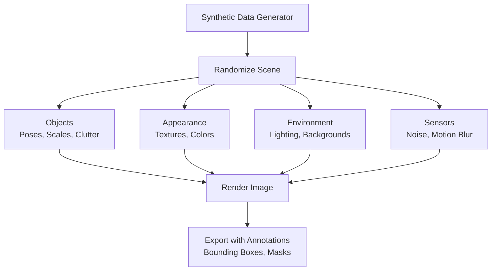

# Chapter 17: Synthetic Data Generation for AI Training

## Learning Objectives

By the end of this chapter, you will be able to:

1. **Understand** the role of synthetic data in modern AI/ML pipelines and its advantages over real-world data collection
2. **Apply** domain randomization techniques to improve model generalization
3. **Use** Isaac Sim's Replicator API to programmatically generate synthetic datasets
4. **Configure** camera sensors with automatic annotations (bounding boxes, segmentation, depth)
5. **Generate** diverse RGB-D datasets with randomized object poses, textures, and lighting
6. **Export** annotated datasets in standard formats (COCO, KITTI, custom JSON)

---

## Introduction: The Synthetic Data Revolution

Training robust perception models (object detection, segmentation, pose estimation) requires **massive labeled datasets**:
- **ImageNet**: 1.4 million images (manually annotated over years)
- **COCO**: 330k images with 1.5 million object instances
- **Autonomous driving datasets** (KITTI, Waymo): Terabytes of sensor data

**The Problem**: Real-world data collection is:
- ❌ **Expensive**: Cameras, sensors, storage, human annotators
- ❌ **Time-consuming**: Months to years to gather sufficient data
- ❌ **Dangerous**: Cannot safely collect failure cases (crashes, collisions)
- ❌ **Limited diversity**: Hard to capture rare scenarios (night, fog, unusual objects)

**The Solution: Synthetic Data**
- ✅ **Scalable**: Generate millions of images in hours (GPU-accelerated rendering)
- ✅ **Automatically labeled**: Perfect annotations (no human error)
- ✅ **Diverse**: Easily randomize objects, lighting, weather, rare events
- ✅ **Safe**: Simulate dangerous scenarios without risk

Isaac Sim's **Replicator API** makes synthetic data generation:
- **Photorealistic**: RTX ray tracing produces images nearly indistinguishable from reality
- **Programmable**: Python scripts define randomization rules (domain randomization)
- **Annotated**: Automatic bounding boxes, instance masks, semantic segmentation, depth, normals
- **Scalable**: GPU parallelization for massive dataset generation

---

## Domain Randomization: The Key to Generalization

### The Sim-to-Real Gap

Models trained **only** on synthetic data often fail on real data due to:
- Unrealistic textures (too clean, repetitive patterns)
- Perfect lighting (no shadows, reflections)
- Lack of sensor noise (cameras, depth sensors)

**Domain Randomization** bridges this gap by introducing **controlled variability**:



**Randomization Strategies**:
1. **Object Randomization**:
   - Random 3D positions, rotations, scales
   - Random object types (chairs, tables, robots)
   - Random materials/textures

2. **Lighting Randomization**:
   - Random light intensity, color temperature
   - Random shadows, reflections

3. **Camera Randomization**:
   - Random viewpoints, field-of-view
   - Sensor noise, motion blur

4. **Background Randomization**:
   - Random HDR environment maps
   - Random procedural textures

**Result**: Models learn **invariant features** (shape, structure) rather than memorizing specific textures/lighting.

---

## Isaac Sim Replicator API

### Architecture

**Replicator** is Isaac Sim's Python framework for synthetic data generation:

```python
import omni.replicator.core as rep

# 1. Define scene randomization
with rep.trigger.on_frame(num_frames=1000):
    with rep.create.group([objects]):
        rep.modify.pose(
            position=rep.distribution.uniform((-2, 0, 0), (2, 1, 2)),
            rotation=rep.distribution.uniform((0, 0, 0), (360, 360, 360))
        )
        rep.randomizer.color(colors=rep.distribution.uniform((0, 0, 0), (1, 1, 1)))

# 2. Setup camera and annotations
camera = rep.create.camera(position=(5, 0, 2))
rp = rep.create.render_product(camera, (1024, 1024))

# 3. Attach writers (save data)
writer = rep.WriterRegistry.get("BasicWriter")
writer.initialize(output_dir="./output", rgb=True, bounding_box_2d_tight=True)
writer.attach([rp])

# 4. Run orchestrator
rep.orchestrator.run()
```

---

## Example: Generating Object Detection Dataset

### Scenario: Detect Mugs on Tables

We'll generate 1000 images of mugs in randomized poses/lighting for training a YOLOv8 detector.

```python title="generate_mug_dataset.py"
from omni.isaac.kit import SimulationApp
simulation_app = SimulationApp({"headless": True})  # No GUI for speed

import omni.replicator.core as rep
from omni.isaac.core.utils.stage import add_reference_to_stage
from omni.isaac.core import SimulationContext

# Create simulation
sim_context = SimulationContext()
sim_context.add_default_ground_plane()

# Add a table
add_reference_to_stage(
    usd_path="/Isaac/Props/Matterport/SM_Dining_Table_A.usd",
    prim_path="/World/Table"
)

# Add multiple mug instances
mug_prims = []
for i in range(5):
    add_reference_to_stage(
        usd_path="/Isaac/Props/YCB/Axis_Aligned/003_cracker_box.usd",
        prim_path=f"/World/Mug_{i}"
    )
    mug_prims.append(f"/World/Mug_{i}")

# Get references to mugs for randomization
mugs = rep.get.prims(path_pattern="/World/Mug_*")

# Randomization: Every frame, randomize mug poses
with rep.trigger.on_frame(num_frames=1000):
    with mugs:
        rep.modify.pose(
            position=rep.distribution.uniform((-0.5, -0.5, 1.0), (0.5, 0.5, 1.2)),
            rotation=rep.distribution.uniform((0, 0, 0), (360, 360, 360)),
            scale=rep.distribution.uniform(0.8, 1.2)
        )

    # Randomize lighting
    with rep.create.light(light_type="Sphere"):
        rep.modify.pose(
            position=rep.distribution.uniform((-2, -2, 2), (2, 2, 5))
        )
        rep.modify.attribute("intensity", rep.distribution.uniform(5000, 15000))

# Create camera
camera = rep.create.camera(
    position=(2, 0, 1.5),
    look_at="/World/Table"
)

# Create render product (output)
render_product = rep.create.render_product(camera, (1280, 720))

# Attach writer for annotations
writer = rep.WriterRegistry.get("BasicWriter")
writer.initialize(
    output_dir="./synthetic_mugs",
    rgb=True,
    bounding_box_2d_tight=True,
    semantic_segmentation=True,
    distance_to_image_plane=True  # Depth
)
writer.attach([render_product])

# Run data generation
print("Generating 1000 synthetic images...")
rep.orchestrator.run()

print("Dataset saved to ./synthetic_mugs/")
simulation_app.close()
```

**Run**:
```bash
~/.local/share/ov/pkg/isaac_sim-2023.1.1/python.sh generate_mug_dataset.py
```

**Output**: `./synthetic_mugs/` folder containing:
- `rgb_0000.png`, `rgb_0001.png`, ... (1000 RGB images)
- `bounding_box_2d_tight_0000.npy` (bounding box coordinates)
- `semantic_segmentation_0000.png` (pixel-wise labels)
- `distance_to_image_plane_0000.npy` (depth maps)

---

## Annotation Types

### 1. Bounding Boxes (2D)

**Format**: NumPy array `(N, 4)` where N = number of objects
```python
[[x_min, y_min, x_max, y_max],  # Object 1
 [x_min, y_min, x_max, y_max]]  # Object 2
```

**Use Case**: Object detection (YOLO, Faster R-CNN)

### 2. Instance Segmentation

**Format**: PNG image where each pixel value = instance ID
- Pixel value 0: Background
- Pixel value 1: Object instance 1
- Pixel value 2: Object instance 2

**Use Case**: Mask R-CNN, panoptic segmentation

### 3. Semantic Segmentation

**Format**: PNG where pixel value = class ID
- Pixel value 0: Background
- Pixel value 1: "Mug" class
- Pixel value 2: "Table" class

**Use Case**: DeepLab, U-Net semantic segmentation

### 4. Depth Maps

**Format**: NumPy array `(H, W)` with distance in meters
```python
depth_map[y, x] = 2.5  # Pixel is 2.5 meters from camera
```

**Use Case**: Depth estimation, 3D reconstruction

### 5. Normals

**Format**: RGB image where RGB encodes surface normal vector

**Use Case**: 3D scene understanding, relighting

---

## Advanced: COCO Format Export

For compatibility with standard training pipelines (Detectron2, MMDetection), export to **COCO JSON**:

```python
# Use COCO Writer
writer = rep.WriterRegistry.get("COCOWriter")
writer.initialize(
    output_dir="./coco_dataset",
    rgb=True,
    semantic_types=["mug", "table"],  # Class names
    skeleton=False
)
writer.attach([render_product])
```

**Output**: Standard COCO format:
```
coco_dataset/
├── annotations.json  # COCO annotations
├── images/
│   ├── 000000.png
│   ├── 000001.png
│   └── ...
```

**Train YOLOv8**:
```python
from ultralytics import YOLO

model = YOLO('yolov8n.pt')
model.train(
    data='coco_dataset/annotations.json',
    epochs=50,
    imgsz=640
)
```

---

## Texture and Material Randomization

### Random PBR Materials

Randomize object appearance for robustness:

```python
import omni.replicator.core as rep

mugs = rep.get.prims(path_pattern="/World/Mug_*")

with rep.trigger.on_frame():
    with mugs:
        # Randomize material properties
        rep.randomizer.materials(
            materials=[
                rep.create.material_omnipbr(
                    diffuse=rep.distribution.uniform((0.1, 0.1, 0.1), (0.9, 0.9, 0.9)),
                    roughness=rep.distribution.uniform(0.0, 1.0),
                    metallic=rep.distribution.uniform(0.0, 1.0)
                )
            ]
        )
```

**Effect**: Mugs appear matte, glossy, metallic, colorful—model learns shape, not color.

---

## HDR Environment Maps for Realistic Lighting

Use real-world HDR images for lighting:

```python
# Load HDR environment map
rep.settings.set_render_rtx_realtime()
rep.randomizer.texture(
    textures=[
        "/Isaac/Materials/Textures/Skies/indoor_warehouse.hdr",
        "/Isaac/Materials/Textures/Skies/outdoor_cloudy.hdr",
        "/Isaac/Materials/Textures/Skies/night_sky.hdr"
    ],
    project_uvw=True
)
```

---

## Lab 3.3: Generate Synthetic Dataset for Object Detection

### Objective
Create a dataset of 500 images with randomized objects (cubes, cylinders, spheres) for training a simple shape detector.

### Step 1: Setup Scene

```python title="lab_3_3_shape_dataset.py"
from omni.isaac.kit import SimulationApp
simulation_app = SimulationApp({"headless": True})

import omni.replicator.core as rep
from omni.isaac.core import SimulationContext

sim_context = SimulationContext()
sim_context.add_default_ground_plane()

# Create shapes
shapes = []
shape_types = ["Cube", "Sphere", "Cylinder"]

for i in range(10):
    shape_type = shape_types[i % 3]
    if shape_type == "Cube":
        prim = rep.create.cube(
            position=(0, 0, 0.5),
            scale=0.2,
            semantics=[("class", "cube")]
        )
    elif shape_type == "Sphere":
        prim = rep.create.sphere(
            position=(0, 0, 0.5),
            scale=0.2,
            semantics=[("class", "sphere")]
        )
    else:
        prim = rep.create.cylinder(
            position=(0, 0, 0.5),
            scale=(0.2, 0.2, 0.3),
            semantics=[("class", "cylinder")]
        )
    shapes.append(prim)

# Randomization
with rep.trigger.on_frame(num_frames=500):
    with rep.create.group(shapes):
        rep.modify.pose(
            position=rep.distribution.uniform((-1, -1, 0.1), (1, 1, 1.5)),
            rotation=rep.distribution.uniform((0, 0, 0), (360, 360, 360))
        )
        rep.randomizer.color(
            colors=rep.distribution.uniform((0, 0, 0), (1, 1, 1))
        )

# Camera
camera = rep.create.camera(position=(3, 0, 2), look_at=(0, 0, 0.5))
rp = rep.create.render_product(camera, (640, 480))

# Writer
writer = rep.WriterRegistry.get("BasicWriter")
writer.initialize(
    output_dir="./shape_dataset",
    rgb=True,
    bounding_box_2d_tight=True,
    semantic_segmentation=True
)
writer.attach([rp])

print("Generating 500 images...")
rep.orchestrator.run()
print("Dataset complete! Saved to ./shape_dataset/")

simulation_app.close()
```

### Step 2: Run and Validate

```bash
~/.local/share/ov/pkg/isaac_sim-2023.1.1/python.sh lab_3_3_shape_dataset.py
```

### Step 3: Inspect Output

```bash
cd shape_dataset
ls rgb_*.png | wc -l  # Should show 500

# View a sample image
eog rgb_0000.png

# Load bounding boxes
python3 -c "import numpy as np; print(np.load('bounding_box_2d_tight_0000.npy'))"
```

### Validation Checklist

- [ ] 500 RGB images generated
- [ ] Bounding box files (.npy) match image count
- [ ] Semantic segmentation images show colored shapes
- [ ] Images show diverse object poses and colors
- [ ] Total generation time < 10 minutes

---

## Best Practices for Synthetic Data

### 1. Balance Realism and Diversity

**Too Realistic**: Overfits to specific textures/lighting
**Too Random**: Unrealistic scenes confuse the model

**Sweet Spot**: Plausible randomization within physical constraints

```python
# Good: Realistic range
rep.modify.pose(position=rep.distribution.uniform((0, 0, 0.1), (2, 2, 2)))

# Bad: Objects floating in sky
rep.modify.pose(position=rep.distribution.uniform((-100, -100, -100), (100, 100, 100)))
```

### 2. Match Real-World Distributions

If real robots operate indoors with fluorescent lighting:
- Generate indoor HDR environments (not outdoor sunny)
- Match camera specs (resolution, FOV) to real sensors

### 3. Include Edge Cases

- Occlusions (partially visible objects)
- Extreme lighting (very dark, very bright)
- Cluttered scenes (many objects overlapping)

### 4. Validate with Real Data

- Generate 10k synthetic images
- Test model on 100 real images
- If accuracy < 70%, increase realism or randomization

---

## Performance Optimization

### GPU Utilization

Replicator runs on GPU—monitor usage:

```bash
nvidia-smi -l 1  # Refresh every second
```

**Expect**: GPU utilization 90-100% during rendering

### Headless Mode

Disable GUI for 2-3x speedup:

```python
simulation_app = SimulationApp({"headless": True})
```

### Parallel Rendering (Advanced)

For massive datasets, use Isaac Sim Cloud or multi-GPU setups:
- NVIDIA Omniverse Farm: Distributed rendering across GPUs
- Docker containers: Spin up multiple Isaac Sim instances

---

## Summary

In this chapter, you learned:

- ✅ **Synthetic data** solves the cost, time, and safety issues of real-world data collection
- ✅ **Domain randomization** (objects, lighting, textures, sensors) bridges the sim-to-real gap
- ✅ **Isaac Sim Replicator API** (`omni.replicator.core`) generates photorealistic annotated datasets
- ✅ Annotations include **bounding boxes**, **instance/semantic segmentation**, **depth**, and **normals**
- ✅ Export formats: **COCO JSON**, **NumPy arrays**, **PNG images**
- ✅ Generated datasets train **YOLOv8**, **Mask R-CNN**, and other vision models

**Next Chapter**: We'll train a real object detection model (YOLOv8) using synthetic data from Isaac Sim and deploy it back into the simulation for testing.

---

## Quiz 3.3: Synthetic Data Generation

1. **What is the main advantage of synthetic data over real-world data?**
   - a) Better image quality
   - b) Automatic annotations and infinite scalability
   - c) Faster camera frame rates
   - d) Lower file sizes

2. **What is "domain randomization"?**
   - a) Randomly deleting images from the dataset
   - b) Varying scene parameters (lighting, textures, poses) to improve model generalization
   - c) Training on data from different countries
   - d) Using random neural network architectures

3. **Which annotation type is best for training YOLO object detection?**
   - a) Instance segmentation masks
   - b) Depth maps
   - c) 2D bounding boxes
   - d) Surface normals

4. **What does `rep.trigger.on_frame(num_frames=1000)` do?**
   - a) Captures 1000 frames per second
   - b) Generates 1000 randomized images
   - c) Sets rendering FPS to 1000
   - d) Triggers a callback after 1000 simulation steps

5. **Why use headless mode (`headless=True`) for data generation?**
   - a) Prevents GPU usage
   - b) Speeds up rendering by disabling GUI
   - c) Reduces image quality
   - d) Required for multi-GPU setups

<details>
<summary>**Show Answers**</summary>

1. **b)** Automatic annotations and infinite scalability (no manual labeling, GPU-accelerated)
2. **b)** Varying scene parameters to improve model generalization (avoids overfitting)
3. **c)** 2D bounding boxes (YOLO requires [x_min, y_min, x_max, y_max])
4. **b)** Generates 1000 randomized images (one per frame with randomization applied)
5. **b)** Speeds up rendering by disabling GUI (2-3x faster for batch data generation)

</details>

---

## Further Reading

- [Isaac Sim Replicator Documentation](https://docs.omniverse.nvidia.com/prod_extensions/prod_extensions/ext_replicator.html)
- [Domain Randomization Paper (OpenAI)](https://arxiv.org/abs/1703.06907)
- [NVIDIA Synthetic Data Generation Guide](https://developer.nvidia.com/synthetic-data-generation)

---

**Next**: [Chapter 18: Training Perception Models with Isaac](/docs/module-3-isaac/week-9/chapter-18-perception-training)
