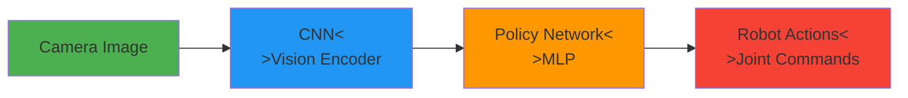
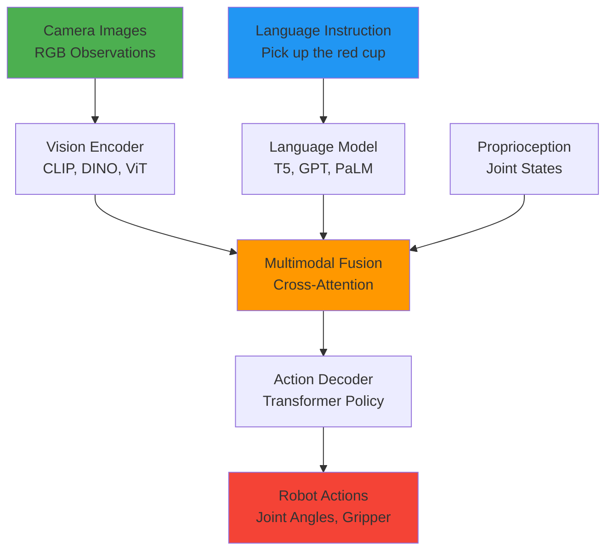
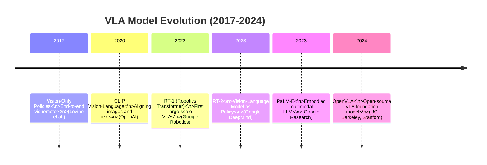
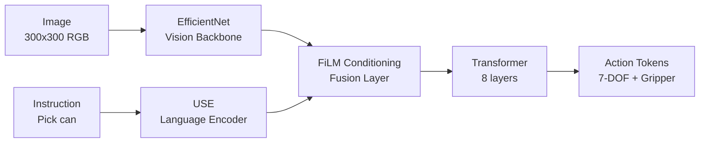
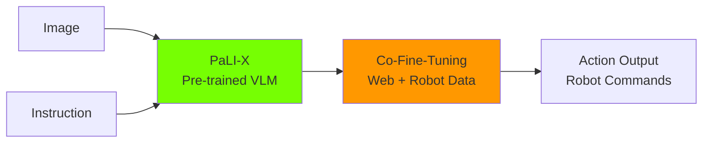
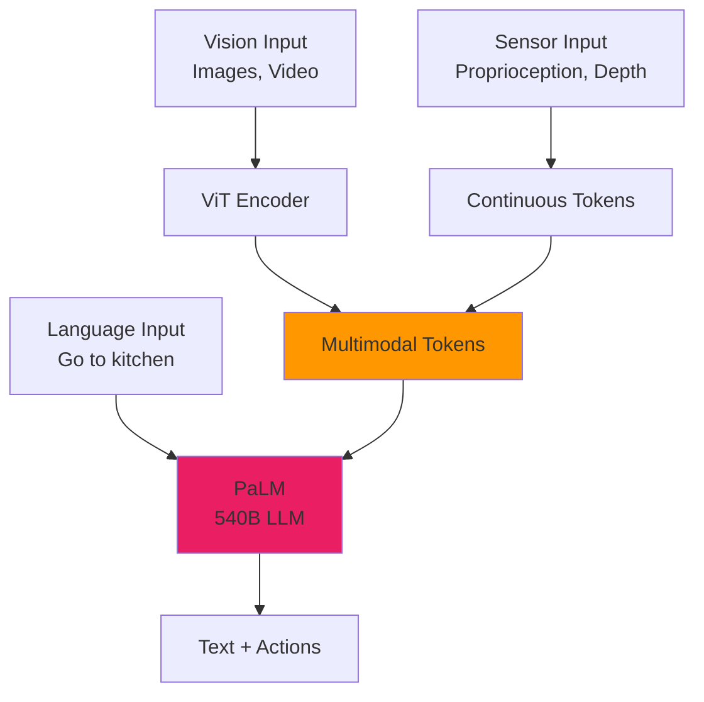
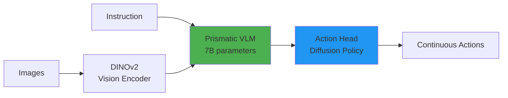
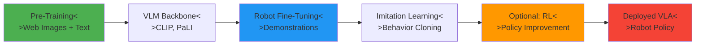
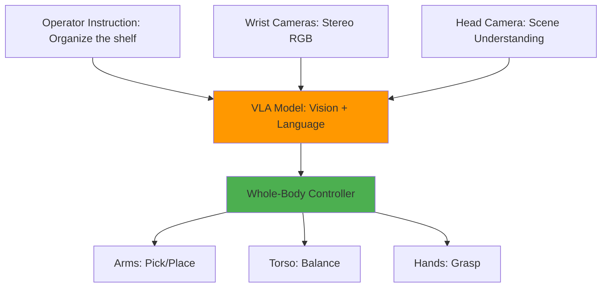

# Chapter 23: Introduction to Vision-Language-Action Models

**Estimated Reading Time**: 55 minutes

## Learning Objectives

By the end of this chapter, you will be able to:

- **LO-4.1.1**: Explain what Vision-Language-Action (VLA) models are and their role in Physical AI
- **LO-4.1.2**: Understand the evolution from vision-only to multimodal robot policies
- **LO-4.1.3**: Identify key VLA architectures (RT-1, RT-2, OpenVLA, PaLM-E)
- **LO-4.1.4**: Describe the three components of VLA models: vision encoders, language models, and action decoders
- **LO-4.1.5**: Recognize real-world applications of VLA in humanoid robotics
- **LO-4.1.6**: Understand the training pipeline: imitation learning, pre-training, and fine-tuning

---

## 1. The Problem: Traditional Robot Control

### How Robots Were Controlled (2010-2020)

Traditional robot systems required **explicit programming** for every task:

```python
# Traditional approach: Hardcoded task
def pick_red_cube():
    # Step 1: Move to predefined position
    move_to_position(x=0.5, y=0.2, z=0.3)

    # Step 2: Close gripper
    close_gripper()

    # Step 3: Lift
    move_to_position(x=0.5, y=0.2, z=0.5)
```

**Problems**:
- ❌ **Not generalizable**: Works only for red cubes at exact positions
- ❌ **Brittle**: Fails if object moves 5cm or changes color
- ❌ **Not scalable**: Need to reprogram for every new task
- ❌ **No human-robot interaction**: Can't understand "pick up the red object"

### The Vision-Only Era (2015-2020)

Researchers tried **vision-based policies** using deep learning:



**Example**: End-to-end visuomotor policies
- Input: RGB image from robot's camera
- Output: Joint velocities or gripper commands

**Limitations**:
- ✅ **Better**: Can adapt to visual variations
- ❌ **Still limited**: Cannot understand human instructions
- ❌ **Task-specific**: Separate model for each task
- ❌ **Data-hungry**: Needs thousands of demonstrations per task

---

## 2. Vision-Language-Action (VLA): The Breakthrough

### What is a VLA Model?

**Vision-Language-Action (VLA)** models are **multimodal foundation models** that combine:

1. **Vision**: Process camera images to understand the environment
2. **Language**: Understand natural language instructions from humans
3. **Action**: Generate robot control commands (joint angles, gripper states)

**Key Insight**: Instead of training separate models for "pick up cup," "open drawer," "fold towel," a single VLA model can perform **thousands of tasks** by conditioning on language instructions.

### VLA Architecture Overview



**Components**:

1. **Vision Encoder**: Extracts visual features from camera images
   - Examples: CLIP (OpenAI), DINO (Meta), ViT (Google)
   - Output: 512-1024 dimensional embeddings

2. **Language Model**: Encodes task instructions into semantic embeddings
   - Examples: T5, BERT, GPT-3, PaLM
   - Output: Instruction embeddings aligned with vision

3. **Multimodal Fusion**: Combines vision + language + robot state
   - Typically uses **cross-attention** (Transformer architecture)
   - Learns correlations: "red cup" (language) ↔ red pixels (vision)

4. **Action Decoder**: Generates robot actions conditioned on fused embeddings
   - Outputs: Joint angles, gripper position, end-effector pose
   - Trained via **imitation learning** or **reinforcement learning**

---

## 3. Evolution of VLA Models

### Timeline of Key Breakthroughs



### Major VLA Architectures

#### RT-1 (Robotics Transformer, 2022)

**Google Robotics**, 130k robot demonstrations



**Key Features**:
- **Tokenizes actions**: Discretizes continuous actions into 256 bins
- **FiLM conditioning**: Modulates vision features with language embeddings
- **Large-scale**: Trained on 130k demonstrations from 700+ tasks

**Performance**: 97% success on seen tasks, 76% on unseen tasks (in simulation)

---

#### RT-2 (Robotics Transformer 2, 2023)

**Google DeepMind**, Vision-Language Model (VLM) as policy



**Key Innovation**:
- **Pre-trained on web data**: Inherits visual understanding from billions of images
- **Co-fine-tuning**: Jointly trains on internet images + robot demonstrations
- **Emergent capabilities**: Can perform tasks never seen in robot data (e.g., "pick up extinct animal") by leveraging web knowledge

**Performance**: 62% success on novel tasks (vs 32% for RT-1)

---

#### PaLM-E (2023)

**Google Research**, Embodied multimodal LLM (562B parameters)



**Key Features**:
- **Massive scale**: 562 billion parameters (largest VLA)
- **General-purpose**: Can do QA, captioning, planning, AND robot control
- **Embodied reasoning**: "I see a spill → I should get a towel"

**Limitation**: Too large for on-robot deployment (requires cloud inference)

---

#### OpenVLA (2024)

**UC Berkeley, Stanford**, Open-source VLA (7B parameters)



**Key Features**:
- **Open-source**: Fully accessible weights and training code
- **Efficient**: 7B parameters (fits on single GPU)
- **Strong performance**: Matches RT-2 on many benchmarks
- **Fine-tunable**: Easily adapt to new robots and tasks

**Why Important**: First production-ready open VLA for research and industry

---

## 4. How VLA Models Learn

### Training Pipeline



### Step 1: Pre-Training (Vision-Language Alignment)

**Objective**: Learn general visual and language understanding

**Data**: Billions of (image, caption) pairs from the internet
- Example: (image of a cup, "a red ceramic coffee mug")

**Method**: Contrastive learning (CLIP)
```python
# Simplified CLIP training
image_embedding = vision_encoder(image)
text_embedding = language_encoder(caption)

# Maximize similarity for matching pairs
loss = contrastive_loss(image_embedding, text_embedding)
```

**Outcome**: Model can match "red cup" (text) to images of red cups

---

### Step 2: Robot Demonstration Collection

**Objective**: Gather robot interaction data

**Methods**:
1. **Teleoperation**: Human pilots robot via VR/joystick
2. **Kinesthetic teaching**: Human physically moves robot
3. **Autonomous scripted policies**: Collect data from existing controllers
4. **Sim-to-real**: Generate data in Isaac Sim with domain randomization

**Data Format**: Tuples of `(observation, instruction, action)`
```python
{
    "observation": {
        "image": RGB image (224x224),
        "robot_state": [7 joint angles, gripper state]
    },
    "instruction": "Pick up the red cube",
    "action": [Δx, Δy, Δz, Δroll, Δpitch, Δyaw, gripper]
}
```

**Scale**:
- RT-1: 130,000 demonstrations
- RT-2: 100,000 demonstrations
- OpenVLA: 970,000 demonstrations (Open X-Embodiment dataset)

---

### Step 3: Imitation Learning (Behavior Cloning)

**Objective**: Train policy to mimic human demonstrations

**Method**: Supervised learning
```python
# Behavior cloning loss
predicted_action = vla_model(image, instruction, robot_state)
true_action = demonstration.action

loss = MSE(predicted_action, true_action)
```

**Challenges**:
- **Distribution shift**: Robot drifts from demonstrated states
- **Compounding errors**: Small mistakes accumulate over time
- **Data efficiency**: Needs many demonstrations

---

### Step 4: (Optional) Reinforcement Learning

**Objective**: Improve policy beyond demonstrations

**Method**: Policy gradient algorithms (PPO, SAC)
```python
# RL fine-tuning
action = vla_model(observation, instruction)
reward = environment.step(action)

# Optimize for higher reward
loss = -log_prob(action) * advantage
```

**Use Cases**:
- Fine-tune in simulation (Isaac Gym)
- Optimize task-specific metrics (speed, smoothness)
- Recover from demonstration errors

---

## 5. VLA for Humanoid Robotics

### Why VLA Matters for Humanoids

Humanoid robots are designed for **human environments** with **diverse tasks**. VLA enables:

1. **General-Purpose Interaction**: "Hand me the book" → robot understands and executes
2. **Adaptive Behavior**: Same robot can cook, clean, assemble products
3. **Sim-to-Real Transfer**: Train in Isaac Sim, deploy to real humanoid
4. **Human-Robot Collaboration**: Natural language interface

### Case Study: 1X NEO

**1X Technologies** (Norwegian robotics startup) uses VLA for NEO humanoid:



**Results**:
- 80% success on warehouse tasks (sorting, shelving)
- Generalizes to novel objects without retraining
- Deployed in pilot facilities (2024)

---

### Example: VLA for Humanoid Manipulation

**Task**: "Pick up the blue bottle and place it in the bin"

**VLA Execution**:
1. **Perception**: Vision encoder detects blue bottle in scene
2. **Language grounding**: "blue bottle" → bounding box in image
3. **Motion planning**: Generate approach trajectory
4. **Action execution**: Output 7-DOF arm commands + gripper state
5. **Feedback**: Monitor success, retry if failed

```python
# Simplified VLA inference
instruction = "Pick up the blue bottle and place it in the bin"
image = robot.get_camera_image()
robot_state = robot.get_joint_states()

# VLA model forward pass
action = vla_model.predict(image, instruction, robot_state)

# Execute action
robot.execute_action(action)
```

---

## 6. Advantages and Limitations

### ✅ Advantages of VLA

1. **Generalization**: One model, thousands of tasks
2. **Natural Interface**: Humans use language, not code
3. **Transfer Learning**: Leverages pre-trained vision-language models
4. **Data Efficiency** (compared to RL from scratch): Few-shot adaptation
5. **Interpretability**: Can explain actions via language

### ❌ Current Limitations

1. **Compute Requirements**: Large models (7B+ parameters) need powerful GPUs
2. **Latency**: Inference can take 50-200ms (too slow for high-speed tasks)
3. **Safety**: No guarantees; can hallucinate unsafe actions
4. **Sim-to-Real Gap**: Still requires real-world fine-tuning
5. **Long-Horizon Tasks**: Struggles with multi-step plans (need hierarchical policies)

---

## 7. The Open X-Embodiment Dataset

### What is Open X-Embodiment?

**Largest open dataset** for robot learning (2023):
- **970,000 demonstrations** from 22 robot platforms
- **Diverse tasks**: Manipulation, navigation, mobile manipulation
- **Multi-robot**: UR5, Franka, Fetch, Spot, humanoids
- **Standardized format**: Common observation/action schema

### Why It Matters

Before Open X-Embodiment:
- Each research lab collected separate datasets
- Models couldn't transfer between robots
- Limited to tens of thousands of demos

**After**:
- Train one VLA on all robot types
- Transfer knowledge: Table-top robot → Humanoid
- Enables true "foundation models" for robotics

### Using Open X-Embodiment

```python
# Example: Load dataset for training
from openxembodiment import load_dataset

dataset = load_dataset("openx_embodiment", split="train")

for episode in dataset:
    observation = episode["observation"]  # Images, robot state
    action = episode["action"]           # 7-DOF + gripper
    instruction = episode["language_instruction"]

    # Train your VLA model
    loss = train_step(vla_model, observation, instruction, action)
```

---

## Lab Exercise 4.1: Explore VLA Models

### Objective
Understand VLA architectures by analyzing existing implementations and visualizing model components.

### Part 1: VLA Model Survey (20 minutes)

**Tasks**:
1. Read the RT-1 paper (Google Robotics): [arxiv.org/abs/2212.06817](https://arxiv.org/abs/2212.06817)
2. Watch RT-2 demo video: [YouTube - Robotics Transformer 2](https://www.youtube.com/watch?v=3Rw8pXYRaj8)
3. Explore OpenVLA GitHub: [github.com/openvla/openvla](https://github.com/openvla/openvla)

**Questions to Answer**:
- What is the main difference between RT-1 and RT-2?
- How many parameters does RT-2 have?
- What tasks can RT-2 do that RT-1 cannot?

---

### Part 2: VLA Architecture Diagram (30 minutes)

**Tasks**:
1. Create a detailed architecture diagram for RT-2 (use draw.io or Mermaid)
2. Label all components:
   - Vision encoder
   - Language encoder
   - Fusion mechanism
   - Action decoder
3. Annotate with data dimensions at each stage

**Deliverable**: PNG/PDF diagram with clear labels

---

### Part 3: Dataset Exploration (20 minutes)

**Tasks**:
1. Visit Open X-Embodiment dataset: [robotics-transformer-x.github.io](https://robotics-transformer-x.github.io/)
2. Browse example demonstrations (videos + metadata)
3. Identify 5 different robot platforms in the dataset
4. Note task diversity (pick, place, push, drawer, etc.)

**Questions to Answer**:
- How many total demonstrations are in the dataset?
- What is the longest episode (in timesteps)?
- Which robot has the most demonstrations?

---

### Validation Checklist

- ✅ Read at least one VLA research paper (RT-1 or RT-2)
- ✅ Watched demonstration videos
- ✅ Created architecture diagram with labeled components
- ✅ Explored Open X-Embodiment dataset
- ✅ Answered reflection questions

---

## Quiz 4.1: VLA Fundamentals

### Question 1
**What does VLA stand for?**

- A) Virtual Learning Agent
- B) Vision-Language-Action ✓
- C) Visual Latent Attention
- D) Velocity-Limited Actuator

**Explanation**: VLA models combine vision, language, and action for multimodal robot control.

---

### Question 2
**Which component processes natural language instructions in a VLA model?**

- A) Vision encoder
- B) Action decoder
- C) Language model ✓
- D) Physics engine

**Explanation**: Language models (e.g., T5, GPT) encode text instructions into embeddings.

---

### Question 3
**What is the primary training method for VLA models?**

- A) Random exploration
- B) Imitation learning (behavior cloning) ✓
- C) Genetic algorithms
- D) Hardcoded rules

**Explanation**: VLA models learn from human demonstrations via supervised imitation learning.

---

### Question 4
**True or False: RT-2 was pre-trained on billions of internet images before robot fine-tuning.**

- True ✓

**Explanation**: RT-2 leverages Vision-Language Models (VLMs) pre-trained on web data for better generalization.

---

### Question 5
**What is the Open X-Embodiment dataset? (Short answer)**

**Expected Answer**: A large-scale open dataset containing 970,000 robot demonstrations from 22 different robot platforms, enabling training of generalist VLA models that can transfer across different robots and tasks.

---

## Key Takeaways

✅ **VLA models** combine vision, language, and action to create generalist robot policies

✅ **Evolution**: Vision-only → Vision-Language alignment (CLIP) → VLA (RT-1, RT-2, OpenVLA)

✅ **Key architectures**: RT-1 (130k demos), RT-2 (VLM pre-training), PaLM-E (562B params), OpenVLA (open-source)

✅ **Training pipeline**: Pre-train VLM → Collect robot demos → Imitation learning → Optional RL

✅ **Humanoid applications**: General-purpose manipulation, natural language control, sim-to-real transfer

✅ **Open X-Embodiment**: 970k demonstrations enabling true foundation models for robotics

---

## What's Next?

In **Chapter 24**, you'll learn about vision encoders (CLIP, DINO, ViT) and how they extract semantic features from images for robot perception.

[Continue to Chapter 24: Vision Encoders for Robotics →](/docs/module-4-vla/week-12/chapter-24-vision-encoders)

---

## Additional Resources

- **RT-1 Paper**: [Robotics Transformer (arxiv.org/abs/2212.06817)](https://arxiv.org/abs/2212.06817)
- **RT-2 Paper**: [RT-2: Vision-Language-Action Models (arxiv.org/abs/2307.15818)](https://arxiv.org/abs/2307.15818)
- **PaLM-E**: [PaLM-E: An Embodied Multimodal LLM (arxiv.org/abs/2303.03378)](https://arxiv.org/abs/2303.03378)
- **OpenVLA**: [github.com/openvla/openvla](https://github.com/openvla/openvla)
- **Open X-Embodiment**: [robotics-transformer-x.github.io](https://robotics-transformer-x.github.io/)

---

**Progress**: Module 4, Week 12, Chapter 23 of 32 | [View all chapters](/docs/intro)
