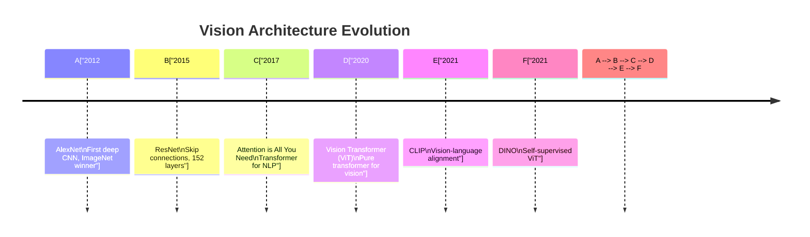
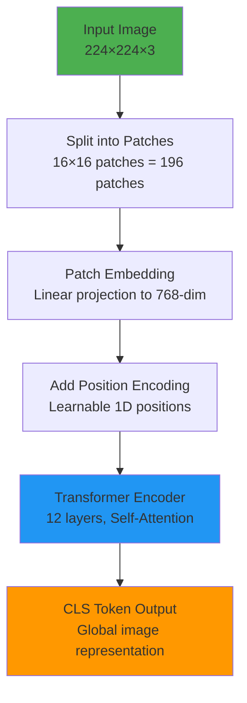
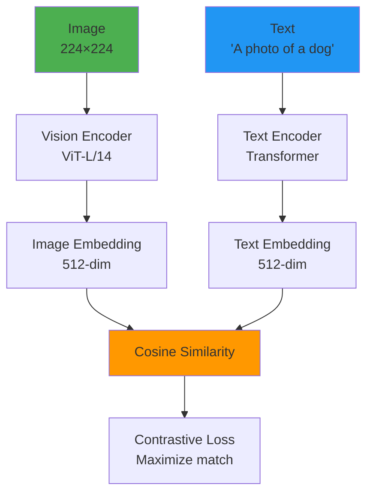
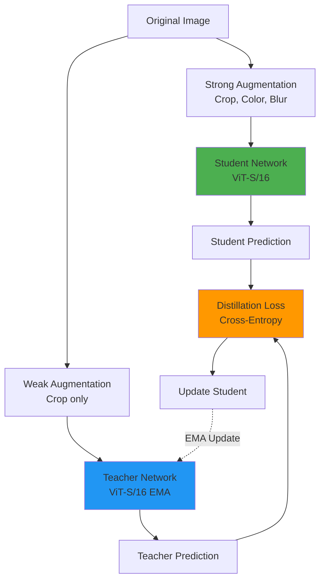

# Chapter 24: Vision Encoders for Robot Perception

**Estimated Reading Time**: 50 minutes

## Learning Objectives

By the end of this chapter, you will be able to:

- **LO-4.2.1**: Explain the role of vision encoders in VLA models
- **LO-4.2.2**: Understand Vision Transformer (ViT) architecture and self-attention mechanisms
- **LO-4.2.3**: Compare CLIP, DINO, and other vision encoders for robotics
- **LO-4.2.4**: Extract visual features from images using pre-trained encoders
- **LO-4.2.5**: Implement vision encoder inference in Python with PyTorch
- **LO-4.2.6**: Evaluate which vision encoder to use for specific robot tasks

---

## 1. Why Vision Encoders Matter

### The Role in VLA Models

**Vision encoders** are the "eyes" of VLA models. They transform raw pixel data into **semantic feature representations** that capture:
- Object identities ("cup", "bottle", "apple")
- Spatial relationships ("cup is on table")
- Visual properties ("red", "metallic", "transparent")
- Actionable affordances ("graspable", "movable")


**Without vision encoders**: Policy would need to learn from raw pixels (millions of dimensions)
**With vision encoders**: Policy learns from compact semantic features (hundreds of dimensions)

---

## 2. Evolution of Vision Architectures

### From CNNs to Transformers



### CNNs vs. Transformers

| Aspect | CNNs (ResNet, EfficientNet) | Transformers (ViT) |
|--------|----------------------------|-------------------|
| **Architecture** | Convolutional layers, pooling | Self-attention, patch embeddings |
| **Receptive Field** | Local (3×3, 5×5 kernels) | Global (all patches) |
| **Inductive Bias** | Strong (translation equivariance) | Weak (learns from data) |
| **Data Requirements** | Moderate (works with ImageNet) | High (needs 300M+ images) |
| **Computational Cost** | Low (efficient convolutions) | High (quadratic attention) |
| **Performance** | Good for vision-only | Best for multimodal (vision+language) |

**Why Transformers for VLA?**
- Better at capturing **long-range dependencies** (e.g., "pick cup" → relate "cup" to gripper position far from cup)
- Natural integration with **language transformers** (same architecture)
- **Transfer learning**: Pre-trained on massive datasets (LAION-5B: 5 billion images)

---

## 3. Vision Transformer (ViT) Architecture

### How ViT Works

**Core Idea**: Treat an image as a sequence of patches, then apply standard Transformer architecture.



### Step-by-Step Breakdown

#### Step 1: Patch Embedding

Divide image into non-overlapping patches:

```python
# Image: 224×224×3
# Patch size: 16×16
# Number of patches: (224/16) × (224/16) = 14 × 14 = 196

# Flatten each patch: 16×16×3 = 768 values
# Linear projection: 768 → 768 (embedding dimension)
```

**Result**: 196 patch embeddings, each 768-dimensional

#### Step 2: Position Encoding

Add positional information (transformers have no spatial awareness):

```python
# Learnable position embeddings
position_embeddings = torch.nn.Parameter(torch.randn(196, 768))

# Add to patch embeddings
patch_embeddings = patch_embeddings + position_embeddings
```

#### Step 3: Transformer Encoder

Apply self-attention layers:

```python
# Self-attention computes interactions between all patches
# Query, Key, Value matrices
Q = patch_embeddings @ W_q
K = patch_embeddings @ W_k
V = patch_embeddings @ W_v

# Attention scores: which patches relate to which
attention_scores = softmax((Q @ K.T) / sqrt(d_k))

# Weighted combination of values
output = attention_scores @ V
```

**Example Attention Pattern**:
- Patch with "cup handle" attends to patches with "cup body"
- Patch with "gripper" attends to patches with "target object"

#### Step 4: CLS Token

Prepend special `[CLS]` token (like BERT):

```python
# CLS token: learnable 768-dim vector
cls_token = torch.nn.Parameter(torch.randn(1, 768))

# Prepend to sequence
input_sequence = torch.cat([cls_token, patch_embeddings], dim=0)
# Shape: (197, 768)  # 1 CLS + 196 patches
```

After transformer layers, `CLS` token contains **global image representation**.

---

### ViT Model Sizes

| Model | Layers | Hidden Dim | Params | Use Case |
|-------|--------|-----------|--------|----------|
| **ViT-Tiny** | 12 | 192 | 5M | Edge devices, real-time |
| **ViT-Small** | 12 | 384 | 22M | Mobile robots |
| **ViT-Base** | 12 | 768 | 86M | Standard robotics |
| **ViT-Large** | 24 | 1024 | 304M | Offline training |
| **ViT-Huge** | 32 | 1280 | 632M | Research, cloud inference |

**For robotics**: ViT-Base is the sweet spot (good performance, fits on GPU).

---

## 4. CLIP: Connecting Vision and Language

### What is CLIP?

**CLIP (Contrastive Language-Image Pre-training)** by OpenAI (2021) learns to align images and text.

**Key Innovation**: Train on 400M (image, caption) pairs from the internet → no manual labels needed!

### CLIP Architecture



### Training Objective

**Contrastive Learning**: Maximize similarity for matching pairs, minimize for mismatched.

```python
# Pseudocode for CLIP training
image_embeddings = vision_encoder(images)  # Shape: (N, 512)
text_embeddings = text_encoder(captions)   # Shape: (N, 512)

# Compute similarity matrix
similarity = image_embeddings @ text_embeddings.T  # (N, N)

# Ground truth: diagonal elements are matches
labels = torch.arange(N)  # [0, 1, 2, ..., N-1]

# Contrastive loss (symmetric)
loss = cross_entropy(similarity, labels) + cross_entropy(similarity.T, labels)
```

**Example**:
- Image of a red cup + "red ceramic mug" → High similarity
- Image of a red cup + "blue bottle" → Low similarity

### Why CLIP for Robotics?

1. **Zero-shot recognition**: Can identify objects never seen during robot training
   - Example: Robot trained on "apple" can recognize "fuji apple" without extra training
2. **Language grounding**: "Pick the red one" → CLIP finds red objects in image
3. **Open-vocabulary**: Not limited to fixed class labels (ImageNet's 1000 classes)

### CLIP Usage Example

```python
import torch
import clip
from PIL import Image

# Load pre-trained CLIP model
model, preprocess = clip.load("ViT-B/32", device="cuda")

# Load image from robot camera
image = Image.open("robot_camera.jpg")
image_input = preprocess(image).unsqueeze(0).to("cuda")

# Define candidate objects
text_inputs = clip.tokenize([
    "a red cup",
    "a blue bottle",
    "an apple",
    "a banana"
]).to("cuda")

# Compute embeddings
with torch.no_grad():
    image_features = model.encode_image(image_input)
    text_features = model.encode_text(text_inputs)

    # Normalize features
    image_features /= image_features.norm(dim=-1, keepdim=True)
    text_features /= text_features.norm(dim=-1, keepdim=True)

    # Compute similarity
    similarity = (image_features @ text_features.T).softmax(dim=-1)

# Get predictions
values, indices = similarity[0].topk(1)
print(f"Detected: {text_inputs[indices[0]]}, confidence: {values[0]:.2f}")
```

---

## 5. DINO: Self-Supervised Vision

### What is DINO?

**DINO (Self-Distillation with NO labels)** by Meta AI (2021) trains ViT without any labels using **self-supervised learning**.

**Key Idea**: Student network learns to match predictions of teacher network on different augmentations of the same image.

### DINO Architecture



### Training Process

1. **Augment image twice**: Strong (random crop, color jitter, blur) and weak (crop only)
2. **Student** predicts from strong augmentation
3. **Teacher** predicts from weak augmentation
4. **Loss**: Student tries to match teacher's prediction
5. **Teacher update**: Exponential moving average of student weights

**No labels needed!** Model learns to recognize objects by invariance to augmentations.

### Why DINO for Robotics?

1. **No pre-training bias**: Not biased toward ImageNet categories
2. **Strong spatial features**: Better object localization than CLIP
3. **Emergent segmentation**: Attention maps naturally segment objects

**Example**: DINO attention on "pick red cube" task:
- Attention focuses on cube edges and surfaces
- Background is suppressed
- Better for grasp point detection

### DINO Usage Example

```python
import torch
from torchvision import transforms
from PIL import Image

# Load DINO model
dino_model = torch.hub.load('facebookresearch/dino:main', 'dino_vits16')
dino_model.eval()

# Preprocessing
transform = transforms.Compose([
    transforms.Resize(256),
    transforms.CenterCrop(224),
    transforms.ToTensor(),
    transforms.Normalize((0.485, 0.456, 0.406), (0.229, 0.224, 0.225)),
])

# Load robot camera image
image = Image.open("robot_view.jpg")
image_tensor = transform(image).unsqueeze(0)

# Extract features
with torch.no_grad():
    features = dino_model(image_tensor)  # Shape: (1, 384) for ViT-S/16

print(f"DINO features shape: {features.shape}")
# Use features for downstream tasks (grasping, navigation)
```

---

## 6. Comparing Vision Encoders

### Performance Comparison

| Encoder | Pre-training | Strengths | Weaknesses | Best For |
|---------|-------------|-----------|------------|----------|
| **CLIP** | Supervised (image-text pairs) | Language grounding, zero-shot | Weaker spatial features | Language-conditioned tasks, VLA |
| **DINO** | Self-supervised (no labels) | Object segmentation, spatial | No language understanding | Grasping, visual servoing |
| **ViT** | Supervised (ImageNet) | Fast inference, well-studied | Limited to 1000 classes | Object classification |
| **DINOv2** | Self-supervised (142M images) | Best spatial features, fast | No language | Manipulation, depth estimation |

### When to Use Which?

**CLIP**:
- Task requires language understanding ("pick the largest red object")
- Zero-shot recognition (new object categories)
- VLA model training

**DINO/DINOv2**:
- Precise object localization (grasping, placing)
- Segmentation without labels
- Visual servoing (align gripper to object)

**ViT (ImageNet)**:
- Simple classification (bottle vs cup)
- Computational budget is tight
- Standard benchmarks (reproducibility)

---

## 7. Practical Implementation

### Setting Up Vision Encoder Pipeline

```python
import torch
import torch.nn as nn
from torchvision import transforms
from PIL import Image

class VisionEncoderPipeline:
    def __init__(self, encoder_type="clip", device="cuda"):
        self.device = device
        self.encoder_type = encoder_type

        if encoder_type == "clip":
            import clip
            self.model, self.preprocess = clip.load("ViT-B/32", device=device)
        elif encoder_type == "dino":
            self.model = torch.hub.load('facebookresearch/dino:main', 'dino_vits16')
            self.model.to(device)
            self.preprocess = transforms.Compose([
                transforms.Resize(256),
                transforms.CenterCrop(224),
                transforms.ToTensor(),
                transforms.Normalize((0.485, 0.456, 0.406), (0.229, 0.224, 0.225)),
            ])

    def encode_image(self, image_path):
        """Extract features from image"""
        image = Image.open(image_path).convert("RGB")
        image_input = self.preprocess(image).unsqueeze(0).to(self.device)

        with torch.no_grad():
            if self.encoder_type == "clip":
                features = self.model.encode_image(image_input)
            elif self.encoder_type == "dino":
                features = self.model(image_input)

        return features.cpu().numpy()

# Usage
encoder = VisionEncoderPipeline(encoder_type="clip")
features = encoder.encode_image("robot_camera_frame.jpg")
print(f"Feature shape: {features.shape}")  # (1, 512) for CLIP ViT-B/32
```

---

## Lab Exercise 4.2: Implement Vision Encoder Feature Extraction

### Objective
Extract and visualize features from robot camera images using CLIP and DINO.

### Prerequisites
- Python 3.8+
- PyTorch 2.0+
- CUDA-capable GPU (optional, CPU works)

### Part 1: Setup (10 minutes)

Install dependencies:

```bash
pip install torch torchvision ftfy regex tqdm
pip install git+https://github.com/openai/CLIP.git
```

Download sample robot images:

```bash
wget https://raw.githubusercontent.com/openai/CLIP/main/CLIP.png -O test_image.png
```

---

### Part 2: CLIP Feature Extraction (20 minutes)

**Task 1**: Extract image features with CLIP

```python
import torch
import clip
from PIL import Image
import numpy as np

# Load model
device = "cuda" if torch.cuda.is_available() else "cpu"
model, preprocess = clip.load("ViT-B/32", device=device)

# Load image
image = preprocess(Image.open("test_image.png")).unsqueeze(0).to(device)

# Extract features
with torch.no_grad():
    image_features = model.encode_image(image)

print(f"CLIP features: {image_features.shape}")  # torch.Size([1, 512])
print(f"Feature norm: {image_features.norm().item():.2f}")
```

**Task 2**: Zero-shot object detection

```python
# Define object queries
text_queries = [
    "a red apple",
    "a laptop computer",
    "a coffee mug",
    "a potted plant",
    "a robotic arm"
]

text_inputs = clip.tokenize(text_queries).to(device)

with torch.no_grad():
    text_features = model.encode_text(text_inputs)

    # Normalize
    image_features_norm = image_features / image_features.norm(dim=-1, keepdim=True)
    text_features_norm = text_features / text_features.norm(dim=-1, keepdim=True)

    # Compute similarity
    similarity = (image_features_norm @ text_features_norm.T).softmax(dim=-1)

# Print results
for i, query in enumerate(text_queries):
    print(f"{query}: {similarity[0, i].item():.3f}")
```

---

### Part 3: DINO Feature Extraction (20 minutes)

**Task**: Extract DINO features and visualize attention maps

```python
import torch
from torchvision import transforms
from PIL import Image
import matplotlib.pyplot as plt

# Load DINO
dino_model = torch.hub.load('facebookresearch/dino:main', 'dino_vits16')
dino_model.eval()

# Preprocessing
transform = transforms.Compose([
    transforms.Resize(256),
    transforms.CenterCrop(224),
    transforms.ToTensor(),
    transforms.Normalize((0.485, 0.456, 0.406), (0.229, 0.224, 0.225)),
])

# Load image
image = Image.open("test_image.png").convert("RGB")
image_tensor = transform(image).unsqueeze(0)

# Extract features
with torch.no_grad():
    features = dino_model(image_tensor)

print(f"DINO features: {features.shape}")  # torch.Size([1, 384])

# Get attention maps (last layer, first head)
attention = dino_model.get_last_selfattention(image_tensor)
print(f"Attention shape: {attention.shape}")  # (1, num_heads, num_patches, num_patches)
```

---

### Part 4: Feature Comparison (20 minutes)

**Task**: Compare CLIP vs DINO on 5 robot task images

1. Download 5 images from robot scenarios:
   - Grasping task
   - Navigation scene
   - Object sorting
   - Humanoid manipulation
   - Indoor environment

2. Extract features with both CLIP and DINO

3. Compute pairwise similarity:
   - CLIP feature similarity
   - DINO feature similarity

4. Visualize with heatmap:

```python
import seaborn as sns
import matplotlib.pyplot as plt

# Assume clip_features and dino_features are (5, feat_dim)
clip_sim = clip_features @ clip_features.T
dino_sim = dino_features @ dino_features.T

fig, axes = plt.subplots(1, 2, figsize=(12, 5))
sns.heatmap(clip_sim, annot=True, ax=axes[0], cmap="YlGnBu")
axes[0].set_title("CLIP Similarity")
sns.heatmap(dino_sim, annot=True, ax=axes[1], cmap="YlGnBu")
axes[1].set_title("DINO Similarity")
plt.tight_layout()
plt.savefig("encoder_comparison.png")
plt.show()
```

---

### Deliverables

1. Python script for CLIP feature extraction
2. Python script for DINO feature extraction
3. Comparison heatmap (PNG)
4. Short report (300 words) on which encoder works better for robot tasks

### Validation Checklist

- ✅ Successfully loaded CLIP and DINO models
- ✅ Extracted features from at least 5 images
- ✅ Compared zero-shot detection accuracy
- ✅ Generated similarity heatmap
- ✅ Wrote comparison report

---

## Quiz 4.2: Vision Encoders

### Question 1
**What is the main advantage of Vision Transformers (ViT) over CNNs?**

- A) Faster inference speed
- B) Global receptive field via self-attention ✓
- C) Smaller model size
- D) Works on CPUs

**Explanation**: ViT uses self-attention, allowing each patch to attend to all other patches (global context), unlike CNNs which have local receptive fields.

---

### Question 2
**How does CLIP align vision and language?**

- A) Supervised classification on ImageNet
- B) Contrastive learning on image-text pairs ✓
- C) Reinforcement learning
- D) Autoencoder reconstruction

**Explanation**: CLIP maximizes similarity for matching (image, caption) pairs and minimizes similarity for mismatched pairs.

---

### Question 3
**What is DINO's key innovation?**

- A) Requires labeled data
- B) Self-supervised learning without labels ✓
- C) Uses RNNs instead of Transformers
- D) Only works on small images

**Explanation**: DINO trains via self-distillation without any labels, learning from image augmentations.

---

### Question 4
**True or False: CLIP can recognize objects it has never seen in robot training data.**

- True ✓

**Explanation**: CLIP's zero-shot capability allows it to recognize novel objects by matching text descriptions, even if not in robot demonstrations.

---

### Question 5
**Which vision encoder is best for grasp point detection? (Short answer)**

**Expected Answer**: DINO or DINOv2, because they provide stronger spatial features and object localization compared to CLIP, which is better for language-conditioned tasks but weaker at precise spatial reasoning.

---

## Key Takeaways

✅ **Vision encoders** transform raw pixels into semantic features for VLA models

✅ **Vision Transformers (ViT)** use patch embeddings and self-attention for global context

✅ **CLIP** aligns vision and language via contrastive learning on 400M image-text pairs

✅ **DINO** learns strong spatial features via self-supervised distillation without labels

✅ **Use CLIP** for language-conditioned tasks, **use DINO** for spatial tasks (grasping)

✅ **Pre-trained encoders** enable transfer learning, reducing data requirements for robot policies

---

## What's Next?

In **Chapter 25**, you'll learn about language models and how they process natural language instructions to condition robot behavior.

[Continue to Chapter 25: Language Models for Robot Control →](/docs/module-4-vla/week-13/chapter-25-language-models)

---

## Additional Resources

- **CLIP Paper**: [Learning Transferable Visual Models (arxiv.org/abs/2103.00020)](https://arxiv.org/abs/2103.00020)
- **DINO Paper**: [Emerging Properties in Self-Supervised ViT (arxiv.org/abs/2104.14294)](https://arxiv.org/abs/2104.14294)
- **ViT Paper**: [An Image is Worth 16x16 Words (arxiv.org/abs/2010.11929)](https://arxiv.org/abs/2010.11929)
- **DINOv2**: [DINOv2: Learning Robust Visual Features (arxiv.org/abs/2304.07193)](https://arxiv.org/abs/2304.07193)

---

**Progress**: Module 4, Week 12, Chapter 24 of 32 | [View all chapters](/docs/intro)
