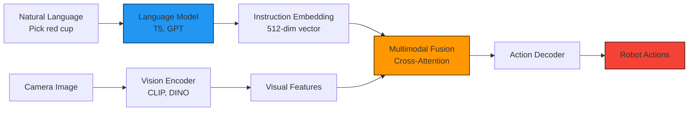
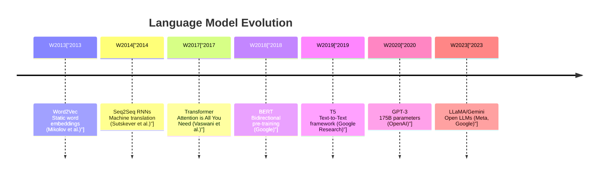
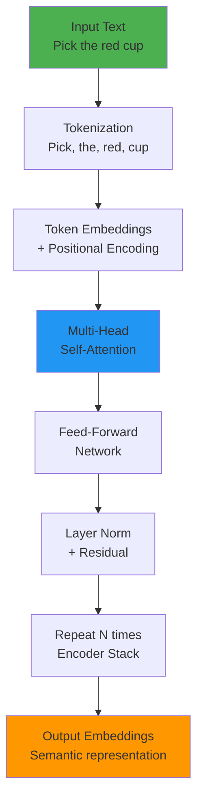
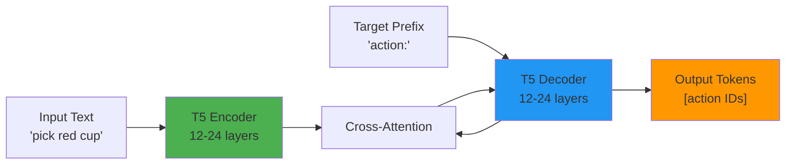
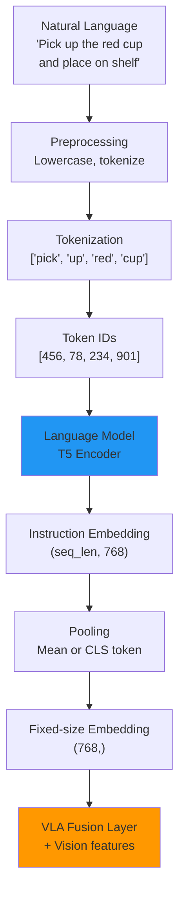
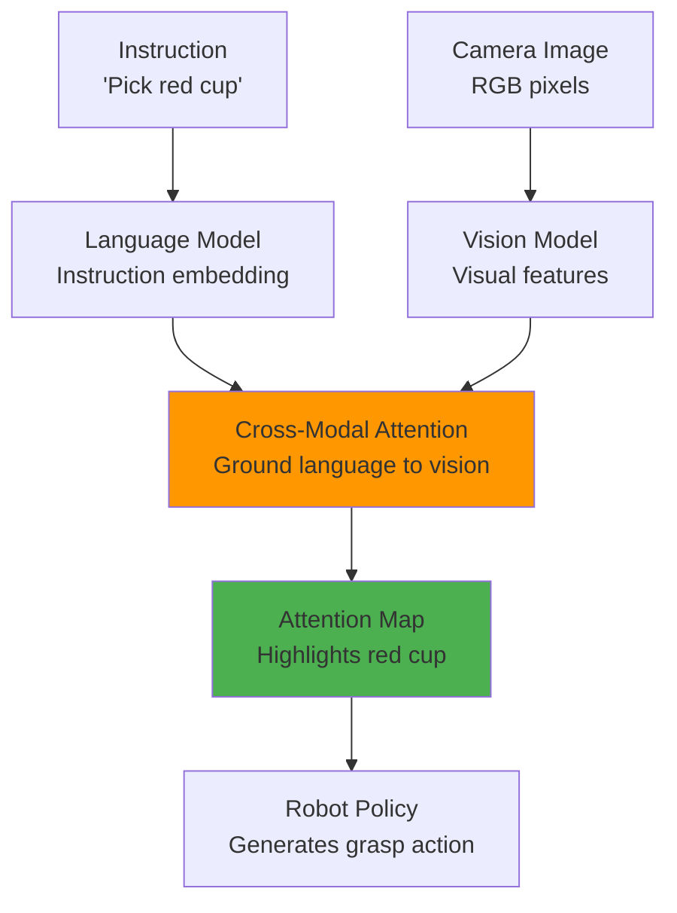

# Chapter 25: Language Models for Robot Control

**Estimated Reading Time**: 50 minutes

## Learning Objectives

By the end of this chapter, you will be able to:

- **LO-4.3.1**: Understand how language models process natural language instructions for robots
- **LO-4.3.2**: Explain Transformer architecture and self-attention mechanisms for NLP
- **LO-4.3.3**: Compare language models (T5, BERT, GPT) for robot control tasks
- **LO-4.3.4**: Implement instruction encoding pipelines for VLA models
- **LO-4.3.5**: Apply prompt engineering techniques for robot commands
- **LO-4.3.6**: Ground language instructions to visual observations and robot actions

---

## 1. Why Language Models for Robotics?

### The Natural Interface Problem

**Traditional robot programming** required explicit code for every task:

```python
# Traditional: Hardcoded commands
robot.move_to(x=0.5, y=0.2, z=0.3)
robot.grasp()
robot.move_to(x=0.8, y=0.4, z=0.3)
robot.release()
```

**Problem**: Requires programming expertise, not scalable to complex tasks.

**With language models**:

```python
# Natural language interface
instruction = "Pick up the red cup and place it on the shelf"
action = vla_model(camera_image, instruction, robot_state)
robot.execute(action)
```

**Advantage**: Humans use natural language, robots understand intent.

---

### The Role in VLA Models



**Language models** convert text instructions into **semantic embeddings** that:
1. **Capture intent**: "pick" vs "place" vs "push"
2. **Ground objects**: "red cup" → red pixels in image
3. **Specify goals**: "on the shelf" → target location
4. **Condition actions**: Same robot, different tasks based on instruction

---

## 2. Transformer Architecture for Language

### Evolution of NLP Models




### Transformer Architecture

**Core Idea**: Process entire sequence in parallel using self-attention, unlike RNNs which process sequentially.



---

### Self-Attention Mechanism

**Purpose**: Learn relationships between all words in a sentence.

**Example**: "Pick the red cup on the table"
- "Pick" attends to "cup" (object of action)
- "red" attends to "cup" (attribute)
- "cup" attends to "table" (location)

**Mathematical Formulation**:

```python
# Self-attention computation
Q = input_embeddings @ W_q  # Query matrix
K = input_embeddings @ W_k  # Key matrix
V = input_embeddings @ W_v  # Value matrix

# Compute attention scores
attention_scores = softmax((Q @ K.T) / sqrt(d_k))

# Weighted sum of values
output = attention_scores @ V
```

**Intuition**:
- **Query**: "What am I looking for?"
- **Key**: "What information do I have?"
- **Value**: "What should I output?"

---

### Multi-Head Attention

**Idea**: Learn multiple attention patterns simultaneously.

graph TB
    A["Input Embeddings"] --> B1["Head 1\nSyntax"]
    A --> B2["Head 2\nSemantics"]
    A --> B3["Head 3\nLong-range deps"]
    A --> B4["Head N\n..."]

    B1 --> C["Concatenate"]
    B2 --> C
    B3 --> C
    B4 --> C

    C --> D["Linear Projection"]
    D --> E["Output"]

    style C fill:#FF9800
```

**Example**:
- **Head 1**: Learns "red" modifies "cup"
- **Head 2**: Learns "pick" is action, "cup" is target
- **Head 3**: Learns spatial relationships ("on the table")

---

## 3. Language Models for Robotics

### T5 (Text-to-Text Transfer Transformer)

**Google Research (2019)**, 220M - 11B parameters

**Key Innovation**: Treat all NLP tasks as text-to-text:
- Translation: Input "translate English to German: Hello" → Output "Hallo"
- Summarization: Input "summarize: [text]" → Output "[summary]"
- **Robotics**: Input "pick red cup" → Output "action tokens"

#### T5 Architecture



**Why T5 for Robotics?**
1. **Encoder-decoder structure**: Natural for instruction → action mapping
2. **Pre-trained on C4 dataset**: 750GB of web text → rich language understanding
3. **Flexible**: Can output continuous or discrete actions
4. **Efficient**: T5-Base (220M params) fits on robot hardware

**Usage in RT-1**:
```python
# RT-1 uses T5 variant for instruction encoding
instruction = "Pick up the apple"
tokens = tokenizer.encode(instruction)  # [3, 456, 78, 12, 901]
instruction_embedding = t5_encoder(tokens)  # (1, seq_len, 768)

# Embedding fed to VLA policy
action = policy(vision_features, instruction_embedding, robot_state)
```

---

### BERT (Bidirectional Encoder Representations)

**Google (2018)**, 110M - 340M parameters

**Key Feature**: **Bidirectional context** - reads entire sentence at once.

**Training**: Masked language modeling
- Input: "Pick the [MASK] cup"
- Predict: "red"

**Robotics Applications**:
- **Instruction similarity**: Is "grasp bottle" similar to "pick up container"?
- **Language grounding**: Match instruction to demonstrated tasks
- **Intent classification**: Is this a pick, place, or push task?

**Limitation**: Encoder-only (no decoder) → Not ideal for generating actions directly

---

### GPT (Generative Pre-trained Transformer)

**OpenAI (2018-2023)**, 117M - 175B parameters

**Key Feature**: **Autoregressive generation** - predict next token sequentially.

**Training**: Next-token prediction
- Input: "Pick the red"
- Predict: "cup"

**Robotics Applications**:
- **Task planning**: "How to make coffee?" → Step-by-step plan
- **Code generation**: "Move arm to (0.5, 0.2, 0.3)" → Python code
- **Human-robot dialogue**: "What are you doing?" → "I am picking up the apple"

**Example - GPT for Robot Planning**:

```python
# GPT generates high-level plan
prompt = """
Robot task: Prepare coffee
Available actions: pick(object), place(object, location), pour(source, target)
Objects: mug, coffee pot, water pitcher

Plan:
"""

response = gpt_model.generate(prompt)
# Output:
# 1. pick(mug)
# 2. place(mug, coffee_machine)
# 3. pick(coffee_pot)
# 4. pour(coffee_pot, mug)
```

**Limitation**: Large models (GPT-3: 175B params) → Too slow for real-time robot control

---

### Comparison Table

| Model | Type | Parameters | Strengths | Robotics Use Case |
|-------|------|-----------|-----------|-------------------|
| **T5** | Encoder-Decoder | 220M - 11B | Flexible, efficient, pre-trained | VLA instruction encoding (RT-1, RT-2) |
| **BERT** | Encoder-only | 110M - 340M | Bidirectional context | Language grounding, similarity |
| **GPT** | Decoder-only | 117M - 175B | Generative, planning | High-level task planning, dialogue |
| **LLaMA** | Decoder-only | 7B - 70B | Open-source, efficient | On-robot reasoning, code gen |

---

## 4. Instruction Encoding Pipeline

### From Text to Robot Actions



---

### Step 1: Tokenization

**Convert text to token IDs** using vocabulary:

```python
from transformers import T5Tokenizer

tokenizer = T5Tokenizer.from_pretrained("t5-base")

instruction = "Pick up the red cup"
tokens = tokenizer.tokenize(instruction)
# Output: ['▁Pick', '▁up', '▁the', '▁red', '▁cup']

token_ids = tokenizer.encode(instruction)
# Output: [7190, 95, 8, 1131, 3802, 1]
# Last token (1) is EOS (end-of-sequence)
```

**Subword tokenization**: Handles rare words
- "humanoid" → ["human", "oid"]
- "grasping" → ["grasp", "ing"]

---

### Step 2: Embedding Layer

**Map token IDs to dense vectors**:

```python
import torch
import torch.nn as nn

vocab_size = 32000  # T5 vocabulary size
embedding_dim = 768  # T5-base hidden dimension

embedding_layer = nn.Embedding(vocab_size, embedding_dim)

# Convert token IDs to embeddings
token_ids = torch.tensor([7190, 95, 8, 1131, 3802])
embeddings = embedding_layer(token_ids)
# Shape: (5, 768)
```

**Each token** is now a 768-dimensional vector capturing semantic meaning.

---

### Step 3: Positional Encoding

**Add position information** (Transformers have no inherent sequence order):

```python
# Sinusoidal positional encoding (from original Transformer paper)
def positional_encoding(seq_len, d_model):
    position = torch.arange(seq_len).unsqueeze(1)
    div_term = torch.exp(torch.arange(0, d_model, 2) * -(math.log(10000.0) / d_model))

    pe = torch.zeros(seq_len, d_model)
    pe[:, 0::2] = torch.sin(position * div_term)
    pe[:, 1::2] = torch.cos(position * div_term)
    return pe

# Add to embeddings
embeddings = embeddings + positional_encoding(seq_len, embedding_dim)
```

**Why?** "Pick cup red" vs "Red cup pick" → Different meanings, same tokens.

---

### Step 4: Transformer Encoding

**Process through T5 encoder**:

```python
from transformers import T5EncoderModel

# Load pre-trained T5 encoder
encoder = T5EncoderModel.from_pretrained("t5-base")

# Encode instruction
input_ids = torch.tensor([[7190, 95, 8, 1131, 3802]])  # Shape: (batch, seq_len)
outputs = encoder(input_ids=input_ids)

instruction_embedding = outputs.last_hidden_state
# Shape: (1, 5, 768) - one embedding per token
```

---

### Step 5: Pooling

**Convert variable-length sequence to fixed-size vector**:

```python
# Method 1: Mean pooling
mean_embedding = instruction_embedding.mean(dim=1)  # (1, 768)

# Method 2: CLS token (first token)
cls_embedding = instruction_embedding[:, 0, :]  # (1, 768)

# Method 3: Max pooling
max_embedding, _ = instruction_embedding.max(dim=1)  # (1, 768)

# Most common for robotics: Mean pooling
```

---

### Complete Pipeline

```python
import torch
from transformers import T5Tokenizer, T5EncoderModel

class InstructionEncoder:
    def __init__(self, model_name="t5-base"):
        self.tokenizer = T5Tokenizer.from_pretrained(model_name)
        self.encoder = T5EncoderModel.from_pretrained(model_name)
        self.encoder.eval()  # Inference mode

    def encode(self, instruction: str) -> torch.Tensor:
        """Encode natural language instruction to fixed-size embedding."""
        # Tokenize
        inputs = self.tokenizer(
            instruction,
            return_tensors="pt",
            padding=True,
            truncation=True,
            max_length=32  # Typical max length for robot instructions
        )

        # Encode
        with torch.no_grad():
            outputs = self.encoder(**inputs)
            embeddings = outputs.last_hidden_state

        # Mean pooling
        instruction_embedding = embeddings.mean(dim=1)  # (1, 768)

        return instruction_embedding

# Usage
encoder = InstructionEncoder()
embedding = encoder.encode("Pick up the red cup")
print(f"Instruction embedding shape: {embedding.shape}")  # (1, 768)
```

---

## 5. Prompt Engineering for Robots

### What is Prompt Engineering?

**Prompt engineering** is the art of crafting input text to elicit desired behavior from language models.

**Why it matters for robotics**:
- Ambiguous instructions → Robot confusion
- Well-structured prompts → Reliable execution

---

### Principles of Good Robot Prompts

#### 1. Be Specific

**Bad**: "Move"
- Where? How far? Which joint?

**Good**: "Move the gripper to position (0.5, 0.2, 0.3)"

#### 2. Use Consistent Vocabulary

**Bad**: Mix "pick", "grasp", "grab", "lift"
- Model learns separate embeddings for synonyms

**Good**: Standardize to "pick" in all training data

#### 3. Provide Context

**Bad**: "Place it"
- Place what? Where?

**Good**: "Place the red cup on the table"

#### 4. Specify Goals, Not Methods

**Bad**: "Rotate joint 3 by 45 degrees"
- Low-level, brittle

**Good**: "Orient the gripper to grasp the handle"
- High-level, generalizable

---

### Structured Prompts

**Template-based instructions** for consistency:

```python
# Template structure
template = "[ACTION] the [COLOR] [OBJECT] [SPATIAL_RELATION] [LOCATION]"

# Examples
instructions = [
    "Pick the red cup on the table",
    "Place the blue bottle in the bin",
    "Push the green block to the left",
    "Grasp the yellow banana from the basket"
]
```

**Benefit**: Model learns compositional structure:
- **Actions**: pick, place, push, grasp
- **Objects**: cup, bottle, block, banana
- **Attributes**: red, blue, green, yellow
- **Spatial**: on, in, to, from

---

### Few-Shot Prompting

**Provide examples in the prompt**:

```python
prompt = """
You are a robot assistant. Interpret instructions and output JSON actions.

Examples:
Instruction: "Pick up the red apple"
Action: {"task": "pick", "object": "apple", "color": "red"}

Instruction: "Place the bottle on the shelf"
Action: {"task": "place", "object": "bottle", "target": "shelf"}

Now:
Instruction: "Grasp the blue mug"
Action:
"""

# Model output:
# {"task": "grasp", "object": "mug", "color": "blue"}
```

**Use case**: When you have limited robot training data, provide in-context examples.

---

### Chain-of-Thought Prompting

**Break complex tasks into steps**:

```python
prompt = """
Task: Make a sandwich
Objects: bread, cheese, knife

Let's think step by step:
1. Pick up the knife
2. Pick up the bread
3. Cut the bread in half
4. Pick up the cheese
5. Place cheese on bread

Action sequence:
"""

# Output: [pick(knife), pick(bread), cut(bread), pick(cheese), place(cheese, bread)]
```

---

## 6. Language Grounding

### What is Language Grounding?

**Language grounding** connects language to perception:
- "red cup" → red pixels in camera image
- "on the table" → table surface in 3D space
- "gripper" → robot's end-effector



---

### Grounding Mechanisms

#### 1. Cross-Attention (Transformer-based)

**Query from language, Key/Value from vision**:

```python
# Language query: "Where is the red cup?"
language_query = instruction_embedding  # (1, 768)

# Vision key/value: Image features
vision_features = clip_encoder(image)  # (196, 768) - 196 patches

# Cross-attention
attention_scores = softmax(language_query @ vision_features.T)  # (1, 196)

# Attention map highlights relevant image regions
attended_features = attention_scores @ vision_features  # (1, 768)
```

**Result**: Model focuses on red cup patches when instruction mentions "red cup".

---

#### 2. CLIP-based Grounding

**Use CLIP similarity for zero-shot grounding**:

```python
import clip
import torch

model, preprocess = clip.load("ViT-B/32")

# Image patches
image_patches = extract_patches(image)  # (100, 3, 224, 224)

# Text query
text = clip.tokenize(["red cup", "blue bottle", "table"]).to("cuda")

# Encode
with torch.no_grad():
    image_features = model.encode_image(image_patches)
    text_features = model.encode_text(text)

    # Compute similarity
    similarity = (image_features @ text_features.T)  # (100, 3)

# Find patch most similar to "red cup"
cup_patch_idx = similarity[:, 0].argmax()
print(f"Red cup detected at patch {cup_patch_idx}")
```

---

#### 3. Bounding Box Prediction

**Directly predict object locations**:

```python
class LanguageGroundedDetector(nn.Module):
    def __init__(self):
        super().__init__()
        self.vision_encoder = CLIPVisionModel()
        self.language_encoder = T5EncoderModel()
        self.bbox_head = nn.Linear(1536, 4)  # (x, y, w, h)

    def forward(self, image, instruction):
        # Encode inputs
        vision_feat = self.vision_encoder(image)  # (768,)
        lang_feat = self.language_encoder(instruction)  # (768,)

        # Concatenate
        combined = torch.cat([vision_feat, lang_feat], dim=-1)  # (1536,)

        # Predict bounding box
        bbox = self.bbox_head(combined)  # (4,) - [x, y, w, h]
        return bbox

# Usage
detector = LanguageGroundedDetector()
bbox = detector(camera_image, "Pick the red cup")
# bbox: [0.45, 0.32, 0.12, 0.18] - cup location in image
```

---

## Lab Exercise 4.3: Implement Instruction Encoder

### Objective
Build a complete instruction encoding pipeline using T5 and evaluate on robot commands.

### Prerequisites
- Python 3.8+
- PyTorch 2.0+
- Transformers library

### Part 1: Setup (10 minutes)

Install dependencies:

```bash
pip install torch transformers sentencepiece
```

---

### Part 2: Basic Encoding (20 minutes)

**Task 1**: Encode single instruction

```python
from transformers import T5Tokenizer, T5EncoderModel
import torch

# Load models
tokenizer = T5Tokenizer.from_pretrained("t5-small")
encoder = T5EncoderModel.from_pretrained("t5-small")

# Instruction
instruction = "Pick up the red apple and place it in the basket"

# Tokenize
inputs = tokenizer(instruction, return_tensors="pt")
print(f"Token IDs: {inputs['input_ids']}")

# Encode
with torch.no_grad():
    outputs = encoder(**inputs)
    embeddings = outputs.last_hidden_state

print(f"Embedding shape: {embeddings.shape}")
# Expected: (1, seq_len, 512) for t5-small
```

---

**Task 2**: Implement pooling strategies

```python
def mean_pooling(embeddings, attention_mask):
    """Mean pooling weighted by attention mask."""
    input_mask_expanded = attention_mask.unsqueeze(-1).expand(embeddings.size()).float()
    sum_embeddings = torch.sum(embeddings * input_mask_expanded, 1)
    sum_mask = torch.clamp(input_mask_expanded.sum(1), min=1e-9)
    return sum_embeddings / sum_mask

# Apply pooling
pooled = mean_pooling(embeddings, inputs['attention_mask'])
print(f"Pooled embedding: {pooled.shape}")  # (1, 512)
```

---

### Part 3: Batch Processing (20 minutes)

**Task**: Encode multiple instructions efficiently

```python
instructions = [
    "Pick up the red cup",
    "Place the blue bottle on the table",
    "Push the green block to the left",
    "Grasp the yellow banana from the basket",
    "Open the drawer"
]

# Batch tokenization
inputs = tokenizer(
    instructions,
    padding=True,
    truncation=True,
    max_length=32,
    return_tensors="pt"
)

# Batch encoding
with torch.no_grad():
    outputs = encoder(**inputs)
    embeddings = outputs.last_hidden_state

# Batch pooling
pooled_embeddings = mean_pooling(embeddings, inputs['attention_mask'])
print(f"Batch embeddings: {pooled_embeddings.shape}")  # (5, 512)
```

---

### Part 4: Similarity Analysis (30 minutes)

**Task**: Compute instruction similarity using cosine distance

```python
import torch.nn.functional as F

# Normalize embeddings
normalized = F.normalize(pooled_embeddings, p=2, dim=1)

# Compute similarity matrix
similarity_matrix = normalized @ normalized.T

print("Instruction Similarity Matrix:")
for i, inst in enumerate(instructions):
    print(f"\n{inst}:")
    for j, other in enumerate(instructions):
        if i != j:
            print(f"  vs '{other}': {similarity_matrix[i, j].item():.3f}")
```

**Expected observations**:
- "Pick" instructions should be similar
- "Place" instructions should cluster
- "Push" and "Grasp" should be distinct

---

### Part 5: Prompt Engineering Experiment (30 minutes)

**Task**: Test prompt variations and measure embedding differences

```python
prompt_variants = {
    "concise": "Pick red cup",
    "standard": "Pick up the red cup",
    "detailed": "Pick up the red cup from the table",
    "verbose": "Please pick up the red-colored cup that is on the table",
}

# Encode all variants
variant_embeddings = {}
for name, prompt in prompt_variants.items():
    inputs = tokenizer(prompt, return_tensors="pt")
    with torch.no_grad():
        outputs = encoder(**inputs)
        embedding = mean_pooling(outputs.last_hidden_state, inputs['attention_mask'])
    variant_embeddings[name] = embedding

# Compare
base = variant_embeddings["standard"]
for name, emb in variant_embeddings.items():
    similarity = F.cosine_similarity(base, emb)
    print(f"{name:12s}: similarity = {similarity.item():.4f}")
```

**Analysis questions**:
1. Which prompt style is most consistent?
2. Does verbosity help or hurt?
3. Should we standardize instruction format?

---

### Deliverables

1. Python script with complete encoding pipeline
2. Similarity matrix visualization (heatmap)
3. Report (500 words) on prompt engineering findings

### Validation Checklist

- ✅ Successfully loaded T5 model
- ✅ Encoded batch of instructions
- ✅ Computed similarity metrics
- ✅ Tested prompt variations
- ✅ Documented observations

---

## Quiz 4.3: Language Models

### Question 1
**What is the primary advantage of Transformer models over RNNs for NLP?**

- A) Smaller model size
- B) Parallel processing of sequences ✓
- C) Works on CPUs
- D) Requires less data

**Explanation**: Transformers process all tokens in parallel via self-attention, unlike RNNs which process sequentially, enabling much faster training.

---

### Question 2
**Which language model is most commonly used in VLA models like RT-1?**

- A) BERT
- B) GPT
- C) T5 ✓
- D) Word2Vec

**Explanation**: T5's encoder-decoder architecture is ideal for instruction-to-action mapping in robotics.

---

### Question 3
**What is self-attention in Transformers?**

- A) Model focuses on important words
- B) Mechanism to learn relationships between all tokens ✓
- C) Layer normalization technique
- D) Optimizer hyperparameter

**Explanation**: Self-attention computes attention scores between every pair of tokens, learning contextual relationships.

---

### Question 4
**True or False: Prompt engineering can significantly improve robot instruction understanding without retraining the model.**

- True ✓

**Explanation**: Well-crafted prompts guide language models to produce desired outputs, leveraging pre-trained knowledge without fine-tuning.

---

### Question 5
**What is language grounding in robotics? (Short answer)**

**Expected Answer**: Language grounding connects language descriptions to perceptual observations (e.g., "red cup" to red pixels in image) and robot actions. It enables robots to identify objects, locations, and properties mentioned in instructions by aligning language embeddings with visual features through cross-attention or similarity matching.

---

## Key Takeaways

✅ **Language models** (T5, BERT, GPT) encode natural language into semantic embeddings

✅ **Transformer architecture** uses self-attention to process sequences in parallel

✅ **T5 is preferred** for VLA models due to encoder-decoder structure and efficiency

✅ **Instruction encoding pipeline**: Tokenization → Embedding → Transformer → Pooling

✅ **Prompt engineering** improves instruction clarity and model reliability

✅ **Language grounding** connects text to visual observations via cross-attention

---

## What's Next?

In **Chapter 26**, you'll learn how to train VLA models using imitation learning, behavior cloning, and fine-tuning techniques.

[Continue to Chapter 26: Training VLA Models →](/docs/module-4-vla/week-13/chapter-26-vla-training)

---

## Additional Resources

- **T5 Paper**: [Exploring the Limits of Transfer Learning (arxiv.org/abs/1910.10683)](https://arxiv.org/abs/1910.10683)
- **Attention is All You Need**: [Transformer Paper (arxiv.org/abs/1706.03762)](https://arxiv.org/abs/1706.03762)
- **CLIP Paper**: [Learning Transferable Visual Models (arxiv.org/abs/2103.00020)](https://arxiv.org/abs/2103.00020)
- **Language Grounding Survey**: [Embodied Language Grounding (arxiv.org/abs/2006.05820)](https://arxiv.org/abs/2006.05820)
- **Hugging Face Transformers**: [huggingface.co/docs/transformers](https://huggingface.co/docs/transformers)

---

**Progress**: Module 4, Week 13, Chapter 25 of 32 | [View all chapters](/docs/intro)
