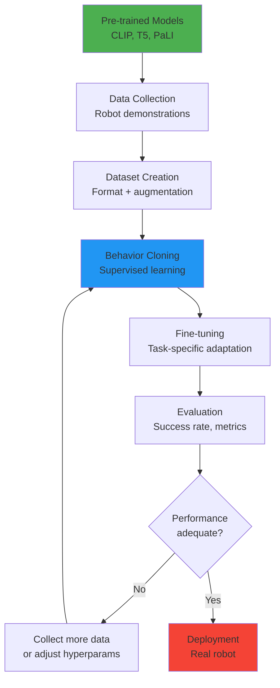
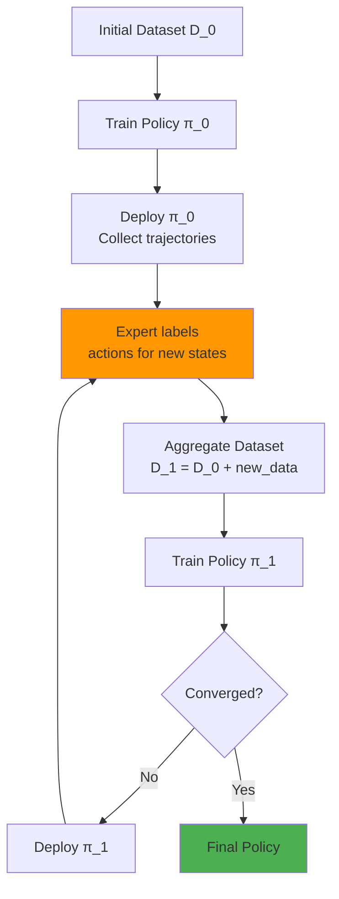
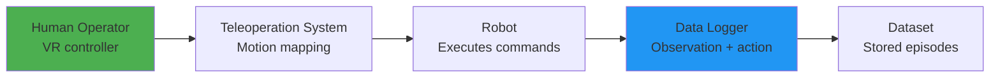
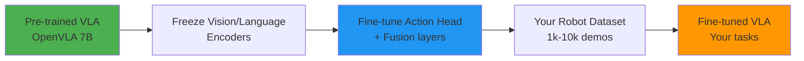

# Chapter 26: Training VLA Models

**Estimated Reading Time**: 55 minutes

## Learning Objectives

By the end of this chapter, you will be able to:

- **LO-4.4.1**: Understand the VLA training pipeline from data collection to deployment
- **LO-4.4.2**: Implement behavior cloning for imitation learning
- **LO-4.4.3**: Design effective robot demonstration collection strategies
- **LO-4.4.4**: Apply data augmentation techniques for robot vision
- **LO-4.4.5**: Fine-tune pre-trained VLA models on custom tasks
- **LO-4.4.6**: Evaluate VLA model performance using task success metrics

---

## 1. The VLA Training Pipeline

### Complete Training Workflow



**Timeline**: 2-4 weeks for a new task (with existing infrastructure)

---

### Training Stages

#### Stage 1: Pre-training (Done Once)

**Vision-Language Model** trained on web data:
- **CLIP**: 400M image-text pairs
- **T5**: 750GB C4 web text
- **PaLI**: Billions of images

**Cost**: $100k - $1M (done by research labs)

**You**: Use pre-trained checkpoints (free)

---

#### Stage 2: Robot Data Collection

**Collect demonstrations** of desired behaviors:
- **Methods**: Teleoperation, kinesthetic teaching, scripted policies
- **Scale**: 100-100k demonstrations per task
- **Format**: (observation, instruction, action) tuples

**Cost**: $10k - $50k (human time + hardware)

---

#### Stage 3: Behavior Cloning

**Train policy** to mimic demonstrations:
- **Method**: Supervised learning (MSE or cross-entropy loss)
- **Duration**: 4-24 hours on GPU
- **Output**: VLA policy checkpoint

---

#### Stage 4: Fine-tuning & Evaluation

**Refine** on specific tasks:
- **Methods**: Online fine-tuning, RL, DAgger
- **Evaluation**: Success rate on test tasks
- **Iterations**: 3-10 cycles

---

## 2. Imitation Learning Fundamentals

### What is Imitation Learning?

**Imitation learning**: Train agents to perform tasks by mimicking expert demonstrations.

**Why for robotics?**
- ✅ No reward engineering (unlike RL)
- ✅ Leverages human expertise
- ✅ Sample-efficient (vs random exploration)
- ✅ Natural for language-conditioned tasks

---

### Behavior Cloning (BC)

**Simplest imitation learning method**: Supervised learning from demonstrations.

```mermaid
graph LR
    A[Expert Demo<br/>Observation + Action] --> B[Dataset<br/>D = &#123;obs, action&#125;]

    B --> C[Policy Network<br/>π&#40;a&#124;obs&#41;]

    C --> D[Loss Function<br/>MSE or CE]

    D --> E[Optimize<br/>Gradient descent]

    E --> C

    style C fill:#2196F3
    style D fill:#FF9800
```



**Training objective**:

```python
# Behavior cloning loss
predicted_action = policy(observation)
true_action = demonstration.action

loss = MSE(predicted_action, true_action)
```

**Advantages**:
- Simple to implement
- No simulator needed
- Fast convergence

**Challenges**:
- **Distribution shift**: Robot deviates from demonstrated states
- **Compounding errors**: Small mistakes accumulate
- **Data-hungry**: Needs diverse demonstrations

---

### BC Implementation

```python
import torch
import torch.nn as nn
import torch.optim as optim

class VLAPolicy(nn.Module):
    def __init__(self, vision_dim=512, language_dim=768, action_dim=7):
        super().__init__()

        # Fusion layer
        self.fusion = nn.Sequential(
            nn.Linear(vision_dim + language_dim, 512),
            nn.ReLU(),
            nn.Dropout(0.1),
        )

        # Action head
        self.action_head = nn.Sequential(
            nn.Linear(512, 256),
            nn.ReLU(),
            nn.Linear(256, action_dim),
        )

    def forward(self, vision_features, language_embedding):
        # Concatenate multimodal features
        combined = torch.cat([vision_features, language_embedding], dim=-1)

        # Fuse and predict action
        fused = self.fusion(combined)
        action = self.action_head(fused)

        return action


def train_behavior_cloning(policy, dataloader, num_epochs=100):
    """Train VLA policy via behavior cloning."""
    optimizer = optim.Adam(policy.parameters(), lr=1e-4)
    criterion = nn.MSELoss()

    for epoch in range(num_epochs):
        total_loss = 0

        for batch in dataloader:
            vision_feat = batch['vision_features']  # (B, 512)
            language_emb = batch['language_embedding']  # (B, 768)
            true_action = batch['action']  # (B, 7)

            # Forward pass
            predicted_action = policy(vision_feat, language_emb)

            # Compute loss
            loss = criterion(predicted_action, true_action)

            # Backward pass
            optimizer.zero_grad()
            loss.backward()
            optimizer.step()

            total_loss += loss.item()

        avg_loss = total_loss / len(dataloader)
        print(f"Epoch {epoch+1}/{num_epochs}, Loss: {avg_loss:.4f}")

    return policy
```

---

### DAgger (Dataset Aggregation)

**Problem with BC**: Robot never sees states it might encounter due to errors.

**Solution**: Iteratively collect more data from policy's mistakes.



**DAgger Algorithm**:
1. Train initial policy from demonstrations
2. Deploy policy, collect visited states
3. Expert provides correct actions for these states
4. Add to dataset, retrain
5. Repeat until performance converges

**Advantage**: Addresses distribution shift by training on policy's own mistakes.

---

## 3. Data Collection Strategies

### Teleoperation

**Method**: Human controls robot remotely via joystick, VR, or motion capture.



**Example - VR Teleoperation**:

```python
import rospy
from geometry_msgs.msg import Twist
from sensor_msgs.msg import Image
import json

class TeleoperationDataCollector:
    def __init__(self):
        self.robot_data = []

        # Subscribe to robot state
        rospy.Subscriber('/camera/image_raw', Image, self.image_callback)
        rospy.Subscriber('/joint_states', JointState, self.joint_callback)

        # Subscribe to VR controller
        rospy.Subscriber('/vr/gripper_pose', PoseStamped, self.vr_callback)

        self.current_image = None
        self.current_joints = None

    def vr_callback(self, msg):
        """Log VR command as expert action."""
        if self.current_image is not None:
            datapoint = {
                'image': self.current_image,
                'robot_state': self.current_joints,
                'action': [msg.pose.position.x,
                           msg.pose.position.y,
                           msg.pose.position.z,
                           msg.pose.orientation.x,
                           msg.pose.orientation.y,
                           msg.pose.orientation.z,
                           msg.pose.orientation.w],
                'timestamp': rospy.Time.now().to_sec()
            }
            self.robot_data.append(datapoint)

    def save_dataset(self, filename='robot_demos.json'):
        with open(filename, 'w') as f:
            json.dump(self.robot_data, f)
        print(f"Saved {len(self.robot_data)} demonstrations")
```

**Pros**:
- High-quality demonstrations
- Human expertise captured

**Cons**:
- Time-consuming (1-2 hours per task)
- Requires teleoperation setup
- Fatigue leads to inconsistency

**Typical scale**: 100-500 demos per task

---

### Kinesthetic Teaching

**Method**: Human physically guides robot through desired motion.

```python
# Enable compliance mode for kinesthetic teaching
def enable_kinesthetic_mode(robot):
    """Set robot joints to zero-gravity mode."""
    for joint in robot.joints:
        joint.set_torque(0)  # Zero torque = easy to move

    print("Robot is now in kinesthetic mode. Guide it through the task.")
```

**Workflow**:
1. Enable compliance mode (low stiffness)
2. Human moves robot through task
3. Record joint positions + end-effector poses
4. Repeat 50-100 times
5. Process into training dataset

**Pros**:
- Intuitive for domain experts
- Fast data collection
- No teleoperation hardware needed

**Cons**:
- Limited to manipulation (not navigation)
- May not capture complex dynamics
- Wears out robot joints over time

---

### Autonomous Collection (Scripted Policies)

**Method**: Use existing controllers to generate diverse data.

```python
def collect_autonomous_data(env, num_episodes=1000):
    """Collect data using scripted policies with randomization."""
    dataset = []

    for episode in range(num_episodes):
        # Reset environment with randomization
        obs = env.reset(
            object_position=np.random.uniform([-0.2, -0.2], [0.2, 0.2]),
            object_color=np.random.choice(['red', 'blue', 'green']),
            lighting=np.random.uniform(0.5, 1.5)
        )

        # Execute scripted policy
        for step in range(50):
            # Simple open-loop controller
            action = compute_scripted_action(obs, step)

            # Execute and record
            next_obs, reward, done, info = env.step(action)

            dataset.append({
                'observation': obs,
                'action': action,
                'language': info['task_instruction']  # e.g., "Pick red cube"
            })

            obs = next_obs
            if done:
                break

    return dataset
```

**Pros**:
- Scales to millions of demonstrations
- No human labor
- Fully automated

**Cons**:
- Limited task diversity
- Policy quality depends on scripted controller
- May learn scripted policy's biases

**Use case**: Pre-training, augmenting human data

---

### Sim-to-Real Data

**Method**: Generate data in Isaac Sim with domain randomization.

```python
# Isaac Sim data generation
from omni.isaac.kit import SimulationApp

def generate_sim_data(num_episodes=10000):
    """Generate diverse robot data in Isaac Sim."""
    simulation_app = SimulationApp({"headless": True})

    from omni.isaac.core import World
    from omni.isaac.manipulators import SingleManipulator
    from omni.isaac.core.objects import DynamicCuboid

    world = World()
    robot = world.scene.add(SingleManipulator(name="Franka"))

    dataset = []

    for episode in range(num_episodes):
        # Domain randomization
        cube = world.scene.add(DynamicCuboid(
            name="target_cube",
            position=np.random.uniform([-0.3, -0.3, 0.5], [0.3, 0.3, 0.7]),
            size=np.random.uniform(0.03, 0.08),
            color=np.random.rand(3)  # Random RGB
        ))

        # Randomize lighting
        world.set_lighting_intensity(np.random.uniform(500, 2000))

        # Execute task and record
        obs = world.get_observations()
        action = robot.compute_ik_solution(target=cube.get_position())

        dataset.append({
            'image': obs['camera'],
            'robot_state': obs['joint_positions'],
            'action': action,
            'instruction': f"Pick the cube"
        })

        world.reset()

    return dataset
```

**Pros**:
- Infinite data
- Perfect labels
- Diverse scenarios via randomization

**Cons**:
- Sim-to-real gap
- Requires simulation infrastructure
- May not capture real-world complexities

---

## 4. Dataset Construction

### Data Format

**Standard VLA dataset format**:

```python
{
    "episode_id": 42,
    "steps": [
        {
            "observation": {
                "image": np.array([224, 224, 3]),  # RGB camera
                "robot_state": np.array([7]),       # Joint positions
                "gripper_state": 0.0                # Open/closed
            },
            "action": {
                "delta_pos": np.array([0.01, 0.02, 0.0]),  # Δx, Δy, Δz
                "delta_rot": np.array([0.0, 0.0, 0.1]),    # Δroll, pitch, yaw
                "gripper": 1.0                              # Close gripper
            },
            "language_instruction": "Pick up the red cube",
            "timestamp": 1234567890.5
        },
        # ... more steps
    ],
    "success": True  # Did episode succeed?
}
```

---

### Data Augmentation

**Challenge**: Robot data is expensive → Need to maximize utility.

**Solution**: Augment observations while preserving action labels.

#### Image Augmentation

```python
import torchvision.transforms as T

def augment_image(image):
    """Apply robot-safe image augmentations."""
    augmentation = T.Compose([
        T.RandomApply([T.ColorJitter(brightness=0.2, contrast=0.2, saturation=0.2)], p=0.5),
        T.RandomApply([T.GaussianBlur(kernel_size=3)], p=0.3),
        T.RandomAdjustSharpness(sharpness_factor=1.5, p=0.3),
        # DO NOT use random rotation/flip - changes spatial semantics!
    ])

    return augmentation(image)
```

**Safe augmentations**:
- ✅ Color jitter (lighting changes)
- ✅ Gaussian noise (sensor noise)
- ✅ Blur (camera defocus)
- ✅ Brightness/contrast

**Unsafe augmentations**:
- ❌ Random rotation (changes spatial layout)
- ❌ Random flip (mirrors scene)
- ❌ Random crop (loses context)

---

#### Temporal Augmentation

**Frame stacking**: Use multiple consecutive frames as input.

```python
def stack_frames(observations, num_frames=3):
    """Stack N consecutive frames as input."""
    stacked = []
    for i in range(len(observations) - num_frames + 1):
        frames = [observations[i + j]['image'] for j in range(num_frames)]
        stacked_image = np.concatenate(frames, axis=-1)  # (224, 224, 9) for 3 frames
        stacked.append({
            'image': stacked_image,
            'action': observations[i + num_frames - 1]['action']
        })
    return stacked
```

**Benefit**: Captures motion and temporal context.

---

#### Language Augmentation

**Paraphrase instructions** to improve generalization:

```python
paraphrases = {
    "Pick up the red cup": [
        "Grasp the red mug",
        "Lift the red cup",
        "Pick the red cup",
        "Get the red cup"
    ],
    "Place on the table": [
        "Put on the table",
        "Set down on the table",
        "Move to the table"
    ]
}

def augment_instruction(instruction):
    """Randomly select paraphrase."""
    if instruction in paraphrases:
        return random.choice(paraphrases[instruction])
    return instruction
```

**Warning**: Only use semantically equivalent paraphrases!

---

## 5. Fine-tuning Pipeline

### Transfer Learning for VLA

**Scenario**: You have a pre-trained VLA model (e.g., OpenVLA) and want to adapt it to your robot.



---

### Fine-tuning Implementation

```python
import torch
from openvla import OpenVLA

def fine_tune_vla(base_model_path, train_dataloader, num_epochs=10):
    """Fine-tune pre-trained VLA on custom robot data."""

    # Load pre-trained model
    model = OpenVLA.from_pretrained(base_model_path)

    # Freeze vision and language encoders
    for param in model.vision_encoder.parameters():
        param.requires_grad = False
    for param in model.language_encoder.parameters():
        param.requires_grad = False

    # Only train action head and fusion layers
    trainable_params = list(model.fusion.parameters()) + list(model.action_head.parameters())
    optimizer = torch.optim.AdamW(trainable_params, lr=1e-5)

    # Training loop
    model.train()
    for epoch in range(num_epochs):
        total_loss = 0

        for batch in train_dataloader:
            images = batch['images']  # (B, 3, 224, 224)
            instructions = batch['instructions']  # (B, max_len)
            robot_states = batch['robot_states']  # (B, 7)
            actions = batch['actions']  # (B, 7)

            # Forward pass
            predicted_actions = model(images, instructions, robot_states)

            # Loss
            loss = torch.nn.functional.mse_loss(predicted_actions, actions)

            # Backward pass
            optimizer.zero_grad()
            loss.backward()
            optimizer.step()

            total_loss += loss.item()

        print(f"Epoch {epoch+1}, Loss: {total_loss/len(train_dataloader):.4f}")

    # Save fine-tuned model
    torch.save(model.state_dict(), "vla_finetuned.pth")
    return model
```

---

### Learning Rate Scheduling

**Use warmup + cosine decay** for stable fine-tuning:

```python
from torch.optim.lr_scheduler import CosineAnnealingLR

def get_scheduler(optimizer, num_epochs, warmup_epochs=2):
    """Learning rate scheduler with warmup."""

    def lr_lambda(epoch):
        if epoch < warmup_epochs:
            return (epoch + 1) / warmup_epochs  # Linear warmup
        else:
            # Cosine decay
            progress = (epoch - warmup_epochs) / (num_epochs - warmup_epochs)
            return 0.5 * (1 + np.cos(np.pi * progress))

    return torch.optim.lr_scheduler.LambdaLR(optimizer, lr_lambda)
```

---

## 6. Evaluation Metrics

### Task Success Rate

**Primary metric**: Fraction of episodes where robot completes task.

```python
def evaluate_policy(policy, test_tasks, num_trials=100):
    """Evaluate VLA policy on test tasks."""
    successes = 0

    for trial in range(num_trials):
        # Reset environment
        obs = env.reset(task=random.choice(test_tasks))

        for step in range(max_steps):
            # Policy prediction
            action = policy.predict(obs['image'], obs['instruction'], obs['robot_state'])

            # Execute
            obs, reward, done, info = env.step(action)

            if done:
                if info['success']:
                    successes += 1
                break

    success_rate = successes / num_trials
    print(f"Success Rate: {success_rate:.2%}")
    return success_rate
```

---

### Action Prediction Error

**Metric**: MSE between predicted and expert actions (offline evaluation).

```python
def compute_action_error(policy, validation_dataset):
    """Compute average action prediction error."""
    total_error = 0
    count = 0

    for batch in validation_dataset:
        predicted_actions = policy(batch['images'], batch['instructions'], batch['robot_states'])
        true_actions = batch['actions']

        error = torch.nn.functional.mse_loss(predicted_actions, true_actions)
        total_error += error.item()
        count += 1

    return total_error / count
```

---

### Generalization Metrics

**Test on unseen variations**:

1. **Object generalization**: New object shapes/colors
2. **Spatial generalization**: Different positions
3. **Instruction generalization**: Paraphrased commands
4. **Background generalization**: Different lighting/scenes

```python
generalization_tests = {
    'seen_objects': evaluate_policy(policy, seen_objects),
    'unseen_colors': evaluate_policy(policy, novel_colors),
    'unseen_positions': evaluate_policy(policy, random_positions),
    'paraphrases': evaluate_policy(policy, paraphrased_instructions)
}

for test_name, success_rate in generalization_tests.items():
    print(f"{test_name}: {success_rate:.2%}")
```

---

## Lab Exercise 4.4: Train a Behavior Cloning Policy

### Objective
Implement behavior cloning to train a simple VLA policy on simulated robot data.

### Part 1: Setup (10 minutes)

```bash
pip install torch torchvision numpy matplotlib
```

---

### Part 2: Create Synthetic Dataset (20 minutes)

**Task**: Generate simple pick-and-place demonstrations

```python
import numpy as np
import torch

def generate_synthetic_data(num_episodes=1000):
    """Generate synthetic robot demonstrations."""
    dataset = []

    for episode in range(num_episodes):
        # Random object position
        object_pos = np.random.uniform([-0.3, -0.3], [0.3, 0.3])

        # Trajectory: move toward object, then to target
        trajectory = []
        for t in range(10):
            if t < 5:
                # Approach object
                target = object_pos
            else:
                # Move to bin
                target = np.array([0.5, 0.5])

            # Current gripper position
            current_pos = np.array([0.0, 0.0]) if t == 0 else trajectory[-1]['next_pos']

            # Action: proportional control
            action = 0.2 * (target - current_pos)

            # Observation: object in image (simplified as coordinates)
            obs = np.concatenate([object_pos, current_pos])

            trajectory.append({
                'observation': obs,
                'action': action,
                'next_pos': current_pos + action
            })

        dataset.extend(trajectory)

    return dataset

# Generate data
train_data = generate_synthetic_data(num_episodes=1000)
print(f"Generated {len(train_data)} demonstrations")
```

---

### Part 3: Implement Policy Network (20 minutes)

```python
import torch.nn as nn

class SimplePolicy(nn.Module):
    def __init__(self, obs_dim=4, action_dim=2):
        super().__init__()
        self.network = nn.Sequential(
            nn.Linear(obs_dim, 64),
            nn.ReLU(),
            nn.Linear(64, 64),
            nn.ReLU(),
            nn.Linear(64, action_dim)
        )

    def forward(self, obs):
        return self.network(obs)

# Instantiate
policy = SimplePolicy()
print(f"Policy parameters: {sum(p.numel() for p in policy.parameters())}")
```

---

### Part 4: Train with Behavior Cloning (30 minutes)

```python
def train_bc(policy, dataset, num_epochs=100, batch_size=64):
    """Train policy via behavior cloning."""
    optimizer = torch.optim.Adam(policy.parameters(), lr=1e-3)
    criterion = nn.MSELoss()

    # Convert to tensors
    observations = torch.FloatTensor([d['observation'] for d in dataset])
    actions = torch.FloatTensor([d['action'] for d in dataset])

    # Training loop
    for epoch in range(num_epochs):
        # Shuffle data
        indices = torch.randperm(len(observations))

        total_loss = 0
        for i in range(0, len(observations), batch_size):
            batch_idx = indices[i:i+batch_size]
            obs_batch = observations[batch_idx]
            action_batch = actions[batch_idx]

            # Forward pass
            predicted_actions = policy(obs_batch)
            loss = criterion(predicted_actions, action_batch)

            # Backward pass
            optimizer.zero_grad()
            loss.backward()
            optimizer.step()

            total_loss += loss.item()

        if (epoch + 1) % 10 == 0:
            print(f"Epoch {epoch+1}, Loss: {total_loss/len(observations)*batch_size:.4f}")

    return policy

# Train
trained_policy = train_bc(policy, train_data, num_epochs=100)
```

---

### Part 5: Evaluate (20 minutes)

```python
def evaluate(policy, num_tests=100):
    """Evaluate trained policy."""
    successes = 0

    for test in range(num_tests):
        object_pos = np.random.uniform([-0.3, -0.3], [0.3, 0.3])
        current_pos = np.array([0.0, 0.0])

        # Rollout policy
        for step in range(10):
            obs = np.concatenate([object_pos, current_pos])
            obs_tensor = torch.FloatTensor(obs).unsqueeze(0)

            with torch.no_grad():
                action = policy(obs_tensor).numpy()[0]

            current_pos += action

            # Check if reached target
            if step >= 5 and np.linalg.norm(current_pos - np.array([0.5, 0.5])) < 0.1:
                successes += 1
                break

    success_rate = successes / num_tests
    print(f"Success Rate: {success_rate:.2%}")
    return success_rate

# Evaluate
evaluate(trained_policy, num_tests=100)
```

---

### Deliverables

1. Python script with complete BC implementation
2. Training loss curve (matplotlib plot)
3. Evaluation results (success rate)
4. Short report (300 words) on findings

---

## Quiz 4.4: VLA Training

### Question 1
**What is the primary objective of behavior cloning?**

- A) Maximize reward
- B) Mimic expert demonstrations ✓
- C) Explore environment
- D) Generate new behaviors

**Explanation**: Behavior cloning is supervised learning where the policy learns to replicate expert actions.

---

### Question 2
**What is the main challenge of behavior cloning?**

- A) Requires too much compute
- B) Distribution shift and compounding errors ✓
- C) Cannot handle language
- D) Too slow to train

**Explanation**: BC suffers from distribution shift - policy visits states not in training data, leading to accumulating errors.

---

### Question 3
**Which data collection method is most scalable?**

- A) Teleoperation
- B) Kinesthetic teaching
- C) Simulation with domain randomization ✓
- D) Manual scripting

**Explanation**: Simulation can generate millions of demonstrations automatically with diverse conditions.

---

### Question 4
**True or False: You should apply random rotations to robot camera images during data augmentation.**

- False ✓

**Explanation**: Random rotations change spatial semantics and would require corresponding action transformations. Color/brightness augmentations are safer.

---

### Question 5
**What is DAgger and why is it useful? (Short answer)**

**Expected Answer**: DAgger (Dataset Aggregation) is an iterative imitation learning algorithm that addresses distribution shift by repeatedly deploying the learned policy, collecting states it visits, obtaining expert labels for those states, and retraining. This ensures the policy trains on its own distribution, reducing compounding errors.

---

## Key Takeaways

✅ **VLA training pipeline**: Pre-training → Data collection → Behavior cloning → Fine-tuning

✅ **Behavior cloning** is supervised learning from expert demonstrations

✅ **Data collection methods**: Teleoperation (high-quality), simulation (scalable), kinesthetic (intuitive)

✅ **Data augmentation**: Color jitter and blur are safe; avoid spatial transformations

✅ **Fine-tuning** adapts pre-trained VLA models to new robots and tasks

✅ **Evaluation**: Success rate (primary), action error (offline), generalization tests

---

## What's Next?

In **Chapter 27**, you'll learn how to deploy VLA models on real robots with inference optimization, ROS 2 integration, and real-time constraints.

[Continue to Chapter 27: Deploying VLA Models →](/docs/module-4-vla/week-14/chapter-27-vla-deployment)

---

## Additional Resources

- **Behavioral Cloning**: [A Reduction of Imitation Learning (arxiv.org/abs/1011.0686)](https://arxiv.org/abs/1011.0686)
- **DAgger**: [A Reduction of Imitation Learning and Structured Prediction (arxiv.org/abs/1011.0686)](https://arxiv.org/abs/1011.0686)
- **RT-1 Training**: [Robotics Transformer (arxiv.org/abs/2212.06817)](https://arxiv.org/abs/2212.06817)
- **Data Augmentation for Robotics**: [Learning Dexterous Manipulation (arxiv.org/abs/1808.00177)](https://arxiv.org/abs/1808.00177)

---

**Progress**: Module 4, Week 13, Chapter 26 of 32 | [View all chapters](/docs/intro)
