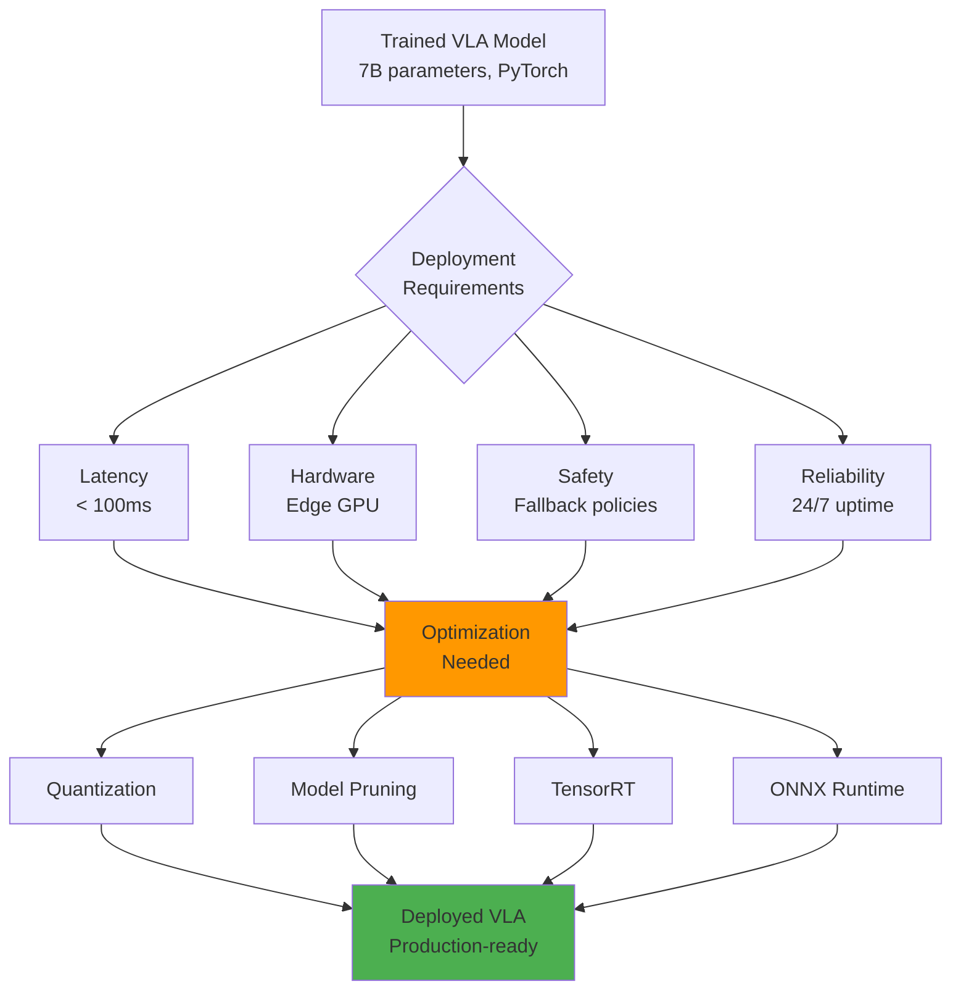
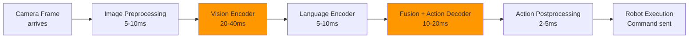
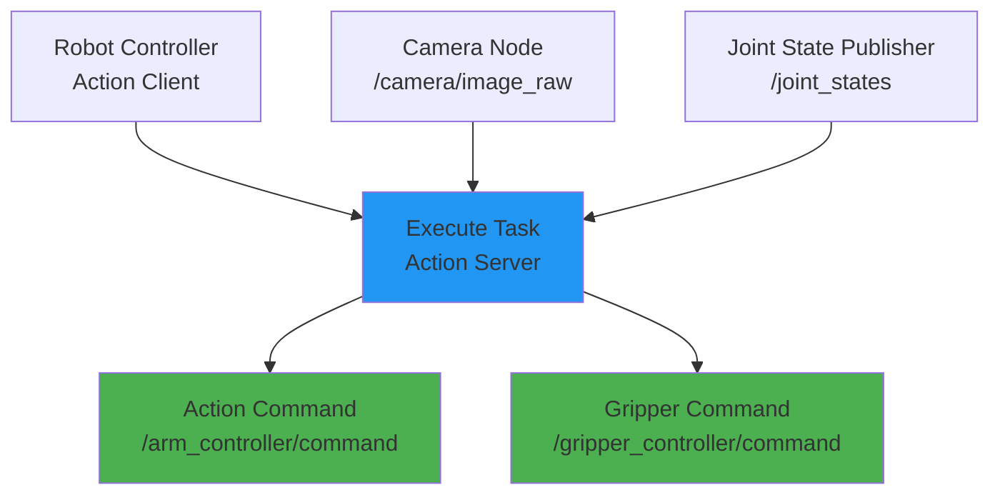
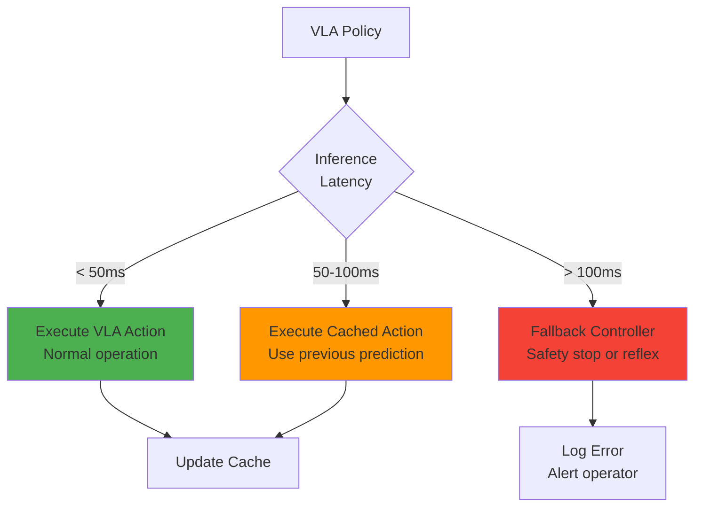

# Chapter 27: Deploying VLA Models

**Estimated Reading Time**: 55 minutes

## Learning Objectives

By the end of this chapter, you will be able to:

- **LO-4.5.1**: Optimize VLA model inference for real-time robot control
- **LO-4.5.2**: Integrate VLA policies with ROS 2 action servers and topics
- **LO-4.5.3**: Apply quantization and pruning to reduce model size
- **LO-4.5.4**: Deploy VLA models on edge devices (Jetson Orin, NVIDIA GPUs)
- **LO-4.5.5**: Handle latency constraints and implement fallback strategies
- **LO-4.5.6**: Monitor and debug deployed VLA systems in production

---

## 1. The Deployment Challenge

### From Training to Production

**Training environment** (offline):
- High-end GPU workstation (A100, H100)
- Unlimited inference time
- Perfect network connectivity
- Can retry failed predictions

**Production environment** (online robot):
- Edge compute (Jetson Orin, laptop GPU)
- Real-time constraints (&lt;100ms latency)
- Unreliable networks
- Safety-critical decisions



---

## 2. Real-Time Constraints

### Control Frequency Requirements

Different robot tasks have different latency requirements:

| Task Type | Max Latency | Control Frequency | Example |
|-----------|-------------|-------------------|---------|
| **High-speed manipulation** | 10-20ms | 50-100 Hz | Catching, juggling |
| **Standard manipulation** | 50-100ms | 10-20 Hz | Pick-and-place, assembly |
| **Mobile navigation** | 100-200ms | 5-10 Hz | Autonomous driving |
| **Slow tasks** | 200-500ms | 2-5 Hz | Long-horizon planning |

**VLA models**: Typically target 50-100ms (10-20 Hz) for manipulation.

---

### Latency Breakdown



**Total pipeline latency**: 42-85ms (typical for optimized VLA)

**Bottlenecks**:
1. Vision encoder (largest model component)
2. Action decoder (autoregressive generation)
3. Data transfer (CPU ↔ GPU)

---

## 3. Inference Optimization

### Model Quantization

**Quantization**: Reduce precision from FP32 → FP16 or INT8.

**Benefits**:
- 2-4x faster inference
- 2-4x smaller model size
- Lower memory bandwidth

#### FP16 (Half Precision)

```python
import torch

# Load model in FP32
model = VLAModel.from_pretrained("openvla-7b")

# Convert to FP16
model = model.half()  # All weights now 16-bit

# Inference
with torch.cuda.amp.autocast():
    action = model(image, instruction, robot_state)

print(f"Model size: {model.get_memory_footprint() / 1e9:.2f} GB")
# FP32: 28 GB → FP16: 14 GB
```

**Accuracy impact**: Minimal (&lt;1% performance drop)

---

#### INT8 Quantization

**More aggressive**: 8-bit integers instead of floats.

```python
import torch.quantization as quantization

# Post-training static quantization
model_fp32 = VLAModel.from_pretrained("openvla-7b")
model_fp32.eval()

# Prepare for quantization
model_fp32.qconfig = quantization.get_default_qconfig('fbgemm')
model_prepared = quantization.prepare(model_fp32)

# Calibrate with representative data
for batch in calibration_dataloader:
    model_prepared(batch['images'], batch['instructions'])

# Convert to INT8
model_int8 = quantization.convert(model_prepared)

# Inference (4x faster!)
action = model_int8(image, instruction)
```

**Accuracy impact**: 2-5% performance drop (acceptable for most tasks)

**Speedup**: 3-4x faster than FP32

---

### TensorRT Optimization

**NVIDIA TensorRT**: Optimize models for NVIDIA GPUs (Jetson, RTX, data center).

```python
import torch_tensorrt

# Load PyTorch model
model = VLAModel.from_pretrained("openvla-7b")
model.eval()

# Define input shapes
inputs = [
    torch_tensorrt.Input(
        shape=[1, 3, 224, 224],  # Images
        dtype=torch.float16
    ),
    torch_tensorrt.Input(
        shape=[1, 32],  # Instruction tokens
        dtype=torch.long
    ),
    torch_tensorrt.Input(
        shape=[1, 7],  # Robot state
        dtype=torch.float16
    )
]

# Compile to TensorRT
trt_model = torch_tensorrt.compile(
    model,
    inputs=inputs,
    enabled_precisions={torch.float16},  # FP16 mode
    workspace_size=1 << 30  # 1GB workspace
)

# Save optimized model
torch.jit.save(trt_model, "vla_tensorrt.ts")

# Inference (up to 5x faster!)
with torch.no_grad():
    action = trt_model(image, instruction, robot_state)
```

**Speedup**: 3-5x faster than PyTorch FP16

---

### ONNX Runtime

**ONNX**: Open format for cross-platform deployment.

```python
import torch
import onnx
import onnxruntime as ort

# Export PyTorch model to ONNX
model = VLAModel.from_pretrained("openvla-7b")
model.eval()

dummy_image = torch.randn(1, 3, 224, 224)
dummy_instruction = torch.randint(0, 32000, (1, 32))
dummy_robot_state = torch.randn(1, 7)

torch.onnx.export(
    model,
    (dummy_image, dummy_instruction, dummy_robot_state),
    "vla_model.onnx",
    input_names=['image', 'instruction', 'robot_state'],
    output_names=['action'],
    dynamic_axes={
        'image': {0: 'batch_size'},
        'instruction': {0: 'batch_size', 1: 'seq_len'},
        'robot_state': {0: 'batch_size'},
        'action': {0: 'batch_size'}
    }
)

# Load with ONNX Runtime
session = ort.InferenceSession(
    "vla_model.onnx",
    providers=['CUDAExecutionProvider', 'CPUExecutionProvider']
)

# Inference
outputs = session.run(
    ['action'],
    {
        'image': image.numpy(),
        'instruction': instruction.numpy(),
        'robot_state': robot_state.numpy()
    }
)
action = outputs[0]
```

**Benefits**:
- Cross-platform (CPU, GPU, mobile)
- Optimized execution
- Hardware-agnostic

---

### Batch Inference

**For multiple robots or offline evaluation**:

```python
def batch_inference(model, images, instructions, robot_states):
    """Process multiple observations in parallel."""
    # Batch inputs
    images_batch = torch.stack(images)  # (N, 3, 224, 224)
    instructions_batch = torch.stack(instructions)  # (N, 32)
    states_batch = torch.stack(robot_states)  # (N, 7)

    # Single forward pass for all robots
    with torch.no_grad():
        actions_batch = model(images_batch, instructions_batch, states_batch)

    return actions_batch

# Example: Control 4 robots simultaneously
actions = batch_inference(model, [img1, img2, img3, img4],
                         [inst1, inst2, inst3, inst4],
                         [state1, state2, state3, state4])
# 4x throughput improvement!
```

---

## 4. ROS 2 Integration

### VLA as ROS 2 Action Server

**Architecture**: VLA policy runs as ROS 2 action server, robot controllers are action clients.



---

### Action Server Implementation

**Define custom action** (`VLAExecuteTask.action`):

```yaml
# Goal: Task instruction
string instruction
sensor_msgs/Image observation
float32[] robot_state
---
# Result: Success/failure
bool success
string message
---
# Feedback: Current progress
float32 progress
string current_state
```

**Action server node**:

```python
import rclpy
from rclpy.action import ActionServer
from rclpy.node import Node
import torch

from my_robot_interfaces.action import VLAExecuteTask
from sensor_msgs.msg import Image, JointState
from trajectory_msgs.msg import JointTrajectory, JointTrajectoryPoint

class VLAPolicyServer(Node):
    def __init__(self):
        super().__init__('vla_policy_server')

        # Load VLA model
        self.model = VLAModel.from_pretrained("openvla-7b")
        self.model.eval()
        self.model.to('cuda')

        # Action server
        self._action_server = ActionServer(
            self,
            VLAExecuteTask,
            '/vla_policy/execute_task',
            self.execute_callback
        )

        # Publishers
        self.action_pub = self.create_publisher(
            JointTrajectory,
            '/arm_controller/command',
            10
        )

        self.get_logger().info('VLA Policy Server ready')

    def execute_callback(self, goal_handle):
        """Execute VLA policy for given task."""
        self.get_logger().info(f'Executing: {goal_handle.request.instruction}')

        # Extract goal
        instruction = goal_handle.request.instruction
        image = self.bridge.imgmsg_to_cv2(goal_handle.request.observation)
        robot_state = goal_handle.request.robot_state

        # Control loop
        for step in range(100):  # Max 100 steps
            # VLA inference
            with torch.no_grad():
                action = self.model.predict(
                    image,
                    instruction,
                    robot_state
                )

            # Publish action
            self.publish_action(action)

            # Feedback
            feedback = VLAExecuteTask.Feedback()
            feedback.progress = step / 100.0
            goal_handle.publish_feedback(feedback)

            # Check success (implement task-specific logic)
            if self.check_success(instruction, image):
                goal_handle.succeed()
                result = VLAExecuteTask.Result()
                result.success = True
                result.message = "Task completed successfully"
                return result

            # Sleep to maintain control rate
            self.rate.sleep()

        # Timeout
        goal_handle.abort()
        result = VLAExecuteTask.Result()
        result.success = False
        result.message = "Task timeout"
        return result

    def publish_action(self, action):
        """Convert VLA action to ROS 2 command."""
        msg = JointTrajectory()
        msg.header.stamp = self.get_clock().now().to_msg()
        msg.joint_names = ['joint1', 'joint2', 'joint3', 'joint4',
                          'joint5', 'joint6', 'joint7']

        point = JointTrajectoryPoint()
        point.positions = action.tolist()
        point.time_from_start.sec = 0
        point.time_from_start.nanosec = 100_000_000  # 100ms

        msg.points = [point]
        self.action_pub.publish(msg)

def main():
    rclpy.init()
    server = VLAPolicyServer()
    rclpy.spin(server)

if __name__ == '__main__':
    main()
```

---

### Launch File

```xml
<!-- vla_deployment.launch.xml -->
<launch>
  <!-- Camera driver -->
  <node pkg="realsense2_camera" exec="realsense2_camera_node" name="camera">
    <param name="color_width" value="640"/>
    <param name="color_height" value="480"/>
    <param name="color_fps" value="30"/>
  </node>

  <!-- Robot state publisher -->
  <node pkg="robot_state_publisher" exec="robot_state_publisher" name="robot_state_publisher">
    <param name="robot_description" value="$(find my_robot)/urdf/robot.urdf"/>
  </node>

  <!-- VLA policy server -->
  <node pkg="vla_deployment" exec="vla_policy_server" name="vla_policy_server">
    <param name="model_path" value="$(find vla_deployment)/models/openvla_finetuned.pth"/>
    <param name="device" value="cuda"/>
    <param name="control_rate" value="10.0"/>  <!-- 10 Hz -->
  </node>

  <!-- Robot controllers -->
  <include file="$(find my_robot)/launch/controllers.launch.xml"/>
</launch>
```

---

## 5. Edge Deployment

### Target Hardware

| Device | GPU | Memory | TDP | Use Case |
|--------|-----|--------|-----|----------|
| **Jetson Orin Nano** | 1024 CUDA cores | 8GB | 15W | Mobile robots |
| **Jetson Orin NX** | 1024 cores | 16GB | 25W | Humanoid arms |
| **Jetson AGX Orin** | 2048 cores | 64GB | 60W | Full humanoids |
| **Laptop RTX 4060** | 3072 cores | 8GB | 115W | Research robots |
| **Desktop RTX 4090** | 16384 cores | 24GB | 450W | Multi-robot control |

**Recommendation**: Jetson AGX Orin for humanoid robots (good balance of power and performance).

---

### Docker Deployment

**Containerize VLA model** for reproducibility:

```dockerfile
# Dockerfile
FROM nvcr.io/nvidia/pytorch:24.01-py3

# Install dependencies
RUN pip install transformers==4.36.0 \
                 omegaconf==2.3.0 \
                 opencv-python==4.8.1.78 \
                 rclpy

# Copy model and code
COPY models/ /workspace/models/
COPY src/ /workspace/src/

# Set environment
ENV MODEL_PATH=/workspace/models/openvla_finetuned.pth
ENV DEVICE=cuda

WORKDIR /workspace

# Run VLA server
CMD ["python", "src/vla_policy_server.py"]
```

**Build and run**:

```bash
# Build image
docker build -t vla_deployment:latest .

# Run with GPU support
docker run --gpus all \
           --network host \
           -v /dev:/dev \
           --privileged \
           vla_deployment:latest
```

---

### Jetson Deployment

**Optimize for Jetson** using TensorRT:

```python
import tensorrt as trt
import torch

def optimize_for_jetson(model_path, output_path):
    """Optimize VLA model for Jetson Orin."""

    # Load model
    model = torch.load(model_path)
    model.eval()

    # Export to ONNX first
    torch.onnx.export(model, dummy_inputs, "vla_temp.onnx")

    # TensorRT builder
    logger = trt.Logger(trt.Logger.WARNING)
    builder = trt.Builder(logger)
    network = builder.create_network()
    parser = trt.OnnxParser(network, logger)

    with open("vla_temp.onnx", "rb") as f:
        parser.parse(f.read())

    # Build engine with FP16 precision (Jetson optimized)
    config = builder.create_builder_config()
    config.set_flag(trt.BuilderFlag.FP16)
    config.max_workspace_size = 4 << 30  # 4GB

    engine = builder.build_engine(network, config)

    # Save
    with open(output_path, "wb") as f:
        f.write(engine.serialize())

    print(f"Optimized model saved to {output_path}")

# Usage
optimize_for_jetson("openvla_7b.pth", "vla_jetson.trt")
```

**Expected performance on Jetson AGX Orin**:
- FP32: 250ms latency
- FP16: 80ms latency
- TensorRT FP16: 45ms latency

---

## 6. Handling Latency and Safety

### Fallback Strategies



---

### Safety Monitor Implementation

```python
import time
import threading

class SafetyMonitor:
    def __init__(self, max_latency_ms=100, emergency_stop_threshold=200):
        self.max_latency = max_latency_ms / 1000.0
        self.emergency_threshold = emergency_stop_threshold / 1000.0
        self.last_action = None
        self.last_update_time = time.time()

    def check_latency(self, action, inference_time):
        """Monitor inference latency and apply safety policies."""
        current_time = time.time()

        if inference_time > self.emergency_threshold:
            # Emergency stop
            self.trigger_emergency_stop()
            return self.get_safe_action()

        elif inference_time > self.max_latency:
            # Use cached action
            if self.last_action is not None:
                print(f"[WARN] High latency ({inference_time*1000:.1f}ms), using cached action")
                return self.last_action
            else:
                return self.get_safe_action()

        else:
            # Normal operation
            self.last_action = action
            self.last_update_time = current_time
            return action

    def get_safe_action(self):
        """Return safe default action (e.g., zero velocity)."""
        return np.zeros(7)  # All joints stationary

    def trigger_emergency_stop(self):
        """Emergency stop robot."""
        print("[ERROR] Emergency stop triggered - inference timeout!")
        # Publish emergency stop command
        # Send alert to operator
        # Log incident

# Usage in VLA server
safety_monitor = SafetyMonitor(max_latency_ms=100)

start_time = time.time()
action = model.predict(image, instruction, robot_state)
inference_time = time.time() - start_time

safe_action = safety_monitor.check_latency(action, inference_time)
robot.execute(safe_action)
```

---

### Asynchronous Inference

**Overlap computation and execution**:

```python
import asyncio
from concurrent.futures import ThreadPoolExecutor

class AsyncVLAController:
    def __init__(self, model):
        self.model = model
        self.executor = ThreadPoolExecutor(max_workers=1)
        self.latest_action = None

    async def async_inference(self, image, instruction, robot_state):
        """Run VLA inference in background thread."""
        loop = asyncio.get_event_loop()
        action = await loop.run_in_executor(
            self.executor,
            self.model.predict,
            image, instruction, robot_state
        )
        self.latest_action = action
        return action

    async def control_loop(self, robot):
        """Asynchronous control loop."""
        while True:
            # Get latest observation
            image = robot.get_camera_image()
            robot_state = robot.get_joint_states()

            # Start inference (non-blocking)
            inference_task = asyncio.create_task(
                self.async_inference(image, instruction, robot_state)
            )

            # Execute previous action while computing next one
            if self.latest_action is not None:
                robot.execute_action(self.latest_action)

            # Wait for inference to complete
            await inference_task

            # Control rate (10 Hz)
            await asyncio.sleep(0.1)

# Run async controller
controller = AsyncVLAController(model)
asyncio.run(controller.control_loop(robot))
```

---

## 7. Monitoring and Debugging

### Performance Metrics

```python
import time
import numpy as np
from collections import deque

class PerformanceMonitor:
    def __init__(self, window_size=100):
        self.latencies = deque(maxlen=window_size)
        self.success_count = 0
        self.failure_count = 0

    def record_latency(self, latency_ms):
        """Record inference latency."""
        self.latencies.append(latency_ms)

    def record_result(self, success):
        """Record task outcome."""
        if success:
            self.success_count += 1
        else:
            self.failure_count += 1

    def get_stats(self):
        """Compute performance statistics."""
        if len(self.latencies) == 0:
            return {}

        latencies_np = np.array(self.latencies)
        total_tasks = self.success_count + self.failure_count

        return {
            'mean_latency_ms': np.mean(latencies_np),
            'p50_latency_ms': np.percentile(latencies_np, 50),
            'p95_latency_ms': np.percentile(latencies_np, 95),
            'p99_latency_ms': np.percentile(latencies_np, 99),
            'max_latency_ms': np.max(latencies_np),
            'success_rate': self.success_count / total_tasks if total_tasks > 0 else 0.0,
            'total_tasks': total_tasks
        }

    def print_report(self):
        """Print performance report."""
        stats = self.get_stats()
        print("\n=== VLA Performance Report ===")
        print(f"Mean Latency: {stats.get('mean_latency_ms', 0):.1f} ms")
        print(f"P95 Latency:  {stats.get('p95_latency_ms', 0):.1f} ms")
        print(f"P99 Latency:  {stats.get('p99_latency_ms', 0):.1f} ms")
        print(f"Success Rate: {stats.get('success_rate', 0):.1%}")
        print(f"Total Tasks:  {stats.get('total_tasks', 0)}")
        print("=" * 30)

# Usage
monitor = PerformanceMonitor()

for task in tasks:
    start = time.time()
    result = execute_task(task)
    latency = (time.time() - start) * 1000

    monitor.record_latency(latency)
    monitor.record_result(result.success)

monitor.print_report()
```

---

### Logging and Telemetry

```python
import logging
from datetime import datetime

# Setup logging
logging.basicConfig(
    level=logging.INFO,
    format='%(asctime)s [%(levelname)s] %(message)s',
    handlers=[
        logging.FileHandler(f'vla_deployment_{datetime.now().strftime("%Y%m%d")}.log'),
        logging.StreamHandler()
    ]
)

logger = logging.getLogger('VLA_Deployment')

# Log inference events
logger.info(f"VLA inference started: {instruction}")
logger.info(f"Inference completed in {latency_ms:.1f}ms")

if latency_ms > 100:
    logger.warning(f"High latency detected: {latency_ms:.1f}ms")

if error:
    logger.error(f"VLA inference failed: {error}")
```

---

## Lab Exercise 4.5: Deploy VLA with ROS 2

### Objective
Create a complete VLA deployment pipeline with ROS 2 integration and performance monitoring.

### Prerequisites
- ROS 2 Humble installed
- Python 3.8+
- PyTorch with CUDA
- Simulated robot (Gazebo) or real robot

### Part 1: Setup ROS 2 Workspace (15 minutes)

```bash
# Create workspace
mkdir -p ~/vla_ws/src
cd ~/vla_ws/src

# Create package
ros2 pkg create vla_deployment \
    --build-type ament_python \
    --dependencies rclpy sensor_msgs trajectory_msgs

cd ~/vla_ws
colcon build
source install/setup.bash
```

---

### Part 2: Implement VLA Action Server (30 minutes)

**File**: `vla_ws/src/vla_deployment/vla_deployment/vla_server.py`

```python
import rclpy
from rclpy.node import Node
from sensor_msgs.msg import JointState
from trajectory_msgs.msg import JointTrajectory, JointTrajectoryPoint
import torch
import numpy as np

class SimpleVLAServer(Node):
    def __init__(self):
        super().__init__('simple_vla_server')

        # Dummy VLA model (replace with real model)
        self.model = self.create_dummy_model()

        # Subscriber
        self.joint_sub = self.create_subscription(
            JointState,
            '/joint_states',
            self.joint_callback,
            10
        )

        # Publisher
        self.cmd_pub = self.create_publisher(
            JointTrajectory,
            '/arm_controller/command',
            10
        )

        # Timer for control loop (10 Hz)
        self.timer = self.create_timer(0.1, self.control_callback)

        self.current_joints = None
        self.get_logger().info('VLA Server initialized')

    def create_dummy_model(self):
        """Create dummy model for testing."""
        class DummyModel:
            def predict(self, joints):
                # Simple proportional controller to zero position
                return -0.1 * joints
        return DummyModel()

    def joint_callback(self, msg):
        """Store current joint states."""
        self.current_joints = np.array(msg.position)

    def control_callback(self):
        """Main control loop."""
        if self.current_joints is None:
            return

        # VLA inference
        action = self.model.predict(self.current_joints)

        # Publish command
        msg = JointTrajectory()
        msg.header.stamp = self.get_clock().now().to_msg()

        point = JointTrajectoryPoint()
        point.positions = (self.current_joints + action).tolist()
        point.time_from_start.sec = 0
        point.time_from_start.nanosec = 100_000_000

        msg.points = [point]
        self.cmd_pub.publish(msg)

def main():
    rclpy.init()
    server = SimpleVLAServer()
    rclpy.spin(server)
    server.destroy_node()
    rclpy.shutdown()

if __name__ == '__main__':
    main()
```

---

### Part 3: Add Performance Monitoring (20 minutes)

```python
# Add to VLA server class
import time
from collections import deque

class SimpleVLAServer(Node):
    def __init__(self):
        # ... existing code ...

        # Performance monitoring
        self.latencies = deque(maxlen=100)
        self.stats_timer = self.create_timer(5.0, self.print_stats)

    def control_callback(self):
        """Main control loop with monitoring."""
        if self.current_joints is None:
            return

        # Measure latency
        start_time = time.time()

        # VLA inference
        action = self.model.predict(self.current_joints)

        latency = (time.time() - start_time) * 1000  # ms
        self.latencies.append(latency)

        # Log high latency
        if latency > 100:
            self.get_logger().warning(f'High latency: {latency:.1f}ms')

        # Publish command
        self.publish_action(action)

    def print_stats(self):
        """Print performance statistics."""
        if len(self.latencies) == 0:
            return

        mean_lat = np.mean(self.latencies)
        p95_lat = np.percentile(self.latencies, 95)

        self.get_logger().info(
            f'Stats - Mean: {mean_lat:.1f}ms, P95: {p95_lat:.1f}ms'
        )
```

---

### Part 4: Test Deployment (25 minutes)

```bash
# Terminal 1: Launch robot simulation
ros2 launch my_robot gazebo.launch.py

# Terminal 2: Run VLA server
ros2 run vla_deployment vla_server

# Terminal 3: Monitor topics
ros2 topic echo /arm_controller/command

# Terminal 4: Check latency
ros2 topic hz /arm_controller/command
```

---

### Deliverables

1. Working ROS 2 VLA action server
2. Performance monitoring implementation
3. Test results (latency statistics)
4. Short report (500 words) on deployment challenges

### Validation Checklist

- ✅ ROS 2 package builds successfully
- ✅ VLA server publishes actions at 10 Hz
- ✅ Latency monitoring logs statistics
- ✅ Successfully controlled simulated robot
- ✅ Documented any issues encountered

---

## Quiz 4.5: VLA Deployment

### Question 1
**What is the typical latency target for VLA-controlled robot manipulation?**

- A) 10ms
- B) 50-100ms ✓
- C) 500ms
- D) 1000ms

**Explanation**: Standard manipulation tasks require 10-20 Hz control (50-100ms latency). High-speed tasks need lower latency, but VLA inference is computationally expensive.

---

### Question 2
**Which optimization technique provides the most aggressive model compression?**

- A) FP16 quantization
- B) INT8 quantization ✓
- C) Model pruning
- D) Knowledge distillation

**Explanation**: INT8 quantization reduces model size by 4x compared to FP32, with 3-4x speedup, though with slightly more accuracy loss than FP16.

---

### Question 3
**What is the primary benefit of TensorRT for robot deployment?**

- A) Cross-platform compatibility
- B) Optimized inference on NVIDIA GPUs ✓
- C) Model compression
- D) Automatic bug fixes

**Explanation**: TensorRT optimizes models specifically for NVIDIA GPUs, providing 3-5x speedup through kernel fusion, precision calibration, and hardware-specific optimizations.

---

### Question 4
**True or False: You should always use the VLA's predicted action even if inference takes 300ms.**

- False ✓

**Explanation**: High latency (>100-200ms) violates real-time constraints. Fallback strategies (cached actions, safety stops) should be used to maintain safe operation.

---

### Question 5
**What is the purpose of an action server in ROS 2 VLA deployment? (Short answer)**

**Expected Answer**: An action server provides a long-running, goal-oriented interface for executing robot tasks. It accepts task instructions, runs the VLA policy in a control loop, provides progress feedback, and returns success/failure results. This architecture separates high-level task planning from low-level control execution.

---

## Key Takeaways

✅ **Deployment requires optimization**: Quantization, TensorRT, and ONNX reduce latency from 200ms+ to &lt;50ms

✅ **Real-time constraints matter**: Manipulation needs 10-20 Hz (50-100ms), requiring careful system design

✅ **ROS 2 integration**: Action servers provide clean interfaces between VLA policies and robot controllers

✅ **Edge deployment**: Jetson AGX Orin can run VLA models at 45ms with TensorRT FP16 optimization

✅ **Safety is critical**: Implement fallback strategies, latency monitoring, and emergency stops

✅ **Monitor performance**: Track latency (p95, p99), success rates, and log all events for debugging

---

## What's Next?

In **Chapter 28**, you'll learn about VLA applications for humanoid manipulation, including whole-body control, dexterous tasks, and real-world case studies from 1X NEO and Figure 01.

[Continue to Chapter 28: VLA for Humanoid Manipulation →](/docs/module-4-vla/week-14/chapter-28-vla-humanoids)

---

## Additional Resources

- **TensorRT Documentation**: [docs.nvidia.com/deeplearning/tensorrt](https://docs.nvidia.com/deeplearning/tensorrt)
- **ONNX Runtime**: [onnxruntime.ai](https://onnxruntime.ai)
- **ROS 2 Actions**: [docs.ros.org/en/humble/Tutorials/Actions](https://docs.ros.org/en/humble/Tutorials/Actions)
- **Jetson Orin**: [developer.nvidia.com/embedded/jetson-orin](https://developer.nvidia.com/embedded/jetson-orin)
- **Model Optimization Best Practices**: [pytorch.org/tutorials/recipes/quantization](https://pytorch.org/tutorials/recipes/quantization)

---

**Progress**: Module 4, Week 14, Chapter 27 of 32 | [View all chapters](/docs/intro)
