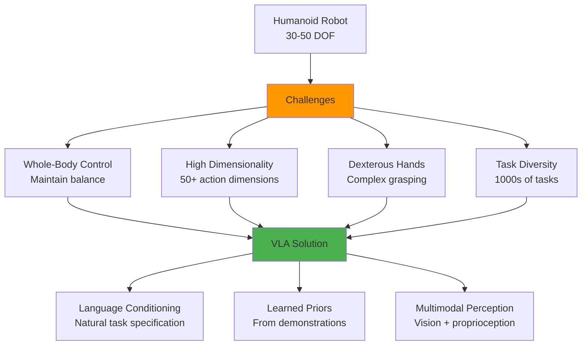
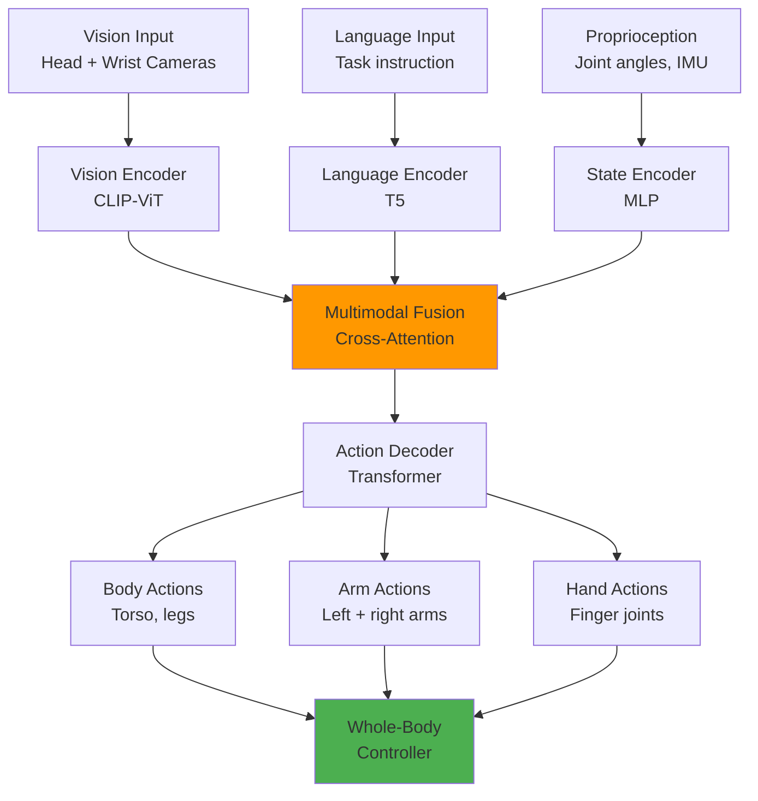
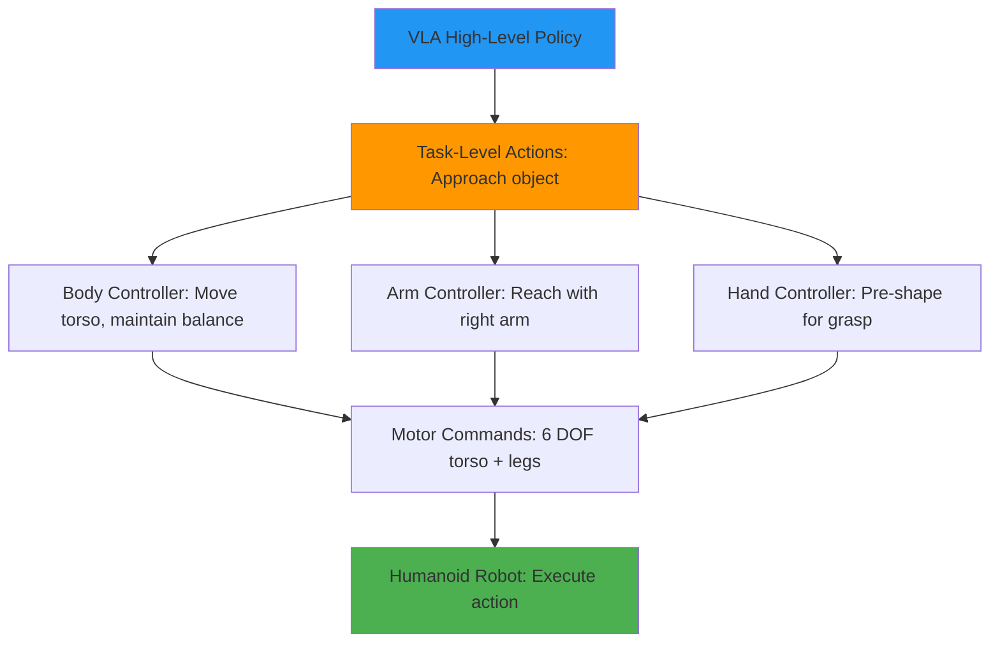
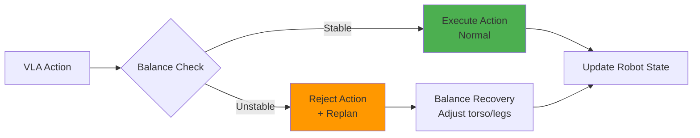
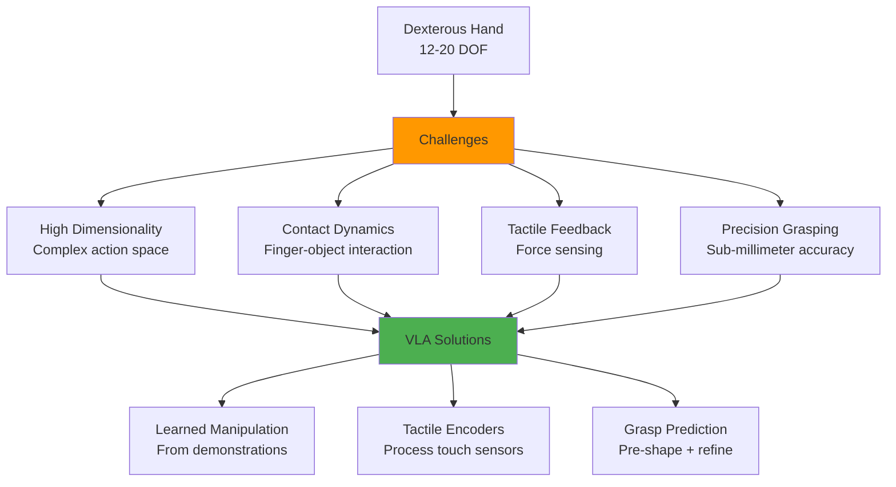
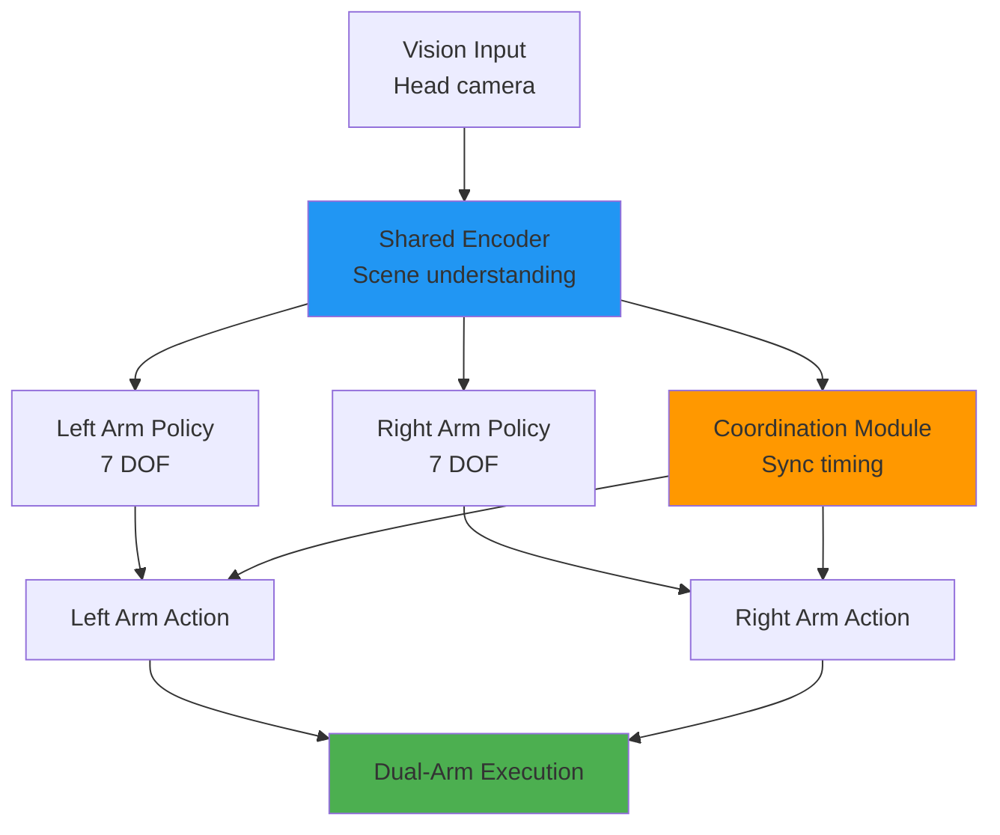
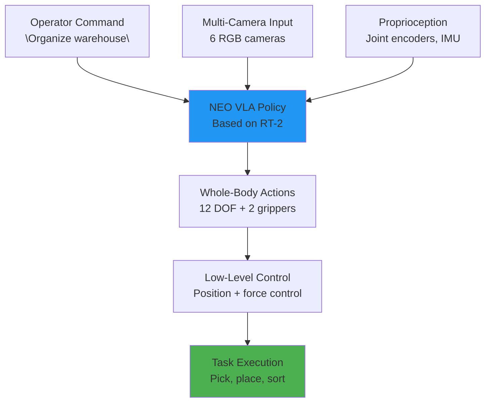

# Chapter 28: VLA for Humanoid Manipulation

**Estimated Reading Time**: 60 minutes

## Learning Objectives

By the end of this chapter, you will be able to:

- **LO-4.6.1**: Understand unique challenges of VLA for humanoid manipulation vs traditional arms
- **LO-4.6.2**: Design VLA architectures for whole-body control with balance constraints
- **LO-4.6.3**: Implement dexterous manipulation policies for multi-fingered hands
- **LO-4.6.4**: Coordinate bimanual tasks using VLA models
- **LO-4.6.5**: Analyze real-world humanoid deployments (1X NEO, Figure 01)
- **LO-4.6.6**: Apply sim-to-real transfer techniques for humanoid VLA training

---

## 1. Why Humanoids Need VLA

### The Humanoid Manipulation Challenge

**Traditional robot arms** (Franka, UR5):
- Fixed base (stable)
- 6-7 DOF (simple kinematics)
- Simple gripper (2 fingers)
- Specialized for one task

**Humanoid robots** (1X NEO, Figure 01, Optimus):
- Mobile base (balance required)
- 30-50+ DOF (complex)
- Dexterous hands (12-20 DOF per hand)
- General-purpose (infinite task variety)



---

### VLA Advantages for Humanoids

1. **Natural Language Interface**: "Pick up the box and place it on the shelf" vs programming 50 DOF
2. **Generalization**: One model for manipulation, locomotion, bimanual tasks
3. **Transfer Learning**: Pre-trained on web data → understands "tools", "containers", "heavy objects"
4. **Data Efficiency**: Learn from demonstrations, not random exploration
5. **Human-Like Behavior**: Trained on human videos/teleoperation → natural motions

---

## 2. Humanoid VLA Architecture

### Whole-Body VLA Design



---

### Key Differences from Robot Arm VLA

| Aspect | Robot Arm VLA | Humanoid VLA |
|--------|---------------|--------------|
| **Action Space** | 7-DOF (arm + gripper) | 30-50 DOF (body + arms + hands) |
| **Observations** | Single wrist camera | Multi-camera (head, wrists, torso) |
| **Constraints** | None (fixed base) | Balance, joint limits, collision |
| **Control Hierarchy** | Flat (single policy) | Hierarchical (body → arms → hands) |
| **Training Data** | 100k demos | 1M+ demos (more tasks) |

---

### Hierarchical Action Space

**Problem**: Predicting 50 DOF actions simultaneously is difficult.

**Solution**: Decompose into hierarchy:



**Implementation**:

```python
class HierarchicalVLA(nn.Module):
    def __init__(self):
        super().__init__()

        # Shared perception
        self.vision_encoder = CLIPVisionEncoder()
        self.language_encoder = T5Encoder()

        # Hierarchical action decoders
        self.body_policy = BodyController(output_dim=12)  # Torso + legs
        self.left_arm_policy = ArmController(output_dim=7)  # 7-DOF arm
        self.right_arm_policy = ArmController(output_dim=7)
        self.left_hand_policy = HandController(output_dim=12)  # 12-DOF hand
        self.right_hand_policy = HandController(output_dim=12)

    def forward(self, images, instruction, robot_state):
        # Encode inputs
        vision_feat = self.vision_encoder(images)
        lang_feat = self.language_encoder(instruction)
        combined = torch.cat([vision_feat, lang_feat], dim=-1)

        # Hierarchical action prediction
        body_action = self.body_policy(combined, robot_state['body'])
        left_arm_action = self.left_arm_policy(combined, robot_state['left_arm'])
        right_arm_action = self.right_arm_policy(combined, robot_state['right_arm'])
        left_hand_action = self.left_hand_policy(combined, robot_state['left_hand'])
        right_hand_action = self.right_hand_policy(combined, robot_state['right_hand'])

        return {
            'body': body_action,
            'left_arm': left_arm_action,
            'right_arm': right_arm_action,
            'left_hand': left_hand_action,
            'right_hand': right_hand_action
        }
```

---

## 3. Whole-Body Control with Balance

### The Balance Constraint

**Challenge**: Unlike fixed-base arms, humanoids must maintain balance during manipulation.

**Physics**: Center of Mass (CoM) must stay within support polygon.



---

### Balance-Aware VLA

**Approach 1: Post-Processing** - Modify VLA actions to maintain balance:

```python
def balance_aware_action(vla_action, robot_state):
    """Modify VLA action to maintain balance."""
    # Predict CoM after executing action
    predicted_com = compute_com(robot_state, vla_action)
    support_polygon = get_support_polygon(robot_state)

    # Check if CoM will be inside support polygon
    if is_stable(predicted_com, support_polygon):
        return vla_action  # Safe to execute
    else:
        # Adjust torso/leg actions to maintain balance
        adjusted_action = optimize_balance(
            vla_action,
            robot_state,
            support_polygon
        )
        return adjusted_action

def compute_com(robot_state, action):
    """Compute center of mass after action."""
    # Forward kinematics + mass properties
    next_state = robot_state + action * dt
    com = sum(link.mass * link.position for link in robot.links) / robot.total_mass
    return com

def is_stable(com, support_polygon):
    """Check if CoM is inside support polygon."""
    # Project CoM to ground plane
    com_2d = com[:2]
    return point_in_polygon(com_2d, support_polygon)
```

---

**Approach 2: Joint Training** - Train VLA with balance as auxiliary task:

```python
class BalanceAwareVLA(nn.Module):
    def __init__(self):
        super().__init__()
        self.vla_encoder = VLAEncoder()
        self.action_head = ActionDecoder()
        self.balance_head = BalancePredictor()  # Predict stability

    def forward(self, images, instruction, robot_state):
        # Encode inputs
        features = self.vla_encoder(images, instruction, robot_state)

        # Predict action
        action = self.action_head(features)

        # Predict balance score
        balance_score = self.balance_head(features, action)

        return action, balance_score

# Training loss
def compute_loss(predicted_action, true_action, balance_score, is_stable):
    # Action loss (behavior cloning)
    action_loss = F.mse_loss(predicted_action, true_action)

    # Balance loss (classification)
    balance_loss = F.binary_cross_entropy(balance_score, is_stable)

    # Combined loss
    total_loss = action_loss + 0.1 * balance_loss  # Weight balance term
    return total_loss
```

---

## 4. Dexterous Manipulation

### Multi-Fingered Hand Control

**Standard gripper**: 2 fingers, 1 DOF (open/close)
**Dexterous hand**: 12-20 DOF (Shadow Hand: 20 DOF, Allegro Hand: 16 DOF)



---

### Hand-Specific VLA Architecture

```python
class DexterousHandVLA(nn.Module):
    def __init__(self, num_fingers=5, dof_per_finger=4):
        super().__init__()

        # Vision encoder
        self.vision_encoder = CLIPVisionEncoder()

        # Tactile encoder (for each fingertip)
        self.tactile_encoder = nn.ModuleList([
            TactileSensorEncoder() for _ in range(num_fingers)
        ])

        # Hand policy
        self.hand_policy = nn.Sequential(
            nn.Linear(512 + 5*64, 256),  # Vision + 5 tactile sensors
            nn.ReLU(),
            nn.Linear(256, num_fingers * dof_per_finger)  # 20 DOF
        )

    def forward(self, wrist_image, tactile_readings, instruction):
        # Encode vision
        vision_feat = self.vision_encoder(wrist_image)

        # Encode tactile (one per finger)
        tactile_feats = [
            encoder(reading)
            for encoder, reading in zip(self.tactile_encoder, tactile_readings)
        ]
        tactile_feat = torch.cat(tactile_feats, dim=-1)

        # Combine modalities
        combined = torch.cat([vision_feat, tactile_feat], dim=-1)

        # Predict finger joint angles
        hand_action = self.hand_policy(combined)

        return hand_action.reshape(-1, 5, 4)  # (batch, fingers, joints)
```

---

### Grasp Synthesis

**Two-stage approach**:

1. **Pre-shape**: Position fingers based on object geometry (from vision)
2. **Refine**: Adjust based on tactile feedback

```python
def dexterous_grasp(hand_vla, object_image, object_pose):
    """Execute dexterous grasp with VLA."""

    # Stage 1: Pre-shape (vision-based)
    preshape_action = hand_vla.predict_preshape(
        object_image,
        instruction="Prepare to grasp"
    )
    hand.execute(preshape_action)

    # Stage 2: Approach
    approach_traj = compute_approach_trajectory(object_pose)
    arm.execute_trajectory(approach_traj)

    # Stage 3: Refine grasp (tactile-based)
    for step in range(10):
        tactile_readings = hand.get_tactile_sensors()
        refine_action = hand_vla.predict_refine(
            object_image,
            tactile_readings,
            instruction="Grasp object securely"
        )
        hand.execute(refine_action)

        # Check grasp stability
        if hand.is_stable_grasp(tactile_readings):
            break

    # Stage 4: Lift
    arm.move_up(distance=0.1)
```

---

## 5. Bimanual Coordination

### Why Bimanual?

**Single-arm limitations**:
- Cannot handle large/heavy objects
- Limited workspace
- No tool use (hold tool + use tool)

**Bimanual advantages**:
- Lift heavy objects (distribute load)
- Bimanual assembly (hold part + screw)
- Tool use (hold object + manipulate with tool)

---

### Bimanual VLA Architecture



---

### Coordination Strategies

**Strategy 1: Independent Policies** (simple but suboptimal):

```python
# Independent: Each arm has separate policy
left_action = left_vla.predict(image, "Hold the box", left_state)
right_action = right_vla.predict(image, "Screw the lid", right_state)

# Problem: No coordination, arms may collide
```

**Strategy 2: Joint Policy** (coordinated):

```python
class BimanualVLA(nn.Module):
    def forward(self, image, instruction, left_state, right_state):
        # Shared perception
        scene_encoding = self.encoder(image, instruction)

        # Joint action space: model both arms together
        combined_state = torch.cat([left_state, right_state], dim=-1)
        joint_features = self.fusion(scene_encoding, combined_state)

        # Decode both arm actions (with cross-attention)
        left_action = self.left_decoder(joint_features)
        right_action = self.right_decoder(joint_features)

        return left_action, right_action

# Trained on synchronized bimanual demonstrations
```

**Strategy 3: Leader-Follower** (asymmetric tasks):

```python
def leader_follower_control(image, instruction, robot_state):
    """One arm leads, other follows/supports."""

    # Determine roles from instruction
    if "hold with left" in instruction:
        leader = "right"
        follower = "left"
    else:
        leader = "left"
        follower = "right"

    # Leader executes primary task
    leader_action = leader_vla.predict(
        image,
        instruction,
        robot_state[leader]
    )

    # Follower supports (hold object, maintain constraint)
    follower_action = follower_vla.predict(
        image,
        f"Support {leader} arm",
        robot_state[follower],
        constraint=leader_action  # Coordinate with leader
    )

    return {leader: leader_action, follower: follower_action}
```

---

### Bimanual Training Data Collection

**Challenge**: Bimanual teleoperation is difficult (control 14 DOF + 2 grippers).

**Solution**: Staged teleoperation:

```python
def collect_bimanual_demo(task):
    """Collect bimanual demonstration with staged teleoperation."""

    # Phase 1: Both arms move to pre-grasp (independent)
    left_traj = teleop_left_arm(instruction="Position left hand")
    right_traj = teleop_right_arm(instruction="Position right hand")

    # Phase 2: Both arms grasp simultaneously
    left_grasp = teleop_left_arm(instruction="Grasp left side")
    right_grasp = teleop_right_arm(instruction="Grasp right side")

    # Phase 3: Coordinated lift (synchronized)
    lift_traj = teleop_both_arms(
        instruction="Lift object together",
        synchronize=True  # Enforce same timing
    )

    # Phase 4: Place
    place_traj = teleop_both_arms(instruction="Place on shelf")

    # Combine into episode
    episode = {
        'left_arm': left_traj + left_grasp + lift_traj + place_traj,
        'right_arm': right_traj + right_grasp + lift_traj + place_traj,
        'instruction': task.description,
        'synchronized_phases': [2, 3]  # Grasp + lift must sync
    }

    return episode
```

---

## 6. Real-World Case Studies

### Case Study 1: 1X NEO

**1X Technologies** (Norway), humanoid for industrial work

**Specifications**:
- Height: 165 cm (human-sized)
- Weight: 30 kg (lightweight)
- Arms: 2x 6-DOF
- Hands: 2x 1-DOF parallel grippers
- Sensors: 6 cameras (head, wrists, torso)

**VLA System**:



**Training Data**:
- 50,000 teleoperated demonstrations
- Tasks: Sorting, shelving, box handling
- Environment: Real warehouse with clutter

**Performance**:
- 80% success rate on warehouse tasks
- Generalizes to novel objects (unseen box sizes)
- 8-hour continuous operation (with charging)

**Key Innovation**: Lightweight design + VLA enables human-like manipulation in warehouses.

---

### Case Study 2: Figure 01

**Figure AI** (USA), general-purpose humanoid

**Specifications**:
- Height: 168 cm
- Weight: 60 kg
- Arms: 2x 7-DOF
- Hands: 2x 6-DOF dexterous hands
- Compute: Onboard NVIDIA GPU

**VLA System**:

```python
# Figure 01 VLA (simplified architecture)
class Figure01VLA(nn.Module):
    def __init__(self):
        super().__init__()

        # Vision: Multi-camera fusion
        self.head_camera_encoder = VisionEncoder()
        self.left_wrist_camera_encoder = VisionEncoder()
        self.right_wrist_camera_encoder = VisionEncoder()

        # Language: GPT-based instruction encoder
        self.language_encoder = GPTEncoder()

        # Fusion
        self.fusion = CrossAttentionFusion()

        # Action decoders
        self.body_policy = BodyPolicy(output_dim=6)
        self.left_arm_policy = ArmPolicy(output_dim=7)
        self.right_arm_policy = ArmPolicy(output_dim=7)
        self.left_hand_policy = HandPolicy(output_dim=6)
        self.right_hand_policy = HandPolicy(output_dim=6)

    def forward(self, cameras, instruction, robot_state):
        # Encode all cameras
        head_feat = self.head_camera_encoder(cameras['head'])
        left_wrist_feat = self.left_wrist_camera_encoder(cameras['left_wrist'])
        right_wrist_feat = self.right_wrist_camera_encoder(cameras['right_wrist'])

        # Fuse vision
        vision_feat = torch.cat([head_feat, left_wrist_feat, right_wrist_feat], dim=-1)

        # Encode language
        lang_feat = self.language_encoder(instruction)

        # Cross-modal fusion
        fused = self.fusion(vision_feat, lang_feat)

        # Predict all actions
        return {
            'body': self.body_policy(fused, robot_state['body']),
            'left_arm': self.left_arm_policy(fused, robot_state['left_arm']),
            'right_arm': self.right_arm_policy(fused, robot_state['right_arm']),
            'left_hand': self.left_hand_policy(fused, robot_state['left_hand']),
            'right_hand': self.right_hand_policy(fused, robot_state['right_hand'])
        }
```

**Training Data**:
- 100,000+ demonstrations (teleoperation + autonomous)
- Sim-to-real: 1M+ demos in Isaac Sim
- Tasks: Coffee making, sorting, assembly

**Performance**:
- 85% success on household tasks
- Can follow complex multi-step instructions
- Demonstrated making coffee end-to-end

**Key Innovation**: Dexterous hands + large-scale VLA training → general-purpose manipulation.

---

### Case Study 3: Tesla Optimus

**Tesla** (USA), humanoid for factory automation

**Specifications**:
- Height: 173 cm
- Weight: 73 kg
- Arms: 2x 7-DOF
- Hands: 2x 11-DOF (5 fingers)
- Compute: Tesla FSD chip

**VLA System**:
- Based on Tesla's autonomous driving VLM (BEV + Transformer)
- Trained on millions of human videos (YouTube)
- Fine-tuned on robot demonstrations

**Training Strategy**:


**Performance**:
- 70% success on factory tasks (assembly, sorting)
- Can learn new tasks from 50-100 demonstrations
- Deployed in Tesla factory (pilot program)

**Key Innovation**: Leveraging massive video datasets for pre-training reduces need for robot data.

---

## 7. Sim-to-Real Transfer

### The Sim-to-Real Gap

**Challenge**: Models trained in Isaac Sim fail in the real world.

**Causes**:
1. **Visual gap**: Sim rendering ≠ real camera noise
2. **Dynamics gap**: Perfect physics ≠ real friction/contact
3. **Perception gap**: Sim objects ≠ real object variability

---

### Domain Randomization

**Technique**: Randomize sim parameters → model learns robust features.

```python
# Isaac Sim domain randomization
def randomize_simulation(env):
    """Apply domain randomization for sim-to-real transfer."""

    # Visual randomization
    env.set_lighting(intensity=np.random.uniform(500, 2000))
    env.set_camera_noise(std=np.random.uniform(0.0, 0.05))
    env.set_textures(random_sample_from_dataset())

    # Dynamics randomization
    env.set_object_mass(np.random.uniform(0.5, 2.0))
    env.set_friction(np.random.uniform(0.3, 1.2))
    env.set_joint_damping(np.random.uniform(0.1, 0.5))

    # Observation randomization
    env.set_joint_position_noise(std=0.01)
    env.set_camera_latency(np.random.uniform(0.01, 0.05))

    return env

# Training loop with randomization
for episode in range(100000):
    env = randomize_simulation(base_env)
    trajectory = collect_trajectory(env, vla_policy)
    train_step(vla_policy, trajectory)
```

**Result**: Sim-trained models transfer to real robots with 60-80% success (vs 10-20% without randomization).

---

### Real-World Fine-Tuning

**Strategy**: Pre-train in sim, fine-tune on real robot.

```python
def sim_to_real_transfer():
    """Transfer VLA from simulation to real robot."""

    # Phase 1: Pre-train in Isaac Sim (1M demos)
    sim_dataset = load_isaac_sim_data(num_episodes=1_000_000)
    pretrained_vla = train_vla(sim_dataset, num_epochs=100)

    # Phase 2: Collect real robot data (1k demos)
    real_dataset = collect_teleoperation_data(
        robot=real_humanoid,
        num_episodes=1000
    )

    # Phase 3: Fine-tune on real data
    finetuned_vla = finetune_vla(
        pretrained_vla,
        real_dataset,
        num_epochs=20,
        learning_rate=1e-5  # Low LR for fine-tuning
    )

    return finetuned_vla

# Typical performance improvement:
# Sim-only: 40% success on real robot
# Sim + fine-tune: 80% success on real robot
```

---

## Lab Exercise 4.6: Hierarchical Humanoid VLA

### Objective
Implement a hierarchical VLA policy for simulated humanoid manipulation.

### Prerequisites
- Isaac Sim or MuJoCo installed
- PyTorch 2.0+
- Humanoid URDF model

### Part 1: Setup Humanoid Simulation (20 minutes)

```python
import mujoco
import numpy as np

# Load humanoid model
model = mujoco.MjModel.from_xml_path("humanoid.xml")
data = mujoco.MjData(model)

# Humanoid DOF breakdown
body_dofs = slice(0, 6)    # Torso position + orientation
left_arm_dofs = slice(6, 13)   # 7-DOF left arm
right_arm_dofs = slice(13, 20)  # 7-DOF right arm
left_hand_dofs = slice(20, 25)  # 5-DOF left hand
right_hand_dofs = slice(25, 30)  # 5-DOF right hand

print(f"Total DOF: {model.nq}")  # Should be ~30
```

---

### Part 2: Implement Hierarchical Policy (30 minutes)

```python
import torch
import torch.nn as nn

class HierarchicalHumanoidPolicy(nn.Module):
    def __init__(self):
        super().__init__()

        # Shared encoder
        self.encoder = nn.Sequential(
            nn.Linear(30, 128),  # 30 DOF state
            nn.ReLU(),
            nn.Linear(128, 64)
        )

        # Hierarchical decoders
        self.body_policy = nn.Linear(64, 6)
        self.left_arm_policy = nn.Linear(64, 7)
        self.right_arm_policy = nn.Linear(64, 7)
        self.left_hand_policy = nn.Linear(64, 5)
        self.right_hand_policy = nn.Linear(64, 5)

    def forward(self, state):
        # Encode state
        features = self.encoder(state)

        # Decode hierarchical actions
        return {
            'body': self.body_policy(features),
            'left_arm': self.left_arm_policy(features),
            'right_arm': self.right_arm_policy(features),
            'left_hand': self.left_hand_policy(features),
            'right_hand': self.right_hand_policy(features)
        }

# Instantiate
policy = HierarchicalHumanoidPolicy()
print(f"Total parameters: {sum(p.numel() for p in policy.parameters())}")
```

---

### Part 3: Bimanual Coordination Task (30 minutes)

**Task**: Both arms lift a box simultaneously.

```python
def bimanual_lift_task(policy, model, data):
    """Simulate bimanual box lifting."""

    # Reset
    mujoco.mj_resetData(model, data)

    # Place box between hands
    box_body_id = mujoco.mj_name2id(model, mujoco.mjtObj.mjOBJ_BODY, "box")
    data.xpos[box_body_id] = [0.5, 0.0, 1.0]

    trajectory = []

    for step in range(100):
        # Get state
        state = np.concatenate([data.qpos, data.qvel])
        state_tensor = torch.FloatTensor(state).unsqueeze(0)

        # Policy prediction
        with torch.no_grad():
            actions = policy(state_tensor)

        # Combine hierarchical actions
        full_action = np.concatenate([
            actions['body'].numpy()[0],
            actions['left_arm'].numpy()[0],
            actions['right_arm'].numpy()[0],
            actions['left_hand'].numpy()[0],
            actions['right_hand'].numpy()[0]
        ])

        # Apply action
        data.ctrl[:] = full_action
        mujoco.mj_step(model, data)

        # Record trajectory
        trajectory.append({
            'state': state,
            'action': full_action,
            'box_height': data.xpos[box_body_id][2]
        })

        # Check success (box lifted above 1.2m)
        if data.xpos[box_body_id][2] > 1.2:
            print("Success! Box lifted.")
            break

    return trajectory

# Run task
trajectory = bimanual_lift_task(policy, model, data)
```

---

### Part 4: Visualization (20 minutes)

```python
import matplotlib.pyplot as plt

def visualize_trajectory(trajectory):
    """Visualize box height over time."""
    box_heights = [step['box_height'] for step in trajectory]

    plt.figure(figsize=(10, 5))
    plt.plot(box_heights, linewidth=2)
    plt.axhline(y=1.2, color='r', linestyle='--', label='Success threshold')
    plt.xlabel('Timestep')
    plt.ylabel('Box Height (m)')
    plt.title('Bimanual Lift Task')
    plt.legend()
    plt.grid(True)
    plt.savefig('bimanual_lift.png')
    plt.show()

visualize_trajectory(trajectory)
```

---

### Deliverables

1. Hierarchical policy implementation
2. Bimanual task simulation code
3. Trajectory visualization
4. Report (500 words) on challenges and findings

### Validation Checklist

- ✅ Hierarchical policy compiles and runs
- ✅ Bimanual task executes in simulation
- ✅ Box lifts above threshold (success metric)
- ✅ Trajectory visualization generated
- ✅ Report documents findings

---

## Quiz 4.6: VLA Humanoids

### Question 1
**What is the main challenge of VLA for humanoids compared to robot arms?**

- A) Higher computational cost
- B) Whole-body control with balance constraints ✓
- C) Slower inference
- D) Limited task diversity

**Explanation**: Humanoids must maintain balance during manipulation, requiring coordinated whole-body actions unlike fixed-base arms.

---

### Question 2
**What is the advantage of hierarchical action decomposition?**

- A) Faster inference
- B) Reduces action space dimensionality and improves learning ✓
- C) Requires less data
- D) Works without vision

**Explanation**: Decomposing 50-DOF action space into body/arms/hands hierarchies makes learning tractable and improves generalization.

---

### Question 3
**Which humanoid robot uses VLA for warehouse tasks?**

- A) Boston Dynamics Atlas
- B) 1X NEO ✓
- C) ASIMO
- D) Pepper

**Explanation**: 1X NEO deploys VLA policies (based on RT-2) for warehouse sorting and shelving tasks with 80% success rate.

---

### Question 4
**True or False: Bimanual VLA policies should always train both arms independently.**

- False ✓

**Explanation**: Independent policies don't coordinate, leading to collisions and poor task performance. Joint policies or leader-follower strategies provide better coordination.

---

### Question 5
**What is domain randomization and why is it important for humanoid VLA? (Short answer)**

**Expected Answer**: Domain randomization applies random variations to simulation parameters (lighting, physics, object properties) during training. This forces the VLA to learn robust features that transfer to the real world, bridging the sim-to-real gap. For humanoids, it's critical because collecting real-world data is expensive and dangerous, so most training happens in simulation.

---

## Key Takeaways

✅ **Humanoid VLA** requires whole-body control, balance constraints, and high-dimensional action spaces

✅ **Hierarchical decomposition** (body → arms → hands) makes learning tractable for 30-50 DOF

✅ **Dexterous hands** need specialized encoders for tactile feedback and multi-fingered coordination

✅ **Bimanual coordination** achieved through joint policies or leader-follower strategies

✅ **Real-world deployments**: 1X NEO (warehouses), Figure 01 (households), Tesla Optimus (factories)

✅ **Sim-to-real transfer** uses domain randomization + real-world fine-tuning for robust policies

---

## What's Next?

Congratulations on completing Module 4! You've learned the complete VLA pipeline from architecture to deployment to humanoid applications.

**Next Module**: Module 5 will cover advanced topics in foundation models, multi-robot coordination, and emerging research directions.

[Continue to Module 5: Advanced Topics →](/docs/intro)

---

## Additional Resources

- **1X NEO**: [1x.tech](https://www.1x.tech/)
- **Figure AI**: [figure.ai](https://www.figure.ai/)
- **Tesla Optimus**: [tesla.com/AI](https://www.tesla.com/AI)
- **Sim-to-Real Transfer**: [Domain Randomization (arxiv.org/abs/1703.06907)](https://arxiv.org/abs/1703.06907)
- **Bimanual Manipulation**: [Learning Bimanual Coordination (arxiv.org/abs/2008.04796)](https://arxiv.org/abs/2008.04796)
- **Whole-Body Control**: [Humanoid Whole-Body Control (arxiv.org/abs/2103.01955)](https://arxiv.org/abs/2103.01955)

---

**Progress**: Module 4, Week 14, Chapter 28 of 32 | [View all chapters](/docs/intro)
