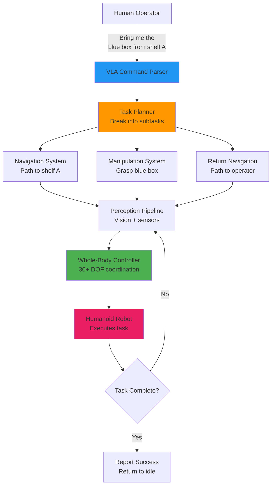
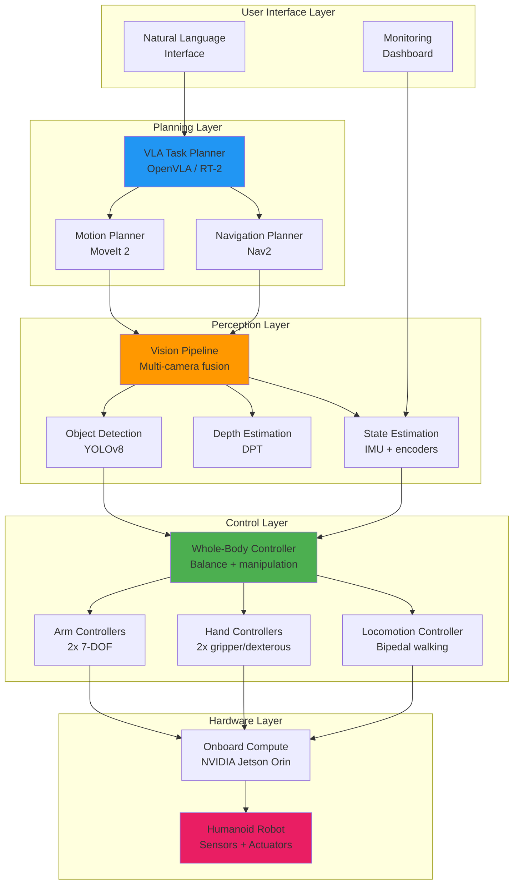
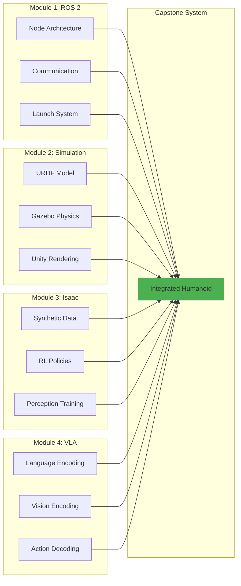
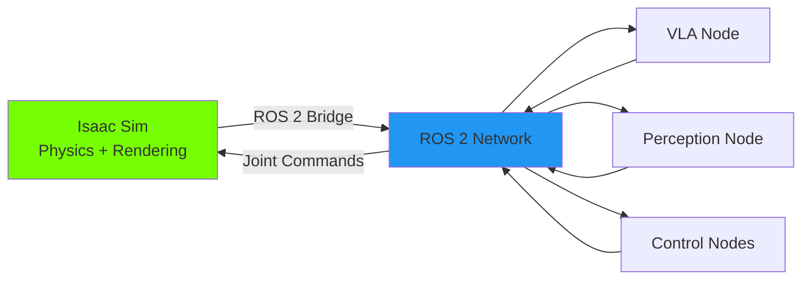
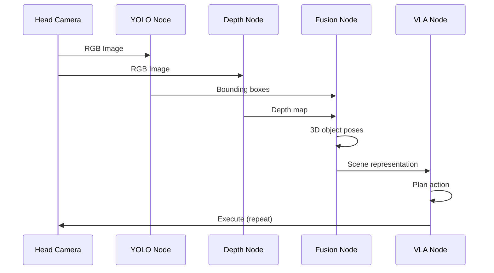
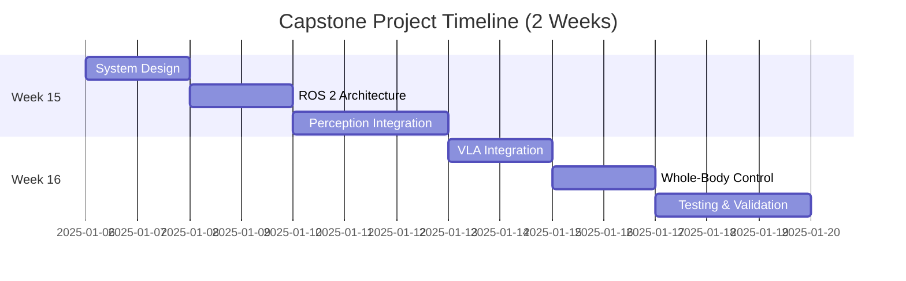
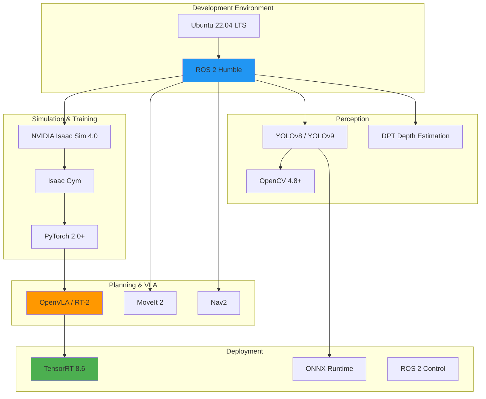

# Chapter 29: Capstone Project Overview

**Estimated Reading Time**: 55 minutes

## Learning Objectives

By the end of this chapter, you will be able to:

- **LO-5.1.1**: Design a complete autonomous humanoid robot system architecture
- **LO-5.1.2**: Identify integration points across ROS 2, simulation, Isaac, and VLA modules
- **LO-5.1.3**: Create a phased project plan with measurable milestones
- **LO-5.1.4**: Define system requirements (functional, non-functional, safety)
- **LO-5.1.5**: Select appropriate hardware and software components for humanoid systems
- **LO-5.1.6**: Establish success criteria and evaluation metrics for the capstone project

---

## 1. Capstone Project Vision

### The Challenge

You've spent 14 weeks mastering the building blocks of Physical AI:
- **Module 1**: ROS 2 fundamentals (topics, services, actions, launch)
- **Module 2**: Digital twin simulation (Gazebo, Unity, URDF)
- **Module 3**: NVIDIA Isaac platform (synthetic data, RL, perception)
- **Module 4**: Vision-Language-Action models (VLA architecture, training, deployment)

**Now**: Integrate everything into a **fully autonomous humanoid robot** capable of:
1. **Understanding** natural language commands ("Pick up the red box and place it on the shelf")
2. **Perceiving** the environment using vision and sensors
3. **Planning** multi-step manipulation and navigation tasks
4. **Executing** actions through whole-body control
5. **Learning** from experience to improve over time

---

### Project Goal

**Build an autonomous humanoid robot system** that can:

**Scenario**: Warehouse assistant robot
- **Input**: Natural language command from human operator
- **Task**: Navigate to target location, manipulate objects, return to base
- **Constraints**: Maintain balance, avoid obstacles, handle object variability
- **Validation**: Test in Isaac Sim, optional real robot deployment



---

## 2. System Architecture

### High-Level Architecture



---

### Component Breakdown

#### 1. User Interface Layer

**Natural Language Interface**:
- Accepts commands via speech/text
- Powered by VLA language encoder (T5, BERT)
- Converts to task-level instructions

**Monitoring Dashboard**:
- RViz2 visualization
- Real-time robot state (joint angles, sensor data)
- Task progress tracking

---

#### 2. Planning Layer

**VLA Task Planner**:
- **Purpose**: High-level task decomposition
- **Model**: OpenVLA or RT-2 fine-tuned on humanoid tasks
- **Input**: Language command + visual scene
- **Output**: Sequence of subtasks (navigate, grasp, lift, place)

**Motion Planner (MoveIt 2)**:
- **Purpose**: Generate collision-free arm trajectories
- **Algorithm**: RRT-Connect, OMPL planners
- **Constraints**: Joint limits, self-collision, workspace bounds

**Navigation Planner (Nav2)**:
- **Purpose**: Compute safe paths through environment
- **Algorithm**: A*, DWB local planner
- **Inputs**: Costmap (obstacles), goal pose
- **Outputs**: Velocity commands for locomotion

---

#### 3. Perception Layer

**Vision Pipeline**:
- Multi-camera fusion (head camera, wrist cameras)
- RGB-D processing (color + depth)
- Real-time at 30 Hz

**Object Detection (YOLOv8)**:
- Trained on synthetic data from Isaac Sim
- Detects task-relevant objects (boxes, shelves, obstacles)
- Outputs: Bounding boxes, class labels, confidence scores

**Depth Estimation (DPT)**:
- Dense Prediction Transformer for depth maps
- Enables grasp pose estimation
- Fallback for robots without depth cameras

**State Estimation**:
- Sensor fusion (IMU + joint encoders)
- Estimates robot pose, velocity, balance state
- Extended Kalman Filter (EKF)

---

#### 4. Control Layer

**Whole-Body Controller**:
- Coordinates all 30+ DOF simultaneously
- Maintains balance during manipulation
- Implements hierarchical control (body → arms → hands)

**Arm Controllers**:
- Position control for reaching
- Velocity control for smooth motion
- Force control for contact tasks

**Hand Controllers**:
- Parallel gripper: 1-DOF open/close
- Dexterous hand: 12-20 DOF per hand (optional)

**Locomotion Controller**:
- Bipedal walking gaits
- Stance control (maintain balance while standing)
- Optional: Learned RL policy from Isaac Gym

---

#### 5. Hardware Layer

**Humanoid Robot Specifications** (example: similar to Unitree G1, 1X NEO):
- **Height**: 165-175 cm
- **Weight**: 35-50 kg
- **DOF**: 30+ (legs, torso, arms, hands)
- **Sensors**:
  - 2-6 RGB cameras (head, wrists, torso)
  - IMU (6-axis: accel + gyro)
  - Force-torque sensors (feet, wrists)
  - Joint encoders (position + velocity)
- **Actuators**:
  - Electric motors with planetary gearboxes
  - Joint torque range: 20-200 Nm

**Onboard Compute**:
- NVIDIA Jetson AGX Orin (64GB)
- 275 TOPS AI performance
- Runs TensorRT models (VLA, YOLO)
- ROS 2 Humble with real-time kernel

---

## 3. Integration Strategy

### Module Integration Map



---

### Integration Points

#### ROS 2 + VLA Integration

**Challenge**: VLA models (PyTorch) → ROS 2 (C++/Python)

**Solution**: ROS 2 Python node with TensorRT inference

```python
class VLAPolicyNode(Node):
    def __init__(self):
        super().__init__('vla_policy_node')

        # Load VLA model (TensorRT for speed)
        self.vla_model = load_trt_model("openvla_humanoid.trt")

        # Subscribers
        self.image_sub = self.create_subscription(
            Image, '/camera/head/image_raw', self.image_callback, 10
        )
        self.command_sub = self.create_subscription(
            String, '/task_command', self.command_callback, 10
        )

        # Publishers
        self.action_pub = self.create_publisher(
            Float64MultiArray, '/humanoid/action', 10
        )

    def command_callback(self, msg):
        # Store latest language command
        self.current_task = msg.data

    def image_callback(self, msg):
        # VLA inference: (image, language) → action
        image = self.bridge.imgmsg_to_cv2(msg)
        action = self.vla_model.predict(image, self.current_task)

        # Publish action to controllers
        action_msg = Float64MultiArray(data=action.tolist())
        self.action_pub.publish(action_msg)
```

---

#### Isaac Sim + ROS 2 Bridge

**Purpose**: Test entire system in simulation before real deployment

**Architecture**:


**Setup**:
```python
# Isaac Sim script with ROS 2 bridge
from isaacsim import SimulationApp
simulation_app = SimulationApp({"headless": False})

from omni.isaac.core import World
from omni.isaac.ros2_bridge import ROS2Bridge

# Create world
world = World(stage_units_in_meters=1.0)

# Add humanoid robot
from omni.isaac.nucleus import get_assets_root_path
humanoid_path = get_assets_root_path() + "/Isaac/Robots/Unitree/G1/g1.usd"
world.scene.add_reference_to_stage(humanoid_path, "/World/Humanoid")

# Enable ROS 2 bridge
ros2_bridge = ROS2Bridge()
ros2_bridge.enable_clock_publisher()  # /clock topic
ros2_bridge.enable_camera_publisher("/World/Humanoid/head_camera", "camera/image_raw")
ros2_bridge.enable_joint_state_publisher("/World/Humanoid", "joint_states")
ros2_bridge.enable_joint_command_subscriber("/World/Humanoid", "joint_command")

# Run simulation
while simulation_app.is_running():
    world.step(render=True)
```

---

#### Perception Pipeline Integration

**Data Flow**:


---

## 4. Project Planning

### Phased Development Approach



---

### Milestone Breakdown

#### Milestone 1: System Architecture (Days 1-2)

**Tasks**:
- Define system requirements document
- Design ROS 2 node architecture
- Select hardware specs (sim or real)
- Create URDF model (if custom)

**Deliverables**:
- Architecture diagram (Mermaid/draw.io)
- Requirements document (functional, non-functional)
- Component list with justifications

**Success Criteria**:
- All modules (ROS 2, Isaac, VLA) have clear integration points
- No circular dependencies in node graph

---

#### Milestone 2: Perception Pipeline (Days 3-5)

**Tasks**:
- Integrate multi-camera fusion
- Deploy YOLO for object detection
- Implement depth estimation (or use depth camera)
- Test perception accuracy in Isaac Sim

**Deliverables**:
- ROS 2 perception nodes (detection, depth, fusion)
- Launch file for perception stack
- Validation report (detection mAP, depth error)

**Success Criteria**:
- Object detection: >85% mAP on test scenarios
- Depth estimation: &lt;5 cm error at 2m distance
- Real-time performance: >20 Hz

---

#### Milestone 3: VLA Integration (Days 6-8)

**Tasks**:
- Load pre-trained VLA model (OpenVLA or RT-2)
- Create ROS 2 VLA node with TensorRT
- Implement action space mapping (VLA → robot joints)
- Test language-conditioned control

**Deliverables**:
- VLA inference node (TensorRT optimized)
- Action space conversion layer
- Demo: 5 language commands executed successfully

**Success Criteria**:
- VLA inference latency: &lt;100 ms
- Command success rate: >70% on simple tasks
- No robot self-collisions

---

#### Milestone 4: Whole-Body Control (Days 9-11)

**Tasks**:
- Implement hierarchical controller (body, arms, hands)
- Integrate balance constraints
- Test bimanual coordination
- Deploy to Isaac Sim humanoid

**Deliverables**:
- Whole-body control node
- Balance safety monitor
- Test scenarios: reaching, walking, manipulation

**Success Criteria**:
- Robot maintains balance during all tasks
- Arms reach targets with &lt;2 cm error
- No joint limit violations

---

#### Milestone 5: System Testing (Days 12-14)

**Tasks**:
- End-to-end integration tests
- 10 task scenarios (navigation + manipulation)
- Performance profiling (latency, CPU/GPU usage)
- Create demo video

**Deliverables**:
- Test report with success rates per task
- Performance metrics dashboard
- 2-minute demo video
- Final presentation slides

**Success Criteria**:
- 7/10 tasks completed successfully
- System runs at >10 Hz control rate
- No safety violations (falls, collisions)

---

## 5. System Requirements

### Functional Requirements

**FR-1: Language Understanding**
- System SHALL accept natural language commands in English
- System SHALL parse commands into executable subtasks within 1 second

**FR-2: Visual Perception**
- System SHALL detect objects with >80% accuracy
- System SHALL estimate object poses with &lt;5 cm error

**FR-3: Navigation**
- System SHALL navigate to goal positions within 2m radius
- System SHALL avoid static and dynamic obstacles

**FR-4: Manipulation**
- System SHALL grasp objects weighing 0.1-5 kg
- System SHALL place objects with &lt;3 cm positioning error

**FR-5: Safety**
- System SHALL detect falls and execute emergency stop within 100 ms
- System SHALL respect joint limits and torque limits at all times

---

### Non-Functional Requirements

**NFR-1: Performance**
- Control loop frequency: >10 Hz (100 ms cycle time)
- VLA inference latency: &lt;100 ms
- Perception pipeline: >20 Hz

**NFR-2: Reliability**
- Mean time between failures (MTBF): >2 hours continuous operation
- Graceful degradation: Continue operation if one camera fails

**NFR-3: Scalability**
- Support 2-6 camera inputs without code changes
- Extensible to different humanoid models via URDF

**NFR-4: Maintainability**
- Modular ROS 2 node architecture
- All nodes have unit tests (>70% coverage)
- Comprehensive logging for debugging

---

### Safety Requirements

**SR-1: Fall Detection**
- Monitor IMU for abnormal accelerations
- Trigger emergency stop if fall detected

**SR-2: Collision Avoidance**
- Maintain 20 cm safety margin from obstacles
- Reduce arm velocity near humans

**SR-3: Joint Protection**
- Enforce software joint limits (±5° from hardware limits)
- Monitor motor temperatures, throttle if >70°C

**SR-4: Emergency Stop**
- Hardware e-stop button (real robot)
- Software e-stop via ROS 2 service call

---

## 6. Technology Stack

### Software Stack



---

### Hardware Options

#### Option 1: Simulation Only (Recommended for Learning)

**Pros**:
- No hardware cost
- Safe experimentation
- Easy reset and iteration

**Cons**:
- Sim-to-real gap
- No tactile feedback

**Requirements**:
- NVIDIA GPU (RTX 3060+, 12GB VRAM)
- 32GB RAM
- Ubuntu 22.04

---

#### Option 2: Real Humanoid Platform

**Commercial Options**:
1. **Unitree G1** (~$16k)
   - 30 DOF
   - 1.5 hours battery
   - ROS 2 compatible
   - Community support

2. **1X NEO** (contact for pricing)
   - Industrial-grade
   - 6 cameras
   - Pre-integrated VLA stack

3. **Custom Build** ($20k-50k)
   - Based on open-source designs (PAL Robotics)
   - Full customization
   - Requires mechatronics expertise

**Additional Hardware**:
- NVIDIA Jetson AGX Orin ($2k)
- Intel RealSense D435i cameras ($200 each)
- Force-torque sensors ($500 each)

---

## Lab Exercise 5.1: Define Your Capstone System

### Objective
Create a complete system architecture document for your capstone project.

### Prerequisites
- Completed Modules 1-4
- Access to Isaac Sim or real humanoid robot

### Part 1: Requirements Definition (30 minutes)

Create `capstone_requirements.md`:

```markdown
# Capstone Project Requirements

## Project Title
[Your project name, e.g., "Warehouse Sorting Humanoid"]

## Functional Requirements
FR-1: [Command understanding]
FR-2: [Perception capabilities]
FR-3: [Navigation capabilities]
FR-4: [Manipulation capabilities]
FR-5: [Safety features]

## Non-Functional Requirements
NFR-1: [Performance targets]
NFR-2: [Reliability targets]
NFR-3: [Scalability requirements]

## Success Criteria
- [ ] Task success rate: >70%
- [ ] Control frequency: >10 Hz
- [ ] No safety violations
- [ ] Demo video completed
```

---

### Part 2: System Architecture Diagram (30 minutes)

Create architecture diagram using Mermaid or draw.io:


**Include**:
- All ROS 2 nodes
- Communication topics/services
- External dependencies (Isaac Sim, TensorRT)

---

### Part 3: Technology Selection (20 minutes)

Create `technology_stack.md`:

```markdown
# Technology Stack

## Base Platform
- OS: Ubuntu 22.04
- ROS 2: Humble
- Python: 3.10

## Simulation
- NVIDIA Isaac Sim 4.0
- [Gazebo Classic / Unity - if needed]

## Perception
- Object Detection: [YOLOv8 / YOLOv9]
- Depth: [RealSense / DPT model]
- Tracking: [ByteTrack / SORT]

## VLA Model
- Model: [OpenVLA / RT-2 / Custom]
- Inference: TensorRT
- Fine-tuning: [Yes / No]

## Hardware (if real robot)
- Robot: [Unitree G1 / Custom / N/A]
- Compute: [Jetson Orin / Laptop GPU]
- Sensors: [List cameras, IMU, etc.]
```

---

### Part 4: Project Plan (40 minutes)

Create Gantt chart or milestone list:

```markdown
# Capstone Project Plan

## Week 15
### Days 1-2: Architecture
- [ ] Requirements document finalized
- [ ] Architecture diagram created
- [ ] Technology stack selected

### Days 3-5: Perception
- [ ] Multi-camera fusion node implemented
- [ ] Object detection integrated
- [ ] Perception tests passing (>85% mAP)

### Days 6-7: VLA Integration
- [ ] VLA model loaded in ROS 2
- [ ] Language commands tested
- [ ] Action space mapping validated

## Week 16
### Days 8-10: Control
- [ ] Whole-body controller implemented
- [ ] Balance constraints enforced
- [ ] Bimanual coordination tested

### Days 11-14: Integration & Testing
- [ ] End-to-end tests (10 scenarios)
- [ ] Performance profiling
- [ ] Demo video recorded
- [ ] Final presentation prepared
```

---

### Deliverables

1. `capstone_requirements.md` (functional, non-functional, safety requirements)
2. Architecture diagram (Mermaid/PNG)
3. `technology_stack.md` (software + hardware selections)
4. `project_plan.md` (milestones with dates)

### Validation Checklist

- ✅ All 4 documents created
- ✅ Requirements are specific and measurable
- ✅ Architecture shows all major components and connections
- ✅ Technology choices are justified
- ✅ Project plan has realistic time estimates
- ✅ Success criteria are clearly defined

---

## Quiz 5.1: Capstone Overview

### Question 1
**What is the primary integration challenge for humanoid VLA systems?**

- A) GPU memory limitations
- B) Coordinating perception, planning, and control across 30+ DOF with balance constraints ✓
- C) Training data availability
- D) ROS 2 installation

**Explanation**: Humanoids require coordinating vision, language understanding, motion planning, and whole-body control while maintaining balance—far more complex than fixed-base arms.

---

### Question 2
**Which module's output directly feeds into the VLA policy node?**

- A) Whole-body controller
- B) Perception pipeline (cameras, object detection) ✓
- C) Navigation planner
- D) Joint encoders only

**Explanation**: VLA models take visual observations (images) and language commands as inputs, both provided by the perception pipeline.

---

### Question 3
**What is an appropriate control loop frequency for a humanoid robot?**

- A) 1 Hz (too slow)
- B) 10-50 Hz ✓
- C) 1000 Hz (overkill for high-level control)
- D) Variable (not acceptable)

**Explanation**: 10-50 Hz balances responsiveness with computational feasibility for high-level VLA-based control. Low-level motor control runs faster (500-1000 Hz).

---

### Question 4
**True or False: You should build the entire system before testing any components.**

- False ✓

**Explanation**: Incremental development with continuous testing (perception → VLA → control) reduces risk and enables faster debugging.

---

### Question 5
**What is the purpose of the ROS 2 bridge in Isaac Sim? (Short answer)**

**Expected Answer**: The ROS 2 bridge in Isaac Sim enables bidirectional communication between the simulation environment and ROS 2 nodes. It publishes sensor data (cameras, joint states, IMU) as ROS 2 topics and subscribes to control commands (joint commands, velocity commands), allowing the entire robot software stack to run identically in simulation and reality.

---

## Key Takeaways

✅ **Capstone project** integrates ROS 2, simulation, Isaac, and VLA into a complete autonomous humanoid system

✅ **System architecture** consists of 5 layers: UI, planning, perception, control, and hardware

✅ **Integration strategy** uses ROS 2 as the middleware connecting all modules (Isaac Sim bridge, TensorRT VLA nodes)

✅ **Phased development** over 2 weeks: architecture → perception → VLA → control → testing

✅ **Requirements** must specify functional, non-functional, and safety criteria with measurable success metrics

✅ **Technology choices** balance performance (TensorRT), compatibility (ROS 2 Humble), and ecosystem (Isaac Sim, OpenVLA)

---

## What's Next?

In **Chapter 30**, you'll implement the system integration layer, building the ROS 2 architecture and connecting all components.

[Continue to Chapter 30: System Integration →](/docs/module-5-capstone/week-15/chapter-30-system-integration)

---

## Additional Resources

- **ROS 2 System Architecture**: [design.ros2.org/articles/composition.html](https://design.ros2.org/articles/composition.html)
- **MoveIt 2 Tutorials**: [moveit.picknik.ai/humble/](https://moveit.picknik.ai/humble/)
- **Nav2 Documentation**: [navigation.ros.org](https://navigation.ros.org/)
- **Isaac Sim ROS 2 Bridge**: [docs.omniverse.nvidia.com/isaacsim/latest/ros2_tutorials.html](https://docs.omniverse.nvidia.com/isaacsim/latest/ros2_tutorials.html)
- **Humanoid Robot Survey**: [arxiv.org/abs/2401.00432](https://arxiv.org/abs/2401.00432)
- **System Requirements Template**: [requirements.seilevel.com/blog/functional-vs-non-functional-requirements](https://requirements.seilevel.com/blog/functional-vs-non-functional-requirements)

---

**Progress**: Module 5, Week 15, Chapter 29 of 32 | [View all chapters](/docs/intro)
