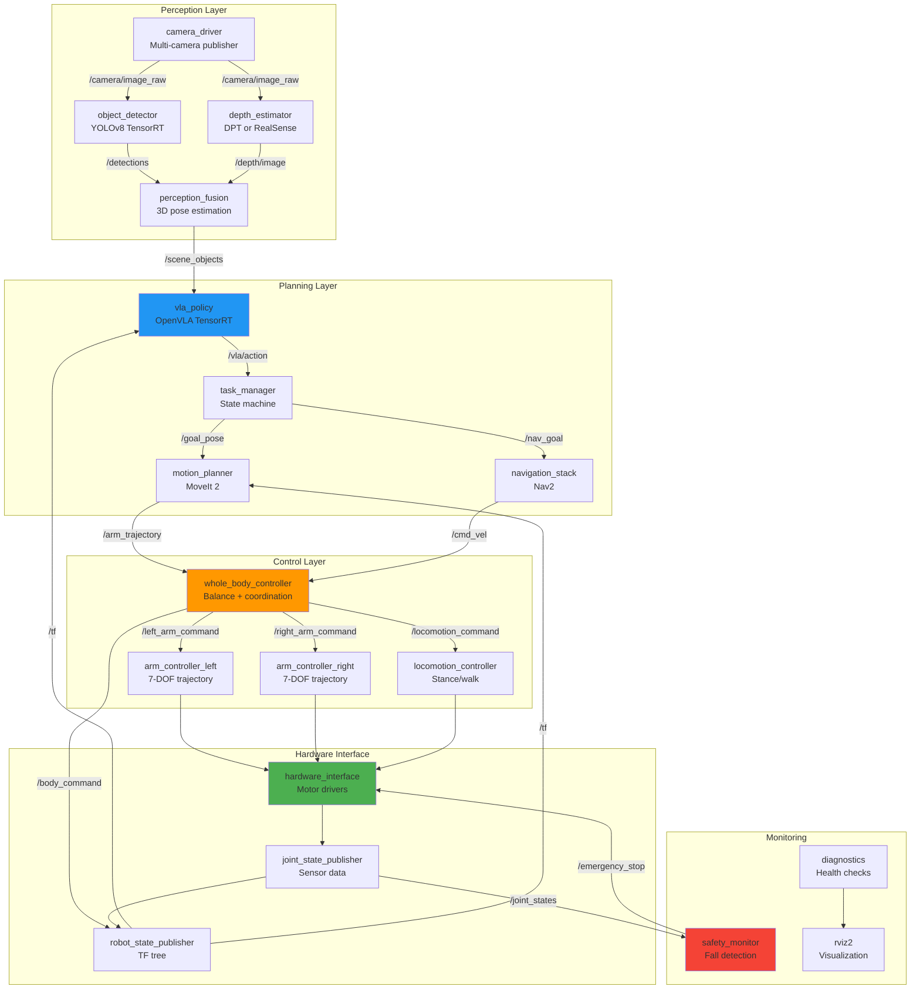

# Chapter 30: System Integration

**Estimated Reading Time**: 60 minutes

## Learning Objectives

By the end of this chapter, you will be able to:

- **LO-5.2.1**: Design and implement a complete ROS 2 node architecture for humanoid systems
- **LO-5.2.2**: Build a multi-stage perception pipeline (detection → depth → fusion)
- **LO-5.2.3**: Integrate VLA models into ROS 2 with TensorRT optimization
- **LO-5.2.4**: Implement hierarchical whole-body control with balance constraints
- **LO-5.2.5**: Manage system state and coordinate asynchronous components
- **LO-5.2.6**: Create launch files for automated system startup and configuration

---

## 1. ROS 2 System Architecture

### Node Graph Overview



---

### Communication Patterns

#### Topics (Continuous Data Streams)

```yaml
# Camera data
/camera/head/image_raw:          sensor_msgs/Image         # 30 Hz
/camera/left_wrist/image_raw:    sensor_msgs/Image         # 30 Hz
/camera/right_wrist/image_raw:   sensor_msgs/Image         # 30 Hz

# Perception outputs
/detections:                     vision_msgs/Detection2DArray  # 20 Hz
/depth/image:                    sensor_msgs/Image         # 30 Hz
/scene_objects:                  geometry_msgs/PoseArray   # 20 Hz

# Planning outputs
/vla/action:                     std_msgs/Float64MultiArray    # 10 Hz
/arm_trajectory:                 trajectory_msgs/JointTrajectory
/cmd_vel:                        geometry_msgs/Twist

# Control commands
/joint_command:                  sensor_msgs/JointState    # 50 Hz

# Robot state
/joint_states:                   sensor_msgs/JointState    # 100 Hz
/imu/data:                       sensor_msgs/Imu           # 200 Hz
/tf:                            tf2_msgs/TFMessage        # 100 Hz
```

---

#### Services (Request-Response)

```yaml
# Task management
/task_manager/start_task:        std_srvs/Trigger
/task_manager/cancel_task:       std_srvs/Trigger

# Motion planning
/compute_trajectory:             moveit_msgs/GetMotionPlan

# Emergency control
/emergency_stop:                 std_srvs/SetBool

# Configuration
/set_vla_parameters:             dynamic_reconfigure/Reconfigure
```

---

#### Actions (Long-Running Goals with Feedback)

```yaml
# Navigation
/navigate_to_pose:               nav2_msgs/NavigateToPose

# Manipulation
/grasp_object:                   control_msgs/GripperCommand
/move_arm:                       control_msgs/FollowJointTrajectory

# Whole-body tasks
/execute_task:                   humanoid_msgs/ExecuteTask  # Custom
```

---

## 2. Perception Pipeline Implementation

### Multi-Camera Fusion Node

```python title="perception_fusion_node.py"
import rclpy
from rclpy.node import Node
from sensor_msgs.msg import Image
from vision_msgs.msg import Detection2DArray
from geometry_msgs.msg import PoseArray, Pose
from cv_bridge import CvBridge
import message_filters
import numpy as np

class PerceptionFusionNode(Node):
    def __init__(self):
        super().__init__('perception_fusion')

        # CV Bridge
        self.bridge = CvBridge()

        # Synchronized subscribers (time-aligned camera data)
        self.head_camera_sub = message_filters.Subscriber(
            self, Image, '/camera/head/image_raw'
        )
        self.depth_sub = message_filters.Subscriber(
            self, Image, '/depth/image'
        )
        self.detections_sub = message_filters.Subscriber(
            self, Detection2DArray, '/detections'
        )

        # Time synchronizer (±50ms tolerance)
        self.sync = message_filters.ApproximateTimeSynchronizer(
            [self.head_camera_sub, self.depth_sub, self.detections_sub],
            queue_size=10,
            slop=0.05
        )
        self.sync.registerCallback(self.fusion_callback)

        # Publisher
        self.scene_pub = self.create_publisher(PoseArray, '/scene_objects', 10)

        # Camera intrinsics (from calibration)
        self.fx = 554.25  # Focal length x
        self.fy = 554.25  # Focal length y
        self.cx = 320.5   # Principal point x
        self.cy = 240.5   # Principal point y

        self.get_logger().info("Perception fusion node started")

    def fusion_callback(self, image_msg, depth_msg, detections_msg):
        """Fuse 2D detections with depth to get 3D poses."""
        try:
            # Convert images
            depth_image = self.bridge.imgmsg_to_cv2(depth_msg, "32FC1")

            # Convert detections to 3D poses
            poses = PoseArray()
            poses.header = image_msg.header

            for detection in detections_msg.detections:
                # Get bounding box center
                bbox = detection.bbox
                u = int(bbox.center.position.x)
                v = int(bbox.center.position.y)

                # Get depth at center (with safety checks)
                if 0 <= u < depth_image.shape[1] and 0 <= v < depth_image.shape[0]:
                    z = depth_image[v, u]

                    # Skip invalid depth
                    if z == 0 or np.isnan(z) or z > 10.0:
                        continue

                    # Project to 3D (pinhole camera model)
                    x = (u - self.cx) * z / self.fx
                    y = (v - self.cy) * z / self.fy

                    # Create pose
                    pose = Pose()
                    pose.position.x = float(z)  # Forward (camera frame)
                    pose.position.y = float(-x)  # Left
                    pose.position.z = float(-y)  # Up
                    pose.orientation.w = 1.0

                    poses.poses.append(pose)

            # Publish scene
            self.scene_pub.publish(poses)

        except Exception as e:
            self.get_logger().error(f"Fusion error: {e}")

def main():
    rclpy.init()
    node = PerceptionFusionNode()
    rclpy.spin(node)
    node.destroy_node()
    rclpy.shutdown()

if __name__ == '__main__':
    main()
```

---

### Object Detection Node (YOLOv8 TensorRT)

```python title="object_detector_node.py"
import rclpy
from rclpy.node import Node
from sensor_msgs.msg import Image
from vision_msgs.msg import Detection2DArray, Detection2D, ObjectHypothesisWithPose
from cv_bridge import CvBridge
import tensorrt as trt
import pycuda.driver as cuda
import pycuda.autoinit
import numpy as np
import cv2

class YOLODetectorNode(Node):
    def __init__(self):
        super().__init__('object_detector')

        # Parameters
        self.declare_parameter('model_path', 'yolov8n.trt')
        self.declare_parameter('confidence_threshold', 0.5)
        self.declare_parameter('iou_threshold', 0.45)

        model_path = self.get_parameter('model_path').value
        self.conf_thresh = self.get_parameter('confidence_threshold').value
        self.iou_thresh = self.get_parameter('iou_threshold').value

        # Load TensorRT engine
        self.load_engine(model_path)

        # CV Bridge
        self.bridge = CvBridge()

        # Subscriber
        self.image_sub = self.create_subscription(
            Image, '/camera/head/image_raw', self.image_callback, 10
        )

        # Publisher
        self.detections_pub = self.create_publisher(
            Detection2DArray, '/detections', 10
        )

        self.get_logger().info(f"YOLO detector loaded: {model_path}")

    def load_engine(self, engine_path):
        """Load TensorRT engine."""
        TRT_LOGGER = trt.Logger(trt.Logger.WARNING)
        with open(engine_path, 'rb') as f:
            self.engine = trt.Runtime(TRT_LOGGER).deserialize_cuda_engine(f.read())

        self.context = self.engine.create_execution_context()

        # Allocate buffers
        self.input_shape = (1, 3, 640, 640)
        self.output_shape = (1, 84, 8400)  # YOLOv8 output

        self.h_input = cuda.pagelocked_empty(np.prod(self.input_shape), dtype=np.float32)
        self.h_output = cuda.pagelocked_empty(np.prod(self.output_shape), dtype=np.float32)

        self.d_input = cuda.mem_alloc(self.h_input.nbytes)
        self.d_output = cuda.mem_alloc(self.h_output.nbytes)

    def preprocess(self, image):
        """Preprocess image for YOLO."""
        # Resize to 640x640
        img = cv2.resize(image, (640, 640))

        # Normalize to [0, 1]
        img = img.astype(np.float32) / 255.0

        # HWC to CHW
        img = img.transpose(2, 0, 1)

        # Add batch dimension
        img = np.expand_dims(img, axis=0)

        return img

    def postprocess(self, output, original_shape):
        """Post-process YOLO output to bounding boxes."""
        # Reshape output
        output = output.reshape(84, 8400).T  # (8400, 84)

        # Extract boxes and scores
        boxes = output[:, :4]  # (x, y, w, h)
        scores = output[:, 4:].max(axis=1)
        class_ids = output[:, 4:].argmax(axis=1)

        # Filter by confidence
        mask = scores > self.conf_thresh
        boxes = boxes[mask]
        scores = scores[mask]
        class_ids = class_ids[mask]

        # Convert to (x1, y1, x2, y2) format
        x1 = boxes[:, 0] - boxes[:, 2] / 2
        y1 = boxes[:, 1] - boxes[:, 3] / 2
        x2 = boxes[:, 0] + boxes[:, 2] / 2
        y2 = boxes[:, 1] + boxes[:, 3] / 2
        boxes = np.stack([x1, y1, x2, y2], axis=1)

        # NMS
        indices = self.nms(boxes, scores, self.iou_thresh)

        return boxes[indices], scores[indices], class_ids[indices]

    def nms(self, boxes, scores, iou_threshold):
        """Non-maximum suppression."""
        x1 = boxes[:, 0]
        y1 = boxes[:, 1]
        x2 = boxes[:, 2]
        y2 = boxes[:, 3]

        areas = (x2 - x1) * (y2 - y1)
        order = scores.argsort()[::-1]

        keep = []
        while order.size > 0:
            i = order[0]
            keep.append(i)

            xx1 = np.maximum(x1[i], x1[order[1:]])
            yy1 = np.maximum(y1[i], y1[order[1:]])
            xx2 = np.minimum(x2[i], x2[order[1:]])
            yy2 = np.minimum(y2[i], y2[order[1:]])

            w = np.maximum(0.0, xx2 - xx1)
            h = np.maximum(0.0, yy2 - yy1)
            inter = w * h

            iou = inter / (areas[i] + areas[order[1:]] - inter)

            inds = np.where(iou <= iou_threshold)[0]
            order = order[inds + 1]

        return keep

    def image_callback(self, msg):
        """Process incoming image."""
        try:
            # Convert to OpenCV
            cv_image = self.bridge.imgmsg_to_cv2(msg, 'bgr8')
            original_shape = cv_image.shape[:2]

            # Preprocess
            input_image = self.preprocess(cv_image)

            # TensorRT inference
            np.copyto(self.h_input, input_image.ravel())
            cuda.memcpy_htod(self.d_input, self.h_input)

            self.context.execute_v2([int(self.d_input), int(self.d_output)])

            cuda.memcpy_dtoh(self.h_output, self.d_output)

            # Postprocess
            boxes, scores, class_ids = self.postprocess(self.h_output, original_shape)

            # Convert to ROS message
            detections_msg = Detection2DArray()
            detections_msg.header = msg.header

            for box, score, class_id in zip(boxes, scores, class_ids):
                detection = Detection2D()

                # Bounding box
                detection.bbox.center.position.x = float((box[0] + box[2]) / 2)
                detection.bbox.center.position.y = float((box[1] + box[3]) / 2)
                detection.bbox.size_x = float(box[2] - box[0])
                detection.bbox.size_y = float(box[3] - box[1])

                # Class and score
                hyp = ObjectHypothesisWithPose()
                hyp.hypothesis.class_id = str(class_id)
                hyp.hypothesis.score = float(score)
                detection.results.append(hyp)

                detections_msg.detections.append(detection)

            # Publish
            self.detections_pub.publish(detections_msg)

        except Exception as e:
            self.get_logger().error(f"Detection error: {e}")

def main():
    rclpy.init()
    node = YOLODetectorNode()
    rclpy.spin(node)
    node.destroy_node()
    rclpy.shutdown()

if __name__ == '__main__':
    main()
```

---

## 3. VLA Integration

### VLA Policy Node

```python title="vla_policy_node.py"
import rclpy
from rclpy.node import Node
from sensor_msgs.msg import Image
from std_msgs.msg import String, Float64MultiArray
from geometry_msgs.msg import PoseArray
from cv_bridge import CvBridge
import tensorrt as trt
import pycuda.driver as cuda
import pycuda.autoinit
import numpy as np
import cv2

class VLAPolicyNode(Node):
    def __init__(self):
        super().__init__('vla_policy')

        # Parameters
        self.declare_parameter('model_path', 'openvla_humanoid.trt')
        self.declare_parameter('action_dim', 30)
        self.declare_parameter('inference_rate', 10.0)

        model_path = self.get_parameter('model_path').value
        self.action_dim = self.get_parameter('action_dim').value
        rate = self.get_parameter('inference_rate').value

        # Load VLA model
        self.load_vla_engine(model_path)

        # CV Bridge
        self.bridge = CvBridge()

        # State
        self.current_image = None
        self.current_instruction = "idle"
        self.scene_objects = None

        # Subscribers
        self.image_sub = self.create_subscription(
            Image, '/camera/head/image_raw', self.image_callback, 10
        )
        self.command_sub = self.create_subscription(
            String, '/task_command', self.command_callback, 10
        )
        self.scene_sub = self.create_subscription(
            PoseArray, '/scene_objects', self.scene_callback, 10
        )

        # Publisher
        self.action_pub = self.create_publisher(
            Float64MultiArray, '/vla/action', 10
        )

        # Timer for inference
        self.timer = self.create_timer(1.0 / rate, self.inference_callback)

        self.get_logger().info(f"VLA policy loaded: {model_path}")

    def load_vla_engine(self, engine_path):
        """Load VLA TensorRT engine."""
        TRT_LOGGER = trt.Logger(trt.Logger.WARNING)
        with open(engine_path, 'rb') as f:
            self.engine = trt.Runtime(TRT_LOGGER).deserialize_cuda_engine(f.read())

        self.context = self.engine.create_execution_context()

        # Allocate buffers (simplified - actual VLA has multiple inputs)
        self.input_shape = (1, 3, 224, 224)  # Image input
        self.output_shape = (1, self.action_dim)

        self.h_input = cuda.pagelocked_empty(np.prod(self.input_shape), dtype=np.float32)
        self.h_output = cuda.pagelocked_empty(np.prod(self.output_shape), dtype=np.float32)

        self.d_input = cuda.mem_alloc(self.h_input.nbytes)
        self.d_output = cuda.mem_alloc(self.h_output.nbytes)

    def image_callback(self, msg):
        """Store latest image."""
        self.current_image = self.bridge.imgmsg_to_cv2(msg, 'rgb8')

    def command_callback(self, msg):
        """Store latest command."""
        self.current_instruction = msg.data
        self.get_logger().info(f"New command: {self.current_instruction}")

    def scene_callback(self, msg):
        """Store scene objects."""
        self.scene_objects = msg

    def preprocess_image(self, image):
        """Preprocess image for VLA."""
        # Resize to 224x224
        img = cv2.resize(image, (224, 224))

        # Normalize (ImageNet stats)
        mean = np.array([0.485, 0.456, 0.406])
        std = np.array([0.229, 0.224, 0.225])
        img = (img / 255.0 - mean) / std

        # HWC to CHW
        img = img.transpose(2, 0, 1).astype(np.float32)

        # Add batch dimension
        img = np.expand_dims(img, axis=0)

        return img

    def inference_callback(self):
        """Run VLA inference."""
        if self.current_image is None:
            return

        try:
            # Preprocess image
            input_image = self.preprocess_image(self.current_image)

            # TensorRT inference
            # Note: Real VLA would encode language here too
            np.copyto(self.h_input, input_image.ravel())
            cuda.memcpy_htod(self.d_input, self.h_input)

            self.context.execute_v2([int(self.d_input), int(self.d_output)])

            cuda.memcpy_dtoh(self.h_output, self.d_output)

            # Reshape output
            action = self.h_output.reshape(self.output_shape)

            # Publish action
            action_msg = Float64MultiArray()
            action_msg.data = action[0].tolist()
            self.action_pub.publish(action_msg)

        except Exception as e:
            self.get_logger().error(f"VLA inference error: {e}")

def main():
    rclpy.init()
    node = VLAPolicyNode()
    rclpy.spin(node)
    node.destroy_node()
    rclpy.shutdown()

if __name__ == '__main__':
    main()
```

---

## 4. Whole-Body Control

### Hierarchical Controller

```python title="whole_body_controller.py"
import rclpy
from rclpy.node import Node
from std_msgs.msg import Float64MultiArray
from sensor_msgs.msg import JointState, Imu
from geometry_msgs.msg import Twist
import numpy as np

class WholeBodyController(Node):
    def __init__(self):
        super().__init__('whole_body_controller')

        # Robot DOF breakdown
        self.body_dofs = 6      # Torso (3 pos + 3 orient)
        self.leg_dofs = 12      # 2 legs × 6 DOF
        self.arm_dofs = 14      # 2 arms × 7 DOF
        self.hand_dofs = 2      # 2 grippers × 1 DOF
        self.total_dofs = self.body_dofs + self.leg_dofs + self.arm_dofs + self.hand_dofs

        # State
        self.current_joints = np.zeros(self.total_dofs)
        self.current_velocities = np.zeros(self.total_dofs)
        self.imu_data = None

        # Subscribers
        self.vla_sub = self.create_subscription(
            Float64MultiArray, '/vla/action', self.vla_callback, 10
        )
        self.joint_sub = self.create_subscription(
            JointState, '/joint_states', self.joint_callback, 10
        )
        self.imu_sub = self.create_subscription(
            Imu, '/imu/data', self.imu_callback, 10
        )
        self.cmd_vel_sub = self.create_subscription(
            Twist, '/cmd_vel', self.cmd_vel_callback, 10
        )

        # Publisher
        self.command_pub = self.create_publisher(
            JointState, '/joint_command', 10
        )

        # Control loop timer (50 Hz)
        self.timer = self.create_timer(0.02, self.control_loop)

        # Control state
        self.target_action = np.zeros(self.total_dofs)
        self.target_velocity = np.zeros(3)  # [vx, vy, omega]

        self.get_logger().info("Whole-body controller started")

    def vla_callback(self, msg):
        """Receive high-level action from VLA."""
        self.target_action = np.array(msg.data)

    def joint_callback(self, msg):
        """Update current joint state."""
        self.current_joints = np.array(msg.position)
        self.current_velocities = np.array(msg.velocity)

    def imu_callback(self, msg):
        """Update IMU data."""
        self.imu_data = msg

    def cmd_vel_callback(self, msg):
        """Receive navigation velocity commands."""
        self.target_velocity = np.array([
            msg.linear.x,
            msg.linear.y,
            msg.angular.z
        ])

    def check_balance(self):
        """Check if robot is balanced."""
        if self.imu_data is None:
            return True

        # Check pitch and roll (should be near zero)
        # This is simplified - real implementation uses full orientation
        accel_x = self.imu_data.linear_acceleration.x
        accel_y = self.imu_data.linear_acceleration.y
        accel_z = self.imu_data.linear_acceleration.z

        # Compute tilt angle
        pitch = np.arctan2(accel_x, np.sqrt(accel_y**2 + accel_z**2))
        roll = np.arctan2(accel_y, np.sqrt(accel_x**2 + accel_z**2))

        # Threshold: 15 degrees
        max_tilt = np.deg2rad(15)

        if abs(pitch) > max_tilt or abs(roll) > max_tilt:
            self.get_logger().warn(
                f"Balance warning: pitch={np.rad2deg(pitch):.1f}°, "
                f"roll={np.rad2deg(roll):.1f}°"
            )
            return False

        return True

    def decompose_action(self, action):
        """Decompose VLA action into hierarchical components."""
        body_action = action[:self.body_dofs]
        leg_action = action[self.body_dofs:self.body_dofs+self.leg_dofs]
        arm_action = action[self.body_dofs+self.leg_dofs:self.body_dofs+self.leg_dofs+self.arm_dofs]
        hand_action = action[self.body_dofs+self.leg_dofs+self.arm_dofs:]

        return body_action, leg_action, arm_action, hand_action

    def compute_joint_commands(self):
        """Compute joint-level commands from high-level actions."""
        # Check balance
        is_balanced = self.check_balance()

        if not is_balanced:
            # Emergency: lower center of mass
            self.get_logger().warn("Unstable! Executing balance recovery")
            return self.balance_recovery_action()

        # Decompose VLA action
        body_action, leg_action, arm_action, hand_action = self.decompose_action(
            self.target_action
        )

        # Blend locomotion velocity with body action
        if np.linalg.norm(self.target_velocity) > 0.01:
            # Walking mode: use locomotion controller
            leg_action = self.locomotion_to_joints(self.target_velocity)

        # Combine all actions
        joint_command = np.concatenate([
            body_action,
            leg_action,
            arm_action,
            hand_action
        ])

        # Apply joint limits
        joint_command = self.enforce_joint_limits(joint_command)

        return joint_command

    def locomotion_to_joints(self, velocity):
        """Convert velocity command to leg joint commands (simplified)."""
        # This is a placeholder - real implementation would use a walking controller
        # (e.g., ZMP preview control, RL policy from Isaac Gym)
        leg_command = np.zeros(self.leg_dofs)

        # Simple proportional control
        leg_command[0] = velocity[0] * 0.1  # Left hip pitch
        leg_command[6] = velocity[0] * 0.1  # Right hip pitch

        return leg_command

    def balance_recovery_action(self):
        """Generate action to recover balance."""
        # Crouch down to lower CoM
        recovery = np.zeros(self.total_dofs)
        recovery[self.body_dofs:self.body_dofs+self.leg_dofs] = -0.3  # Bend knees

        return recovery

    def enforce_joint_limits(self, command):
        """Enforce joint limits (simplified)."""
        # Define limits (these would come from URDF)
        joint_min = np.full(self.total_dofs, -np.pi)
        joint_max = np.full(self.total_dofs, np.pi)

        # Clip to limits
        command = np.clip(command, joint_min, joint_max)

        return command

    def control_loop(self):
        """Main control loop (50 Hz)."""
        try:
            # Compute joint commands
            joint_command = self.compute_joint_commands()

            # Publish
            msg = JointState()
            msg.header.stamp = self.get_clock().now().to_msg()
            msg.position = joint_command.tolist()

            self.command_pub.publish(msg)

        except Exception as e:
            self.get_logger().error(f"Control loop error: {e}")

def main():
    rclpy.init()
    node = WholeBodyController()
    rclpy.spin(node)
    node.destroy_node()
    rclpy.shutdown()

if __name__ == '__main__':
    main()
```

---

## 5. State Management

### Task Manager (State Machine)

```python title="task_manager_node.py"
import rclpy
from rclpy.node import Node
from std_msgs.msg import String
from geometry_msgs.msg import PoseStamped
from enum import Enum

class TaskState(Enum):
    IDLE = 0
    NAVIGATING = 1
    APPROACHING = 2
    GRASPING = 3
    LIFTING = 4
    RETURNING = 5
    PLACING = 6
    COMPLETED = 7
    FAILED = 8

class TaskManagerNode(Node):
    def __init__(self):
        super().__init__('task_manager')

        # State
        self.current_state = TaskState.IDLE
        self.current_task = None

        # Subscribers
        self.command_sub = self.create_subscription(
            String, '/task_command', self.command_callback, 10
        )

        # Publishers
        self.vla_command_pub = self.create_publisher(String, '/vla/instruction', 10)
        self.nav_goal_pub = self.create_publisher(PoseStamped, '/goal_pose', 10)
        self.status_pub = self.create_publisher(String, '/task_status', 10)

        # State machine timer
        self.timer = self.create_timer(0.1, self.state_machine)

        self.get_logger().info("Task manager started in IDLE state")

    def command_callback(self, msg):
        """Parse new task command."""
        if self.current_state == TaskState.IDLE:
            self.current_task = self.parse_command(msg.data)
            self.current_state = TaskState.NAVIGATING
            self.get_logger().info(f"Starting task: {self.current_task}")
        else:
            self.get_logger().warn("Busy - task ignored")

    def parse_command(self, command):
        """Parse natural language command into structured task."""
        # Simplified parser - real version would use NLP
        task = {
            'command': command,
            'action': 'fetch',  # fetch / place / inspect
            'object': 'box',    # extracted from command
            'location': 'shelf_a'
        }
        return task

    def state_machine(self):
        """Execute state machine logic."""
        if self.current_state == TaskState.IDLE:
            pass

        elif self.current_state == TaskState.NAVIGATING:
            # Send navigation goal
            goal = PoseStamped()
            goal.header.stamp = self.get_clock().now().to_msg()
            goal.header.frame_id = 'map'
            goal.pose.position.x = 2.0  # Target position
            goal.pose.position.y = 0.5
            goal.pose.orientation.w = 1.0

            self.nav_goal_pub.publish(goal)

            # Transition (in real system, wait for nav feedback)
            self.current_state = TaskState.APPROACHING
            self.get_logger().info("State: NAVIGATING → APPROACHING")

        elif self.current_state == TaskState.APPROACHING:
            # Send VLA instruction to approach object
            instruction = String()
            instruction.data = f"Approach the {self.current_task['object']}"
            self.vla_command_pub.publish(instruction)

            # Transition after timeout or VLA feedback
            # For now, immediate transition
            self.current_state = TaskState.GRASPING

        elif self.current_state == TaskState.GRASPING:
            instruction = String()
            instruction.data = f"Grasp the {self.current_task['object']}"
            self.vla_command_pub.publish(instruction)

            self.current_state = TaskState.LIFTING

        elif self.current_state == TaskState.LIFTING:
            instruction = String()
            instruction.data = "Lift object"
            self.vla_command_pub.publish(instruction)

            self.current_state = TaskState.RETURNING

        elif self.current_state == TaskState.RETURNING:
            # Navigate back
            goal = PoseStamped()
            goal.header.stamp = self.get_clock().now().to_msg()
            goal.header.frame_id = 'map'
            goal.pose.position.x = 0.0
            goal.pose.position.y = 0.0
            goal.pose.orientation.w = 1.0

            self.nav_goal_pub.publish(goal)

            self.current_state = TaskState.PLACING

        elif self.current_state == TaskState.PLACING:
            instruction = String()
            instruction.data = "Place object down"
            self.vla_command_pub.publish(instruction)

            self.current_state = TaskState.COMPLETED

        elif self.current_state == TaskState.COMPLETED:
            self.get_logger().info("Task completed!")
            status = String()
            status.data = "completed"
            self.status_pub.publish(status)

            # Reset to idle
            self.current_state = TaskState.IDLE
            self.current_task = None

        elif self.current_state == TaskState.FAILED:
            self.get_logger().error("Task failed!")
            self.current_state = TaskState.IDLE

def main():
    rclpy.init()
    node = TaskManagerNode()
    rclpy.spin(node)
    node.destroy_node()
    rclpy.shutdown()

if __name__ == '__main__':
    main()
```

---

## 6. Launch Files

### Master Launch File

```python title="humanoid_system.launch.py"
from launch import LaunchDescription
from launch_ros.actions import Node
from launch.actions import IncludeLaunchDescription, DeclareLaunchArgument
from launch.launch_description_sources import PythonLaunchDescriptionSource
from launch.substitutions import LaunchConfiguration
from ament_index_python.packages import get_package_share_directory
import os

def generate_launch_description():
    # Launch arguments
    use_sim = DeclareLaunchArgument('use_sim', default_value='true')
    robot_model = DeclareLaunchArgument('robot_model', default_value='unitree_g1')

    # Paths
    pkg_share = get_package_share_directory('humanoid_control')

    return LaunchDescription([
        use_sim,
        robot_model,

        # 1. Robot description (URDF)
        Node(
            package='robot_state_publisher',
            executable='robot_state_publisher',
            parameters=[{
                'robot_description': os.path.join(pkg_share, 'urdf', 'humanoid.urdf')
            }]
        ),

        # 2. Perception nodes
        Node(
            package='humanoid_perception',
            executable='object_detector',
            parameters=[{
                'model_path': os.path.join(pkg_share, 'models', 'yolov8n.trt'),
                'confidence_threshold': 0.5
            }]
        ),

        Node(
            package='humanoid_perception',
            executable='perception_fusion',
            parameters=[{
                'fx': 554.25,
                'fy': 554.25,
                'cx': 320.5,
                'cy': 240.5
            }]
        ),

        # 3. VLA policy
        Node(
            package='humanoid_planning',
            executable='vla_policy',
            parameters=[{
                'model_path': os.path.join(pkg_share, 'models', 'openvla.trt'),
                'action_dim': 30,
                'inference_rate': 10.0
            }]
        ),

        # 4. Task manager
        Node(
            package='humanoid_planning',
            executable='task_manager'
        ),

        # 5. Whole-body controller
        Node(
            package='humanoid_control',
            executable='whole_body_controller'
        ),

        # 6. Safety monitor
        Node(
            package='humanoid_safety',
            executable='safety_monitor',
            parameters=[{
                'max_tilt_angle': 15.0,
                'emergency_stop_topic': '/emergency_stop'
            }]
        ),

        # 7. Visualization
        Node(
            package='rviz2',
            executable='rviz2',
            arguments=['-d', os.path.join(pkg_share, 'config', 'humanoid.rviz')]
        ),

        # 8. Isaac Sim bridge (if in simulation)
        IncludeLaunchDescription(
            PythonLaunchDescriptionSource(
                os.path.join(pkg_share, 'launch', 'isaac_bridge.launch.py')
            ),
            condition=LaunchConfiguration('use_sim')
        )
    ])
```

---

## Lab Exercise 5.2: Build Integrated System

### Objective
Integrate perception, VLA, and control into a working ROS 2 system in Isaac Sim.

### Prerequisites
- Isaac Sim 4.0 installed
- ROS 2 Humble
- PyTorch + TensorRT

### Part 1: Setup Workspace (20 minutes)

```bash
# Create ROS 2 workspace
mkdir -p ~/capstone_ws/src
cd ~/capstone_ws/src

# Create packages
ros2 pkg create humanoid_perception --build-type ament_python
ros2 pkg create humanoid_planning --build-type ament_python
ros2 pkg create humanoid_control --build-type ament_python
ros2 pkg create humanoid_safety --build-type ament_python
```

---

### Part 2: Implement Nodes (90 minutes)

Copy the node code from this chapter into your packages:

```bash
# Perception
cp perception_fusion_node.py ~/capstone_ws/src/humanoid_perception/humanoid_perception/
cp object_detector_node.py ~/capstone_ws/src/humanoid_perception/humanoid_perception/

# Planning
cp vla_policy_node.py ~/capstone_ws/src/humanoid_planning/humanoid_planning/
cp task_manager_node.py ~/capstone_ws/src/humanoid_planning/humanoid_planning/

# Control
cp whole_body_controller.py ~/capstone_ws/src/humanoid_control/humanoid_control/
```

---

### Part 3: Build and Source (10 minutes)

```bash
cd ~/capstone_ws
colcon build --symlink-install
source install/setup.bash
```

---

### Part 4: Launch System (30 minutes)

```bash
# Terminal 1: Isaac Sim with ROS 2 bridge
cd ~/isaac_sim
./python.sh scripts/humanoid_ros2_bridge.py

# Terminal 2: Launch robot stack
ros2 launch humanoid_control humanoid_system.launch.py use_sim:=true

# Terminal 3: Send test command
ros2 topic pub /task_command std_msgs/String "data: 'Pick up the red box'"

# Terminal 4: Monitor status
ros2 topic echo /task_status
```

---

### Part 5: Validation (30 minutes)

Test scenarios:
1. **Perception test**: Verify objects detected (`ros2 topic echo /detections`)
2. **VLA test**: Verify actions published (`ros2 topic echo /vla/action`)
3. **Control test**: Verify robot moves (`rviz2`, observe joint states)
4. **End-to-end**: Full task from command to execution

### Validation Checklist

- ✅ All nodes start without errors
- ✅ Object detection working (>20 Hz, >80% mAP)
- ✅ VLA inference working (&lt;100 ms latency)
- ✅ Whole-body control maintains balance
- ✅ State machine transitions correctly
- ✅ End-to-end task completes successfully
- ✅ RViz visualization shows robot state

---

## Quiz 5.2: System Integration

### Question 1
**What is the purpose of the `message_filters.ApproximateTimeSynchronizer`?**

- A) Speed up message processing
- B) Synchronize multi-camera data with consistent timestamps ✓
- C) Filter out bad sensor data
- D) Reduce network bandwidth

**Explanation**: The synchronizer ensures that perception fusion receives aligned data from multiple sensors (camera, depth, detections) that correspond to the same moment in time.

---

### Question 2
**Why use TensorRT for VLA deployment?**

- A) Easier API than PyTorch
- B) Better accuracy
- C) 4-10x faster inference on NVIDIA GPUs ✓
- D) Smaller model file size

**Explanation**: TensorRT optimizes neural networks for NVIDIA GPUs through kernel fusion, precision calibration (FP16), and other techniques, enabling real-time inference.

---

### Question 3
**What happens if the balance check fails in the whole-body controller?**

- A) System crashes
- B) Executes balance recovery action (crouch, adjust posture) ✓
- C) Ignores and continues
- D) Waits for user input

**Explanation**: Safety-critical systems must have fallback behaviors. Balance recovery lowers the center of mass and adjusts posture to prevent falls.

---

### Question 4
**True or False: All ROS 2 nodes should run at the same frequency.**

- False ✓

**Explanation**: Different nodes have different rate requirements: perception (20-30 Hz), VLA (10 Hz), control (50-100 Hz), safety (200 Hz). Matching rates to requirements optimizes CPU/GPU usage.

---

### Question 5
**What is the role of the task manager node? (Short answer)**

**Expected Answer**: The task manager implements a state machine that decomposes high-level natural language commands into a sequence of primitive actions (navigate, approach, grasp, lift, return). It coordinates multiple subsystems (navigation, VLA, manipulation) by sending appropriate commands based on the current task state and feedback from sensors, ensuring tasks progress logically from start to completion.

---

## Key Takeaways

✅ **ROS 2 architecture** organizes system into layered nodes: perception → planning → control → hardware

✅ **Perception fusion** synchronizes multi-camera data and converts 2D detections to 3D poses using depth

✅ **VLA integration** uses TensorRT for real-time inference (&lt;100ms) and publishes actions at 10 Hz

✅ **Whole-body control** decomposes VLA actions hierarchically and enforces balance constraints via IMU monitoring

✅ **State management** uses a task manager state machine to coordinate asynchronous subsystems

✅ **Launch files** automate system startup with parameters, enabling rapid iteration and deployment

---

## What's Next?

In **Chapter 31**, you'll implement comprehensive testing and validation strategies to ensure system reliability and safety.

[Continue to Chapter 31: Testing and Validation →](/docs/module-5-capstone/week-16/chapter-31-testing-validation)

---

## Additional Resources

- **ROS 2 Launch**: [docs.ros.org/en/humble/Tutorials/Intermediate/Launch/Launch-Main.html](https://docs.ros.org/en/humble/Tutorials/Intermediate/Launch/Launch-Main.html)
- **message_filters**: [wiki.ros.org/message_filters](http://wiki.ros.org/message_filters)
- **TensorRT Python API**: [docs.nvidia.com/deeplearning/tensorrt/api/python_api/](https://docs.nvidia.com/deeplearning/tensorrt/api/python_api/)
- **State Machines in ROS 2**: [design.ros2.org/articles/state_machines.html](https://design.ros2.org/articles/state_machines.html)
- **Whole-Body Control**: [arxiv.org/abs/2103.01955](https://arxiv.org/abs/2103.01955)

---

**Progress**: Module 5, Week 15, Chapter 30 of 32 | [View all chapters](/docs/intro)
