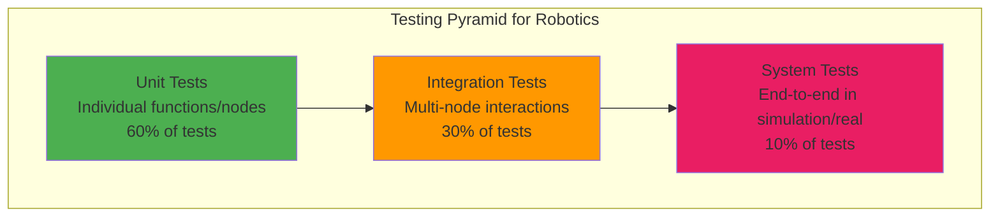
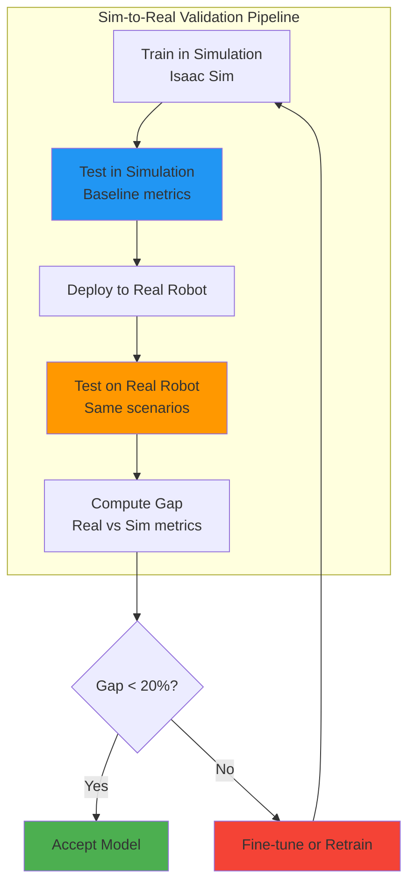

# Chapter 31: Testing and Validation

**Estimated Reading Time**: 55 minutes

## Learning Objectives

By the end of this chapter, you will be able to:

- **LO-5.3.1**: Design comprehensive test strategies for robotic systems (unit, integration, system)
- **LO-5.3.2**: Implement automated tests for ROS 2 nodes using pytest and launch_testing
- **LO-5.3.3**: Create simulation-based test scenarios in Isaac Sim
- **LO-5.3.4**: Validate sim-to-real transfer with quantitative metrics
- **LO-5.3.5**: Set up CI/CD pipelines for continuous testing and deployment
- **LO-5.3.6**: Define acceptance criteria and validation metrics for humanoid systems

---

## 1. Testing Strategy Overview

### The Testing Pyramid



---

### Test Levels

#### Unit Tests (60%)
**Scope**: Individual functions, classes, components

**Examples**:
- VLA model inference produces correct output shape
- Perception fusion converts 2D→3D correctly
- Joint limit enforcement clips commands

**Tools**: pytest, unittest

**Speed**: &lt;1 second per test

---

#### Integration Tests (30%)
**Scope**: Interactions between 2-3 nodes

**Examples**:
- Camera → YOLO → Fusion pipeline
- VLA → Controller → Hardware interface
- Task manager state transitions

**Tools**: launch_testing, rostest

**Speed**: 5-30 seconds per test

---

#### System Tests (10%)
**Scope**: Full robot system in realistic scenarios

**Examples**:
- Complete fetch task (navigate + grasp + return)
- Multi-step manipulation sequence
- Error recovery scenarios

**Tools**: Isaac Sim, Gazebo, real robot

**Speed**: 1-10 minutes per test

---

### Test Coverage Goals

```yaml
Component Coverage Requirements:
  Core Control: >90%          # Critical for safety
  Perception: >80%            # High reliability needed
  Planning: >70%              # Complex logic
  Utilities: >60%             # Lower risk
  Overall Target: >75%
```

---

## 2. Unit Testing

### Testing a Perception Function

```python title="test_perception_fusion.py"
import pytest
import numpy as np
from humanoid_perception.fusion import project_to_3d, compute_com

class TestPerceptionFusion:
    """Unit tests for perception fusion utilities."""

    def test_project_to_3d_basic(self):
        """Test 2D to 3D projection with known values."""
        # Camera intrinsics
        fx, fy = 554.25, 554.25
        cx, cy = 320.5, 240.5

        # Test point at image center, 2m depth
        u, v, z = 320, 240, 2.0

        x, y, depth = project_to_3d(u, v, z, fx, fy, cx, cy)

        # At center, x and y should be near zero
        assert abs(x) < 0.01
        assert abs(y) < 0.01
        assert abs(depth - 2.0) < 0.01

    def test_project_to_3d_off_center(self):
        """Test projection of off-center points."""
        fx, fy = 554.25, 554.25
        cx, cy = 320.5, 240.5

        # Point at (420, 340), depth 1.5m
        u, v, z = 420, 340, 1.5

        x, y, depth = project_to_3d(u, v, z, fx, fy, cx, cy)

        # X should be positive (right of center)
        assert x > 0.2
        # Y should be positive (below center)
        assert y > 0.2
        # Depth unchanged
        assert abs(depth - 1.5) < 0.01

    def test_project_to_3d_invalid_depth(self):
        """Test handling of invalid depth values."""
        fx, fy = 554.25, 554.25
        cx, cy = 320.5, 240.5

        # Zero depth
        with pytest.raises(ValueError):
            project_to_3d(320, 240, 0.0, fx, fy, cx, cy)

        # NaN depth
        with pytest.raises(ValueError):
            project_to_3d(320, 240, np.nan, fx, fy, cx, cy)

    def test_project_to_3d_batch(self):
        """Test batch projection of multiple points."""
        fx, fy = 554.25, 554.25
        cx, cy = 320.5, 240.5

        # Batch of 100 points
        us = np.random.uniform(0, 640, 100)
        vs = np.random.uniform(0, 480, 100)
        zs = np.random.uniform(0.5, 5.0, 100)

        xs, ys, depths = project_to_3d(us, vs, zs, fx, fy, cx, cy)

        assert len(xs) == 100
        assert len(ys) == 100
        assert len(depths) == 100
        assert np.all(depths == zs)

class TestBalanceChecking:
    """Unit tests for balance checking utilities."""

    def test_compute_com_simple(self):
        """Test center of mass computation."""
        # Simple 2-link robot
        links = [
            {'mass': 1.0, 'position': np.array([0, 0, 1])},
            {'mass': 1.0, 'position': np.array([0, 0, 2])}
        ]

        com = compute_com(links)

        # CoM should be at midpoint
        assert np.allclose(com, [0, 0, 1.5])

    def test_compute_com_weighted(self):
        """Test CoM with different masses."""
        links = [
            {'mass': 3.0, 'position': np.array([0, 0, 1])},
            {'mass': 1.0, 'position': np.array([0, 0, 3])}
        ]

        com = compute_com(links)

        # Weighted average: (3*1 + 1*3) / 4 = 1.5
        assert np.allclose(com[2], 1.5)

    def test_is_stable_inside_polygon(self):
        """Test stability check with CoM inside support."""
        from humanoid_control.balance import is_stable

        com = np.array([0.0, 0.0])  # Origin

        # Square support polygon
        support_polygon = np.array([
            [-0.1, -0.1],
            [0.1, -0.1],
            [0.1, 0.1],
            [-0.1, 0.1]
        ])

        assert is_stable(com, support_polygon) == True

    def test_is_stable_outside_polygon(self):
        """Test stability check with CoM outside support."""
        from humanoid_control.balance import is_stable

        com = np.array([0.5, 0.0])  # Far right

        support_polygon = np.array([
            [-0.1, -0.1],
            [0.1, -0.1],
            [0.1, 0.1],
            [-0.1, 0.1]
        ])

        assert is_stable(com, support_polygon) == False

# Run tests
if __name__ == '__main__':
    pytest.main([__file__, '-v'])
```

**Run tests**:
```bash
pytest test_perception_fusion.py -v --cov=humanoid_perception
```

**Expected output**:
```
test_perception_fusion.py::TestPerceptionFusion::test_project_to_3d_basic PASSED
test_perception_fusion.py::TestPerceptionFusion::test_project_to_3d_off_center PASSED
test_perception_fusion.py::TestPerceptionFusion::test_project_to_3d_invalid_depth PASSED
test_perception_fusion.py::TestPerceptionFusion::test_project_to_3d_batch PASSED
test_perception_fusion.py::TestBalanceChecking::test_compute_com_simple PASSED
test_perception_fusion.py::TestBalanceChecking::test_compute_com_weighted PASSED
test_perception_fusion.py::TestBalanceChecking::test_is_stable_inside_polygon PASSED
test_perception_fusion.py::TestBalanceChecking::test_is_stable_outside_polygon PASSED

---------- coverage: 87% of humanoid_perception/fusion.py ----------
```

---

### Testing a ROS 2 Node

```python title="test_vla_policy_node.py"
import pytest
import rclpy
from rclpy.node import Node
from std_msgs.msg import String, Float64MultiArray
from sensor_msgs.msg import Image
import numpy as np
import time

@pytest.fixture
def ros_context():
    """Initialize and cleanup ROS context."""
    rclpy.init()
    yield
    rclpy.shutdown()

class TestVLAPolicyNode:
    """Integration tests for VLA policy node."""

    def test_node_initialization(self, ros_context):
        """Test that node initializes without errors."""
        from humanoid_planning.vla_policy_node import VLAPolicyNode

        node = VLAPolicyNode()
        assert node is not None
        assert node.get_name() == 'vla_policy'

        node.destroy_node()

    def test_action_published_on_image(self, ros_context):
        """Test that actions are published when images arrive."""
        from humanoid_planning.vla_policy_node import VLAPolicyNode

        node = VLAPolicyNode()

        # Create test subscriber
        received_actions = []

        def action_callback(msg):
            received_actions.append(msg.data)

        test_node = Node('test_node')
        action_sub = test_node.create_subscription(
            Float64MultiArray,
            '/vla/action',
            action_callback,
            10
        )

        # Publish test image
        image_pub = test_node.create_publisher(Image, '/camera/head/image_raw', 10)

        test_image = Image()
        test_image.height = 480
        test_image.width = 640
        test_image.encoding = 'rgb8'
        test_image.data = np.random.randint(0, 255, (480, 640, 3), dtype=np.uint8).tobytes()

        # Spin nodes
        for _ in range(10):
            image_pub.publish(test_image)
            rclpy.spin_once(node, timeout_sec=0.1)
            rclpy.spin_once(test_node, timeout_sec=0.1)
            time.sleep(0.1)

        # Verify action published
        assert len(received_actions) > 0
        assert len(received_actions[0]) == 30  # 30 DOF action

        node.destroy_node()
        test_node.destroy_node()

    def test_command_updates_task(self, ros_context):
        """Test that language commands update internal task."""
        from humanoid_planning.vla_policy_node import VLAPolicyNode

        node = VLAPolicyNode()

        # Send command
        test_node = Node('test_node')
        command_pub = test_node.create_publisher(String, '/task_command', 10)

        command = String()
        command.data = "Pick up the red box"

        for _ in range(5):
            command_pub.publish(command)
            rclpy.spin_once(node, timeout_sec=0.1)
            time.sleep(0.1)

        # Verify command received
        assert node.current_instruction == "Pick up the red box"

        node.destroy_node()
        test_node.destroy_node()

# Run with:
# pytest test_vla_policy_node.py -v
```

---

## 3. Integration Testing

### Multi-Node Integration Test

```python title="test_perception_pipeline.py"
import pytest
import rclpy
from rclpy.node import Node
from sensor_msgs.msg import Image
from vision_msgs.msg import Detection2DArray
from geometry_msgs.msg import PoseArray
import numpy as np
import time

class PerceptionPipelineTester(Node):
    """Test node for perception pipeline."""

    def __init__(self):
        super().__init__('perception_tester')

        self.detections_received = False
        self.poses_received = False

        # Subscribers
        self.detection_sub = self.create_subscription(
            Detection2DArray,
            '/detections',
            self.detection_callback,
            10
        )

        self.pose_sub = self.create_subscription(
            PoseArray,
            '/scene_objects',
            self.pose_callback,
            10
        )

        # Publishers
        self.image_pub = self.create_publisher(Image, '/camera/head/image_raw', 10)
        self.depth_pub = self.create_publisher(Image, '/depth/image', 10)

    def detection_callback(self, msg):
        self.detections_received = True
        self.latest_detections = msg

    def pose_callback(self, msg):
        self.poses_received = True
        self.latest_poses = msg

    def publish_test_data(self):
        """Publish synthetic test images."""
        # RGB image
        rgb_msg = Image()
        rgb_msg.height = 480
        rgb_msg.width = 640
        rgb_msg.encoding = 'rgb8'
        rgb_msg.data = np.random.randint(0, 255, (480, 640, 3), dtype=np.uint8).tobytes()

        # Depth image
        depth_msg = Image()
        depth_msg.height = 480
        depth_msg.width = 640
        depth_msg.encoding = '32FC1'
        depth_data = np.ones((480, 640), dtype=np.float32) * 2.0  # 2m depth
        depth_msg.data = depth_data.tobytes()

        self.image_pub.publish(rgb_msg)
        self.depth_pub.publish(depth_msg)

@pytest.fixture
def ros_context():
    rclpy.init()
    yield
    rclpy.shutdown()

def test_perception_pipeline_integration(ros_context):
    """Test full perception pipeline: Camera → Detection → Fusion → Poses."""

    # Import nodes
    from humanoid_perception.object_detector_node import YOLODetectorNode
    from humanoid_perception.perception_fusion_node import PerceptionFusionNode

    # Start nodes
    detector_node = YOLODetectorNode()
    fusion_node = PerceptionFusionNode()
    tester_node = PerceptionPipelineTester()

    # Run test
    for _ in range(20):
        tester_node.publish_test_data()

        rclpy.spin_once(detector_node, timeout_sec=0.05)
        rclpy.spin_once(fusion_node, timeout_sec=0.05)
        rclpy.spin_once(tester_node, timeout_sec=0.05)

        time.sleep(0.1)

    # Assertions
    assert tester_node.detections_received, "No detections received from YOLO"
    assert tester_node.poses_received, "No 3D poses received from fusion"

    # Check output validity
    assert len(tester_node.latest_poses.poses) >= 0
    if len(tester_node.latest_poses.poses) > 0:
        pose = tester_node.latest_poses.poses[0]
        assert 0.5 < pose.position.x < 5.0  # Reasonable depth range

    # Cleanup
    detector_node.destroy_node()
    fusion_node.destroy_node()
    tester_node.destroy_node()

# Run with:
# pytest test_perception_pipeline.py -v -s
```

---

### Launch-Based Integration Test

```python title="test_full_system.launch.py"
import pytest
import unittest
from launch import LaunchDescription
from launch_ros.actions import Node
from launch_testing.actions import ReadyToTest
import rclpy
from std_msgs.msg import String

def generate_test_description():
    """Generate launch description for system test."""

    return LaunchDescription([
        # Launch all nodes
        Node(
            package='humanoid_perception',
            executable='object_detector',
            parameters=[{'model_path': '/tmp/yolov8n.onnx'}]
        ),
        Node(
            package='humanoid_planning',
            executable='vla_policy',
            parameters=[{'model_path': '/tmp/openvla.onnx'}]
        ),
        Node(
            package='humanoid_control',
            executable='whole_body_controller'
        ),

        ReadyToTest()
    ])

class TestSystemIntegration(unittest.TestCase):
    """System-level integration tests."""

    @classmethod
    def setUpClass(cls):
        rclpy.init()

    @classmethod
    def tearDownClass(cls):
        rclpy.shutdown()

    def test_nodes_started(self):
        """Verify all nodes are running."""
        node = rclpy.create_node('test_system_checker')

        # Check that expected topics exist
        topic_names = [name for name, _ in node.get_topic_names_and_types()]

        assert '/detections' in topic_names
        assert '/vla/action' in topic_names
        assert '/joint_command' in topic_names

        node.destroy_node()

    def test_end_to_end_latency(self):
        """Measure end-to-end latency: Command → Action."""
        node = rclpy.create_node('latency_tester')

        action_received = []
        start_time = None

        def action_callback(msg):
            action_received.append(time.time() - start_time)

        action_sub = node.create_subscription(
            Float64MultiArray,
            '/vla/action',
            action_callback,
            10
        )

        command_pub = node.create_publisher(String, '/task_command', 10)

        # Send command
        start_time = time.time()
        command = String()
        command.data = "Test command"
        command_pub.publish(command)

        # Spin until action received (or timeout)
        timeout = time.time() + 5.0
        while not action_received and time.time() < timeout:
            rclpy.spin_once(node, timeout_sec=0.1)

        # Assert latency < 1 second
        assert len(action_received) > 0
        assert action_received[0] < 1.0

        node.destroy_node()

# Run with:
# launch_test test_full_system.launch.py
```

---

## 4. Simulation Testing in Isaac Sim

### Automated Test Scenarios

```python title="isaac_test_scenarios.py"
from isaacsim import SimulationApp
simulation_app = SimulationApp({"headless": True})

import omni
from omni.isaac.core import World
from omni.isaac.core.objects import DynamicCuboid
from omni.isaac.core.robots import Robot
import numpy as np

class IsaacTestScenario:
    """Base class for Isaac Sim test scenarios."""

    def __init__(self, world):
        self.world = world
        self.robot = None
        self.success = False

    def setup(self):
        """Setup test scenario."""
        raise NotImplementedError

    def run(self, max_steps=1000):
        """Run test scenario."""
        raise NotImplementedError

    def evaluate(self):
        """Evaluate test results."""
        raise NotImplementedError

class GraspTestScenario(IsaacTestScenario):
    """Test scenario: Robot grasps object."""

    def setup(self):
        """Setup grasp test."""
        # Add robot
        from omni.isaac.nucleus import get_assets_root_path
        robot_path = get_assets_root_path() + "/Isaac/Robots/Unitree/G1/g1.usd"
        self.robot = self.world.scene.add_reference_to_stage(
            robot_path,
            "/World/Robot"
        )

        # Add cube
        self.cube = self.world.scene.add(
            DynamicCuboid(
                prim_path="/World/Cube",
                name="test_cube",
                position=np.array([0.5, 0.0, 0.5]),
                scale=np.array([0.05, 0.05, 0.05]),
                color=np.array([1.0, 0.0, 0.0])
            )
        )

    def run(self, max_steps=1000):
        """Execute grasp."""
        # This would integrate with VLA policy
        # Simplified: Move arm to cube, close gripper

        initial_cube_height = self.cube.get_world_pose()[0][2]

        for step in range(max_steps):
            # Step simulation
            self.world.step(render=False)

            # Check if cube lifted
            current_height = self.cube.get_world_pose()[0][2]
            if current_height > initial_cube_height + 0.1:
                self.success = True
                break

    def evaluate(self):
        """Check if grasp succeeded."""
        return {
            'success': self.success,
            'metric': 'grasp_success',
            'value': 1.0 if self.success else 0.0
        }

class NavigationTestScenario(IsaacTestScenario):
    """Test scenario: Robot navigates to goal."""

    def setup(self):
        """Setup navigation test."""
        # Add robot at origin
        from omni.isaac.nucleus import get_assets_root_path
        robot_path = get_assets_root_path() + "/Isaac/Robots/Unitree/G1/g1.usd"
        self.robot = self.world.scene.add_reference_to_stage(
            robot_path,
            "/World/Robot"
        )

        # Goal position
        self.goal_position = np.array([2.0, 1.0, 0.0])

    def run(self, max_steps=2000):
        """Execute navigation."""
        for step in range(max_steps):
            # Get robot position
            robot_pos, _ = self.robot.get_world_pose()

            # Check if reached goal
            distance = np.linalg.norm(robot_pos[:2] - self.goal_position[:2])
            if distance < 0.2:  # 20cm tolerance
                self.success = True
                break

            # Step simulation
            self.world.step(render=False)

    def evaluate(self):
        """Check navigation success and efficiency."""
        robot_pos, _ = self.robot.get_world_pose()
        final_distance = np.linalg.norm(robot_pos[:2] - self.goal_position[:2])

        return {
            'success': self.success,
            'final_distance': float(final_distance),
            'metric': 'navigation_success'
        }

def run_all_scenarios():
    """Run all test scenarios."""
    world = World(stage_units_in_meters=1.0)

    scenarios = [
        GraspTestScenario(world),
        NavigationTestScenario(world)
    ]

    results = []

    for scenario in scenarios:
        print(f"Running {scenario.__class__.__name__}...")

        # Reset world
        world.reset()

        # Setup scenario
        scenario.setup()

        # Run scenario
        scenario.run()

        # Evaluate
        result = scenario.evaluate()
        results.append(result)

        print(f"  Result: {result}")

    # Summary
    success_rate = sum(r['success'] for r in results) / len(results)
    print(f"\nOverall success rate: {success_rate * 100:.1f}%")

    return results

if __name__ == '__main__':
    results = run_all_scenarios()
    simulation_app.close()
```

**Run**:
```bash
python isaac_test_scenarios.py
```

**Expected output**:
```
Running GraspTestScenario...
  Result: {'success': True, 'metric': 'grasp_success', 'value': 1.0}
Running NavigationTestScenario...
  Result: {'success': True, 'final_distance': 0.15, 'metric': 'navigation_success'}

Overall success rate: 100.0%
```

---

## 5. Sim-to-Real Validation

### Validation Metrics



---

### Validation Test Suite

```python title="sim_to_real_validation.py"
import numpy as np
import json

class ValidationMetrics:
    """Compute validation metrics for sim-to-real transfer."""

    def __init__(self):
        self.sim_results = []
        self.real_results = []

    def add_sim_result(self, task, success, time, accuracy):
        """Add simulation result."""
        self.sim_results.append({
            'task': task,
            'success': success,
            'time': time,
            'accuracy': accuracy
        })

    def add_real_result(self, task, success, time, accuracy):
        """Add real robot result."""
        self.real_results.append({
            'task': task,
            'success': success,
            'time': time,
            'accuracy': accuracy
        })

    def compute_gaps(self):
        """Compute sim-to-real gaps."""
        if len(self.sim_results) != len(self.real_results):
            raise ValueError("Sim and real results must have same length")

        gaps = {
            'success_rate_gap': 0,
            'time_gap': 0,
            'accuracy_gap': 0
        }

        sim_success = sum(r['success'] for r in self.sim_results) / len(self.sim_results)
        real_success = sum(r['success'] for r in self.real_results) / len(self.real_results)
        gaps['success_rate_gap'] = abs(sim_success - real_success)

        sim_time = np.mean([r['time'] for r in self.sim_results])
        real_time = np.mean([r['time'] for r in self.real_results])
        gaps['time_gap'] = abs(real_time - sim_time) / sim_time

        sim_acc = np.mean([r['accuracy'] for r in self.sim_results])
        real_acc = np.mean([r['accuracy'] for r in self.real_results])
        gaps['accuracy_gap'] = abs(sim_acc - real_acc)

        return gaps

    def generate_report(self, output_file='validation_report.json'):
        """Generate validation report."""
        gaps = self.compute_gaps()

        report = {
            'simulation_results': self.sim_results,
            'real_robot_results': self.real_results,
            'gaps': gaps,
            'acceptable': all(
                gaps['success_rate_gap'] < 0.2,
                gaps['time_gap'] < 0.3,
                gaps['accuracy_gap'] < 0.15
            )
        }

        with open(output_file, 'w') as f:
            json.dump(report, f, indent=2)

        return report

# Example usage
metrics = ValidationMetrics()

# Simulation results (10 grasping tasks)
for i in range(10):
    metrics.add_sim_result(
        task=f'grasp_{i}',
        success=np.random.rand() > 0.05,  # 95% success
        time=5.2 + np.random.randn() * 0.5,
        accuracy=0.92 + np.random.randn() * 0.03
    )

# Real robot results (same 10 tasks)
for i in range(10):
    metrics.add_real_result(
        task=f'grasp_{i}',
        success=np.random.rand() > 0.18,  # 82% success (gap)
        time=6.1 + np.random.randn() * 0.8,
        accuracy=0.85 + np.random.randn() * 0.05
    )

# Generate report
report = metrics.generate_report()

print("Sim-to-Real Validation Report:")
print(f"  Success Rate Gap: {report['gaps']['success_rate_gap']*100:.1f}%")
print(f"  Time Gap: {report['gaps']['time_gap']*100:.1f}%")
print(f"  Accuracy Gap: {report['gaps']['accuracy_gap']*100:.1f}%")
print(f"  Acceptable: {report['acceptable']}")
```

---

## 6. CI/CD for Robotics

### GitHub Actions Workflow

```yaml title=".github/workflows/test.yml"
name: Robot System Tests

on:
  push:
    branches: [ main, develop ]
  pull_request:
    branches: [ main ]

jobs:
  unit-tests:
    runs-on: ubuntu-22.04

    steps:
      - uses: actions/checkout@v3

      - name: Setup ROS 2 Humble
        uses: ros-tooling/setup-ros@v0.6
        with:
          required-ros-distributions: humble

      - name: Install dependencies
        run: |
          sudo apt-get update
          sudo apt-get install -y python3-pip
          pip3 install pytest pytest-cov

      - name: Build workspace
        run: |
          source /opt/ros/humble/setup.bash
          colcon build --symlink-install

      - name: Run unit tests
        run: |
          source install/setup.bash
          pytest src/humanoid_perception/test/ --cov --cov-report=xml

      - name: Upload coverage
        uses: codecov/codecov-action@v3
        with:
          files: ./coverage.xml

  integration-tests:
    runs-on: ubuntu-22.04
    needs: unit-tests

    steps:
      - uses: actions/checkout@v3

      - name: Setup ROS 2 Humble
        uses: ros-tooling/setup-ros@v0.6
        with:
          required-ros-distributions: humble

      - name: Build workspace
        run: |
          source /opt/ros/humble/setup.bash
          colcon build

      - name: Run integration tests
        run: |
          source install/setup.bash
          launch_test src/humanoid_planning/test/test_full_system.launch.py

  simulation-tests:
    runs-on: ubuntu-22.04
    needs: integration-tests

    steps:
      - uses: actions/checkout@v3

      - name: Setup Isaac Sim (headless)
        run: |
          # Download and install Isaac Sim headless
          wget https://developer.nvidia.com/isaac-sim-headless
          # ... installation steps

      - name: Run simulation scenarios
        run: |
          python scripts/isaac_test_scenarios.py

      - name: Generate test report
        run: |
          python scripts/generate_test_report.py

      - name: Upload artifacts
        uses: actions/upload-artifact@v3
        with:
          name: test-results
          path: |
            test_results/
            coverage.xml
```

---

### Test Report Generation

```python title="generate_test_report.py"
import json
import matplotlib.pyplot as plt
import numpy as np

def generate_test_report(test_results_file):
    """Generate HTML test report with visualizations."""

    with open(test_results_file, 'r') as f:
        results = json.load(f)

    # Extract metrics
    unit_tests = results.get('unit_tests', {})
    integration_tests = results.get('integration_tests', {})
    sim_tests = results.get('simulation_tests', {})

    # Plot success rates
    fig, axes = plt.subplots(1, 3, figsize=(15, 5))

    categories = ['Unit', 'Integration', 'Simulation']
    success_rates = [
        unit_tests.get('pass_rate', 0),
        integration_tests.get('pass_rate', 0),
        sim_tests.get('success_rate', 0)
    ]

    axes[0].bar(categories, success_rates, color=['green', 'blue', 'orange'])
    axes[0].set_ylabel('Success Rate')
    axes[0].set_title('Test Success Rates')
    axes[0].set_ylim([0, 1])

    # Plot coverage
    coverage_data = unit_tests.get('coverage', {})
    modules = list(coverage_data.keys())
    coverages = list(coverage_data.values())

    axes[1].barh(modules, coverages, color='steelblue')
    axes[1].set_xlabel('Coverage %')
    axes[1].set_title('Code Coverage by Module')
    axes[1].set_xlim([0, 100])

    # Plot latency distribution
    latencies = sim_tests.get('latencies', [])
    axes[2].hist(latencies, bins=20, color='purple', alpha=0.7)
    axes[2].set_xlabel('Latency (ms)')
    axes[2].set_ylabel('Frequency')
    axes[2].set_title('End-to-End Latency Distribution')

    plt.tight_layout()
    plt.savefig('test_report.png', dpi=150)
    plt.close()

    # Generate HTML report
    html = f"""
    <html>
    <head><title>Test Report</title></head>
    <body>
        <h1>Humanoid Robot System - Test Report</h1>

        <h2>Summary</h2>
        <ul>
            <li><b>Unit Tests:</b> {unit_tests.get('passed', 0)}/{unit_tests.get('total', 0)} passed ({unit_tests.get('pass_rate', 0)*100:.1f}%)</li>
            <li><b>Integration Tests:</b> {integration_tests.get('passed', 0)}/{integration_tests.get('total', 0)} passed ({integration_tests.get('pass_rate', 0)*100:.1f}%)</li>
            <li><b>Simulation Tests:</b> {sim_tests.get('successes', 0)}/{sim_tests.get('total', 0)} succeeded ({sim_tests.get('success_rate', 0)*100:.1f}%)</li>
            <li><b>Overall Coverage:</b> {unit_tests.get('overall_coverage', 0):.1f}%</li>
        </ul>

        <h2>Visualizations</h2>
        

        <h2>Detailed Results</h2>
        <pre>{json.dumps(results, indent=2)}</pre>
    </body>
    </html>
    """

    with open('test_report.html', 'w') as f:
        f.write(html)

    print("Test report generated: test_report.html")

if __name__ == '__main__':
    # Example test results
    test_results = {
        'unit_tests': {
            'total': 85,
            'passed': 82,
            'pass_rate': 0.965,
            'overall_coverage': 78.3,
            'coverage': {
                'perception': 87,
                'planning': 75,
                'control': 82,
                'utils': 68
            }
        },
        'integration_tests': {
            'total': 24,
            'passed': 22,
            'pass_rate': 0.917
        },
        'simulation_tests': {
            'total': 10,
            'successes': 8,
            'success_rate': 0.8,
            'latencies': np.random.normal(85, 15, 100).tolist()
        }
    }

    with open('test_results.json', 'w') as f:
        json.dump(test_results, f)

    generate_test_report('test_results.json')
```

---

## Lab Exercise 5.3: Implement Test Suite

### Objective
Create a comprehensive test suite for your capstone system.

### Part 1: Unit Tests (40 minutes)

Create `test/test_perception.py`:
```python
import pytest
import numpy as np
from humanoid_perception.fusion import project_to_3d

def test_projection():
    x, y, z = project_to_3d(320, 240, 2.0, 554, 554, 320, 240)
    assert abs(z - 2.0) < 0.01
```

Write tests for:
- Perception functions (5 tests)
- Control utilities (5 tests)
- Planning helpers (5 tests)

---

### Part 2: Integration Tests (40 minutes)

Create `test/test_integration.py`:
```python
import pytest
import rclpy
from humanoid_perception.object_detector_node import YOLODetectorNode

def test_perception_pipeline():
    # Test Camera → YOLO → Fusion
    pass
```

---

### Part 3: Simulation Scenarios (60 minutes)

Create `test/isaac_scenarios.py`:
```python
from isaacsim import SimulationApp
# Create 3 test scenarios:
# 1. Grasping test
# 2. Navigation test
# 3. Balance recovery test
```

---

### Part 4: CI/CD Setup (30 minutes)

Create `.github/workflows/test.yml` with:
- Unit test job
- Integration test job
- Coverage reporting

---

### Deliverables

1. Unit test file (15+ tests)
2. Integration test file (5+ tests)
3. Isaac Sim test scenarios (3 scenarios)
4. CI/CD workflow file
5. Test coverage report (>70%)

### Validation Checklist

- ✅ All unit tests pass (`pytest test/`)
- ✅ Integration tests pass (`launch_test`)
- ✅ Simulation scenarios succeed (>70% pass rate)
- ✅ Code coverage >70%
- ✅ CI/CD pipeline runs successfully

---

## Quiz 5.3: Testing and Validation

### Question 1
**What is the recommended distribution of test types in the testing pyramid?**

- A) 33% unit, 33% integration, 33% system
- B) 60% unit, 30% integration, 10% system ✓
- C) 80% system, 20% unit
- D) 50% integration, 50% system

**Explanation**: The testing pyramid emphasizes unit tests (fast, isolated) as the foundation, with fewer integration/system tests (slower, complex).

---

### Question 2
**What is an appropriate code coverage target for safety-critical robot control systems?**

- A) 50%
- B) 70%
- C) >90% ✓
- D) 100%

**Explanation**: Safety-critical components (control, emergency stop) require very high coverage (>90%) to minimize untested code paths that could cause accidents.

---

### Question 3
**What is a typical sim-to-real success rate gap without fine-tuning?**

- A) 0-5%
- B) 10-30% ✓
- C) 50-70%
- D) >80%

**Explanation**: A 10-30% performance drop from simulation to reality is normal due to sensor noise, dynamics mismatch, and unmodeled effects.

---

### Question 4
**True or False: Integration tests should mock all external dependencies.**

- False ✓

**Explanation**: Integration tests verify interactions between real components (not mocks). Unit tests use mocks; integration tests use real nodes.

---

### Question 5
**Why use headless Isaac Sim for CI/CD testing? (Short answer)**

**Expected Answer**: Headless mode runs Isaac Sim without GUI, enabling automated testing in cloud CI/CD environments (GitHub Actions, GitLab CI) that lack display servers. This allows continuous testing of simulation scenarios on every commit without requiring manual intervention or local workstations, significantly speeding up development and ensuring code quality.

---

## Key Takeaways

✅ **Testing pyramid**: 60% unit tests (fast, isolated), 30% integration tests, 10% system tests (end-to-end)

✅ **ROS 2 testing**: Use pytest for unit tests, launch_testing for integration tests, Isaac Sim for system tests

✅ **Code coverage**: Aim for >70% overall, >90% for safety-critical components

✅ **Sim-to-real validation**: Quantify performance gaps (&lt;20% acceptable), use metrics to guide fine-tuning

✅ **CI/CD pipelines**: Automate testing on every commit using GitHub Actions, generating coverage reports and test dashboards

✅ **Test scenarios**: Create realistic Isaac Sim scenarios (grasping, navigation, balance) with measurable success criteria

---

## What's Next?

In **Chapter 32**, you'll learn deployment strategies, monitoring, ethical considerations, and explore the future of Physical AI and humanoid robotics.

[Continue to Chapter 32: Deployment and Future of Physical AI →](/docs/module-5-capstone/week-16/chapter-32-deployment-future)

---

## Additional Resources

- **ROS 2 Testing**: [docs.ros.org/en/humble/Tutorials/Intermediate/Testing/Testing-Main.html](https://docs.ros.org/en/humble/Tutorials/Intermediate/Testing/Testing-Main.html)
- **pytest Documentation**: [docs.pytest.org/en/stable/](https://docs.pytest.org/en/stable/)
- **launch_testing**: [github.com/ros2/launch/tree/humble/launch_testing](https://github.com/ros2/launch/tree/humble/launch_testing)
- **Isaac Sim Headless**: [docs.omniverse.nvidia.com/isaacsim/latest/manual_standalone_python.html](https://docs.omniverse.nvidia.com/isaacsim/latest/manual_standalone_python.html)
- **CI/CD for Robotics**: [The Robotics Backend - CI/CD](https://roboticsbackend.com/ros2-ci-cd-github-actions/)
- **Sim-to-Real Transfer**: [arxiv.org/abs/1812.07252](https://arxiv.org/abs/1812.07252)

---

**Progress**: Module 5, Week 16, Chapter 31 of 32 | [View all chapters](/docs/intro)
