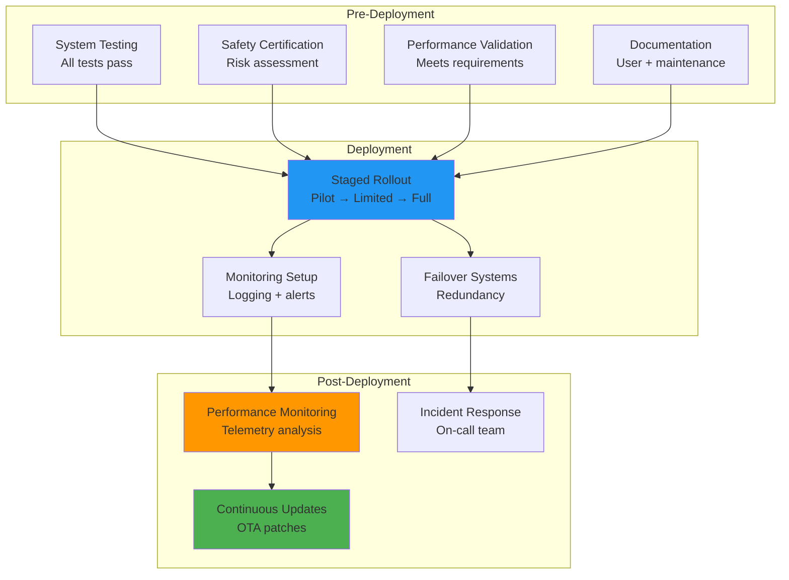
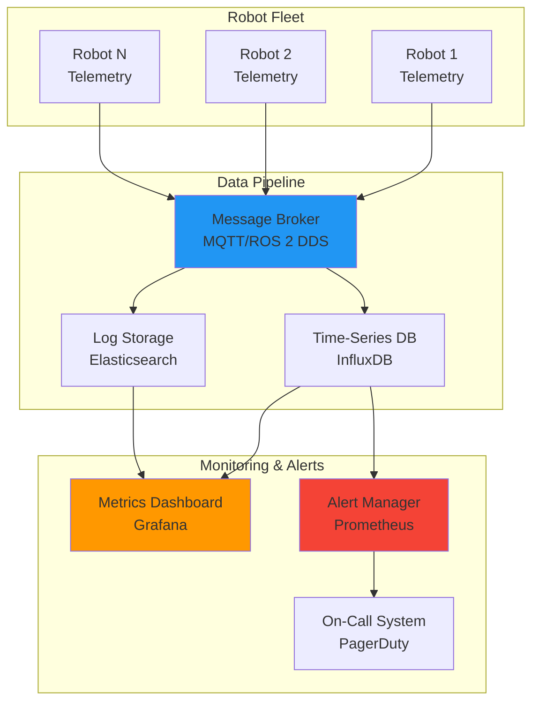
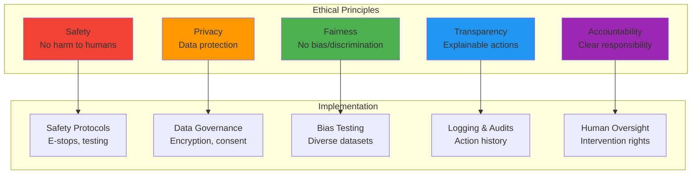
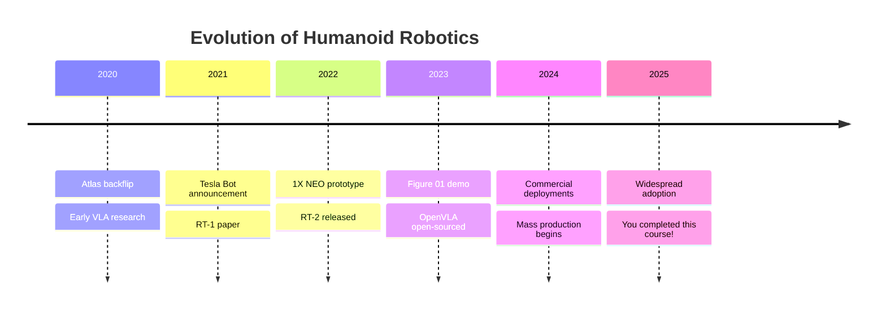
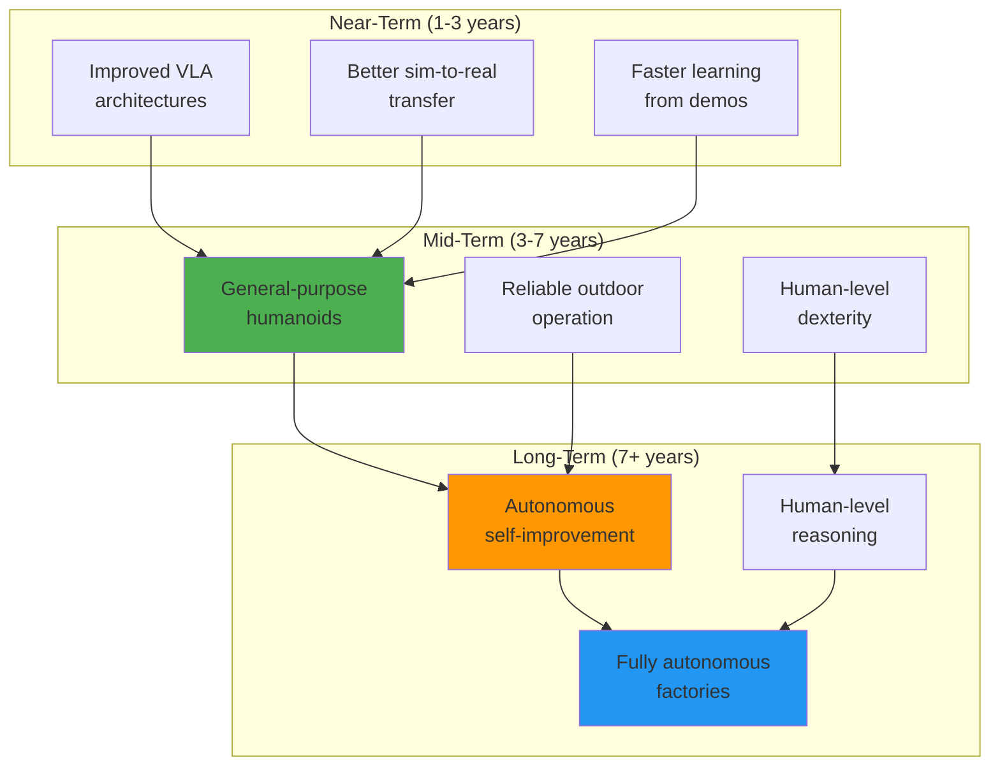
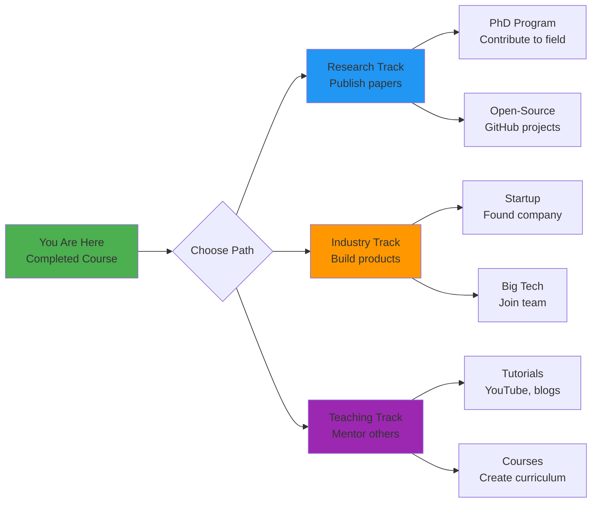

# Chapter 32: Deployment and Future of Physical AI

**Estimated Reading Time**: 60 minutes

## Learning Objectives

By the end of this chapter, you will be able to:

- **LO-5.4.1**: Design production deployment strategies for humanoid robot systems
- **LO-5.4.2**: Implement monitoring and observability for robot fleets
- **LO-5.4.3**: Apply ethical frameworks to Physical AI development and deployment
- **LO-5.4.4**: Establish safety protocols and risk mitigation strategies
- **LO-5.4.5**: Analyze current trends and predict future directions in humanoid robotics
- **LO-5.4.6**: Create a roadmap for continued learning and contribution to Physical AI

---

## 1. Production Deployment Strategies

### Deployment Readiness Checklist



---

### Staged Rollout Strategy

#### Phase 1: Pilot Deployment (Weeks 1-4)

**Scope**: 1-3 robots in controlled environment

**Goals**:
- Validate real-world performance
- Identify unexpected issues
- Train operators
- Refine deployment procedures

**Success Criteria**:
- No safety incidents
- >70% task success rate
- Operator satisfaction >8/10

**Example**:
```yaml
# pilot_deployment_config.yaml
deployment:
  phase: pilot
  robot_count: 2
  environment: warehouse_zone_a
  supervision_level: high  # Human supervisor always present

tasks:
  - pick_and_place_boxes
  - shelf_organization
  - inventory_scanning

monitoring:
  telemetry_rate: 10hz  # High frequency for debugging
  video_recording: true
  human_intervention_log: true

rollback_triggers:
  - safety_incident: true
  - task_success_rate: &lt;0.5
  - system_uptime: &lt;0.8
```

---

#### Phase 2: Limited Deployment (Weeks 5-12)

**Scope**: 10-30 robots across multiple sites

**Goals**:
- Scale infrastructure
- Test fleet management
- Optimize performance
- Collect diverse data

**Success Criteria**:
- Task success rate >80%
- Mean time between failures >24 hours
- No critical safety incidents

---

#### Phase 3: Full Production (Week 13+)

**Scope**: 100+ robots, all sites

**Goals**:
- Maximize operational efficiency
- Continuous improvement via data
- Establish support organization

**Success Criteria**:
- Task success rate >85%
- Uptime >95%
- Customer satisfaction >9/10

---

### Over-The-Air (OTA) Update System

```python title="ota_update_manager.py"
import rclpy
from rclpy.node import Node
from std_msgs.msg import String
import requests
import hashlib
import os
import subprocess

class OTAUpdateManager(Node):
    """Manage over-the-air software updates for robot fleet."""

    def __init__(self):
        super().__init__('ota_update_manager')

        # Parameters
        self.declare_parameter('update_server_url', 'https://updates.example.com')
        self.declare_parameter('current_version', '1.0.0')
        self.declare_parameter('auto_update', False)

        self.update_server = self.get_parameter('update_server_url').value
        self.current_version = self.get_parameter('current_version').value
        self.auto_update = self.get_parameter('auto_update').value

        # Publishers
        self.status_pub = self.create_publisher(String, '/system/update_status', 10)

        # Check for updates every hour
        self.timer = self.create_timer(3600, self.check_for_updates)

        self.get_logger().info(f"OTA Manager started (version {self.current_version})")

    def check_for_updates(self):
        """Check update server for new versions."""
        try:
            response = requests.get(
                f"{self.update_server}/api/latest_version",
                params={'robot_id': self.get_robot_id()}
            )

            if response.status_code == 200:
                latest_version = response.json()['version']

                if latest_version != self.current_version:
                    self.get_logger().info(
                        f"Update available: {self.current_version} → {latest_version}"
                    )

                    if self.auto_update:
                        self.perform_update(latest_version)
                    else:
                        self.notify_update_available(latest_version)
                else:
                    self.get_logger().info("System is up to date")

        except Exception as e:
            self.get_logger().error(f"Update check failed: {e}")

    def perform_update(self, version):
        """Download and install update."""
        self.get_logger().info(f"Starting update to version {version}")

        # Step 1: Download update package
        update_url = f"{self.update_server}/updates/{version}/package.tar.gz"
        local_file = f"/tmp/update_{version}.tar.gz"

        self.get_logger().info(f"Downloading {update_url}...")
        response = requests.get(update_url, stream=True)

        with open(local_file, 'wb') as f:
            for chunk in response.iter_content(chunk_size=8192):
                f.write(chunk)

        # Step 2: Verify checksum
        expected_checksum = requests.get(
            f"{self.update_server}/updates/{version}/checksum.sha256"
        ).text.strip()

        actual_checksum = self.compute_checksum(local_file)

        if actual_checksum != expected_checksum:
            self.get_logger().error("Checksum mismatch! Update aborted.")
            return

        # Step 3: Apply update
        self.get_logger().info("Checksum verified. Applying update...")

        # Extract and install
        subprocess.run(['tar', '-xzf', local_file, '-C', '/opt/robot_software/'])
        subprocess.run(['systemctl', 'restart', 'robot_stack.service'])

        self.get_logger().info(f"Update to {version} complete. Restarting...")

    def compute_checksum(self, file_path):
        """Compute SHA256 checksum."""
        sha256 = hashlib.sha256()
        with open(file_path, 'rb') as f:
            for block in iter(lambda: f.read(4096), b''):
                sha256.update(block)
        return sha256.hexdigest()

    def get_robot_id(self):
        """Get unique robot identifier."""
        # Read from file or hardware ID
        if os.path.exists('/etc/robot_id'):
            with open('/etc/robot_id', 'r') as f:
                return f.read().strip()
        return 'unknown'

    def notify_update_available(self, version):
        """Publish notification about available update."""
        msg = String()
        msg.data = f"Update available: {version}"
        self.status_pub.publish(msg)

def main():
    rclpy.init()
    node = OTAUpdateManager()
    rclpy.spin(node)
    node.destroy_node()
    rclpy.shutdown()

if __name__ == '__main__':
    main()
```

---

## 2. Monitoring and Observability

### Monitoring Architecture



---

### Telemetry Collection Node

```python title="telemetry_node.py"
import rclpy
from rclpy.node import Node
from sensor_msgs.msg import JointState, Imu, BatteryState
from std_msgs.msg import String
from diagnostic_msgs.msg import DiagnosticArray
import psutil
import json
from influxdb_client import InfluxDBClient, Point
from influxdb_client.client.write_api import SYNCHRONOUS

class TelemetryNode(Node):
    """Collect and publish system telemetry."""

    def __init__(self):
        super().__init__('telemetry_node')

        # InfluxDB client
        self.declare_parameter('influxdb_url', 'http://localhost:8086')
        self.declare_parameter('influxdb_token', 'your_token')
        self.declare_parameter('influxdb_org', 'your_org')
        self.declare_parameter('influxdb_bucket', 'robot_telemetry')

        influxdb_url = self.get_parameter('influxdb_url').value
        influxdb_token = self.get_parameter('influxdb_token').value
        influxdb_org = self.get_parameter('influxdb_org').value
        self.influxdb_bucket = self.get_parameter('influxdb_bucket').value

        self.influx_client = InfluxDBClient(
            url=influxdb_url,
            token=influxdb_token,
            org=influxdb_org
        )
        self.write_api = self.influx_client.write_api(write_options=SYNCHRONOUS)

        # Robot ID
        self.robot_id = self.get_robot_id()

        # Subscribers
        self.joint_sub = self.create_subscription(
            JointState, '/joint_states', self.joint_callback, 10
        )
        self.imu_sub = self.create_subscription(
            Imu, '/imu/data', self.imu_callback, 10
        )
        self.battery_sub = self.create_subscription(
            BatteryState, '/battery_state', self.battery_callback, 10
        )
        self.diagnostics_sub = self.create_subscription(
            DiagnosticArray, '/diagnostics', self.diagnostics_callback, 10
        )

        # Periodic system metrics
        self.timer = self.create_timer(1.0, self.publish_system_metrics)

        self.get_logger().info(f"Telemetry node started for robot {self.robot_id}")

    def get_robot_id(self):
        """Get robot identifier."""
        import socket
        return socket.gethostname()

    def joint_callback(self, msg):
        """Log joint states."""
        for i, name in enumerate(msg.name):
            point = Point("joint_state") \
                .tag("robot_id", self.robot_id) \
                .tag("joint", name) \
                .field("position", float(msg.position[i])) \
                .field("velocity", float(msg.velocity[i]) if msg.velocity else 0.0) \
                .field("effort", float(msg.effort[i]) if msg.effort else 0.0)

            self.write_api.write(bucket=self.influxdb_bucket, record=point)

    def imu_callback(self, msg):
        """Log IMU data."""
        point = Point("imu") \
            .tag("robot_id", self.robot_id) \
            .field("accel_x", msg.linear_acceleration.x) \
            .field("accel_y", msg.linear_acceleration.y) \
            .field("accel_z", msg.linear_acceleration.z) \
            .field("gyro_x", msg.angular_velocity.x) \
            .field("gyro_y", msg.angular_velocity.y) \
            .field("gyro_z", msg.angular_velocity.z)

        self.write_api.write(bucket=self.influxdb_bucket, record=point)

    def battery_callback(self, msg):
        """Log battery status."""
        point = Point("battery") \
            .tag("robot_id", self.robot_id) \
            .field("voltage", msg.voltage) \
            .field("current", msg.current) \
            .field("percentage", msg.percentage)

        self.write_api.write(bucket=self.influxdb_bucket, record=point)

    def diagnostics_callback(self, msg):
        """Log diagnostic messages."""
        for status in msg.status:
            point = Point("diagnostics") \
                .tag("robot_id", self.robot_id) \
                .tag("component", status.name) \
                .field("level", status.level) \
                .field("message", status.message)

            self.write_api.write(bucket=self.influxdb_bucket, record=point)

    def publish_system_metrics(self):
        """Publish system-level metrics."""
        # CPU usage
        cpu_percent = psutil.cpu_percent(interval=None)

        # Memory usage
        memory = psutil.virtual_memory()

        # Disk usage
        disk = psutil.disk_usage('/')

        # GPU usage (if available)
        try:
            import pynvml
            pynvml.nvmlInit()
            handle = pynvml.nvmlDeviceGetHandleByIndex(0)
            gpu_util = pynvml.nvmlDeviceGetUtilizationRates(handle)
            gpu_memory = pynvml.nvmlDeviceGetMemoryInfo(handle)
            gpu_temp = pynvml.nvmlDeviceGetTemperature(handle, pynvml.NVML_TEMPERATURE_GPU)

            gpu_available = True
        except:
            gpu_available = False

        # Write to InfluxDB
        point = Point("system_metrics") \
            .tag("robot_id", self.robot_id) \
            .field("cpu_percent", cpu_percent) \
            .field("memory_percent", memory.percent) \
            .field("disk_percent", disk.percent)

        if gpu_available:
            point = point \
                .field("gpu_util", gpu_util.gpu) \
                .field("gpu_memory_percent", gpu_memory.used / gpu_memory.total * 100) \
                .field("gpu_temp", gpu_temp)

        self.write_api.write(bucket=self.influxdb_bucket, record=point)

def main():
    rclpy.init()
    node = TelemetryNode()
    rclpy.spin(node)
    node.destroy_node()
    rclpy.shutdown()

if __name__ == '__main__':
    main()
```

---

### Grafana Dashboard Configuration

```json title="grafana_dashboard.json"
{
  "dashboard": {
    "title": "Robot Fleet Dashboard",
    "panels": [
      {
        "id": 1,
        "title": "Task Success Rate",
        "type": "graph",
        "targets": [
          {
            "query": "SELECT mean(success) FROM tasks WHERE time > now() - 24h GROUP BY time(1h), robot_id"
          }
        ]
      },
      {
        "id": 2,
        "title": "Battery Levels",
        "type": "gauge",
        "targets": [
          {
            "query": "SELECT last(percentage) FROM battery GROUP BY robot_id"
          }
        ]
      },
      {
        "id": 3,
        "title": "CPU Usage",
        "type": "timeseries",
        "targets": [
          {
            "query": "SELECT mean(cpu_percent) FROM system_metrics WHERE time > now() - 1h GROUP BY time(1m), robot_id"
          }
        ]
      },
      {
        "id": 4,
        "title": "Incident Map",
        "type": "geomap",
        "targets": [
          {
            "query": "SELECT count(*) FROM incidents WHERE time > now() - 7d GROUP BY location"
          }
        ]
      }
    ]
  }
}
```

---

## 3. Ethical Considerations

### Ethical Framework for Physical AI



---

### Safety Protocols

#### Emergency Stop System

```python title="emergency_stop_node.py"
import rclpy
from rclpy.node import Node
from std_srvs.srv import SetBool
from sensor_msgs.msg import Imu, JointState
import numpy as np

class EmergencyStopNode(Node):
    """Monitor robot state and trigger emergency stop when needed."""

    def __init__(self):
        super().__init__('emergency_stop_node')

        # State
        self.emergency_stop_active = False

        # Thresholds
        self.max_tilt_angle = np.deg2rad(20)  # 20 degrees
        self.max_joint_velocity = 5.0  # rad/s
        self.max_acceleration = 50.0  # m/s^2

        # Subscribers
        self.imu_sub = self.create_subscription(
            Imu, '/imu/data', self.imu_callback, 10
        )
        self.joint_sub = self.create_subscription(
            JointState, '/joint_states', self.joint_callback, 10
        )

        # Service
        self.estop_service = self.create_service(
            SetBool,
            '/emergency_stop',
            self.estop_service_callback
        )

        # Publisher (to hardware interface)
        self.estop_pub = self.create_publisher(SetBool, '/hardware/emergency_stop', 10)

        self.get_logger().info("Emergency stop monitor started")

    def imu_callback(self, msg):
        """Check for dangerous tilt or acceleration."""
        if self.emergency_stop_active:
            return

        # Check tilt
        accel = np.array([
            msg.linear_acceleration.x,
            msg.linear_acceleration.y,
            msg.linear_acceleration.z
        ])

        tilt = np.arctan2(
            np.sqrt(accel[0]**2 + accel[1]**2),
            abs(accel[2])
        )

        if tilt > self.max_tilt_angle:
            self.trigger_emergency_stop(f"Excessive tilt: {np.rad2deg(tilt):.1f}°")

        # Check acceleration
        accel_magnitude = np.linalg.norm(accel)
        if accel_magnitude > self.max_acceleration:
            self.trigger_emergency_stop(f"Excessive acceleration: {accel_magnitude:.1f} m/s^2")

    def joint_callback(self, msg):
        """Check for dangerous joint velocities."""
        if self.emergency_stop_active:
            return

        if msg.velocity:
            max_vel = max(abs(v) for v in msg.velocity)
            if max_vel > self.max_joint_velocity:
                self.trigger_emergency_stop(f"Excessive joint velocity: {max_vel:.1f} rad/s")

    def trigger_emergency_stop(self, reason):
        """Activate emergency stop."""
        self.get_logger().error(f"EMERGENCY STOP: {reason}")

        self.emergency_stop_active = True

        # Publish to hardware interface
        msg = SetBool.Request()
        msg.data = True
        self.estop_pub.publish(msg)

    def estop_service_callback(self, request, response):
        """Handle manual emergency stop requests."""
        if request.data:
            self.trigger_emergency_stop("Manual trigger")
            response.success = True
            response.message = "Emergency stop activated"
        else:
            # Reset
            self.emergency_stop_active = False
            response.success = True
            response.message = "Emergency stop reset"

        return response

def main():
    rclpy.init()
    node = EmergencyStopNode()
    rclpy.spin(node)
    node.destroy_node()
    rclpy.shutdown()

if __name__ == '__main__':
    main()
```

---

### Privacy and Data Governance

**Key Principles**:

1. **Data Minimization**: Collect only what's necessary
2. **Purpose Limitation**: Use data only for stated purposes
3. **Encryption**: Protect data in transit and at rest
4. **Consent**: Obtain explicit permission for human data (video, audio)
5. **Right to Deletion**: Allow individuals to request data removal

**Implementation**:

```yaml title="privacy_policy.yaml"
data_collection:
  camera_data:
    retention_period: 7_days
    blur_faces: true
    encryption: AES-256
    consent_required: true

  sensor_data:
    retention_period: 30_days
    anonymize: true

  telemetry:
    retention_period: 90_days
    aggregate_only: true  # No individual-level data

access_controls:
  engineers:
    - read_telemetry
    - read_logs
  operators:
    - read_status
  administrators:
    - read_all
    - delete_data
```

---

### Bias Mitigation

**Challenge**: VLA models trained on web data may exhibit biases.

**Mitigation Strategies**:

1. **Diverse Training Data**: Include underrepresented groups/scenarios
2. **Fairness Testing**: Evaluate performance across demographics
3. **Debiasing Techniques**: Fine-tune to reduce disparate impact
4. **Human-in-the-Loop**: Flag uncertain decisions for human review

```python title="bias_testing.py"
import numpy as np

def test_fairness(model, test_sets):
    """Test model fairness across demographic groups."""

    results = {}

    for group_name, test_data in test_sets.items():
        successes = []

        for example in test_data:
            prediction = model.predict(example['image'], example['instruction'])
            success = evaluate_prediction(prediction, example['ground_truth'])
            successes.append(success)

        results[group_name] = {
            'success_rate': np.mean(successes),
            'count': len(successes)
        }

    # Check for disparate impact
    baseline_rate = results['baseline']['success_rate']

    for group_name, metrics in results.items():
        if group_name == 'baseline':
            continue

        ratio = metrics['success_rate'] / baseline_rate

        if ratio < 0.8:  # 80% rule (EEOC guideline)
            print(f"WARNING: Disparate impact detected for {group_name}")
            print(f"  Success rate: {metrics['success_rate']:.2%} vs baseline {baseline_rate:.2%}")
            print(f"  Ratio: {ratio:.2f} (threshold: 0.80)")

    return results

# Example usage
test_sets = {
    'baseline': load_test_data('diverse_users'),
    'elderly_users': load_test_data('elderly'),
    'wheelchair_users': load_test_data('wheelchair'),
    'children': load_test_data('children')
}

fairness_results = test_fairness(vla_model, test_sets)
```

---

## 4. Future of Physical AI

### Current State (2025)



---

### Emerging Trends

#### 1. Foundation Models for Robotics

**Trend**: Large-scale pre-training on diverse robot data (RT-X, Open-X Embodiment)

**Impact**:
- Single model controls multiple robot types
- Faster learning from small datasets (few-shot)
- Better generalization to novel tasks

**Timeline**: 2-3 years to mainstream adoption

---

#### 2. Sim-to-Real Breakthrough

**Trend**: Near-zero sim-to-real gap via photorealistic simulation + domain randomization

**Impact**:
- Train entirely in simulation (no real robot data needed)
- Deploy to diverse environments without retraining
- Dramatically reduce development costs

**Timeline**: 3-5 years

---

#### 3. Dexterous Manipulation

**Trend**: Multi-fingered hands with tactile feedback become standard

**Impact**:
- Handle complex objects (bottles, tools, fabric)
- Perform human-level assembly tasks
- Enable new applications (healthcare, cooking)

**Timeline**: 4-6 years for consumer applications

---

#### 4. Human-Robot Collaboration

**Trend**: Robots work alongside humans safely in shared spaces

**Impact**:
- Manufacturing: collaborative assembly
- Healthcare: assisted living, rehabilitation
- Domestic: household chores, elder care

**Timeline**: 5-7 years for widespread deployment

---

#### 5. Affordable Humanoids

**Trend**: Cost reduction from $100k+ to &lt;$20k

**Impact**:
- Consumer market opens (homes, small businesses)
- Exponential growth in deployment
- New business models (robotics-as-a-service)

**Timeline**: 5-10 years

---

### Future Research Directions



---

### Market Projections

| Year | Humanoid Market Size | Key Applications |
|------|---------------------|------------------|
| 2025 | $5B | Warehouses, R&D |
| 2030 | $38B | Manufacturing, healthcare |
| 2035 | $150B+ | Homes, services, construction |

**Source**: Allied Market Research, Goldman Sachs Research

---

## 5. Your Next Steps

### Capstone Project Completion

**Final Deliverables**:

1. ✅ **Working System**: Integrated humanoid robot in Isaac Sim
2. ✅ **Demo Video**: 2-minute showcase (3 tasks executed)
3. ✅ **Technical Report**: Architecture, results, lessons learned
4. ✅ **Code Repository**: GitHub with README, documentation
5. ✅ **Presentation**: 10-minute slide deck

---

### Continued Learning Roadmap



---

### Recommended Next Courses

**Advanced Topics**:
1. **Reinforcement Learning for Robotics** (Berkeley CS 287)
2. **Robot Learning Seminar** (Stanford CS 337)
3. **Humanoid Locomotion** (CMU 16-745)
4. **Multi-Robot Systems** (MIT 6.834)

**Hands-On Projects**:
1. Contribute to OpenVLA or RT-X projects
2. Build a custom humanoid (PAL Robotics open-source)
3. Participate in robotics competitions (RoboCup, DARPA)

**Research Papers** (must-read):
- RT-2: Vision-Language-Action Models ([arxiv.org/abs/2307.15818](https://arxiv.org/abs/2307.15818))
- Open X-Embodiment ([robotics-transformer-x.github.io](https://robotics-transformer-x.github.io/))
- Dexterity from Touch ([arxiv.org/abs/2309.09973](https://arxiv.org/abs/2309.09973))

---

### Community Engagement

**Join Communities**:
- ROS Discourse: [discourse.ros.org](https://discourse.ros.org/)
- Humanoid Robotics Discord: [discord.gg/humanoid-robotics](https://discord.gg/humanoid-robotics)
- Physical AI Slack: [physicalai.slack.com](https://physicalai.slack.com/)

**Contribute**:
- Open-source projects (ROS 2 packages, VLA implementations)
- Documentation improvements
- Bug reports and fixes

**Network**:
- Attend conferences (ICRA, IROS, RSS, CoRL)
- Follow researchers on Twitter/X
- Join local robotics meetups

---

## Lab Exercise 5.4: Deploy Your Capstone System

### Objective
Complete final deployment and create comprehensive documentation.

### Part 1: Deployment Checklist (30 minutes)

Create `deployment_checklist.md`:

```markdown
# Deployment Checklist

## Pre-Deployment
- [ ] All tests passing (unit, integration, system)
- [ ] Code coverage >70%
- [ ] Safety protocols implemented
- [ ] Documentation complete
- [ ] Performance meets requirements

## Deployment
- [ ] Isaac Sim environment configured
- [ ] Launch files tested
- [ ] Monitoring enabled
- [ ] Emergency stop verified
- [ ] Backup/recovery plan documented

## Post-Deployment
- [ ] System running for >1 hour without failures
- [ ] 5 tasks completed successfully
- [ ] Telemetry collected and visualized
- [ ] Demo video recorded
- [ ] Final report written
```

---

### Part 2: Demo Video (60 minutes)

Create 2-minute video showcasing:
1. **Introduction** (15s): System overview
2. **Task 1** (30s): Navigation + object detection
3. **Task 2** (30s): Manipulation (grasp + place)
4. **Task 3** (30s): Multi-step sequence
5. **Conclusion** (15s): Results + future work

**Tools**: OBS Studio, Isaac Sim recording, video editor

---

### Part 3: Technical Report (90 minutes)

Write 5-page report covering:

**1. Executive Summary** (0.5 pages)
- Project goal
- Key results
- Lessons learned

**2. System Architecture** (1.5 pages)
- Node graph diagram
- Component descriptions
- Technology choices

**3. Implementation** (1.5 pages)
- Perception pipeline
- VLA integration
- Control system
- Key code snippets

**4. Testing & Validation** (1 page)
- Test strategy
- Results (success rates, latency, coverage)
- Sim-to-real validation (if applicable)

**5. Conclusion** (0.5 pages)
- Achievements
- Challenges
- Future improvements

---

### Part 4: Code Repository (30 minutes)

Structure your GitHub repo:

```
capstone-humanoid-robot/
├── README.md                # Overview, setup, demo
├── LICENSE
├── docs/
│   ├── architecture.md
│   ├── deployment.md
│   └── api_reference.md
├── src/
│   ├── humanoid_perception/
│   ├── humanoid_planning/
│   ├── humanoid_control/
│   └── humanoid_safety/
├── launch/
│   └── humanoid_system.launch.py
├── config/
│   └── parameters.yaml
├── test/
│   ├── unit/
│   ├── integration/
│   └── system/
├── models/
│   └── README.md (download links)
└── demo/
    └── demo_video.mp4
```

---

### Deliverables

1. ✅ Deployment checklist (completed)
2. ✅ Demo video (2 minutes, uploaded to YouTube/Vimeo)
3. ✅ Technical report (5 pages PDF)
4. ✅ GitHub repository (public, with README)
5. ✅ Presentation slides (10 slides)

### Validation Checklist

- ✅ System deployed successfully in Isaac Sim
- ✅ 5+ tasks completed end-to-end
- ✅ Demo video shows working system
- ✅ Technical report is comprehensive and clear
- ✅ Code repository is well-documented
- ✅ Presentation is professional and engaging

---

## Quiz 5.4: Deployment and Future

### Question 1
**What is the recommended approach for deploying robot systems to production?**

- A) Deploy all robots at once
- B) Staged rollout (pilot → limited → full) ✓
- C) Deploy to customers first, then test
- D) Skip testing if simulations passed

**Explanation**: Staged rollout allows gradual validation in real environments, identifying issues before full-scale deployment and minimizing risk.

---

### Question 2
**Which metric is most critical for production robot monitoring?**

- A) CPU usage
- B) Code commits per day
- C) Task success rate + safety incidents ✓
- D) GPU temperature

**Explanation**: Task success rate measures whether the robot fulfills its purpose, and safety incidents directly impact humans—both are critical for production systems.

---

### Question 3
**What is the "80% rule" in bias testing?**

- A) 80% test coverage required
- B) Model must work 80% of the time
- C) Protected group's success rate must be ≥80% of baseline ✓
- D) 80% of data must be diverse

**Explanation**: The 80% rule (from EEOC guidelines) states that a protected group's success rate should be at least 80% of the baseline rate, or disparate impact may exist.

---

### Question 4
**True or False: Emergency stop systems should only be software-based.**

- False ✓

**Explanation**: Safety-critical systems require hardware emergency stops (physical buttons) as a failsafe when software fails or is unresponsive.

---

### Question 5
**What is the projected humanoid robotics market size by 2030? (Short answer)**

**Expected Answer**: Approximately $38 billion according to market research (Allied Market Research, Goldman Sachs). The market is expected to grow from ~$5B in 2025 to $150B+ by 2035, driven by manufacturing, healthcare, and eventually consumer applications as costs decrease and capabilities improve.

---

## Key Takeaways

✅ **Production deployment** requires staged rollout (pilot → limited → full) with rigorous monitoring and rollback capabilities

✅ **Monitoring systems** collect telemetry (metrics, logs, diagnostics) and visualize via dashboards (Grafana) with alerting (Prometheus)

✅ **Ethical frameworks** prioritize safety, privacy, fairness, transparency, and accountability in Physical AI systems

✅ **Emergency stop systems** combine hardware (physical buttons) and software (IMU monitoring) for failsafe operation

✅ **Future trends** include foundation models, dexterous manipulation, human-robot collaboration, and affordable humanoids (&lt;$20k by 2030)

✅ **Your journey continues** through research, industry, or teaching—the field needs your contributions!

---

## Final Thoughts

### Congratulations!

You've completed a comprehensive journey through Physical AI and humanoid robotics:

- **Module 1**: ROS 2 fundamentals (nodes, topics, services, actions)
- **Module 2**: Digital twin simulation (Gazebo, Unity, URDF)
- **Module 3**: NVIDIA Isaac platform (synthetic data, RL, perception)
- **Module 4**: Vision-Language-Action models (VLA architecture, training, deployment)
- **Module 5**: Capstone project (integrated autonomous humanoid system)

**You now have the skills to**:
- Design and implement robot software architectures
- Train perception and control models with sim-to-real transfer
- Build language-conditioned robot policies with VLA
- Deploy production-ready systems with monitoring and safety
- Contribute to the future of Physical AI

---

### The Road Ahead

**Physical AI is at an inflection point**. In the next 5-10 years, humanoid robots will transition from research labs to everyday life—warehouses, hospitals, homes, and beyond.

**The field needs**:
- **Engineers** to build robust systems
- **Researchers** to solve open problems
- **Entrepreneurs** to create new applications
- **Ethicists** to guide responsible development

**You** are now equipped to be part of this transformation.

**Go build the future.**

---

## Thank You

Thank you for joining us on this journey. We can't wait to see what you build next.

**Stay in touch**:
- Share your capstone project: [#PhysicalAI](https://twitter.com/hashtag/PhysicalAI)
- Join the community: [Physical AI Discord](https://discord.gg/physical-ai)
- Continue learning: [Resources page](/docs/resources)

**Questions?** Check the [FAQ](/docs/faq) or reach out to the community.

---

**[Return to Course Introduction](/docs/intro)** | **[View All Modules](/docs/intro#-5-comprehensive-modules)**

---

## Additional Resources

- **Deployment Best Practices**: [The Pragmatic Engineer - Production Readiness](https://blog.pragmaticengineer.com/production-readiness-checklist/)
- **Robot Ethics**: [IEEE Robotics and Automation Society - Ethics](https://www.ieee-ras.org/robot-ethics)
- **Monitoring for Robotics**: [Elastic Observability for Robotics](https://www.elastic.co/blog/observability-for-robotics)
- **Future Trends**: [Goldman Sachs - Humanoid Robots Report](https://www.goldmansachs.com/insights/articles/robots-are-coming)
- **RT-X Project**: [robotics-transformer-x.github.io](https://robotics-transformer-x.github.io/)
- **OpenVLA**: [openvla.github.io](https://openvla.github.io/)
- **1X Technologies**: [1x.tech](https://www.1x.tech/)
- **Figure AI**: [figure.ai](https://www.figure.ai/)
- **Tesla Optimus**: [tesla.com/AI](https://www.tesla.com/AI)

---

**Progress**: Module 5, Week 16, Chapter 32 of 32 - COURSE COMPLETE! | [View all chapters](/docs/intro)
