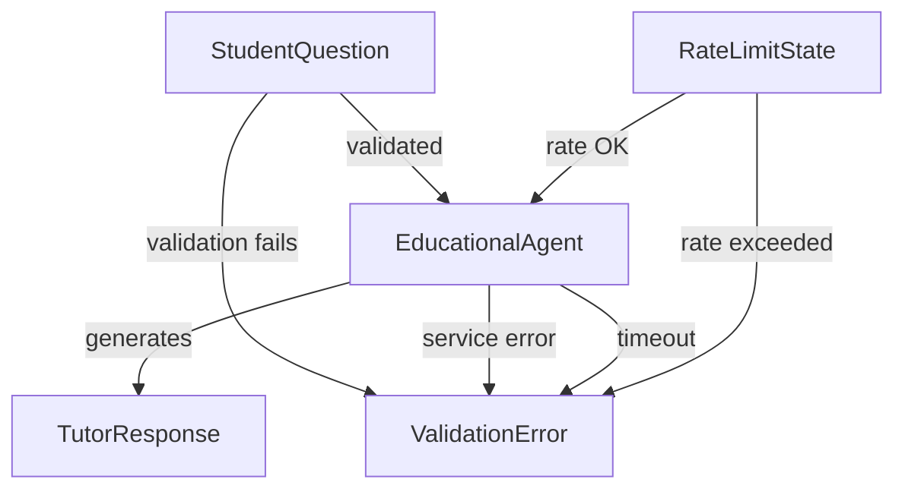
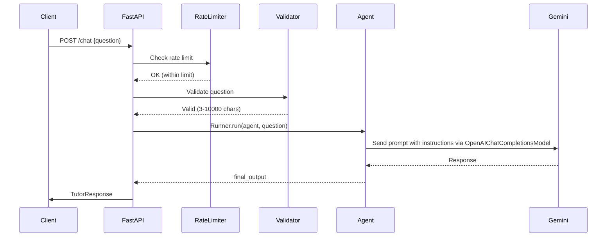
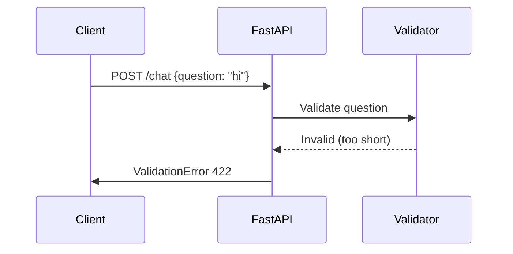
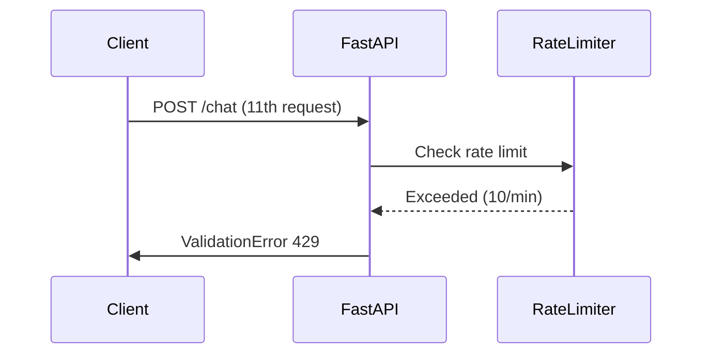

# Data Model: Backend Chat Communication Service with OpenAIChatCompletionsModel

**Feature**: Backend Chat Communication Service
**Branch**: `001-fastapi-chat-endpoint`
**Date**: 2025-12-14
**Status**: Draft

## Overview

This document defines the data models, entities, and state management for the FastAPI chat endpoint using OpenAI Agent SDK with OpenAIChatCompletionsModel and Gemini 2.0 Flash. The data model supports the requirements defined in `spec.md` and architectural decisions from `research.md`. The migration to OpenAIChatCompletionsModel is purely an internal implementation change that maintains 100% backward compatibility in data models and API contracts.

## Core Entities

### 1. StudentQuestion

**Purpose**: Represents incoming questions from students with quality validation constraints.

**Fields**:
| Field | Type | Constraints | Description |
|-------|------|-------------|-------------|
| `question` | `str` | min_length=3, max_length=10000 | The student's question text |

**Validation Rules**:
- **FR-002**: Minimum 3 characters (prevents empty/trivial input)
- **FR-002**: Maximum 10,000 characters (prevents abuse and token overflow)
- Must be non-empty string after stripping whitespace

**Pydantic Model**:
```python
from pydantic import BaseModel, Field, validator

class StudentQuestion(BaseModel):
    question: str = Field(
        ...,
        min_length=3,
        max_length=10000,
        description="Student's learning question"
    )

    @validator('question')
    def question_not_empty_whitespace(cls, v):
        if not v.strip():
            raise ValueError('Question cannot be only whitespace')
        return v.strip()

    class Config:
        json_schema_extra = {
            "example": {
                "question": "What is Physical AI and how does it differ from traditional AI?"
            }
        }
```

**State Transitions**: N/A (stateless input)

---

### 2. TutorResponse

**Purpose**: Represents educational responses generated by the AI tutor.

**Fields**:
| Field | Type | Constraints | Description |
|-------|------|-------------|-------------|
| `response` | `str` | required, non-empty | The educational response content |
| `agent_name` | `str` | required | Name of the agent that generated the response |
| `timestamp` | `datetime` | auto-generated | When the response was created (ISO 8601) |

**Validation Rules**:
- **FR-009**: Response must not be empty or only whitespace
- **FR-010**: Response must be guided by Global Constitution principles (validated via agent instructions)
- Response should be educational and relevant to Physical AI/Robotics

**Pydantic Model**:
```python
from pydantic import BaseModel, Field
from datetime import datetime

class TutorResponse(BaseModel):
    response: str = Field(
        ...,
        description="Educational response from the AI tutor"
    )
    agent_name: str = Field(
        ...,
        description="Name of the agent that generated this response"
    )
    timestamp: datetime = Field(
        default_factory=datetime.utcnow,
        description="When the response was generated (UTC)"
    )

    class Config:
        json_schema_extra = {
            "example": {
                "response": "Physical AI refers to artificial intelligence systems that interact with and manipulate the physical world through robotics...",
                "agent_name": "Educational Tutor",
                "timestamp": "2025-12-14T10:30:00Z"
            }
        }
```

**State Transitions**: N/A (immutable output)

---

### 3. ValidationError

**Purpose**: Represents feedback provided when input doesn't meet requirements.

**Fields**:
| Field | Type | Constraints | Description |
|-------|------|-------------|-------------|
| `error_type` | `str` | enum: validation, service, timeout, rate_limit | Category of error |
| `message` | `str` | required | User-friendly error message |
| `field` | `str | None` | optional | Field that failed validation (if applicable) |
| `timestamp` | `datetime` | auto-generated | When the error occurred |

**Error Types**:
- `validation`: Input validation failures (FR-006)
- `service`: AI service unavailable (FR-007)
- `timeout`: Request exceeded 30 seconds (FR-008)
- `rate_limit`: Too many requests (FR-013)

**Pydantic Model**:
```python
from pydantic import BaseModel, Field
from datetime import datetime
from enum import Enum

class ErrorType(str, Enum):
    VALIDATION = "validation"
    SERVICE = "service"
    TIMEOUT = "timeout"
    RATE_LIMIT = "rate_limit"

class ValidationError(BaseModel):
    error_type: ErrorType = Field(
        ...,
        description="Category of error"
    )
    message: str = Field(
        ...,
        description="User-friendly error message"
    )
    field: str | None = Field(
        None,
        description="Field that failed validation (if applicable)"
    )
    timestamp: datetime = Field(
        default_factory=datetime.utcnow,
        description="When the error occurred (UTC)"
    )

    class Config:
        json_schema_extra = {
            "example": {
                "error_type": "validation",
                "message": "Question must be at least 3 characters long",
                "field": "question",
                "timestamp": "2025-12-14T10:30:00Z"
            }
        }
```

**State Transitions**: N/A (error output)

---

### 4. EducationalAgent

**Purpose**: Represents the AI tutor agent configuration and state using OpenAIChatCompletionsModel.

**Fields**:
| Field | Type | Constraints | Description |
|-------|------|-------------|-------------|
| `name` | `str` | required | Agent identifier |
| `instructions` | `str` | required | Educational principles and guidelines |
| `model` | `OpenAIChatCompletionsModel` | required | LLM configuration (Gemini 2.0 Flash) |
| `tools` | `list[function_tool]` | optional | Available tools (none for MVP) |
| `guardrails` | `list[Guardrail]` | optional | Input/output validation rules |

**Validation Rules**:
- **FR-003**: Instructions must include Global Constitution principles
- **FR-011**: Agent must be ready within 5 seconds of startup
- Model must be configured with valid Gemini API credentials
- **FR-014**: OpenAIChatCompletionsModel must be configured for Gemini 2.0 Flash

**Implementation** (using OpenAI Agent SDK with OpenAIChatCompletionsModel):
```python
from agents import Agent, AsyncOpenAI, OpenAIChatCompletionsModel
import os

class EducationalAgentFactory:
    """Factory for creating educational tutor agents with OpenAIChatCompletionsModel"""

    @staticmethod
    def load_educational_instructions() -> str:
        """Load Global Constitution and format as agent instructions"""
        constitution_path = ".specify/memory/constitution.md"
        with open(constitution_path, "r") as f:
            constitution = f.read()

        # Extract educational principles (Core Principles section)
        principles = EducationalAgentFactory.extract_principles(constitution)

        instructions = f"""
You are an educational AI tutor specializing in Physical AI and Humanoid Robotics.

## Your Mission
Help students learn complex Physical AI concepts through accessible, progressive,
and practical explanations aligned with the Physical AI Textbook curriculum.

## Educational Principles (Global Constitution)
{principles}

## Response Guidelines
1. **Accessibility**: Explain concepts for learners with varying software/hardware backgrounds
2. **Progressive Difficulty**: Start with foundational concepts before advanced topics
3. **Practical Context**: Include examples, simulations, and hands-on exercise suggestions
4. **Course Alignment**: Reference course modules (ROS 2, Gazebo/Unity, NVIDIA Isaac, VLA)
5. **Clarity First**: Use clear language, avoid unnecessary jargon, define technical terms
6. **Engagement**: Encourage exploration and deeper questions

## Scope
- Focus on Physical AI and Humanoid Robotics topics
- Reference textbook content when relevant
- For out-of-scope questions, politely redirect to Physical AI topics
"""
        return instructions

    @staticmethod
    def extract_principles(constitution: str) -> str:
        """Extract Core Principles section from constitution"""
        # Parse markdown to find Core Principles section
        lines = constitution.split('\n')
        in_principles = False
        principles = []

        for line in lines:
            if '## Core Principles' in line:
                in_principles = True
                continue
            if in_principles and line.startswith('## '):
                break
            if in_principles:
                principles.append(line)

        return '\n'.join(principles).strip()

    @staticmethod
    def create_agent() -> Agent:
        """Create and initialize the educational tutor agent with OpenAIChatCompletionsModel"""
        instructions = EducationalAgentFactory.load_educational_instructions()

        # Create AsyncOpenAI client configured for Gemini
        gemini_client = AsyncOpenAI(
            api_key=os.environ.get("GEMINI_API_KEY"),
            base_url=os.environ.get("GEMINI_BASE_URL", "https://generativelanguage.googleapis.com/v1beta/openai/")
        )

        # Wrap client in OpenAIChatCompletionsModel
        model = OpenAIChatCompletionsModel(
            model=os.environ.get("GEMINI_MODEL", "gemini-2.0-flash"),
            openai_client=gemini_client
        )

        agent = Agent(
            name="Educational Tutor",
            instructions=instructions,
            model=model
        )

        return agent
```

**State Transitions**:
1. `Uninitialized` → `Ready` (on startup, <5 seconds)
2. `Ready` → `Processing` (on question received)
3. `Processing` → `Ready` (after response sent)
4. `Ready` → `Error` (on service failure)
5. `Error` → `Ready` (on recovery)

---

### 5. RateLimitState

**Purpose**: Tracks request counts per student for rate limiting (FR-013).

**Fields**:
| Field | Type | Constraints | Description |
|-------|------|-------------|-------------|
| `identifier` | `str` | required | Client identifier (IP address for MVP) |
| `request_count` | `int` | ≥0 | Number of requests in current window |
| `window_start` | `datetime` | required | Start of current 1-minute window |
| `limit` | `int` | =10 | Maximum requests per minute |

**Validation Rules**:
- **FR-013**: Maximum 10 requests per minute per student
- Window resets every 60 seconds
- Exceeding limit returns HTTP 429 with clear feedback

**Implementation** (using slowapi):
```python
from slowapi import Limiter, _rate_limit_exceeded_handler
from slowapi.util import get_remote_address
from slowapi.errors import RateLimitExceeded
from fastapi import Request, Response
from datetime import datetime

# Initialize limiter
limiter = Limiter(key_func=get_remote_address)

# Custom rate limit exceeded handler
@app.exception_handler(RateLimitExceeded)
async def custom_rate_limit_handler(request: Request, exc: RateLimitExceeded):
    return JSONResponse(
        status_code=429,
        content={
            "error_type": "rate_limit",
            "message": "You have exceeded the limit of 10 requests per minute. Please wait before trying again.",
            "field": None,
            "timestamp": datetime.utcnow().isoformat()
        }
    )
```

**State Transitions**:
1. `New Window` → `Active` (first request in window)
2. `Active` → `Active` (requests 2-9)
3. `Active` → `Limited` (request 11+)
4. `Limited` → `New Window` (after 60 seconds)

---

## Entity Relationships



**Relationships**:
1. **StudentQuestion** → **EducationalAgent**: Input is validated then passed to agent
2. **EducationalAgent** → **TutorResponse**: Agent generates educational response
3. **StudentQuestion** → **ValidationError**: Invalid input produces validation error
4. **EducationalAgent** → **ValidationError**: Service failures produce error responses
5. **RateLimitState** → **ValidationError**: Rate limit exceeded produces error
6. **RateLimitState** → **EducationalAgent**: Rate limit OK allows processing

---

## Data Flow

### Successful Request Flow



### Error Flow (Validation)



### Error Flow (Rate Limit)



---

## Configuration Model

### Environment Configuration

**Purpose**: Externalized configuration for agent initialization.

**Fields**:
| Field | Type | Required | Description |
|-------|------|----------|-------------|
| `GEMINI_API_KEY` | `str` | Yes | Google AI Studio API key |
| `GEMINI_BASE_URL` | `str` | No | Gemini API base URL (default: "https://generativelanguage.googleapis.com/v1beta/openai/") |
| `GEMINI_MODEL` | `str` | No | Model name (default: "gemini-2.0-flash") |
| `CONSTITUTION_PATH` | `str` | No | Path to constitution.md (default: .specify/memory/constitution.md) |
| `RATE_LIMIT_PER_MINUTE` | `int` | No | Requests per minute (default: 10) |
| `REQUEST_TIMEOUT_SECONDS` | `int` | No | Max request time (default: 30) |

**Pydantic Settings Model**:
```python
from pydantic_settings import BaseSettings

class Settings(BaseSettings):
    gemini_api_key: str
    gemini_base_url: str = "https://generativelanguage.googleapis.com/v1beta/openai/"
    gemini_model: str = "gemini-2.0-flash"
    constitution_path: str = ".specify/memory/constitution.md"
    rate_limit_per_minute: int = 10
    request_timeout_seconds: int = 30

    class Config:
        env_file = ".env"
        case_sensitive = False

# Global settings instance
settings = Settings()
```

---

## Storage Considerations

### MVP Phase (No Persistence)

For the current implementation:
- **No Database**: All processing is stateless
- **In-Memory Rate Limiting**: slowapi uses in-memory storage
- **No Session Storage**: Each request is independent
- **No Logging to DB**: Chat logs are out of scope for FR-001 to FR-013

### Future Phases (Out of Scope)

When implementing user authentication and analytics:
- **Users Table**: Store user profiles, backgrounds, preferences
- **Chat Logs Table**: Store questions/responses for analytics
- **Sessions Table**: Persist conversation history across requests
- **Vector Store**: RAG integration with textbook content

---

## Migration Implementation Details

### Internal Model Changes (Implementation Detail)

#### AITutor Class

**Location**: `backend/src/backend/agent.py`

**Purpose**: Wrapper for AI client interaction

**Before (AsyncOpenAI)**:
```python
from openai import AsyncOpenAI

class AITutor:
    client: AsyncOpenAI
    model: str
    system_prompt: str
```

**After (OpenAIChatCompletionsModel)**:
```python
from agents import Agent, Runner, AsyncOpenAI, OpenAIChatCompletionsModel

class AITutor:
    agent: Agent  # Wraps OpenAIChatCompletionsModel + constitution instructions
```

**Impact**: Internal only - no effect on API contracts or external interfaces

---

## API Contract Validation

**Request Format** (unchanged):
```json
{
  "question": "What is Physical AI?"
}
```

**Success Response Format** (unchanged):
```json
{
  "response": "Physical AI refers to...",
  "agent_name": "Educational Tutor",
  "timestamp": "2025-12-14T10:30:00Z"
}
```

**Error Response Format** (unchanged):
```json
{
  "error_type": "service",
  "message": "AI service error: ...",
  "field": null,
  "timestamp": "2025-12-14T10:30:00Z"
}
```

---

## Data Flow Comparison

### Before Migration (AsyncOpenAI)

```
StudentQuestion (Pydantic)
    ↓
validate question (3-10000 chars)
    ↓
AITutor.generate_response(message: str)
    ↓
AsyncOpenAI.chat.completions.create(
    model="gemini-2.0-flash",
    messages=[
        {"role": "system", "content": constitution},
        {"role": "user", "content": message}
    ]
)
    ↓
response.choices[0].message.content
    ↓
TutorResponse(response=content)
```

### After Migration (OpenAIChatCompletionsModel)

```
StudentQuestion (Pydantic)  [UNCHANGED]
    ↓
validate question (3-10000 chars)  [UNCHANGED]
    ↓
AITutor.generate_response(message: str)  [UNCHANGED SIGNATURE]
    ↓
Runner.run(
    starting_agent=Agent(
        instructions=constitution,
        model=OpenAIChatCompletionsModel(
            model="gemini-2.0-flash",
            openai_client=AsyncOpenAI(
                api_key=GEMINI_API_KEY,
                base_url=GEMINI_BASE_URL
            )
        )
    ),
    input=message
)
    ↓
result.final_output
    ↓
TutorResponse(response=content)  [UNCHANGED]
```

**Observation**: Only the internal execution path changes. Input/output data structures are identical.

---

## Validation Summary

| Entity | Validation Rules | Enforces |
|--------|------------------|----------|
| **StudentQuestion** | min_length=3, max_length=10000, non-empty | FR-002, FR-006 |
| **TutorResponse** | non-empty response | FR-009 |
| **ValidationError** | error_type enum, non-empty message | FR-007 |
| **EducationalAgent** | valid instructions, valid API key, OpenAIChatCompletionsModel config | FR-003, FR-011, FR-014 |
| **RateLimitState** | max 10/minute | FR-013 |

---

## Testing Data Models

### Valid Test Cases

```python
# Valid question - minimal length
StudentQuestion(question="AI?")

# Valid question - typical
StudentQuestion(question="What is Physical AI and how does it differ from traditional AI?")

# Valid question - near max length
StudentQuestion(question="a" * 9999)
```

### Invalid Test Cases

```python
# Too short
StudentQuestion(question="a")  # Raises ValidationError

# Too long
StudentQuestion(question="a" * 10001)  # Raises ValidationError

# Empty
StudentQuestion(question="")  # Raises ValidationError

# Whitespace only
StudentQuestion(question="   ")  # Raises ValidationError
```

---

## Consistency with Spec

| Spec Requirement | Data Model Support |
|------------------|-------------------|
| **FR-001**: Accept text questions | `StudentQuestion.question: str` |
| **FR-002**: Validate 3-10000 chars | `Field(min_length=3, max_length=10000)` |
| **FR-003**: Use Global Constitution | `EducationalAgent.instructions` |
| **FR-004**: Send to AI tutor | `EducationalAgent` + `Runner.run()` |
| **FR-005**: Return response | `TutorResponse` |
| **FR-006**: Validation feedback | `ValidationError` with clear messages |
| **FR-007**: Informative errors | `ValidationError.error_type` enum |
| **FR-008**: 30-second timeout | Enforced in service layer, not data model |
| **FR-009**: Handle empty responses | `TutorResponse` validation |
| **FR-010**: Educational quality | `EducationalAgent.instructions` |
| **FR-011**: Ready in 5 seconds | `EducationalAgent` initialization |
| **FR-012**: Handle concurrency | Stateless models support concurrency |
| **FR-013**: Rate limiting | `RateLimitState` + slowapi |
| **FR-014**: OpenAIChatCompletionsModel | `EducationalAgent.model: OpenAIChatCompletionsModel` |

---

## Next Steps

1. Generate API contracts in `/contracts/` using these data models
2. Implement Pydantic models in `backend/src/models/`
3. Create agent factory in `backend/src/services/agent.py`
4. Write unit tests for all validation rules
5. Generate quickstart.md for developers