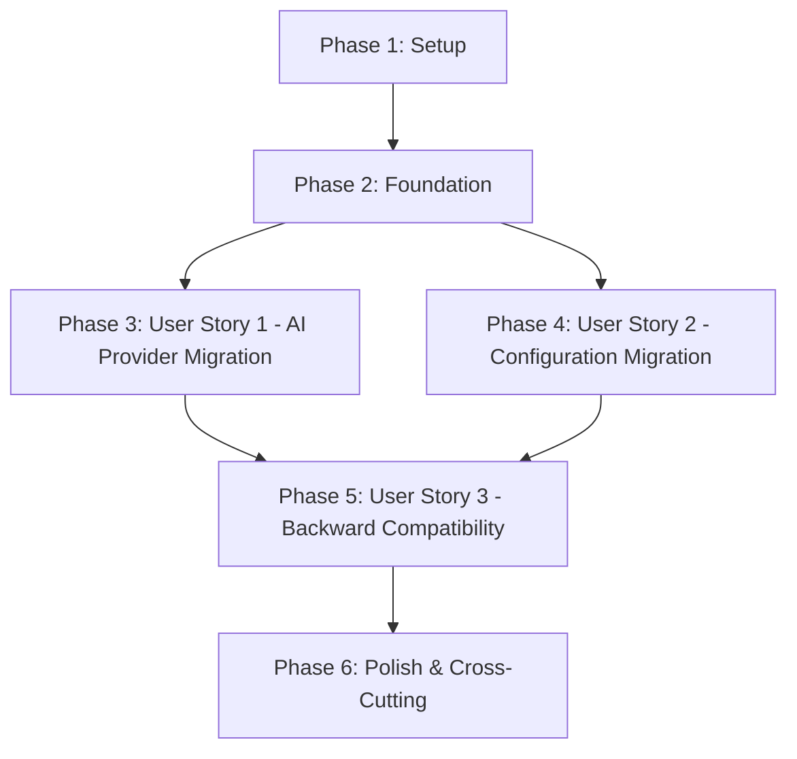

# Tasks: Replace Gemini with Cohere API

**Input**: Design documents from `/specs/010-replace-gemini-cohere/`
**Prerequisites**: plan.md, spec.md, research.md, data-model.md, contracts/, quickstart.md

**Branch**: `010-replace-gemini-cohere`
**Date**: 2025-12-25

**Tests**: Tests are NOT explicitly requested in the specification. This task list focuses on implementation and manual validation per quickstart.md.

**Organization**: Tasks are grouped by user story to enable independent implementation and testing of each story.

## Format: `- [ ] [ID] [P?] [Story] Description`

- **[P]**: Can run in parallel (different files, no dependencies)
- **[Story]**: Which user story this task belongs to (US1, US2, US3)
- Include exact file paths in descriptions

## Path Conventions

This is a **web application** with backend/frontend separation:
- **Backend**: `backend/src/`, `backend/pyproject.toml`, `backend/.env`
- **Frontend**: `frontend/` (NO CHANGES in this feature)

---

## Phase 1: Setup (Shared Infrastructure)

**Purpose**: Backup current state and prepare for migration

- [X] T001 Create git checkpoint before migration with commit message "Pre-Cohere migration checkpoint"
- [X] T002 Backup current agent.py to backend/src/backend/agent.py.backup

---

## Phase 2: Foundational (Blocking Prerequisites)

**Purpose**: Core dependency and configuration changes that MUST be complete before ANY user story can be implemented

**⚠️ CRITICAL**: No user story work can begin until this phase is complete

- [ ] T003 [P] Update backend/pyproject.toml dependencies: Remove "openai-agents>=0.6.0" and "google-generativeai>=0.8.0", Add "cohere>=5.0.0"
- [ ] T004 [P] Update backend/.env environment variables: Remove GEMINI_API_KEY, GEMINI_MODEL, GEMINI_BASE_URL; Add COHERE_API_KEY=<placeholder> and COHERE_MODEL=command-r-plus-08-2024
- [ ] T005 Install new dependencies with pip uninstall openai-agents google-generativeai -y && pip install cohere
- [ ] T006 Verify Cohere SDK installation with python -c "import cohere; print(cohere.__version__)"

**Checkpoint**: Foundation ready - dependencies updated, user story implementation can now begin

---

## Phase 3: User Story 1 - AI Provider Migration (Priority: P1) 🎯 MVP

**Goal**: Replace Gemini API with Cohere API for chat response generation while maintaining identical functionality

**Independent Test**:
1. Start backend: `uvicorn backend.main:app --reload`
2. Send chat request: `curl -X POST http://localhost:8000/chat -H "Content-Type: application/json" -d '{"message":"What is physical AI?"}'`
3. Verify response comes from Cohere and matches ChatResponse format

**Acceptance Criteria**:
- Backend starts successfully with Cohere client initialized
- Chat requests return responses from Cohere API
- Response format matches existing ChatResponse model
- No Gemini-related errors in logs

### Implementation for User Story 1

- [ ] T007 [P] [US1] Update backend/src/config/settings.py: Replace gemini_api_key, gemini_model_name, gemini_model, gemini_base_url with cohere_api_key: str and cohere_model: str = "command-r-plus-08-2024"
- [ ] T008 [P] [US1] Update backend/src/backend/config.py: Replace gemini_api_key, gemini_base_url, gemini_model with cohere_api_key: str and cohere_model: str = "command-r-plus-08-2024"
- [ ] T009 [US1] Rewrite backend/src/backend/agent.py: Replace imports (from agents → import cohere), remove Agent/Runner/AsyncOpenAI/OpenAIChatCompletionsModel, implement native AsyncClientV2
- [ ] T010 [US1] In backend/src/backend/agent.py AITutor.__init__(): Validate COHERE_API_KEY, create cohere.AsyncClientV2 with timeout, load constitution, store model name
- [ ] T011 [US1] In backend/src/backend/agent.py generate_response(): Implement client.chat() with messages=[{developer: constitution}, {user: message}], temperature=0.7, max_tokens=2000
- [ ] T012 [US1] In backend/src/backend/agent.py generate_response(): Add error handling for cohere.errors (UnauthorizedError, RateLimitError, BadRequestError, ServiceUnavailableError)
- [ ] T013 [US1] In backend/src/backend/agent.py generate_response(): Add asyncio.wait_for() with timeout=settings.request_timeout_seconds and handle asyncio.TimeoutError
- [ ] T014 [US1] In backend/src/backend/agent.py generate_response(): Validate response is non-empty and raise EmptyAIResponse if empty

**Checkpoint**: At this point, User Story 1 should be fully functional - backend uses Cohere for chat responses

---

## Phase 4: User Story 2 - Configuration Migration (Priority: P1)

**Goal**: Remove all Gemini-specific configuration and ensure only Cohere credentials exist

**Independent Test**:
1. Search codebase: `grep -r "gemini" backend/src/` (should return only comments/docs)
2. Check health endpoint: `curl http://localhost:8000/health` (should show "model": "command-r-plus-08-2024")
3. Verify .env has no GEMINI_* variables and has COHERE_* variables

**Acceptance Criteria**:
- No Gemini references in configuration files
- Health check reports Cohere model information
- Environment variables use COHERE_* naming

### Implementation for User Story 2

- [ ] T015 [US2] Update backend/src/backend/main.py health_check(): Change settings.gemini_model to settings.cohere_model in return statement
- [ ] T016 [US2] Verify backend/.env has no GEMINI_* environment variables remaining
- [ ] T017 [US2] Create/update backend/.env.example with COHERE_API_KEY and COHERE_MODEL placeholders for documentation
- [ ] T018 [US2] Search and remove any remaining Gemini imports or references in backend/src/backend/ (grep -r "gemini" backend/src/)

**Checkpoint**: At this point, User Stories 1 AND 2 should both be complete - Cohere fully integrated, Gemini fully removed

---

## Phase 5: User Story 3 - Backward Compatibility (Priority: P2)

**Goal**: Verify API contract remains unchanged and existing integrations continue to work

**Independent Test**:
1. Use existing frontend application and verify chat works without changes
2. Test error responses: Invalid API key should return 500 with generic message
3. Test rate limiting: 11 rapid requests should trigger 429 error on 11th request
4. Verify timeout: Long-running request times out at 30 seconds with 504 error

**Acceptance Criteria**:
- ChatRequest/ChatResponse models unchanged
- Error responses maintain same format and status codes
- Frontend works without any modifications
- Rate limiting enforced (10 req/min)
- Timeout behavior preserved (30 seconds)

### Validation for User Story 3

- [ ] T019 [US3] Verify backend/src/backend/models.py ChatRequest and ChatResponse models are unchanged
- [ ] T020 [US3] Verify backend/src/backend/exceptions.py AIServiceError and EmptyAIResponse classes are unchanged
- [ ] T021 [US3] Test /chat endpoint returns ChatResponse format: {"response": "...", "agent_name": "AI Tutor"}
- [ ] T022 [US3] Test error handling: Start backend with invalid COHERE_API_KEY, send chat request, verify 500 error returned
- [ ] T023 [US3] Test rate limiting: Send 11 rapid requests to /chat endpoint, verify 11th request returns 429 error
- [ ] T024 [US3] Verify /health endpoint returns {"status": "healthy", "constitution_loaded": true, "model": "command-r-plus-08-2024", "rate_limit": "10/minute"}

**Checkpoint**: All user stories should now be independently functional and validated

---

## Phase 6: Polish & Cross-Cutting Concerns

**Purpose**: Final verification, documentation, and cleanup

- [ ] T025 Run full manual test suite per specs/010-replace-gemini-cohere/quickstart.md Testing section
- [ ] T026 Verify no Gemini dependencies: pip list | grep -E "(openai-agents|google-generativeai)" should return nothing
- [ ] T027 Verify Cohere dependency installed: pip list | grep cohere should show cohere>=5.0.0
- [ ] T028 Test complete user journey: Start backend, check health, send 3 different chat messages, verify all responses from Cohere
- [ ] T029 Review logs for any Gemini-related errors or warnings during startup and chat requests
- [ ] T030 Document any parameter tuning (temperature, max_tokens) if response quality required adjustments

**Final Checkpoint**: Migration complete and validated

---

## Dependencies Between User Stories



**Dependency Analysis**:

- **Phase 1 (Setup)** → **Phase 2 (Foundation)**: Must complete backup and dependency updates before any code changes
- **Phase 2 (Foundation)** → **Phase 3 (US1)** and **Phase 4 (US2)**: Dependencies and configuration must be updated before implementing code changes
- **Phase 3 (US1)** and **Phase 4 (US2)** → **Phase 5 (US3)**: Both AI provider migration and configuration migration must complete before validating backward compatibility
- **Phase 5 (US3)** → **Phase 6 (Polish)**: Full functionality must be validated before final testing and cleanup

**Parallel Opportunities**:

- **Phase 2**: T003 (pyproject.toml) and T004 (.env) can run in parallel (different files)
- **Phase 3 (US1)**: T007 (settings.py) and T008 (config.py) can run in parallel (different files)
- **Phase 4 (US2)**: T015 (main.py), T017 (.env.example), T018 (grep search) can run in parallel (different files/operations)
- **Phase 5 (US3)**: T019-T024 all validation tasks can run in parallel (read-only verification)

**Sequential Dependencies**:

- T005 (pip install) MUST wait for T003 and T004 (dependency and env updates)
- T009-T014 (agent.py rewrite) MUST be sequential (same file, logical order)
- T025-T030 (final testing) MUST wait for all user story phases to complete

---

## Parallel Execution Examples

### Phase 2 (Foundation) - Parallel Group 1
```bash
# Run these tasks in parallel (different files)
# Terminal 1:
# T003: Edit backend/pyproject.toml

# Terminal 2:
# T004: Edit backend/.env

# Then run sequentially:
# T005: pip uninstall and install
# T006: Verify installation
```

### Phase 3 (User Story 1) - Parallel Group 2
```bash
# Run these tasks in parallel (different files)
# Terminal 1:
# T007: Edit backend/src/config/settings.py

# Terminal 2:
# T008: Edit backend/src/backend/config.py

# Then run sequentially (same file):
# T009-T014: Rewrite backend/src/backend/agent.py
```

### Phase 4 (User Story 2) - Parallel Group 3
```bash
# Run these tasks in parallel
# Terminal 1:
# T015: Edit backend/src/backend/main.py

# Terminal 2:
# T017: Create backend/.env.example

# Terminal 3:
# T018: Run grep search
```

### Phase 5 (User Story 3) - Parallel Group 4
```bash
# All validation tasks can run in parallel (read-only)
# T019-T024: Verify models, test endpoints, check responses
```

---

## Implementation Strategy

### MVP Scope (Minimum Viable Product)

**Recommended MVP**: Phase 1 (Setup) + Phase 2 (Foundation) + Phase 3 (User Story 1)

**Rationale**:
- **Phase 3 (US1)** is the core requirement: Replace Gemini with Cohere for chat
- This delivers the primary value: Backend uses Cohere API for responses
- Independent test criteria: Chat requests work with Cohere
- Remaining stories (US2, US3) are cleanup and validation

**MVP Deliverables**:
- ✅ Cohere SDK installed and configured
- ✅ agent.py rewritten to use native Cohere client
- ✅ Chat endpoint returns responses from Cohere API
- ✅ Constitution loading preserved
- ✅ Error handling for Cohere-specific exceptions

**Post-MVP Increments**:
- **Increment 1**: Add Phase 4 (US2 - Configuration Migration) for full Gemini removal
- **Increment 2**: Add Phase 5 (US3 - Backward Compatibility) for comprehensive validation
- **Increment 3**: Add Phase 6 (Polish) for final testing and documentation

### Incremental Delivery

Each phase/user story can be delivered as an independent increment:

1. **Setup + Foundation** (T001-T006): Prepare environment ⏱️ 10 minutes
2. **User Story 1** (T007-T014): Core Cohere integration ⏱️ 30 minutes
3. **User Story 2** (T015-T018): Configuration cleanup ⏱️ 15 minutes
4. **User Story 3** (T019-T024): Validation and testing ⏱️ 20 minutes
5. **Polish** (T025-T030): Final verification ⏱️ 15 minutes

**Total estimated time**: ~90 minutes for complete migration

---

## Task Summary

**Total Tasks**: 30
- **Phase 1 (Setup)**: 2 tasks
- **Phase 2 (Foundation)**: 4 tasks
- **Phase 3 (User Story 1)**: 8 tasks
- **Phase 4 (User Story 2)**: 4 tasks
- **Phase 5 (User Story 3)**: 6 tasks
- **Phase 6 (Polish)**: 6 tasks

**Parallel Opportunities Identified**: 12 tasks marked with [P]
- Phase 2: 2 parallel tasks (T003, T004)
- Phase 3: 2 parallel tasks (T007, T008)
- Phase 4: 3 parallel tasks (T015, T017, T018)
- Phase 5: 6 parallel tasks (T019-T024 - all validation tasks)

**User Story Mapping**:
- **US1 (AI Provider Migration)**: 8 tasks (T007-T014)
- **US2 (Configuration Migration)**: 4 tasks (T015-T018)
- **US3 (Backward Compatibility)**: 6 tasks (T019-T024)

**Independent Test Criteria Per Story**:
- **US1**: Chat endpoint returns Cohere responses
- **US2**: Health check shows Cohere model, no Gemini references
- **US3**: Frontend works unchanged, error handling preserved, rate limiting enforced

**Files Modified**: 6 files total
1. `backend/pyproject.toml` - Dependencies
2. `backend/.env` - Environment variables
3. `backend/src/config/settings.py` - Settings class
4. `backend/src/backend/config.py` - Config module
5. `backend/src/backend/agent.py` - AITutor class (complete rewrite)
6. `backend/src/backend/main.py` - Health check endpoint (1 line change)

**Files Created**: 1 file
1. `backend/.env.example` - Environment template

**Files Unchanged**: All other files including:
- `backend/src/backend/models.py` - ChatRequest/ChatResponse
- `backend/src/backend/exceptions.py` - AIServiceError/EmptyAIResponse
- `backend/src/auth/*` - Authentication system
- `backend/src/config/database.py` - Database configuration
- `backend/src/tools/*` - Textbook search tool
- `frontend/*` - All frontend files

---

## Format Validation

✅ **All tasks follow checklist format**: `- [ ] [ID] [P?] [Story?] Description`

✅ **Task IDs sequential**: T001-T030

✅ **[P] markers**: Applied to 12 tasks that can run in parallel

✅ **[Story] labels**: Applied to all user story tasks (US1, US2, US3)

✅ **File paths included**: All implementation tasks specify exact file paths

✅ **Independent test criteria**: Defined for each user story phase

✅ **Parallel execution examples**: Provided for all phases with parallel opportunities

✅ **MVP scope identified**: Phase 3 (User Story 1) recommended as MVP

---

**Status**: ✅ Tasks generated and ready for execution

**Next Step**: Begin with Phase 1 (Setup) tasks T001-T002 to create checkpoint and backup
